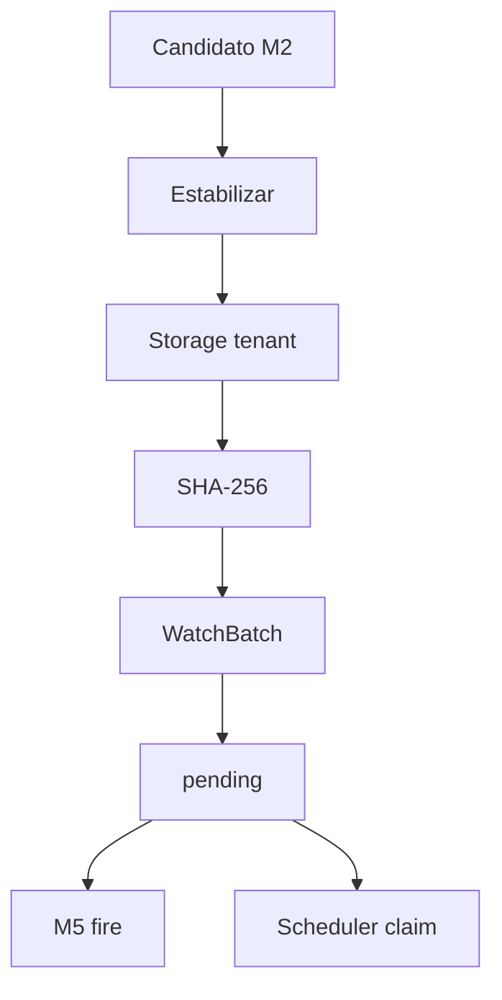

# Módulo 3 — Intake (llegada → storage / lote / hash)

Materializa el archivo detectado por el origen (M2) en **storage del tenant** como un **lote** con **hash SHA-256**. No elige app (M4) ni decide si dispara al llegar o deja pendiente (M5). Es el contrato que el Scheduler consume con `input_origin=watch`.

> **Estado:** **Diseño M3** (spec + prototipos HTML); implementación Django / worker pendiente de OK  
> **Producto:** [`../FILE_WATCH.md`](../FILE_WATCH.md) §1 · §4 · §5  
> **Índice:** [`README.md`](README.md)  
> **Previo:** [`wach_source.md`](wach_source.md)  
> **Siguiente:** enrutado [`wach_route.md`](wach_route.md) · fire [`wach_fire.md`](wach_fire.md) · idempotencia [`wach_idempotency.md`](wach_idempotency.md)  
> **Prototipos:** [`../../prototype/file_watch/watch_intake.html`](../../prototype/file_watch/watch_intake.html) · [`watch_intake_help.html`](../../prototype/file_watch/watch_intake_help.html)  
> **Rama:** `diseno_desarrollo_FILE_WATCH`

---

## Propósito

Cuando el adaptador (M2) detecta un candidato que cumple el patrón:

1. Espera estabilización (archivo no sigue creciendo).  
2. Copia / recibe bytes al storage de la compañía.  
3. Calcula **hash SHA-256** del contenido.  
4. Crea un registro de **lote** (`WatchBatch`) ligado al `watch_id` (slug M1).  
5. Aplica `after_detect` del origen (dejar / marcar / borrar en remoto) **solo si** el intake confirmó OK.  
6. Entrega el lote a M5 (fire inmediato) o lo deja **pendiente** para Scheduler / otro consumidor.

```text
M2 detectó nombre en origen
  → M3: bytes → storage + lote + hash
  → M5: ¿encolar Job ahora? ¿solo pending?
  → Scheduler (cron): claim pending por watch_id → mismo runner
```



**Artifact vs Watch (producto §5):** el hash del lote **no** se fija en la config del plan. Cada llegada puede producir **otro** hash. El plan con `input_origin=artifact` guarda un hash fijo; con `input_origin=watch` guarda el `watch_id` y el tick pide “el lote pendiente” (este módulo).

---

## Acción en el hub

- Rail **Definición → Intake**: política de materialización (PA/ED).  
- Rail **Operación → Llegadas / lotes**: historial de lotes de esta bandeja (misma pantalla o ancla `#lotes`).

GE/CO: ver lotes y política; sin cambiar política ni forzar re-intake.

Guardar política **no** cambia `status` de la bandeja ni reescribe lotes existentes.

---

## Modelo de lote (`WatchBatch` — tentativo)

| Campo | Notas |
|-------|--------|
| `id` | UUID |
| `company_id` | Tenant |
| `watch_id` | Slug de la bandeja (= Scheduler) |
| `original_filename` | Nombre visto en origen |
| `content_hash` | SHA-256 hex (mismo contrato que `artifact_ref` en runners) |
| `storage_key` / path | Ubicación en storage del tenant (jail compañía) |
| `byte_size` | Tamaño |
| `status` | Ver tabla abajo |
| `source_kind` | Snapshot del adaptador al ingerir |
| `detected_at` | Primera detección |
| `ingested_at` | Intake OK |
| `consumed_at` | Cuando un Job/tick/claim tomó el lote |
| `consumed_by` | `schedule:{id}` · `fire:{job_id}` · `pipeline:{run}` · `manual` |
| `error_code` | Si `intake_failed` |

### Estados del lote

| `status` | UI | Significado |
|----------|-----|-------------|
| `pending` | Pendiente | En storage; disponible para claim (Scheduler / fire M5 / API) |
| `claimed` | Reservado | Claim atómico en curso (evita doble consumo) |
| `consumed` | Consumido | Ya alimentó un Job/run |
| `intake_failed` | Falló intake | No hay hash usable; ver `error_code` |
| `skipped` | Omitido | p. ej. duplicado (detalle M6) o patrón/cuota |

**MVP claim:** un consumidor toma el lote `pending` más antiguo (`fifo`) o el más reciente (`lifo`) según política; pasa a `claimed` → `consumed` al encolar OK. Si el Job falla después, el lote **no** vuelve a `pending` automáticamente (reintento = M6 / decisión de producto; default: queda `consumed` con enlace al Job fallido).

Sin lote `pending` → el tick Scheduler responde `schedule_missing_input` (hoy).

---

## Política de intake (config bandeja)

| Campo | Obligatorio | Default | Notas |
|-------|-------------|---------|--------|
| `settle_seconds` | Sí | `5` | Tiempo sin cambio de tamaño antes de copiar |
| `max_bytes` | Sí | p. ej. cuota compañía o 100 MiB | Rechazo → `intake_failed` / código cuota (M6/M8) |
| `pending_pick_policy` | Sí | `fifo` | `fifo` \| `lifo` — qué lote toma el Scheduler |
| `retain_consumed_days` | No | `90` | Retención metadatos/archivos consumidos (ops) |

La política **no** elige proyecto ni pipeline.

---

## Flujo de intake (sistema)

1. Bandeja `active` + origen completo (M2).  
2. Candidato nuevo (nombre + opcional fingerprint de origen).  
3. Estabilizar `settle_seconds`.  
4. Leer bytes → escribir storage bajo prefijo compañía (`watches/{watch_id}/batches/{batch_id}/…`).  
5. Hash SHA-256.  
6. Crear `WatchBatch` `pending` (o `skipped` si M6 dice duplicado).  
7. Ejecutar `after_detect` del origen.  
8. Emitir `watch.batch_ingested`.  
9. Invocar gancho M5 (fire o no-op si modo “solo lote”).

Actor: `system:file_watch` (no UF).

---

## Contrato hacia File Scheduler

| Scheduler | Watch M3 |
|-----------|----------|
| `input_origin=watch` + `watch_id` | Busca lote `pending` de esa bandeja / compañía |
| Pick | Según `pending_pick_policy` |
| Éxito | Claim → entrega `content_hash` + path como `artifact_ref` al runner |
| Sin pending | No inventar archivo → `schedule_missing_input` |
| Hash en storage ausente | `schedule_artifact_not_found` (capa Scheduler) |

El Scheduler **no** lee SFTP ni la carpeta drop: solo el lote ya materializado.

Misma semántica para un pipeline u otra app que “llame” a Watch para tomar el archivo llegado (producto §4 modo 2).

---

## UI — Llegadas / lotes

Columnas: fecha intake, nombre original, hash corto, tamaño, estado, consumido por, acciones (ver detalle / abrir Job si hay).

Filtros: estado (Pendiente, Consumido, Falló, …) + DataTables buscar (paridad listados).

No hay “Ejecutar Job” aquí (eso es M5 o el vertical destino). Opcional MVP+: “Marcar consumido” solo PA (ops).

---

## Autorización

| Acción | PA | ED | GE | CO |
|--------|----|----|----|-----|
| Ver lotes / política | ✓ | ✓ | ✓ | ✓ |
| Editar política | ✓ | ✓ | — | — |
| Descargar bytes del lote | ✓ | ✓ | ✓* | — |
| Forzar re-intake / borrar lote | ✓ | — | — | — |

\*GE: según política de compañía; sin PII de celdas parseadas (aún no hay parse).

---

## Validación / errores (capa intake)

| `error_code` (tentativo) | Cuándo |
|--------------------------|--------|
| `watch_intake_unstable` | Archivo sigue creciendo tras settle |
| `watch_intake_too_large` | Supera `max_bytes` |
| `watch_intake_store_failed` | Fallo al escribir storage |
| `watch_intake_hash_failed` | No se pudo hashear |
| `watch_forbidden` | GE/CO guarda política |
| `validation_required` | Política incompleta |

Duplicados de contenido → M6 (`skipped` + código propio).

Servicio: `ok` / `error_code` / `user_message`.

---

## Auditoría

| Evento | Payload |
|--------|---------|
| `watch.intake_policy_updated` | actor, settle, max_bytes, pick_policy |
| `watch.batch_ingested` | watch_id, batch_id, hash, size, filename (no bytes) |
| `watch.batch_claim` | batch_id, consumed_by |
| `watch.batch_intake_failed` | batch_id, error_code |

---

## Fuera de alcance

- Configurar SFTP (M2).  
- Elegir Clean/Gate/`pipeline_id` (M4).  
- Disparo al llegar vs solo pending (M5).  
- Reglas finas de duplicado/cuota (M6).  
- Implementar el bridge en `schedule_runner` (M10 / Scheduler).

---

## Criterio de aceptación del módulo (diseño)

- [x] Lote con hash = contrato `artifact_ref` para runners.  
- [x] Estados pending → claimed → consumed; fallo intake separado.  
- [x] Política settle / max / fifo|lifo.  
- [x] Contrato explícito vs `schedule_missing_input`.  
- [x] Artifact (hash fijo en plan) ≠ Watch (hash por llegada).  
- [x] Prototipos HTML (política + listado de lotes + ayuda).

---

## Documentos relacionados

| Documento | Relación |
|-----------|----------|
| [`../FILE_WATCH.md`](../FILE_WATCH.md) | §4 modos · §5 Artifact vs Watch |
| [`wach_source.md`](wach_source.md) | Detecta; `after_detect` post-intake |
| [`wach_fire.md`](wach_fire.md) | Usa lote pending o dispara |
| [`../definition_app_FILE_SCHEDULER/sch_target.md`](../definition_app_FILE_SCHEDULER/sch_target.md) | `input_origin=watch` |
| [`../definition_app_FILE_SCHEDULER/sch_tick.md`](../definition_app_FILE_SCHEDULER/sch_tick.md) | Claim / missing input |
| [`../definition_app/UI_MESSAGES.md`](../definition_app/UI_MESSAGES.md) | Textos al implementar |
