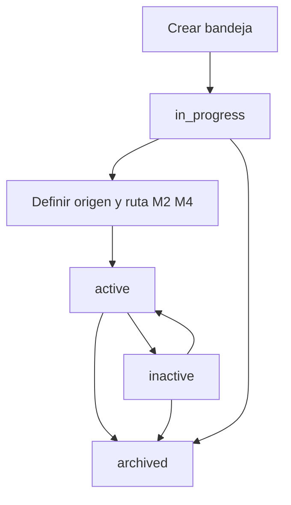

# Módulo 1 — Ciclo de vida de la bandeja (FILE WATCH)

Alta, listado, edición, **pausar / reanudar**, archivar y hub de la bandeja vigilada. Sin adaptador de origen, sin intake de archivos, sin disparo.

> **Estado:** **Diseño M1** (spec + prototipos HTML); implementación Django pendiente de OK  
> **Producto:** [`../FILE_WATCH.md`](../FILE_WATCH.md) §1 · §2 · §5  
> **Índice:** [`README.md`](README.md)  
> **Rama:** `diseno_desarrollo_FILE_WATCH`  
> **Siguientes módulos:** origen (`wach_source.md`) · intake (`wach_intake.md`) · enrutado (`wach_route.md`) · fire (`wach_fire.md`)

---

## Propósito

Una **bandeja** (Watch) es la unidad de plataforma que el usuario **crea y mantiene** para que, más adelante, un monitor detecte llegadas de archivo y las deje en storage (y/o dispare un Job).

Este módulo cubre solo el **ciclo de vida de la definición**:

1. Identidad (código, nombre, visibilidad).
2. **Estado operativo** (en proceso / activo / inactivo / archivado) — paridad de etiquetas con File Scheduler / File Pipeline.
3. Quién puede listar, crear, editar, pausar o archivar.
4. Auditoría **CRUD** (plano A; no la llegada de archivos).

**No cubre:** adaptador SFTP/carpeta (M2), lote/hash en storage (M3), enrutado a proyecto/`pipeline_id` (M4), disparo al llegar (M5), idempotencia (M6), códigos `watch_*` de ingestión (M8), notificaciones (M9), puente Scheduler (M10).

El monitor (M2/M5) **solo** considera bandejas `active` con origen y reglas mínimas válidas (otros módulos). Una bandeja `inactive` o `archived` no recibe ni dispara.

El **código** (`slug`) de la bandeja es el valor que el plan File Scheduler guarda como `watch_id` cuando `input_origin=watch` ([`../definition_app_FILE_SCHEDULER/sch_target.md`](../definition_app_FILE_SCHEDULER/sch_target.md)).

---

## Integración con DynamicWorkspace

| Concepto | Implementación (objetivo) |
|----------|---------------------------|
| Contenedor | Entidad de plataforma `Watch` / bandeja (no `Project.project_kind` de archivo) |
| Código | `slug` único por compañía (= `watch_id` hacia Scheduler) |
| Tenant | `company` — sin lectura cruzada |
| Visibilidad | `members_only` \| `company` (paridad Scheduler / Pipeline) |
| Estado | `status`: ver tabla abajo |
| Miembros | Reutilizar PA/ED/GE/CO; **no** inventar roles |
| Servicio | `watch_lifecycle_service` (nombre tentativo) |

No hay `project_kind` de Watch. La bandeja **no** configura parsers: apunta (M4) a un proyecto publicado o a un `pipeline_id`, o deja lote pendiente para el Scheduler.

---

## Estado de la definición

Independiente del último archivo llegado y del resultado del Job.

| Valor | UI | Significado | ¿El monitor puede ingerir / disparar? |
|-------|-----|-------------|----------------------------------------|
| `in_progress` | En proceso | Alta / aún sin origen (M2) listo | No |
| `active` | Activo | Bandeja en operación (origen M2 válido; enrutado M4 según modo) | Sí |
| `inactive` | **Inactivo** | Pausado a propósito. Definición e historial de lotes se conservan | No |
| `archived` | Archivado | Baja lógica; no aparece en listado operativo | No |

No hay un estado aparte `paused`: la **acción** es Pausar / Reanudar; el **valor** persistido es `inactive` / Inactivo.

**Alta:** nace en `in_progress`.  
**Activar** (`in_progress` → `active`): bloqueado si origen (M2) incompleto (y, si el modo dispara Job al llegar, si falta enrutado M4).  
**Pausar:** solo desde `active` → `inactive`.  
**Reanudar:** `inactive` → `active` (mismas comprobaciones que activar).  
**Archivar:** desde `in_progress`, `active` o `inactive`; no se borra el historial de llegadas (M7).  
**No** hay hard-delete en MVP.

Transiciones de estado solo **PA o ED de la bandeja**. GE/CO: lectura.

---

## Autorización (este módulo)

Hereda chasis US/UF y Pipeline §6. Monitor / fire = sistema (fuera de M1).

**Crear bandeja** exige **tipo de usuario `US`** de la misma compañía **y** rol **PA** o **ED**. Un **UF** no da de alta bandejas (aunque sea PA/ED de un proyecto vertical). Un **US** con rol GE o CO tampoco.

La matriz siguiente aplica **sobre la bandeja** (miembros). La fila Crear además filtra por `user_type=US`.

| Acción | PA | ED | GE | CO |
|--------|----|----|----|-----|
| Listar / ver metadatos | ✓ | ✓ | ✓ | ✓ |
| Crear bandeja (`US` + este rol) | ✓ | ✓ | — | — |
| Editar nombre, descripción, visibilidad | ✓ | ✓ | — | — |
| Pausar / reanudar | ✓ | ✓ | — | — |
| Archivar | ✓ | — | — | — |
| Gestionar miembros | ✓ | — | — | — |
| Ver auditoría CRUD | ✓ | ✓ | ✓* | ✓* |

\*CO/GE: metadatos de eventos; sin bytes del archivo (no hay archivo en M1).

Compañía inactiva o bandeja de otra company → no listar (404 opaco al acceso directo).

---

## Crear

| Campo | Obligatorio | Notas |
|-------|-------------|-------|
| `slug` | Sí | Único por compañía; minúsculas / guiones; será el `watch_id` del Scheduler |
| `name` | Sí | Nombre visible |
| `description` | No | |
| `visibility` | Sí | Default `members_only` |
| `status` | Sí | Default `in_progress` (no se elige origen ni ruta aquí) |

- Creador: **US** PA o ED de la compañía; queda **PA** de la bandeja.
- Sin SFTP, sin carpeta, sin patrón de nombre, sin destino Job.
- PRG + HTML plano (sin Django Forms).
- Servicio: `ok` / `error_code` / `user_message`.
- Mensaje éxito (catálogo al implementar): *Bandeja creada correctamente.* → hub.

Errores de negocio típicos (M1):

| `error_code` (tentativo) | Cuándo |
|--------------------------|--------|
| `watch_slug_taken` | Slug duplicado en la compañía |
| `watch_forbidden` | No es US PA/ED de la compañía (crear) o no es PA/ED de la bandeja (resto) |
| `validation_required` | Nombre o slug vacío |

---

## Listado

- Solo bandejas de la **misma compañía** visibles por membresía o `visibility=company`.
- Excluir `archived` del listado operativo (filtro “Archivados” opcional).
- Columnas: código, nombre, estado, visibilidad, **origen** (vacío hasta M2), última llegada (vacío hasta M3), acceso.
- Resumen: visibles / activos / en proceso / **inactivos** (sobre el conjunto filtrado).
- Filtros: búsqueda + estado (Activo, En proceso, Inactivo; Archivados aparte).

---

## Hub

Rail de módulos (estado de cada uno: pendiente / listo según specs posteriores):

1. **Origen** — M2 ([`wach_source.md`](wach_source.md)): SFTP / carpeta / adaptador; no dispara.  
2. **Intake** — M3 ([`wach_intake.md`](wach_intake.md)): llegada → storage / lote / hash.  
3. **Enrutado** — M4 ([`wach_route.md`](wach_route.md)): proyecto/versión o `pipeline_id`.  
4. **Disparo** — M5 ([`wach_fire.md`](wach_fire.md)): al llegar vs lote pendiente para Scheduler.  
5. **Idempotencia** — M6 ([`wach_idempotency.md`](wach_idempotency.md)): duplicados / cuotas.  
6. **Avisos** — M9 ([`wach_notify.md`](wach_notify.md)): correo/webhook; default off.  
7. **Llegadas / lotes** — historial de ingestión (detalle en M3/M7).  
8. **Auditoría** — M7 ([`wach_audit.md`](wach_audit.md)): timeline append-only.  
9. **Miembros** — si aplica.

Acciones en hub: **Pausar** / **Reanudar** según estado y rol. **Editar**, **Miembros** y **Archivar** viven en el **listado** (no se duplican en el hub).

No hay “Procesar ahora” en M1 (eso es fire; M5 o acción futura explícita).

---

## Editar

PA/ED pueden cambiar `name`, `description`, `visibility`.  
`slug` **inmutable** tras el alta (paridad Scheduler / pipelines). El Scheduler y otros sistemas ya pueden referenciar ese `watch_id`.

Editar **no** cambia `status`. Pausar/reanudar/archivar son acciones distintas.

Si la bandeja está `active`, editar metadatos **no** cancela un Job ya encolado por una llegada previa.

---

## Pausar / reanudar

| Acción | De | A | Efecto |
|--------|----|---|--------|
| Pausar | `active` | `inactive` | El monitor no ingiere ni dispara. Lotes ya en storage no se borran. Columna Estado = **Inactivo**. |
| Reanudar | `inactive` | `active` | Exige origen (M2) válido (y enrutado M4 si el modo dispara al llegar). Si incompleto → error de negocio. |

Pausar una bandeja `in_progress` no aplica. Archivar cubre “sacar de circulación” el borrador.

---

## Archivar

Baja lógica. La bandeja deja el listado operativo.  
No se reutiliza el `slug` en MVP (evitar colisión de auditoría y de `watch_id` en planes Scheduler).  
Evento `watch.archived`. Restaurar = fuera de MVP.

Si un plan Scheduler apunta a este `watch_id`, el tick seguirá fallando o deberá documentarse en M10 (plan apunta a bandeja archivada).

---

## Auditoría CRUD (plano A)

Obligatorio. Append-only. Sin PII de celdas. Detalle de llegadas: M7.

| Evento | Qué registrar |
|--------|----------------|
| `watch.created` | `created_by`, `created_at`, `company_id`, slug, name, visibility, status inicial |
| `watch.updated` | `updated_by`, `updated_at`, campos cambiados (nombre, descripción, visibilidad) |
| `watch.paused` | actor, timestamp, `active` → `inactive` |
| `watch.resumed` | actor, timestamp, `inactive` → `active` |
| `watch.archived` | actor, timestamp |

PLATFORM API **no** audita este CRUD en su MVP (paridad Scheduler).

---

## Miembros

Membresía propia de la bandeja: **solo PA** invita, cambia rol y revoca; misma compañía; el creador (owner) no se revoca ni pierde PA.

**El alta** no se hereda de un vertical: solo **US** PA/ED de la compañía.

---

## API-ready

CRUD de bandejas **fuera** del MVP de PLATFORM API. Este módulo no define `POST /watches`. El diseño no impide una admin API posterior. El disparo HTTP de Jobs sigue siendo PLATFORM API (producto §2).

---

## Fuera de alcance (este archivo)

- Modelos Django, migraciones, worker SFTP/carpeta.  
- Credenciales de origen, patrones de nombre, enrutado, fire, `error_code` de ingestión.

**Prototipos M1:** [`../../prototype/file_watch/`](../../prototype/file_watch/) (`index.html`).

---

## Criterio de aceptación del módulo (diseño)

- [x] Alta con slug único por compañía y status `in_progress`.  
- [x] Listado filtrable (Activo / En proceso / **Inactivo** / Archivados).  
- [x] Hub con rail a M2–M9 y acciones pausar / reanudar / archivar.  
- [x] Matriz PA/ED/GE/CO; crear = US + PA/ED.  
- [x] Eventos CRUD (`watch.created` / `updated` / `paused` / `resumed` / `archived`).  
- [x] `slug` = contrato `watch_id` hacia File Scheduler.  
- [x] Mensajes alineables a [`../definition_app/UI_MESSAGES.md`](../definition_app/UI_MESSAGES.md).  
- [x] Prototipos HTML M1 (sin código Django) — revisión UX pendiente de OK.

---

## Documentos relacionados

| Documento | Relación |
|-----------|----------|
| [`../FILE_WATCH.md`](../FILE_WATCH.md) | Producto §1 · §2 · §5 |
| [`README.md`](README.md) | Índice de módulos |
| [`../FILE_SCHEDULER.md`](../FILE_SCHEDULER.md) | Consumidor de `watch_id` |
| [`../definition_app_FILE_SCHEDULER/sch_target.md`](../definition_app_FILE_SCHEDULER/sch_target.md) | `input_origin=watch` |
| [`../FILE_PIPELINE.md`](../FILE_PIPELINE.md) | §6 permisos |
| [`../definition_app/UI_MESSAGES.md`](../definition_app/UI_MESSAGES.md) | Textos al implementar |
| [`../security/SEGURIDAD_Y_ACCESOS.md`](../security/SEGURIDAD_Y_ACCESOS.md) | Tenant, tipos UA/US/UF |
