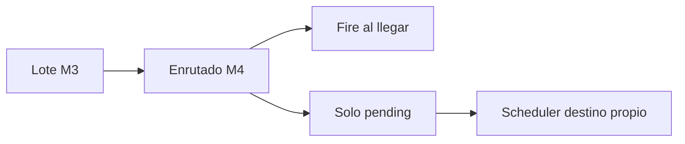

# Módulo 4 — Enrutado (proyecto / pipeline)

Declara **qué** Job o pipeline ejecutará File Watch cuando el modo de disparo (M5) encole al llegar. No configura SFTP (M2), no materializa el lote (M3) ni decide “ahora vs solo pendiente” (M5).

> **Estado:** **Diseño M4** (spec + prototipos HTML); implementación Django pendiente de OK  
> **Producto:** [`../FILE_WATCH.md`](../FILE_WATCH.md) §1 · §4 · Pipeline  
> **Índice:** [`README.md`](README.md)  
> **Previo:** [`wach_intake.md`](wach_intake.md)  
> **Siguiente:** fire [`wach_fire.md`](wach_fire.md)  
> **Prototipos:** [`../../prototype/file_watch/watch_route.html`](../../prototype/file_watch/watch_route.html) · [`watch_route_help.html`](../../prototype/file_watch/watch_route_help.html)  
> **Rama:** `diseno_desarrollo_FILE_WATCH`

---

## Propósito

La bandeja ya sabe **de dónde** viene el archivo (M2) y **cómo** lo guarda (M3). Este módulo dice **hacia qué runner** se apunta el lote cuando Watch **dispara**.

```text
Origen M2 → Intake M3 (lote + hash)
  → Enrutado (este módulo): Job publicado | pipeline | diferir
  → Fire M5: ¿encolar ya con este destino? ¿solo dejar pending?
```



**Frontera con File Scheduler:** el plan con `input_origin=watch` tiene **su propio** destino ([`sch_target.md`](../definition_app_FILE_SCHEDULER/sch_target.md)). Al hacer claim del lote, el tick usa el destino del **plan**, no el enrutado de la bandeja. El enrutado de Watch aplica al camino **“disparo al llegar”** (M5).

**No cubre:** cron, hash fijo Artifact, diseño de pasos del pipeline, IFS.

---

## Acción en el hub

Enlace **Enrutado** del rail → pantalla de este módulo (PA/ED). GE/CO: solo lectura.

Guardar **no** cambia `status`. Cumple el requisito M4 cuando el modo de fire exige destino (ver completitud).

Editar en bandeja `active`: el próximo fire usa el nuevo destino; no cancela Jobs ya encolados. Auditoría: `watch.route_updated`.

---

## Modelo de enrutado (MVP)

Una sola definición por bandeja.

| Campo | Obligatorio | Notas |
|-------|-------------|-------|
| `route_mode` | Sí | `job` · `pipeline` · `defer` |
| `kind` | Si `job` | App (`file_gate`, `file_pipe`, `file_clean`, …). No `file_pipeline` aquí → use `pipeline`. |
| `project_id` | Si `job` | Proyecto misma compañía con **versión publicada**. |
| `pipeline_id` | Si `pipeline` | Pipeline misma compañía, `active` + versión publicada. |
| `route_complete` | Derivado | Ver abajo |

### Modos

| `route_mode` | Significado | Cuándo usarlo |
|--------------|-------------|---------------|
| `job` | Al disparar (M5), encolar el runner de ese proyecto/versión publicada | Extracto → Gate directo al llegar |
| `pipeline` | Al disparar, `start_run` del `pipeline_id` | Cadena Gate→Pipe al llegar |
| `defer` | Watch **no** elige runner; solo deja lote `pending` | El Scheduler (u otro) define el Job; modo producto §4 “ingesta + plan a la hora” |

Con `defer`, M5 debe ser compatible (solo pending / no fire de Job). Activar una bandeja `defer` + fire-al-llegar = inválido (M5/M8).

---

## Completitud para Activar

| Situación | ¿M4 completo? |
|-----------|----------------|
| Fire al llegar (M5) + `job` / `pipeline` válido | Sí |
| Fire al llegar + `defer` o destino sin publicada | No |
| Solo lote para Scheduler (M5) + `defer` | Sí (destino lo pone el plan) |
| Solo lote + `job`/`pipeline` configurado | Sí (opcional; no se usa hasta cambiar M5) |

Reanudar: mismas reglas. Origen M2 sigue siendo obligatorio ([`wach_lifecycle.md`](wach_lifecycle.md)).

**Versión al fire:** igual que Scheduler — se usa la versión **publicada vigente** al encolar. Si se despublica → no encolar; código `watch_no_published_target` (M8).

---

## Job vs pipeline

| Modo | Qué se encola | Historial |
|------|---------------|-----------|
| `job` | Mismo `run_*_job` que UI/API/Scheduler | Historial de **esa app** |
| `pipeline` | Orquestador; no se reimplementa la cadena | Tablero Pipeline |
| `defer` | Nada desde Watch | Lotes en Intake; Jobs vía plan |

Un solo runner: Watch no bifurca semántica. Tenancy: sistema debe poder ejecutar el proyecto (o todos los pasos del pipeline); si no → denegar fire.

---

## Validación

| `error_code` (tentativo) | Cuándo |
|--------------------------|--------|
| `validation_required` | Falta modo, proyecto o pipeline |
| `watch_no_published_target` | Proyecto/pipeline sin publicada; pipeline no activo |
| `watch_route_cross_tenant` | Destino de otra compañía |
| `watch_forbidden` | GE/CO guarda |
| `watch_route_defer_conflict` | `defer` incompatible con fire-al-llegar (cuando M5 exista) |

Servicio: `ok` / `error_code` / `user_message`.  
Éxito: *Enrutado guardado correctamente.*

---

## Autorización

PA/ED: editar. GE/CO: ver. Misma matriz M1. Monitor/fire = sistema.

---

## Relación con otros módulos

| Este módulo | Otro |
|-------------|------|
| Elige runner | M5 decide si encola ya |
| No pide hash ni `watch_id` | La bandeja **es** el origen del archivo |
| `defer` | Scheduler `input_origin=watch` + destino del plan |
| Publicado | Paridad [`sch_target.md`](../definition_app_FILE_SCHEDULER/sch_target.md) |

---

## Auditoría

`watch.route_updated` — actor, `route_mode`, `kind`/`project_id` o `pipeline_id` (sin bytes).

---

## Fuera de alcance

- Worker de fire, claim Scheduler.  
- Catálogo de pasos Pipeline.  
- Patrón de nombre / SFTP.

---

## Criterio de aceptación del módulo (diseño)

- [x] `job` / `pipeline` / `defer` con reglas de publicada.  
- [x] Frontera clara: destino del plan ≠ enrutado de la bandeja.  
- [x] Completitud ligada a M5 (fire vs solo pending).  
- [x] Prototipos + ayuda + enlace hub.

---

## Documentos relacionados

| Documento | Relación |
|-----------|----------|
| [`../FILE_WATCH.md`](../FILE_WATCH.md) | §1 · §4 modos |
| [`wach_intake.md`](wach_intake.md) | Lote que se enruta |
| [`wach_fire.md`](wach_fire.md) | Usa o ignora este destino |
| [`../definition_app_FILE_SCHEDULER/sch_target.md`](../definition_app_FILE_SCHEDULER/sch_target.md) | Destino del plan (claim) |
| [`../FILE_PIPELINE.md`](../FILE_PIPELINE.md) | `pipeline_id` |
| [`../definition_app/UI_MESSAGES.md`](../definition_app/UI_MESSAGES.md) | Textos al implementar |
