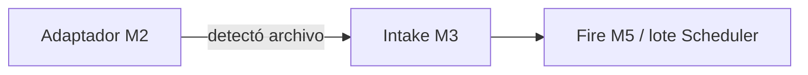

# Módulo 2 — Origen / adaptador (FILE WATCH)

Configura **de dónde** llega el archivo a la bandeja. Cierra la forma de trabajo del producto ([`../FILE_WATCH.md`](../FILE_WATCH.md) §3). No copia a storage (M3), no enruta (M4) ni dispara Job (M5).

> **Estado:** **Diseño M2** (spec + prototipos HTML); implementación Django / worker pendiente de OK  
> **Producto:** [`../FILE_WATCH.md`](../FILE_WATCH.md) §3 · §1 · §7  
> **Índice:** [`README.md`](README.md)  
> **Previo:** [`wach_lifecycle.md`](wach_lifecycle.md)  
> **Siguiente:** intake [`wach_intake.md`](wach_intake.md) · enrutado [`wach_route.md`](wach_route.md) · fire [`wach_fire.md`](wach_fire.md)  
> **Prototipos:** [`../../prototype/file_watch/watch_source.html`](../../prototype/file_watch/watch_source.html) · [`watch_source_help.html`](../../prototype/file_watch/watch_source_help.html)  
> **Rama:** `diseno_desarrollo_FILE_WATCH`

---

## Decisión de forma de trabajo (§3)

**Elegida para el producto:** modelo unificado **bandeja + adaptador de origen**. Una bandeja tiene **un** origen activo; el adaptador es intercambiable por `source_kind`.

| Forma (§3) | Decisión M2 |
|------------|-------------|
| **Monitor a la espera** | **MVP.** Worker/proceso de plataforma consulta o escucha el origen (SFTP, carpeta gestionada). |
| **Por pedido de API** | **MVP como adaptador** `api_push`: un endpoint de plataforma registra la llegada en esa bandeja (hermano de PLATFORM_API; no sustituye el disparo HTTP de Jobs). |
| **Dentro de un pipeline** | **No** es el origen de la bandeja. Pipeline es **destino** (M4: `pipeline_id`). Un paso “Watch” en el diseñador de Pipeline queda fuera de MVP. |
| **Correo / cola / cloud** | **Fuera de MVP** (diseño abierto: `source_kind` extensible). Cloud object storage = siguiente adaptador tras SFTP/carpeta. |
| **Todas a la vez** | Misma entidad `Watch` + catálogo de adaptadores; no una app distinta por origen. |

Documentar el cierre también en [`../FILE_WATCH.md`](../FILE_WATCH.md) §3 al aceptar este módulo.

```text
Origen (este módulo): ¿dónde mirar / quién empuja?
  → Intake (M3): bytes → storage tenant + lote + hash
  → Enrutado (M4) / Disparo (M5): qué Job o dejar pendiente para Scheduler
```



---

## Propósito

El usuario declara el **adaptador** de la bandeja: tipo, conexión, ruta y patrón de nombre. El monitor (sistema) solo opera si la bandeja está `active` y el origen está **completo y válido**.

**No cubre:** escritura del lote en storage, hash SHA-256, idempotencia de duplicados, enrutado a proyecto/`pipeline_id`, fire al llegar, credenciales en claro en auditoría, cron.

---

## Acción en el hub

Enlace **Origen** del rail → pantalla de este módulo (PA/ED). GE/CO: solo lectura (sin secretos; host/ruta/patrón sí).

Guardar **no** cambia `status` (sigue En proceso / Activo / Inactivo). Sí cumple el requisito M2 para **Activar** / **Reanudar** (junto con M4 si el modo dispara Job al llegar — M5).

Editar origen en bandeja `active`: el monitor usa la nueva config en el siguiente ciclo; **no** reescribe lotes ya en storage. Auditoría: `watch.source_updated` (sin password/token).

---

## Adaptadores MVP (`source_kind`)

| `source_kind` | UI | Cómo detecta | Notas |
|---------------|-----|--------------|-------|
| `sftp` | SFTP | Poll periódico del worker (listado remoto) | Host, puerto, usuario, secreto, ruta remota, patrón |
| `managed_folder` | Carpeta gestionada | Poll o inotify sobre drop path del tenant | Ruta relativa al área de la compañía; sin credenciales de terceros |
| `api_push` | API / webhook | Cliente empuja el archivo (o referencia) al endpoint de la bandeja | Token de bandeja o client PLATFORM_API acotado; no vigila red externa |

**Un solo `source_kind` por bandeja** en MVP (cambiar de tipo = reconfigurar; lotes previos no se borran).

### Campos comunes

| Campo | Obligatorio | Notas |
|-------|-------------|-------|
| `source_kind` | Sí | Ver tabla |
| `filename_pattern` | Sí | Glob simple (`extracto_*.csv`, `*.zip`). Default `*` |
| `source_complete` | Derivado | `true` si validación de guardado OK |

### `sftp`

| Campo | Obligatorio | Notas |
|-------|-------------|-------|
| `sftp_host` | Sí | Hostname o IP |
| `sftp_port` | Sí | Default `22` |
| `sftp_username` | Sí | |
| `sftp_secret_ref` | Sí | Referencia a secreto de plataforma (nunca password en UI tras guardar ni en audit payload) |
| `sftp_remote_path` | Sí | Directorio remoto absoluto o home-relative |
| `poll_interval_sec` | Sí | Default `60`; mínimo de producto (p. ej. 30) |
| `after_detect` | Sí | `leave` \| `mark` \| `delete_remote` — qué hacer en el origen **después** de que M3 confirme intake (detalle de ejecución en M3; M2 solo guarda la política) |

Probar conexión (botón opcional): PA/ED; resultado OK/fallo sin listar todos los archivos.

### `managed_folder`

| Campo | Obligatorio | Notas |
|-------|-------------|-------|
| `folder_rel_path` | Sí | Bajo el prefijo de compañía (p. ej. `watches/{slug}/drop`). El sistema puede proponer path al elegir este kind |
| `poll_interval_sec` | Sí | Default `30` si no hay watcher nativo |
| `after_detect` | Sí | `leave` \| `move_processed` \| `delete` — en el drop area |

No expone rutas IFS arbitrarias del servidor host: solo el área gestionada del tenant.

### `api_push`

| Campo | Obligatorio | Notas |
|-------|-------------|-------|
| `push_token_hint` | Solo lectura | Últimos 4 del token o “rotatable”; rotar = PA |
| `accept_multipart` | Sí | Default true — upload directo al endpoint de bandeja |
| `accept_storage_ref` | Sí | Default false — aceptar hash ya en storage (avanzado; alinea con Artifact solo como *entrega*, no como origen del plan) |

El endpoint concreto y auth máquina se detallan en M10 / PLATFORM_API; M2 solo marca la bandeja como receptora push.

---

## Completitud para activar

Origen **completo** cuando:

1. `source_kind` elegido.  
2. Campos obligatorios del kind válidos.  
3. Para `sftp`: `sftp_secret_ref` presente (secreto creado o reutilizado).  
4. Para `api_push`: token emitido al menos una vez.

Sin origen completo → no `in_progress` → `active` ([`wach_lifecycle.md`](wach_lifecycle.md)).

---

## Validación

| `error_code` (tentativo) | Cuándo |
|--------------------------|--------|
| `validation_required` | Falta host, ruta, patrón, etc. |
| `watch_source_invalid` | Combinación kind/campos inválida; patrón glob no parseable |
| `watch_sftp_unreachable` | Probar conexión falló (no bloquea guardar si se guarda “borrador”; sí puede bloquear Activar según política — **MVP: Activar exige último test OK o skip explícito de ops**) |
| `watch_forbidden` | GE/CO intenta guardar |
| `watch_secret_missing` | SFTP sin secreto |

Servicio: `ok` / `error_code` / `user_message`. Errores **inline**.

Mensaje éxito (catálogo al implementar): *Origen guardado correctamente.*

---

## Autorización

| Acción | PA | ED | GE | CO |
|--------|----|----|----|-----|
| Ver config (sin secretos) | ✓ | ✓ | ✓ | ✓ |
| Guardar origen / rotar token push | ✓ | ✓ | — | — |
| Probar SFTP | ✓ | ✓ | — | — |
| Ver valor de password/token | — | — | — | — |

Monitor = identidad de **sistema** (no UF). No bypasea company del Watch.

---

## Seguridad

- Credenciales solo vía almacén de secretos de la plataforma.  
- Audit: host, path, pattern, kind — **nunca** password ni token completo.  
- `managed_folder`: path jail al prefijo de compañía.  
- Rate: `poll_interval_sec` mínimo; cuotas de llegada en M6.

---

## Relación con otros módulos

| Este módulo | Otro |
|-------------|------|
| Detecta candidato | M3 materializa lote + hash |
| `after_detect` | M3 ejecuta la política tras intake OK |
| No elige app | M4 enrutado |
| No decide “al llegar vs Scheduler” | M5 fire |
| `watch_id` = slug M1 | Scheduler `input_origin=watch` consume lotes, no este adaptador |

---

## Auditoría

| Evento | Payload (sin secretos) |
|--------|-------------------------|
| `watch.source_updated` | actor, kind, paths/patterns, poll_interval, after_detect, secret_ref id (no valor) |
| `watch.source_tested` | actor, ok/fail, latency (opcional) |
| `watch.push_token_rotated` | actor, timestamp |

---

## Fuera de alcance (este archivo)

- Worker Railway, cola de poll, inotify real.  
- Copia a `media/…`, modelo `WatchBatch`.  
- Adaptadores cloud/correo.  
- Paso Watch dentro del diseñador File Pipeline.

---

## Criterio de aceptación del módulo (diseño)

- [x] Decisión §3 documentada (monitor + api_push; pipeline = destino).  
- [x] Tres `source_kind` MVP con campos y validación.  
- [x] Completitud M2 para Activar / Reanudar.  
- [x] Secretos fuera de UI/audit.  
- [x] Prototipos HTML + ayuda.  
- [x] Enlace desde hub rail.

---

## Documentos relacionados

| Documento | Relación |
|-----------|----------|
| [`../FILE_WATCH.md`](../FILE_WATCH.md) | §3 forma de trabajo |
| [`wach_lifecycle.md`](wach_lifecycle.md) | Activar exige origen |
| [`wach_intake.md`](wach_intake.md) | Siguiente: lote / hash |
| [`../definition_app_FILE_SCHEDULER/sch_target.md`](../definition_app_FILE_SCHEDULER/sch_target.md) | `watch_id` |
| [`../PLATFORM_API.md`](../PLATFORM_API.md) | Hermano; push ≠ disparo de Job |
| [`../security/SEGURIDAD_Y_ACCESOS.md`](../security/SEGURIDAD_Y_ACCESOS.md) | Monitor sistema |
| [`../definition_app/UI_MESSAGES.md`](../definition_app/UI_MESSAGES.md) | Textos al implementar |
