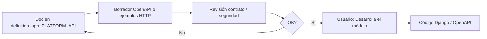

# definition_app_PLATFORM_API — Definición PLATFORM API

Carpeta de documentación de análisis y definición para **PLATFORM API** (ejecución remota de jobs por HTTP).

> **Producto:** [`../PLATFORM_API.md`](../PLATFORM_API.md)  
> **Familia:** [`../APP_FACTORY.md`](../APP_FACTORY.md) §2.3 · [`../APP_FACTORY_FILE_OPS.md`](../APP_FACTORY_FILE_OPS.md)  
> **Estado:** **M1–M9 implementados** (`apps.platform_api`) · consola `/app/platform-api/` · HTTP `/api/v1/…`  
> **No es un vertical de menú UF:** no hay `project_kind` propio. Invoca runners existentes (`kind`) y el orquestador [`../FILE_PIPELINE.md`](../FILE_PIPELINE.md)  
> **Chasis:** `Company`, credencial de máquina, scopes, billing/feature flags — no sustituye 2FA de UF ([`../security/SEGURIDAD_Y_ACCESOS.md`](../security/SEGURIDAD_Y_ACCESOS.md))

---

## Método de trabajo (por módulo)

**Definir → (opcional) contrato OpenAPI / ejemplo HTTP → revisar → implementar solo con OK explícito.**

No es el ritual de pantallas HTML de Gate/Clean: el entregable principal es **contrato HTTP + auth + auditoría**. Una UI mínima de **clientes/keys** (PA/US) puede prototiparse después, si el módulo lo pide.



| Paso | Dónde | Quién |
|------|-------|--------|
| 1. Diseño, alcance, reglas, validaciones | `docs/definition_app_PLATFORM_API/<modulo>.md` | Agente + revisión |
| 2. Contrato (sin Django) | OpenAPI borrador o ejemplos en el mismo `.md` | Agente |
| 3. Revisión | Chat | Usuario |
| 4. Implementación | `apps.platform_api` + URLs `/api/v1/…` | M1–M9 **hechos**; cambios con OK explícito |

**Método histórico** (definir → revisar → «Desarrolla el módulo») ya se aplicó a M1–M9. **No** volver a generar la app Django. Cambios nuevos: spec del módulo + OK explícito.

Los prototipos HTML (`prototype/platform_api/`) siguen como referencia UX.

---

## Documentos (por módulo)

Los módulos **especializan** un corte de [`../PLATFORM_API.md`](../PLATFORM_API.md); no duplican el paraguas ni el §7.1 del Pipeline.

| Archivo | Módulo | Contenido | Estado | Ancla producto |
|---------|--------|-----------|--------|----------------|
| [`MANUAL_USUARIO_API_APP.md`](MANUAL_USUARIO_API_APP.md) | Uso US | Manual paso a paso (jobs sueltos / apps) | **Curl 1–10 hecho** · Postman 6–8 hecho | Consola `/app/platform-api/` |
| [`MANUAL_USUARIO_API_PIPELINE.md`](MANUAL_USUARIO_API_PIPELINE.md) | Uso US | Manual del mismo esquema para consultar/disparar **pipelines** por API | **Placeholder** | [`pa_pipeline.md`](pa_pipeline.md) · FILE_PIPELINE |
| [`pa_prototype_map.md`](pa_prototype_map.md) | Guía | Relación de pantallas, flujo, ejemplo nómina | **Diseño** | Prototipos |
| [`pa_auth.md`](pa_auth.md) | **1** | Clientes de máquina, keys, tenancy, scopes | **Implementado** | §4 · §4.1 |
| [`pa_client_audit.md`](pa_client_audit.md) | **1c** | Auditoría append-only del ciclo de vida del cliente/key | **Implementado** | §4 |
| [`pa_security.md`](pa_security.md) | **1b** | Integridad de proceso: PII, TTL, SSRF, cuotas, amenazas | **Implementado** | §4.2 · §11 |
| [`pa_contract.md`](pa_contract.md) | **2** | Request/response común, `wait`, estados, errores, `kind` | **Implementado** | §5 · §5.5 · §8 · §9 |
| [`pa_jobs_run.md`](pa_jobs_run.md) | **3** | `POST /jobs/run` sync — Gate + Pipe + Reverse + Match + Scout + Clean + Split/Merge | **Implementado** | §5 · §7 · §14 A/B/C |
| [`pa_jobs_query.md`](pa_jobs_query.md) | **4** | `GET /jobs/{id}`, artifacts, listado multi-app | **Implementado** | §10.1 |
| [`pa_jobs_ops.md`](pa_jobs_ops.md) | **5** | Idempotencia, dry-run, cancel, reintento | **Implementado** | §10.1 · §11 |
| [`pa_pipeline.md`](pa_pipeline.md) | **6** | `kind=file_pipeline` — delega; no copia orquestador | **Implementado** | §5.4 · Pipeline §3 · §7.1 |
| [`pa_audit.md`](pa_audit.md) | **7** | `trigger_source=api`, correlation, paridad historial/tablero | **Implementado** | §10.2 · §10.3 |
| [`pa_webhooks.md`](pa_webhooks.md) | **8** | Callbacks firmados, eventos, reintentos | **Implementado** | §10.1 Fase C |
| [`pa_openapi.md`](pa_openapi.md) | **9** | Paths canónicos; YAML OpenAPI aplazado | **Implementado** | §13 · §14 C |
| [`pa_integration.md`](pa_integration.md) | Transversal | Runners por `kind`, URLs, mapeo UI↔API, Archive | **Implementado** | §3 · §12 |

---

## Qué no va en esta carpeta

| Queda fuera | Dónde vive |
|-------------|------------|
| Diseñador de esquemas / mapeos / pasos de pipeline | Specs de cada app y [`../definition_app_FILE_PIPELINE/`](../definition_app_FILE_PIPELINE/) |
| Auditoría E2E de pipeline (definición + paso) | [`../FILE_PIPELINE.md`](../FILE_PIPELINE.md) §7.1 — aquí solo el plano HTTP |
| Tablero de corridas | [`../definition_app_FILE_PIPELINE/pipeline_dashboard.md`](../definition_app_FILE_PIPELINE/pipeline_dashboard.md) — la API **alimenta**, no sustituye |
| CRUD de proyectos, miembros, billing | Otras superficies |
| Worksheets / records API | Doc futuro distinto |

---

## Prototipos

| Carpeta | Contenido |
|---------|-----------|
| [`../../prototype/platform_api/`](../../prototype/platform_api/) | Visor `#rutas` · clientes · talón de job · auditoría |

Abrir: `http://127.0.0.1:8000/prototype/platform_api/` (DEBUG + runserver) o Preview de `index.html` en Cursor.

| Prototipo | Módulo | Destino futuro |
|-----------|--------|----------------|
| `index.html` · `#pa_guide` | Mapa / flujo / ejemplo | [`pa_prototype_map.md`](pa_prototype_map.md) |
| `api_clients.html` · create · reveal · detail | 1 | UI keys (cuentas/seguridad), no sidebar de archivo |
| `pa_security.html` | 1b | Misma familia |
| `pa_contract.html` | 2 | — |
| `pa_jobs_run.html` · `pa_job_result.html` | 3 | Superficie HTTP (no plantilla de app de archivos) |
| `pa_jobs_list.html` · `pa_job_detail.html` | 4 | — |
| `pa_jobs_ops.html` | 5 | — |
| `pa_pipeline_run.html` | 6 | — |
| `pa_audit.html` | 7 | Tablero Pipeline ya cubre pulso |
| `pa_webhooks.html` | 8 | — |
| `pa_openapi.html` | 9 | — |
| `pa_integration.html` | Transversal | — |

Firma UX: **talón de despacho** (sello sha256) y **bóveda de key de un solo uso**. Tokens workbench stone (misma familia que File Pipeline).

---

## Carpetas de trabajo

```
docs/
├── PLATFORM_API.md
└── definition_app_PLATFORM_API/
    └── …

prototype/platform_api/
    ├── index.html          ← visor Cursor (#rutas)
    ├── platform-api-proto.css
    └── …
```

---

## Prioridad de diseño (histórico) vs código

Alineado a [`../PLATFORM_API.md`](../PLATFORM_API.md) §14. Todos los módulos de la tabla **están en código**; la columna «Fase» es el orden original, no “pendiente”.

| Orden | Módulo | Fase original | Código |
|-------|--------|---------------|--------|
| 1 | M1 Auth + scopes | A | **Hecho** |
| 1b | M1b Seguridad de proceso | A | **Hecho** |
| 2 | M2 Contrato común | A | **Hecho** |
| 3 | M3 `POST /jobs/run` | A (+ kinds B/C) | **Hecho** (Gate, Pipe, Reverse, Match, Scout, Clean, Split, Merge, Pipeline) |
| 4 | M4 GET job + artifacts | A | **Hecho** |
| 5 | M5 Idempotencia / dry-run / cancel | A / B | **Hecho** |
| 6 | M6 Pipeline | B | **Hecho** |
| 7 | M7 Auditoría + tablero | B | **Hecho** (HTTP + `trigger_source=api`) |
| 8 | M8 Webhooks | C | **Hecho** |
| 9 | M9 OpenAPI índice | C | **Hecho**; YAML aplazado |
| — | Transversal `pa_integration.md` | — | **Hecho** |

Pendiente de **producto** (no de M1–M9): manual [`MANUAL_USUARIO_API_PIPELINE.md`](MANUAL_USUARIO_API_PIPELINE.md), YAML OpenAPI, Repair/Profiler, `GET /ops/summary`, Archive/Registry.

---

## Convención

- Copy: **ejecución remota / job / integración**, no “nuevo producto de archivos”.  
- Respuestas de servicio: `ok` / `error_code` / `user_message` / `errors` ([`../definition_app/UI_MESSAGES.md`](../definition_app/UI_MESSAGES.md)).  
- Productivo = **versión publicada** (proyecto o pipeline).  
- Un solo runner: UI, API, Watch y Scheduler no bifurcan semántica.  
- Pipeline: **delegar**; no reimplementar la cadena.  
- La máquina **no** bypasea tenancy ni permisos de los proyectos destino.  
- Nombres de código (cuando existan): inglés; docs: español.

---

## Documentos relacionados

| Documento | Relación |
|-----------|----------|
| [`../PLATFORM_API.md`](../PLATFORM_API.md) | Producto paraguas |
| [`../FILE_PIPELINE.md`](../FILE_PIPELINE.md) | `kind=file_pipeline`; auditoría §7.1 |
| [`../definition_app_FILE_PIPELINE/`](../definition_app_FILE_PIPELINE/) | Specs del orquestador |
| [`../FILE_GATE.md`](../FILE_GATE.md) · [`../DataMappingStudio.md`](../DataMappingStudio.md) | Kinds MVP Fase A |
| [`../APP_FACTORY.md`](../APP_FACTORY.md) | Índice; API en §2.3 |
| [`../security/SEGURIDAD_Y_ACCESOS.md`](../security/SEGURIDAD_Y_ACCESOS.md) | Auth humana; extender a máquina |
| [`../definition_app/UI_MESSAGES.md`](../definition_app/UI_MESSAGES.md) | Códigos y mensajes |
| [`../definition_app_FILE_PIPELINE/`](../definition_app_FILE_PIPELINE/) | Patrón de carpeta / ritual |
