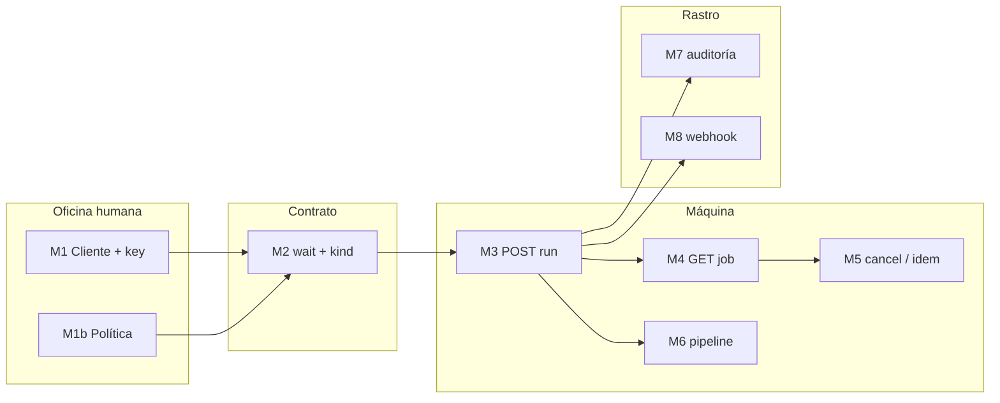
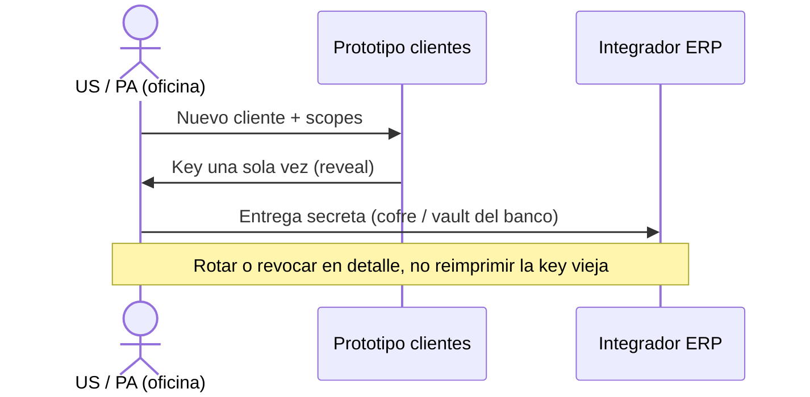
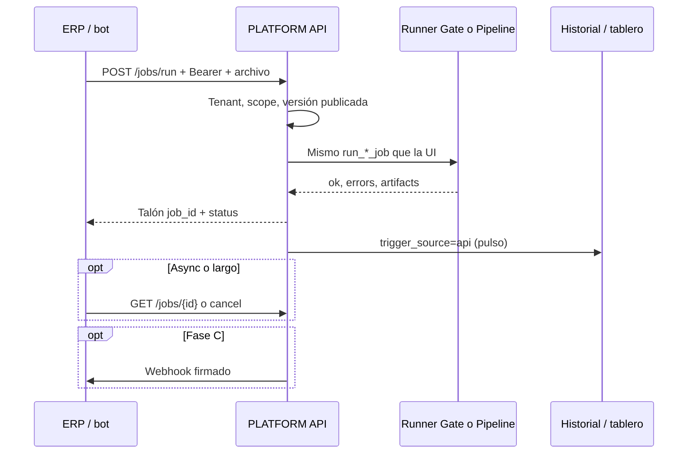
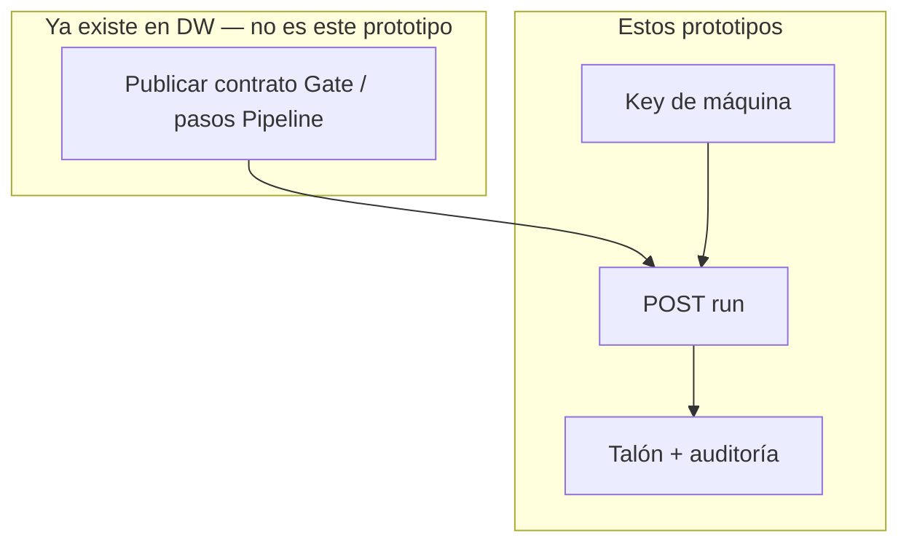

# Mapa de prototipos PLATFORM API — relación, flujo y ejemplo

Cómo se **relacionan** las pantallas del visor, qué **función** cumple cada una, el **flujo de trabajo** y un **ejemplo de proceso** de punta a punta.

> **Visor:** `[../../prototype/platform_api/](../../prototype/platform_api/)` · `http://127.0.0.1:8000/prototype/platform_api/`  
> **Producto:** `[../PLATFORM_API.md](../PLATFORM_API.md)`  
> **Pantalla guía en el visor:** `#pa_guide`

Los prototipos **no son un menú de producto más**. Simulan dos mundos:

| Mundo                          | Quién                   | Qué ve                                          |
| ------------------------------ | ----------------------- | ----------------------------------------------- |
| **A · Oficina (humano US/PA)** | Quien da de alta al ERP | Clientes, keys, política, webhooks, paths       |
| **B · Máquina (ERP / bot)**    | El sistema a las 06:00  | POST run → talón → consulta / cancel / pipeline |

La UI de Gate/Pipe/Pipeline **ya existe** en el producto. Aquí no se rediseña el validador: se muestra el **mostrador HTTP** y el **talón** que deja cada disparo.

---

## 1. Idea en una frase

**Alguien de confianza emite una llave (M1). El ERP usa esa llave para pedir el mismo trabajo que un operador haría a mano (M3). Queda un talón auditable (M4–M7).**

M9 (paths) y transversal (runners) **no son pantallas de operación diaria**: son el plano eléctrico (qué URL existe, qué motor se llama).

---

## 2. Relación pantalla ↔ función

Lea esta tabla **de arriba abajo** la primera vez. Luego use el visor con `#pa_guide`.

### Bloque A — Preparar la máquina (una vez, o al rotar keys)

| Orden | Prototipo           | Módulo | Función                                                                | Se relaciona con       |
| ----- | ------------------- | ------ | ---------------------------------------------------------------------- | ---------------------- |
| 1     | `api_clients`       | M1     | Ver quién puede llamar a la API en **esta** compañía                   | Detalle, nuevo         |
| 2     | `api_client_create` | M1     | Dar de alta nombre, entorno, **scopes** (no un token dios)             | → reveal               |
| 3     | `api_client_reveal` | M1     | Mostrar la key **una vez** (bóveda). El servidor no la vuelve a pintar | Detalle                |
| 4     | `api_client_detail` | M1     | Rotar o **revocar**. Ver último job                                    | Webhooks, listado jobs |
| 5     | `pa_security`       | M1b    | Recordatorio de reglas: PII, TTL, cuotas, no enumerar ids              | Todas las llamadas     |

Sin el bloque A, el resto es teatro: no hay identidad de máquina.

### Bloque B — Entender el pedido (diseño, no operación)

| Prototipo        | Módulo      | Función                                                                                                                              |
| ---------------- | ----------- | ------------------------------------------------------------------------------------------------------------------------------------ |
| `pa_contract`    | M2          | Distinguir **qué** se ejecuta (`kind` / pipeline) de **cómo espera** HTTP (`wait` sync/async). Estados de Gate ≠ estado del pipeline |
| `pa_openapi`     | M9          | Inventario de paths `/api/v1/…` (un run, no un API por app)                                                                          |
| `pa_integration` | Transversal | Qué `kind` llama a qué app; Worksheets fuera                                                                                         |

### Bloque C — Trabajar (cada archivo / cada mañana)

| Orden | Prototipo         | Módulo | Función                                                                                                | Relación                     |
| ----- | ----------------- | ------ | ------------------------------------------------------------------------------------------------------ | ---------------------------- |
| 1     | `pa_jobs_run`     | M3     | Formulario que **simula** `POST /jobs/run` (Gate o Pipe, MVP)                                          | → talón                      |
| 2     | `pa_job_result`   | M3     | **Talón**: `job_id`, accepted/rejected, sello hash. Es la respuesta HTTP hecha visible                 | Mismo id en Gate UI          |
| 3     | `pa_jobs_list`    | M4     | Cola/historial de jobs de la compañía (filtro kind/status)                                             | Detalle, pipeline, ops       |
| 4     | `pa_job_detail`   | M4     | Metadatos + links a informe/salida (TTL, firma). Sin celdas                                            | Artifacts                    |
| 5     | `pa_jobs_ops`     | M5     | Si el ERP reenvía el mismo lote: **mismo job**. Si se colgó: **cancel**. Dry-run no ensucia el tablero | Run + listado                |
| 6     | `pa_pipeline_run` | M6     | El POST no es un kind suelto: es **toda la cadena**. La API no orquesta; muestra el rail del Pipeline  | Tablero / historial Pipeline |

### Bloque D — Enterarse del resultado (ops e integración)

| Prototipo     | Módulo | Función                                                                              |
| ------------- | ------ | ------------------------------------------------------------------------------------ |
| `pa_audit`    | M7     | El tablero de Pipeline **debe contar** los runs `trigger_source=api`. Dry-run aparte |
| `pa_webhooks` | M8     | El ERP no quiere solo polling: callback firmado (sin archivo en el body)             |

---

## 3. Diseño del flujo de trabajo (humano vs máquina)

Hay **dos ciclos**. No ocurren en el mismo escritorio.

### Ciclo 1 — Alta (humano, poco frecuente)

Pantallas: `api_clients` → `api_client_create` → `api_client_reveal` → `api_client_detail`.  
Opcional: `pa_security` (límites) y `pa_webhooks` (URL del ERP).

### Ciclo 2 — Ejecución (máquina, cada lote)

Pantallas: `pa_jobs_run` → `pa_job_result` → `pa_jobs_list` / `pa_job_detail` → (`pa_jobs_ops` si retry/cancel) → `pa_audit`.  
Si el proyecto publicado es un **pipeline**: `pa_pipeline_run` en lugar del talón Gate simple.

### Relación con File Gate / File Pipeline (producto real)

El analista **sigue publicando en Gate o Pipeline**. El ERP **no diseña esquemas por API** (fuera de MVP).

---

## 4. Ejemplo de proceso — nómina del banco (martes 06:00)

Historia que recorre casi todas las pantallas. Compañía demo **ACME**.

### Contexto

| Rol       | Persona / sistema                               | Quiere                                                        |
| --------- | ----------------------------------------------- | ------------------------------------------------------------- |
| Ana (US)  | Oficina                                         | Que el banco mande el TXT sin que un operador suba el archivo |
| Contrato  | Proyecto Gate `nomina-mensual` v3 **publicado** | Validar fechas y filas                                        |
| ERP banco | `client_erp_01`                                 | Cada mañana `nomina_YYYYMMDD.txt`                             |

### Día −1 (oficina) — pantallas a abrir en este orden

1. `api_client_create` — Alta `client_erp_01`, entorno prod, scopes `jobs:run`, `jobs:read`, `artifacts:download` (sin `pipeline:run` si solo Gate).
2. `api_client_reveal` — Ana copia la key al gestor de secretos del banco. **Cierra la pantalla.** Esa key **queda asociada** a `client_erp_01` y se **reutiliza** en todas las peticiones (cada mañana). No se genera una key nueva por lote ni por job. Solo hay key nueva al **rotar** o al **dar de alta otro cliente**.
3. `pa_webhooks` (si Fase C) — URL `https://erp.acme.example/hooks/dw`.
4. `pa_security` — Confirma límite 25 MB y que los logs no guardan celdas.

### Día 0, 06:00 (máquina)

1. El ERP hace el equivalente a `pa_jobs_run`: mismo Bearer guardado el día −1 + `kind=file_gate`, `project_slug=nomina-mensual`, `version=published`, header `Idempotency-Key: erp-20260822-001`.
2. Respuesta = `pa_job_result`: talón `job_id=a1b2c3f0`, negocio **accepted**, sello sha256.
3. Si el banco reintenta el mismo archivo a las 06:00:07 → `pa_jobs_ops` (replay): **mismo** `job_id`, no un segundo intake.
4. Ana a las 08:00 abre `pa_jobs_list` y `pa_job_detail`: ve correlation, informe, TTL. El historial de **File Gate** muestra el mismo id (paridad UI).
5. `pa_audit`: el canal API del tablero Pipeline (o el recuento de jobs API) sube; no parece que “hoy no hubo corridas”.

### Variante — el TXT llega sucio y hay cadena

Si el flujo publicado es Pipeline *Clean → Gate*:

1. El POST es `pa_pipeline_run`: `kind=file_pipeline`, `wait=async`, `202`.
2. El rail muestra s1 Clean OK, s3 Gate **failed**, s4 Pipe skipped.
3. El banco recibe webhook `job.failed` o consulta GET. Ops abre el job Gate nativo desde `app_job_id` (eso ya es UI Pipeline, no este prototipo).

### Variante — lote colgado

1. `pa_jobs_ops` → Cancel. Status `cancelled`. No se inventa un accepted.

---

## 5. Recorrido sugerido en el visor (15 minutos)

Abra `[#pa_guide](../../prototype/platform_api/index.html#pa_guide)` y luego:

| Min | Hash                                       | Para qué                       |
| --- | ------------------------------------------ | ------------------------------ |
| 1   | `#pa_guide`                                | Este mapa, en pantalla         |
| 2   | `#api_clients` → create → reveal           | Entender la llave              |
| 3   | `#pa_contract`                             | Jugar kind vs wait             |
| 4   | `#pa_jobs_run` → `#pa_job_result`          | Un disparo                     |
| 5   | `#pa_jobs_list` → detalle → `#pa_jobs_ops` | Operar el talón                |
| 6   | `#pa_pipeline_run`                         | En qué se diferencia la cadena |
| 7   | `#pa_audit` → `#pa_webhooks`               | Ops e integración              |

No hace falta memorizar M9/transversal en el primer pase.

---

## 6. Qué no es cada pantalla (para no perderse)

| Si parece…                  | En realidad…                                                               |
| --------------------------- | -------------------------------------------------------------------------- |
| Un Swagger                  | `pa_openapi` es un **índice de paths**, no un cliente HTTP real            |
| El diseñador de Pipeline    | `pa_pipeline_run` solo muestra el **resultado** de una cadena ya publicada |
| El tablero de File Pipeline | `pa_audit` explica el **canal API** dentro de ese tablero; no lo reemplaza |
| Login 2FA                   | Los clientes de máquina **no** son usuarios UF                             |

---

## Relacionados

`[README.md](README.md)` · `[pa_auth.md](pa_auth.md)` · `[../PLATFORM_API.md](../PLATFORM_API.md)` §7 (ejemplo Gate)