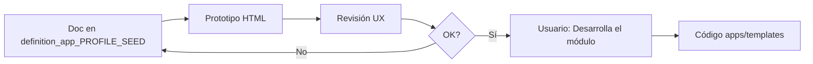

# definition_app_PROFILE_SEED — Definición PROFILE_SEED

Carpeta de documentación de análisis y definición para **PROFILE_SEED** (Sembrador de perfiles), vertical de la familia reutilización alta.

> **Producto:** [`../PROFILE_SEED.md`](../PROFILE_SEED.md)  
> **Familia §2:** [`../APP_FACTORY_HIGH_REUSE.md`](../APP_FACTORY_HIGH_REUSE.md) §7  
> **Rama Git sugerida:** `feature/profile-seed` (no desplegar a producción hasta merge a `main`)  
> **Chasis:** reutiliza `Company`, `UserProfile`, `Project`, `ProjectMembership`, seguridad y billing.  
> **Reuso técnico:** snapshots de `DmsSourceProfile` / contrato GATE / perfiles Match / entrada Reverse — **clone**, no vínculo vivo.  
> **Complemento:** Structure Scout (desde muestra); Bridge GATE (pre-check por hash).

---

## Método de trabajo (por módulo)

Igual que FILE GATE / Match / Reverse: **definir → prototipar → revisar → implementar solo con OK explícito**.

| Paso | Dónde | Quién |
|------|-------|--------|
| 1. Diseño | `docs/definition_app_PROFILE_SEED/<modulo>.md` | Agente + revisión |
| 2. HTML demo | `prototype/profile_seed/` | Agente |
| 3. Revisión | Chat / navegador | Usuario |
| 4. Implementación | `apps/profile_seed/` o servicios compartidos + CTAs | Solo con «Desarrolla el módulo» |

---

## Documentos (por módulo)

| Archivo | Módulo | Contenido | Estado |
|---------|--------|-----------|--------|
| [`../PROFILE_SEED.md`](../PROFILE_SEED.md) | Producto | Visión, MVP, fronteras | **Partida** |
| `seed_hub.md` | **1** | Hub / CTA Importar / permisos | Pendiente |
| `source_picker.md` | **2** | Selector origen (kind, proyecto, versión, slot) | Pendiente |
| `apply_draft.md` | **3** | Preview, validación, escritura borrador | Pendiente |
| `seed_history.md` | **4** | Historial / auditoría de semillas | Pendiente |
| `ps_integration.md` | Transversal | Kind opcional, URLs, reuso DMS | Pendiente |

> Los `.md` de módulo se crean al iniciar cada módulo (no anticipar specs vacías).

---

## Prioridad de siembra (MVP)

| Prioridad | Origen → Destino |
|-----------|------------------|
| P0 | FILE GATE (esquema publicado) → FILE MATCH Perfil A |
| P1 | FILE GATE → FILE MATCH Perfil B |
| P2 | FILE GATE → Reverse (entrada) |
| P3 | Match A ↔ Match B / otro Match |

---

## Carpetas de trabajo (objetivo)

| Rol | Ruta |
|-----|------|
| Specs | `docs/definition_app_PROFILE_SEED/` |
| Prototipos | `prototype/profile_seed/` |
| Templates | `templates/profile_seed/` y/o CTAs en `templates/file_match/`, `file_gate/`, … |
| App / servicios | `apps/profile_seed/` **o** `profile_seed_service` compartido |

---

## Decisión de diseño (hereda del producto)

| # | Tema | Decisión |
|---|------|----------|
| PS1 | ¿Compartir perfil vivo? | **No** — solo clone snapshot |
| PS2 | ¿Auto-publicar? | **No** — solo borrador destino |
| PS3 | ¿Tenant? | Misma compañía |
| PS4 | ¿Vs Scout? | Seed = desde definición; Scout = desde muestra |
| PS5 | ¿Vs Bridge GATE? | Seed = estructura; Bridge = job passed por hash |

---

## Orden sugerido de apertura

| Orden | Qué abrir | Nota |
|-------|-----------|------|
| 0 | Este README + [`PROFILE_SEED.md`](../PROFILE_SEED.md) | **Hecho** |
| 1 | `seed_hub.md` + prototipo CTA en Match Perfil A | Primer valor visible |
| 2 | `source_picker.md` | |
| 3 | `apply_draft.md` + spike GATE→Match A | |
| 4 | `seed_history.md` | |
| 5 | `ps_integration.md` | Congelar URLs / kind |

---

## Índice y estado

| Documento | Estado |
|-----------|--------|
| Producto PROFILE_SEED | [`../PROFILE_SEED.md`](../PROFILE_SEED.md) — partida |
| Paraguas familia | [`../APP_FACTORY_HIGH_REUSE.md`](../APP_FACTORY_HIGH_REUSE.md) §7 |
| Specs por módulo | Pendientes de apertura |
| Código | No iniciado |

---

*Carpeta: `docs/definition_app_PROFILE_SEED/` — definición por módulo del Sembrador de perfiles.*
