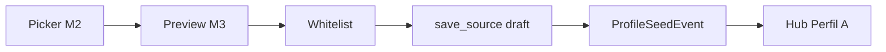

# Apply draft — PROFILE_SEED Módulo 3

Proceso y especificación del **Módulo 3** del Sembrador: **preview + validación + escritura de borrador** en el destino — clone del origen **publicado** elegido en M2. **Nunca** publica.

> Estado: **implementado** (M3 — preview + `save_source` + `ProfileSeedEvent` + wiring M2).  
> Producto: [`../PROFILE_SEED.md`](../PROFILE_SEED.md).  
> Rama: `feature/profile-seed`.  
> Predecesor: [`source_picker.md`](source_picker.md) (M2 — implementado).  
> Siguiente: [`seed_history.md`](seed_history.md) (M4 — **implementado**).  
> Destino P0: FILE MATCH · slot `profile_a`.  
> Origen P0: FILE GATE · slot `schema` · versión publicada.  
> Escritura: `source_persistence_service.save_source` (patrón Scout apply, 2 pasos meta→fields).  
> Auditoría: modelo `ProfileSeedEvent` (PS9); listado UI en M4.  
> App: `apps/profile_seed/` · host URLs bajo Match Perfil A.  
> Código: `apply_seed_service` · `profile_a_seed_apply` · `templates/profile_seed/apply_confirm*.html`.  
> Prototipos: [`../../prototype/profile_seed/`](../../prototype/profile_seed/).  
> Frontera Scout: Scout aplica draft de muestra; Seed clona definición **publicada**.  
> Frontera Bridge: no participa.

---

## Propósito

Permitir al diseñador (PA/ED del destino) **confirmar y sembrar** la estructura elegida:

1. Ver preview del origen publicado (tipo, encoding/delim, N campos, muestra de nombres);
2. Validar whitelist del destino (tipo incompatible → error, sin escritura);
3. Ver warning si el borrador destino ya tiene campos (overwrite);
4. Confirmar → `save_source` solo borrador + `ProfileSeedEvent`;
5. Volver al hub Perfil A (o deep-link al wizard) para seguir editando / publicar en Match M4.

```
Picker origen (M2) · source_id
        →
Preview + validación + overwrite (este módulo)
        →
save_source (borrador Match A) + ProfileSeedEvent
        →
Hub Perfil A
```

---

## Qué es / qué hace / qué no hace

| Pregunta | Respuesta |
|----------|-----------|
| **¿Qué es?** | El paso de **confirmar y escribir** el clone snapshot en el borrador destino |
| **¿Qué hace?** | Preview, valida tipo, avisa overwrite, escribe borrador, audita |
| **¿Qué no hace?** | No elige origen (M2). No publica Match. No clona `gate_policy` / reglas Match / target. No es historial completo (M4 lista eventos). No es Scout ni bridge |
| **Copy UX** | “Confirmar importación” / “Sembrar borrador” — **no** “publicar”, “vincular”, “bridge”, “aplicar Scout” |

---

## Relación con M2 / M4 / Scout / Match

| Tema | Decisión |
|------|----------|
| Entrada | `source_id` (PK proyecto origen) desde M2; destino = Match actual · `profile_a` |
| Lectura origen | Solo `get_published_version` → `profile_to_dict` (nunca borrador origen) |
| Escritura destino | `get_or_create_draft_version` + `save_source` (strict=False como Scout) |
| Whitelist | `profile_a_whitelist.reject_non_whitelist_file_type` **antes** de escribir |
| Strip PS7 | Quitar `config.gate_policy` (y claves de política) del snapshot clonado |
| Scout apply | Misma familia de writer; origen distinto (publicado vs draft Scout) |
| M4 | Lee `ProfileSeedEvent`; M3 **crea** el evento ok/failed |



**Frontera M2 vs M3:** M2 selecciona; M3 preview + escribe.  
**Frontera M3 vs publicar Match:** M3 solo borrador SourceProfile A; publicar definición Match sigue siendo el módulo Match de publicación.  
**Frontera M3 vs M4:** M3 registra evento; M4 lista/detalla.

---

## Alcance de este documento

| Incluido | Excluido |
|----------|----------|
| Preview origen publicado (P0 GATE→Match A) | Selector de origen (M2) |
| Validación whitelist Perfil A | Diff campo a campo (Fase 2) |
| Warning + confirm overwrite borrador | Publicar Match / GATE |
| `save_source` 2 pasos + strip policy | Match B / Reverse writers (P1+) |
| Modelo + create `ProfileSeedEvent` | UI historial completa (M4) |
| Ayuda del paso | Kind propio `profile_seed` |
| Wiring Continuar M2 → confirmar | Bridge / Scout |

---

## Preview (qué mostrar)

| Señal | UI |
|-------|-----|
| Origen | kind · slug · vN · slot Esquema |
| Destino | Match · slug · Perfil A |
| Tipo archivo | `file_type_code` |
| Layout | encoding, delimitador (si aplica), line ending (resumen corto) |
| Campos | **N** + muestra de hasta **8** nombres |
| Destino vacío | Info: “Se llenará el borrador A con N campos.” |
| Destino con campos | **Warning:** “El borrador A ya tiene M campos; se sobrescribirán con N del origen. No se publica la definición Match.” |
| Tipo fuera de whitelist | **Error** + CTA volver a M2; botón Aplicar deshabilitado / ausente |

Diff campo-a-campo = Fase 2.

### Shape preview (servicio → template)

```python
{
    "source": {  # fila M2 + extras
        "id", "slug", "name", "kind", "kind_label",
        "slot", "slot_label", "version_number", "version_label",
        "file_type_code", "fields_count", "published_at",
        "encoding_code", "delimiter",  # opcionales
        "field_names_sample": ["col_a", "col_b", ...],  # ≤8
    },
    "target": {
        "slug", "name", "slot": "profile_a", "slot_label",
        "field_count": int,          # borrador actual
        "file_type_code": str,
    },
    "overwrite": bool,               # target.field_count > 0
    "can_apply": bool,               # permiso + whitelist OK + origen válido
    "whitelist_error": str | None,
}
```

---

## Clone snapshot (escritura)

### Lectura

```
published = get_published_version(source_project)
raw = profile_to_dict(published.source_profile)
```

### Limpieza (PS1 / PS7)

| Incluir | Excluir |
|---------|---------|
| `file_type_code` | `config.gate_policy` |
| encoding / line_ending (vía dict `save_source`) | Reglas Match / target Reverse |
| `capture_start` / `capture_end` | Jobs / runs |
| `content_rules` / `processing_report` (si son del source) | FK viva al perfil origen |
| `fields[]` | Cualquier vínculo a `DmsMappingVersion` origen |

### Escritura (patrón Scout)

1. Re-validar elegibilidad origen (`list_eligible_sources` / resolve) + `user_can_import` destino.  
2. Whitelist Perfil A; si falla → `OperationResult` + evento `failed` opcional (o solo flash sin evento — **preferir evento failed** para diagnóstico PS9).  
3. `map_published_source_to_partials(cleaned)` → `meta`, `fields_partial`.  
4. `save_source(user, target, meta, strict=False)`.  
5. `save_source(user, target, fields_partial, strict=False)`.  
6. `ProfileSeedEvent` status `ok` / `failed`.  
7. **No** publish.

> Overwrite MVP = reemplazo del partial source en el **borrador** destino; no toca `current_version` publicada del Match.

---

## Modelo `ProfileSeedEvent` (propuesto)

Crear en `apps/profile_seed/models.py` (+ migración en el mismo PR de implementación M3).

| Campo | Tipo | Notas |
|-------|------|-------|
| `id` | UUID PK | |
| `target_project` | FK Project | Destino Match (CASCADE) |
| `target_slot` | char | `profile_a` (P0) |
| `source_project` | FK Project NULL | SET_NULL si se borra origen |
| `source_kind` | char | `file_gate` … |
| `source_slot` | char | `schema` … |
| `source_version` | int | Denormalizado (vN publicada) |
| `source_slug` | char | Denormalizado para historial si se borra origen |
| `status` | char | `ok` / `failed` |
| `message` | text | User-facing corto |
| `mode` | char | default `clone_snapshot` |
| `created_by` | FK User NULL | |
| `created_at` | datetime | |

Índice: `(target_project, -created_at)` para M4.

M4 listará estos registros desde el hub Match / seed.

---

## Pantallas

| Pantalla | Descripción |
|----------|-------------|
| Confirmar importación | Preview + overwrite + POST aplicar |
| Post-éxito | Flash + redirect hub Perfil A (CTA “Revisar Perfil A”) |
| Ayuda | Qué se clona, overwrite, roles, frontera Scout/bridge |

### Rutas propuestas (MVP bajo Match)

| Acción | URL | Nombre Django |
|--------|-----|---------------|
| Confirmar (GET preview / POST apply) | `/app/file-match/proyectos/<slug>/perfil-a/importar/confirmar/` | `profile_a_seed_apply` |
| Ayuda | `…/importar/confirmar/ayuda/` | `profile_a_seed_apply_help` |

Query / body:

| Param | Uso |
|-------|-----|
| `source_id` | PK origen (GET y POST) |
| `action=apply` | POST confirmar |

Wiring M2: **Continuar a confirmar** → `profile_a_seed_apply?source_id=…`.

Namespace host: `file_match:*` · servicio: `apply_seed_service` (o métodos en `profile_seed_service`).

---

## Proceso (flujo de usuario)

1. En M2 selecciona origen → **Continuar a confirmar**.  
2. Ve preview origen/destino + warning overwrite si aplica.  
3. Si tipo incompatible → error + volver a M2 (no aplica).  
4. PA/ED pulsa **Sembrar borrador** (POST).  
5. OK → flash éxito → hub Perfil A.  
6. Fail → flash error + re-render preview (PRG opcional; preferir redirect picker/confirm con flash).  
7. Cancelar → M2 o hub A.

### Estados

| Estado | UI |
|--------|-----|
| Origen válido, destino vacío | Info + Aplicar habilitado |
| Origen válido, overwrite | Warning + Aplicar habilitado |
| Whitelist fail | Error + sin Aplicar |
| `source_id` ausente / no elegible | Flash `MSG_SOURCE_UNAVAILABLE` → redirect M2 |
| Sin permiso | Flash `MSG_NO_IMPORT` → hub A |

---

## Reglas de negocio

| ID | Regla |
|----|-------|
| A1 | Solo clone snapshot; nunca FK viva al perfil origen (PS1). |
| A2 | Escribe solo **borrador** destino; nunca auto-publica (PS2). |
| A3 | Origen debe seguir siendo elegible y **publicado** al aplicar (re-check). |
| A4 | Misma compañía; PA/ED en destino; visibilidad origen (PS4/PS5). |
| A5 | No clonar `gate_policy` ni reglas Match / target (PS7). |
| A6 | Whitelist Perfil A antes de `save_source`; mensaje de catálogo Match. |
| A7 | Overwrite: aviso explícito en UI; confirmar con POST (PS8). |
| A8 | Registrar `ProfileSeedEvent` ok y failed (PS9). |
| A9 | Sin Django Forms; HTML plano + POST `action=apply`. |
| A10 | Tras OK UX: implementar preview + writer + modelo; M4 lista eventos. |

---

## Validaciones / mensajes

| Situación | Canal | Texto |
|-----------|-------|-------|
| Sin permiso | flash | No tiene permiso para importar estructuras en este proyecto. |
| Origen no disponible | flash | El origen seleccionado no está disponible o no tiene versión publicada. |
| Tipo no permitido (whitelist A) | error UI / flash | El tipo de archivo no está permitido en FILE MATCH (perfil A). Use CSV, Excel, TXT delimitado, TXT posicional, JSON o XML. |
| Apply OK | success | Estructura importada al borrador del Perfil A. Revise y publique la definición Match cuando corresponda. |
| Apply fail | error + log | No se pudo importar la estructura. Si persiste, contacte al administrador. |
| Overwrite (aviso, no error) | warning UI | El borrador del Perfil A ya tiene M campos; se sobrescribirán con N del origen. No se publica la definición Match. |

Catálogo: ampliar [`UI_MESSAGES.md`](../definition_app/UI_MESSAGES.md) §3.13 al implementar.

---

## Diseño UX

| Elemento | Criterio |
|----------|----------|
| Eyebrow | `PROFILE SEED · Confirmar` |
| Stepper | 1 Entrada ✓ · 2 Origen ✓ · 3 Confirmar (active) |
| Paneles | Origen (publicado) · Destino (borrador) · Campos muestra |
| Primario | Sembrar borrador |
| Secondary | Ayuda · Volver a origen (M2) · Cancelar (hub A) |
| Post-OK | Flash + hub Perfil A |

### Wireframe

1. Scope Match · Perfil A.  
2. Stepper paso 3.  
3. Card origen: GATE · slug · vN · tipo · encoding.  
4. Card destino: borrador A · M campos actuales.  
5. Lista corta de nombres de campo.  
6. Alert overwrite si M>0.  
7. CTA Sembrar / Volver / Cancelar.

---

## Integración técnica (objetivo post-OK)

| Pieza | Ubicación |
|-------|-----------|
| Modelo | `apps/profile_seed/models.py` → `ProfileSeedEvent` + migración |
| Servicio apply | `apps/profile_seed/services/apply_seed_service.py` (o extensión de `profile_seed_service`) |
| Whitelist | `apps.file_match.profile_a.services.profile_a_whitelist` |
| Writer | `source_persistence_service.save_source` |
| Publish check origen | `file_intake_persistence_service.get_published_version` |
| Vistas / URLs | `profile_a_seed_apply` / `_help` |
| Templates | `templates/profile_seed/apply_confirm.html` · `apply_confirm_help.html` |
| Wiring M2 | Continuar → `?source_id=` |
| Mensajes | `UI_MESSAGES.md` §3.13 |

---

## Matriz de permisos (M3)

| Acción | PA | ED | GE | CO |
|--------|----|----|----|-----|
| Ver preview / confirmar | Sí | Sí | No | No |
| POST sembrar borrador | Sí | Sí | No | No |
| Ver ayuda | Sí | Sí | Sí* | Sí* |

\*Ayuda del flujo; sin aplicar.

---

## Criterios de aceptación

- [x] Propósito, frontera M2/M4/Scout/bridge
- [x] Preview shape, whitelist, overwrite, clone strip
- [x] `ProfileSeedEvent` propuesto + reglas A1–A10
- [x] Prototipos: confirm vacío / overwrite / error tipo / ayuda
- [x] «Desarrolla el módulo» → código (preview + `save_source` + modelo + wiring M2)
- [x] Mensajes en `UI_MESSAGES.md` §3.13

---

## Implementación (entregado)

| Pieza | Ubicación |
|-------|-----------|
| `ProfileSeedEvent` | `apps/profile_seed/models.py` · migración `0001_profile_seed_event` |
| `get_apply_preview` / `apply_seed_to_profile_a` | `apps/profile_seed/services/apply_seed_service.py` |
| Vistas / URLs | `profile_a_seed_apply` / `profile_a_seed_apply_help` |
| Templates | `templates/profile_seed/apply_confirm.html` · `apply_confirm_help.html` |
| Wiring M2 | Continuar → `?source_id=` |
| Mensajes | `UI_MESSAGES.md` §3.13 · `MSG_APPLY_OK` / `MSG_APPLY_FAIL` |

---

## Próximos pasos

1. Abrir M4 `seed_history.md` (listado `ProfileSeedEvent`).  
2. Ampliar CTAs / caminos P1+ tras historial.  
3. `ps_integration.md` transversal.

---

## Referencias

| Documento | Uso |
|-----------|-----|
| [`../PROFILE_SEED.md`](../PROFILE_SEED.md) | PS1–PS10, EJ-01…03, modelo |
| [`source_picker.md`](source_picker.md) | M2 `source_id` |
| [`seed_hub.md`](seed_hub.md) | Destino / permisos |
| [`../definition_app_STRUCTURE_SCOUT/apply_target.md`](../definition_app_STRUCTURE_SCOUT/apply_target.md) | Patrón `save_source` |
| [`../definition_app_FILE_MATCH/profile_a.md`](../definition_app_FILE_MATCH/profile_a.md) | Destino A / whitelist |
| [`../definition_app/UI_MESSAGES.md`](../definition_app/UI_MESSAGES.md) §3.13 | Mensajes |

---

*Documento: `docs/definition_app_PROFILE_SEED/apply_draft.md` — Módulo 3 PROFILE_SEED (implementado).*
