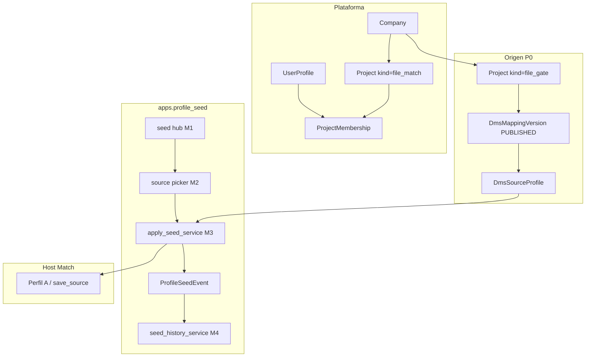

# Integración PROFILE_SEED ↔ DynamicWorkspace

Alineación del **Sembrador de perfiles (PROFILE_SEED)** con la plataforma: compañías, usuarios, seguridad, reuso DMS / GATE / Match, frontera STRUCTURE SCOUT / Bridge GATE y convenciones Django ya implementadas (M1–M4).

> Estado: **documentado** (refleja implementación M1–M4 en `apps.profile_seed` + CTAs host en FILE MATCH).  
> Producto: [`../PROFILE_SEED.md`](../PROFILE_SEED.md).  
> Rama: `feature/profile-seed`.  
> Fuente de verdad plataforma: [`../DynamicWorkspace.md`](../DynamicWorkspace.md), [`../definition_app/DynamicWorkspace_Model.md`](../definition_app/DynamicWorkspace_Model.md).  
> Patrón hermano: [`../definition_app_STRUCTURE_SCOUT/ss_integration.md`](../definition_app_STRUCTURE_SCOUT/ss_integration.md), [`../definition_app_FILE_MATCH/fm_integration.md`](../definition_app_FILE_MATCH/fm_integration.md).  
> Specs por módulo: [`README.md`](README.md).  
> Mensajes UI: [`../definition_app/UI_MESSAGES.md`](../definition_app/UI_MESSAGES.md) §3.13.

---

## Principio

PROFILE_SEED **no duplica** tenant, autenticación ni (en MVP) un contenedor de proyecto propio. Es una capa delgada (`apps.profile_seed`) que:

1. reutiliza `Company`, `UserProfile`, `Project`, `ProjectMembership`, seguridad y billing;
2. **lee** definiciones **publicadas** (`get_published_version` + `profile_to_dict`);
3. **escribe** solo borrador destino vía `source_persistence_service.save_source` (patrón Scout apply, 2 pasos);
4. aporta **obra propia**: permisos de import, picker, apply, modelo `ProfileSeedEvent` y historial;
5. se **embebe** en apps destino (P0: FILE MATCH Perfil A) — **sin** `project_kind=profile_seed` obligatorio.



**Diferenciador vs STRUCTURE SCOUT:** Seed = desde **definición publicada**; Scout = desde **muestra**. Ambos siembran borrador; el origen del snapshot es distinto.

**Diferenciador vs Bridge GATE:** Bridge = pre-check por **hash** de job; Seed = **clone de estructura** (sin vínculo vivo).

---

## Jerarquía tenant

```
Company
 ├── UserProfile (UA | US | UF)
 ├── Subscription
 ├── Project (file_gate, …)     ← orígenes publicados
 └── Project (file_match, …)   ← destino P0
      ├── DmsProjectConfig / DmsMappingVersion (borrador + published Match)
      ├── DmsSourceProfile (Perfil A — destino del seed)
      └── ProfileSeedEvent (N — auditoría M3/M4)
```

**No hay** en MVP:

- `project_kind = profile_seed`
- Hub / listado / sidebar propios de Seed
- Tabla de exploración Scout ni reuso de `StructureDraft` / `ScoutApply`

**Reglas heredadas:**

1. Todo usuario opera dentro de `user.profile.company` (salvo UA soporte).
2. Destino y origen deben ser de la **misma** compañía (PS4).
3. Acceso a `/app/` requiere seguridad completa + suscripción vigente (US/UF).
4. Cross-compañía: **no**.

---

## Tipos de usuario global

| Tipo | Rol en PROFILE_SEED |
|------|---------------------|
| **UA** | Soporte; no opera el Sembrador de negocio en MVP |
| **US** | Gestiona UF; ve proyectos Match/GATE según membresía/visibilidad |
| **UF** | Opera import en destinos donde es PA/ED; consulta historial según membresía Match |

Seed **no introduce** tipos de usuario nuevos. Permisos granulares = roles del **proyecto destino** (+ visibilidad del origen).

---

## Discriminador `project_kind` (MVP)

| Decisión | Valor |
|----------|--------|
| Kind propio Seed | **No** en MVP |
| Host P0 | URLs bajo `file_match` · namespace `file_match:*` |
| App Django | `apps.profile_seed` en `INSTALLED_APPS` (servicios + modelo) |
| Fase 2 | Opcional `KIND_PROFILE_SEED` + hub transversal si hace falta historial global |

Otros kinds de la plataforma siguen siendo orígenes/destinos (`file_gate`, `file_match`, `reverse`, `dms`, `structure_scout`).

---

## Modelo propio

| Modelo | Relación | Módulo | Rol |
|--------|----------|--------|-----|
| `ProfileSeedEvent` | N:1 `target_project` (+ FK opcional `source_project`) | M3 escribe · M4 lee | Auditoría ok/failed · modo `clone_snapshot` |

Campos clave: `target_slot`, `source_kind`, `source_slot`, `source_version`, `source_slug` (denormalizado), `status`, `message`, `created_by`, `created_at`.

Migración: `profile_seed.0001_profile_seed_event`.

---

## Reuso técnico (obligatorio)

| Pieza | Dónde | Seed |
|-------|-------|------|
| Visibilidad proyectos GATE | `gate_project_service.visible_projects_qs` | Picker M2 |
| Versión publicada | `file_intake_persistence_service.get_published_version` | M2/M3 |
| Snapshot source | `source_persistence_service.profile_to_dict` | M2 metadata · M3 clone |
| Escritura borrador | `source_persistence_service.save_source` | M3 (2 pasos meta→fields) |
| Whitelist Perfil A | `profile_a_whitelist` | M3 antes de escribir |
| Acceso Match | `match_project_service.get_project_for_user` | Host vistas |

**Prohibido en clone (PS7):** `config.gate_policy`, reglas Match, target Reverse, jobs, FK viva al perfil origen.

---

## Frontera Scout / Bridge / Match publish

| Producto | Entrada | Salida típica |
|----------|---------|----------------|
| **PROFILE_SEED** | Definición publicada | Borrador destino + `ProfileSeedEvent` |
| **STRUCTURE SCOUT** | Muestra de archivo | `StructureDraft` → borrador destino + `ScoutApply` |
| **Bridge GATE** | Hash de archivo en job | Pre-check passed / warnings |
| **Publish Match** | Borrador A+B+reglas | `DmsMappingVersion` publicada |

Seed **nunca** auto-publica el destino (PS2). Publicar Match sigue siendo el módulo de publicación de FILE MATCH.

Compartible a futuro: capa “aplicar estructura a destino” explícita (hoy Seed y Scout reusan `save_source` por separado).

---

## Membresía y matriz de permisos

Roles = `ProjectMembership` del **destino** Match (reuso total).

| Acción | PA | ED | GE | CO |
|--------|----|----|----|-----|
| Ver hub Perfil A / historial importaciones | Sí | Sí | Sí | Sí |
| CTA / shell Importar (M1) | Sí | Sí | No | No |
| Selector origen (M2) | Sí | Sí | No | No |
| Confirmar / sembrar borrador (M3) | Sí | Sí | No | No |
| Ver detalle historial (M4) | Sí | Sí | Sí | Sí |
| Importar de nuevo (CTA) | Sí | Sí | No | No |
| Ver origen GATE en picker / deep-link | Sí* | Sí* | — | — |

\*Requiere poder **ver** el proyecto origen (membresía GATE o `dms_config.visibility=company`).

Seed no inventa UI de miembros propia; usa la de FILE MATCH / GATE.

---

## URLs y navegación (congeladas — P0)

Host: FILE MATCH · prefijo `/app/file-match/proyectos/<slug>/perfil-a/` · `app_name = file_match`.

| Área | Ruta | Nombre URL |
|------|------|------------|
| Shell importar (M1) | `…/importar/` | `profile_a_seed_hub` |
| Ayuda M1 | `…/importar/ayuda/` | `profile_a_seed_hub_help` |
| Origen (M2) | `…/importar/origen/` | `profile_a_seed_picker` |
| Ayuda M2 | `…/importar/origen/ayuda/` | `profile_a_seed_picker_help` |
| Confirmar (M3) | `…/importar/confirmar/` | `profile_a_seed_apply` |
| Ayuda M3 | `…/importar/confirmar/ayuda/` | `profile_a_seed_apply_help` |
| Historial (M4) | `…/importar/historial/` | `profile_a_seed_history` |
| Detalle | `…/importar/historial/<uuid>/` | `profile_a_seed_history_detail` |
| Ayuda M4 | `…/importar/historial/ayuda/` | `profile_a_seed_history_help` |

Query relevantes: `kind`, `source_id` (M2/M3); `status` (M4).

**CTA hub Perfil A:** “Importar estructura” (PA/ED) + “Historial de importaciones” (todos los roles con acceso).

Templates: `templates/profile_seed/` + panel en `templates/file_match/profile_a/hub.html`.  
Prototipos: `prototype/profile_seed/` (gitignored).  
CSS: reuso `projects.css` / `mapping.css` / `source_profile.css`. Sin Django Forms.

**Sidebar UF:** no hay entrada Seed propia en MVP; el usuario entra por FILE MATCH → Perfil A.

---

## Stepper del flujo Importar (P0)

| Paso | Pantalla | Módulo |
|------|----------|--------|
| 1 Entrada | Shell destino | M1 |
| 2 Origen | Picker GATE publicado | M2 |
| 3 Confirmar | Preview + `save_source` | M3 |
| (aparte) | Historial de eventos | M4 |

---

## Caminos de siembra

| Prioridad | Origen → Destino | MVP |
|-----------|------------------|-----|
| **P0** | FILE GATE `schema` publicado → Match `profile_a` | **Implementado** |
| P1 | GATE → Match `profile_b` | Pendiente |
| P2 | GATE / Match → Reverse `input` | Pendiente |
| P3 | Match A → B (mismo proyecto) | **Implementado** (`copy_from_a_service`; no cross-project aún) |
| Fase 2 | DMS / FilePipe; hub kind Seed; Match↔Match otro proyecto | Pendiente |

---

## Seguridad y convenciones

| Tema | Criterio |
|------|----------|
| Decoradores | `security_complete_required` + `user_type_required("UF")` (vistas host Match) |
| Formularios | HTML plano + GET/POST — **sin** Django Forms |
| Resultados | `OperationResult` en apply; flash `messages.*` + PRG |
| Logs | `logger.exception` técnico; usuario solo catálogo §3.13 |
| Idioma | Docs/UI en español; código en inglés |

---

## Mensajes UI

Catálogo único: [`UI_MESSAGES.md`](../definition_app/UI_MESSAGES.md) §3.13 — bloques M1–M4 (acceso, picker, apply, historial).

Constantes MSG en `profile_seed_service` / `apply_seed_service` / `seed_history_service` alineadas al catálogo.

---

## Checklist de integración (as-built)

- [x] App `apps.profile_seed` + `ProfileSeedEvent` (sin kind obligatorio)
- [x] CTA + shell Importar en Match Perfil A (M1)
- [x] Picker orígenes GATE publicados (M2)
- [x] Preview + whitelist + overwrite + `save_source` + auditoría (M3)
- [x] Historial list/detail + enlace hub A (M4)
- [x] Strip `gate_policy` en clone
- [x] Matriz roles PA/ED/GE/CO
- [x] Mensajes §3.13 M1–M4
- [ ] Kind / hub / sidebar propios (Fase 2)
- [ ] Caminos P1–P3 (Match B, Reverse, Match↔Match)
- [ ] CTA “Importar” uniforme en GATE / Reverse / DMS
- [ ] Capa apply compartida explícita con Scout (deseable)

---

## Fuera de alcance de este documento

- Redefinir módulos M1–M4 (ver specs por módulo).
- Prototipos HTML nuevos (integración = mapa as-built).
- Deploy a producción desde `feature/profile-seed` (merge a `main` primero — PS10).

---

## Referencias

| Documento | Uso |
|-----------|-----|
| [`../PROFILE_SEED.md`](../PROFILE_SEED.md) | Producto, PS1–PS10, matriz §11 |
| [`README.md`](README.md) | Índice de módulos |
| [`../STRUCTURE_SCOUT.md`](../STRUCTURE_SCOUT.md) · [`ss_integration.md`](../definition_app_STRUCTURE_SCOUT/ss_integration.md) | Frontera Scout |
| [`../FILE_MATCH.md`](../FILE_MATCH.md) · [`../FILE_GATE.md`](../FILE_GATE.md) | Destino / origen P0 |
| [`../definition_app/UI_MESSAGES.md`](../definition_app/UI_MESSAGES.md) | §3.13 |
| [`../APP_FACTORY_HIGH_REUSE.md`](../APP_FACTORY_HIGH_REUSE.md) | Familia §7 |

---

*Documento: `docs/definition_app_PROFILE_SEED/ps_integration.md` — integración transversal PROFILE_SEED (documentado M1–M4).*
