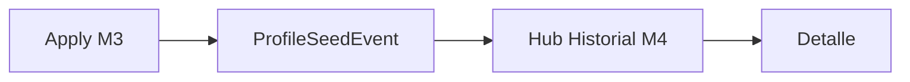

# Seed history — PROFILE_SEED Módulo 4

Proceso y especificación del **Módulo 4** del Sembrador: **historial de semillas** — listado y detalle de `ProfileSeedEvent` creados en M3, anclado al proyecto destino (P0: FILE MATCH).

> Estado: **implementado** (M4 — listado / detalle `ProfileSeedEvent` + enlace hub A).  
> Producto: [`../PROFILE_SEED.md`](../PROFILE_SEED.md).  
> Rama: `feature/profile-seed`.  
> Predecesor: [`apply_draft.md`](apply_draft.md) (M3 — implementado).  
> Siguiente: [`ps_integration.md`](ps_integration.md) (transversal — **documentado**).  
> Fuente: modelo existente `ProfileSeedEvent` — **solo lectura** en M4.  
> Destino P0: eventos con `target_project` = Match actual · `target_slot=profile_a`.  
> App: `apps/profile_seed/` · host URLs bajo Match Perfil A.  
> Código: `seed_history_service` · `profile_a_seed_history*` · `templates/profile_seed/history_*.html`.  
> Prototipos: [`../../prototype/profile_seed/`](../../prototype/profile_seed/).  
> Frontera Scout: historial Scout = drafts + applies de muestra; Seed = imports de definición publicada.  
> Frontera Bridge: no participa.

---

## Propósito

Dar visibilidad auditable de **qué se importó** y **con qué resultado**:

1. Listado de eventos de seed del proyecto Match (fecha desc);
2. Filtro por status (todos / ok / failed);
3. Detalle de un evento (origen, versión, mensaje, usuario);
4. Deep-links al hub Perfil A y al origen GATE si sigue existiendo;
5. CTA secundario para iniciar otra importación (M1).

```
ProfileSeedEvent (target = Match actual)
        →
Timeline filtrable
        →
Detalle evento
        →
CTAs: Perfil A / origen / Importar de nuevo
```

---

## Qué es / qué hace / qué no hace

| Pregunta | Respuesta |
|----------|-----------|
| **¿Qué es?** | El **libro de bitácora** de importaciones al destino Match |
| **¿Qué hace?** | Lista, filtra, detalla eventos; enlaces de navegación |
| **¿Qué no hace?** | No siembra de nuevo (eso es M1–M3). No edita eventos. No deshace overwrite. No lista seeds de otros proyectos destino |
| **Copy UX** | “Historial de importaciones” — no “ejecuciones”, “bridge”, “Scout” ni “publicaciones Match” |

---

## Relación con M3 / Match / Scout

| Tema | Decisión |
|------|----------|
| Fuente | Solo `ProfileSeedEvent` filtrado por `target_project` = Match actual |
| Escritura | **Prohibida** en M4 (M3 ya creó ok/failed) |
| Anclaje UI | Bajo Perfil A / flujo Importar (P0); enlace opcional desde hub Perfil A |
| Scout history | Distinto producto / tablas; no mezclar timelines |
| CO | Ve metadatos (fecha, origen slug/vN, status, usuario); **no** hay payload de campos en el evento (ya seguro) |



**Frontera M3 vs M4:** M3 escribe eventos; M4 solo lee.  
**Frontera M4 vs publicar Match:** historial de seed ≠ historial de versiones publicadas Match.

---

## Alcance de este documento

| Incluido | Excluido |
|----------|----------|
| Timeline por destino Match | Historial global multi-proyecto (Fase 2 / hub Seed) |
| Filtro status | Filtro por rango de fechas (Fase 2) |
| Detalle evento + deep-links | Re-aplicar / rollback / diff campos |
| Empty state + CTA Importar | Edición / borrado de eventos |
| Ayuda | Eventos de Match B / Reverse (cuando existan paths P1+) |

---

## Proceso (flujo de usuario)

1. Desde hub Perfil A (enlace “Historial de importaciones”) o tras M3 → **Historial**.  
2. Ver tabla ordenada por `created_at` desc.  
3. Filtrar por status (opcional).  
4. Abrir detalle de un evento.  
5. Desde detalle: abrir Perfil A / origen GATE (si existe) / Importar de nuevo (M1).

### Evento timeline (fila)

| Columna | Contenido |
|--------|-----------|
| Fecha | `created_at` |
| Origen | `source_kind` · `source_slug` (o FK) · `v{source_version}` · slot |
| Destino | slot (`Perfil A`) |
| Status | ok / fallido (badge) |
| Usuario | `created_by` (username / display) |
| Acción | Ver detalle |

### Shape fila (servicio → template)

```python
{
    "id": str,  # UUID
    "created_at": datetime,
    "status": "ok" | "failed",
    "status_label": "OK" | "Fallido",
    "message": str,
    "source_kind": str,
    "source_kind_label": str,
    "source_slug": str,
    "source_version": int,
    "source_version_label": "v3",
    "source_slot": str,
    "source_slot_label": str,
    "source_project_id": int | None,
    "source_url": str | None,  # deep-link si visible
    "target_slot": str,
    "target_slot_label": str,
    "created_by_label": str,
}
```

---

## Pantallas

| Pantalla | Descripción |
|----------|-------------|
| Hub historial | Filtro status + tabla |
| Detalle evento | Metadatos + mensaje + CTAs |
| Empty | Sin eventos + CTA Importar estructura |
| Ayuda | Qué se lista, roles, frontera Scout/bridge |

### Rutas propuestas (MVP bajo Match)

| Acción | URL | Nombre Django |
|--------|-----|---------------|
| Hub | `/app/file-match/proyectos/<slug>/perfil-a/importar/historial/` | `profile_a_seed_history` |
| Detalle | `…/historial/<uuid:event_id>/` | `profile_a_seed_history_detail` |
| Ayuda | `…/historial/ayuda/` | `profile_a_seed_history_help` |

Query GET:

| Param | Uso |
|-------|-----|
| `status` | `""` / `ok` / `failed` |

Wiring hub Perfil A: enlace secundario “Historial de importaciones” (visible si `user_can_view` Match; no exige PA/ED).

Namespace host: `file_match:*` · servicio: `seed_history_service` (list / detail / deep-links).

---

## Deep-links

| Destino | Condición | URL |
|---------|-----------|-----|
| Hub Perfil A | Siempre | `file_match:profile_a_hub` |
| Origen GATE esquema | `source_project` existe + usuario puede ver GATE | `file_gate:schema_hub` |
| Origen caído | FK null o sin permiso | Mostrar solo `source_slug` denormalizado; sin enlace |
| Importar de nuevo | PA/ED | `profile_a_seed_hub` |

---

## Reglas de negocio

| ID | Regla |
|----|-------|
| R1 | Solo lectura de `ProfileSeedEvent` del `target_project` actual. |
| R2 | Misma compañía (garantizada por acceso al proyecto Match). |
| R3 | Ver historial: cualquier miembro activo del Match (PA/ED/GE/CO) o política de vista Match equivalente. |
| R4 | Importar de nuevo / CTAs de seed: solo PA/ED (`user_can_import`). |
| R5 | No mutar ni borrar eventos en MVP. |
| R6 | Copy: “Historial de importaciones”; no mezclar con Scout/bridge/publish. |
| R7 | Sin Django Forms; HTML plano + GET filtro. |
| R8 | Detalle 404/redirect si el evento no pertenece al proyecto. |
| R9 | CO: metadatos sí; no inventar payload de campos (el modelo no los guarda). |
| R10 | Tras OK UX: implementar list/detail + enlace en hub A. |

---

## Validaciones / mensajes

| Situación | Canal | Texto |
|-----------|-------|-------|
| Sin acceso Match | flash | No tiene acceso a este proyecto FILE MATCH. |
| Sin eventos | empty UI | Aún no hay importaciones de estructura en este proyecto. |
| Evento no encontrado | flash | Registro de importación no encontrado. |
| Origen ya no disponible | hint en detalle | El proyecto origen ya no está disponible; se muestra el slug guardado. |

Catálogo: ampliar [`UI_MESSAGES.md`](../definition_app/UI_MESSAGES.md) §3.13 al implementar.

---

## Diseño UX

| Elemento | Criterio |
|----------|----------|
| Eyebrow | `PROFILE SEED · Historial` |
| Título | Historial de importaciones |
| Filtro | Select status (Todos / OK / Fallido) |
| Tabla | Fecha · Origen · Slot · Status · Usuario · Ver |
| Detalle | Cards origen/destino + mensaje + CTAs |
| Hub A | Enlace texto/botón secundario junto al CTA Importar (o panel aparte) |
| Empty | CTA Importar si `can_seed_import` |

### Wireframe hub

1. Scope Match · Perfil A.  
2. Filtro status.  
3. Tabla eventos.  
4. Secondary: Ayuda · Volver a Perfil A · Importar.

### Wireframe detalle

1. Badge status.  
2. Origen (kind/slug/vN/slot) + enlace si cabe.  
3. Destino slot + enlace Perfil A.  
4. Mensaje / modo `clone_snapshot`.  
5. Usuario · fecha.

---

## Integración técnica (objetivo post-OK)

| Pieza | Ubicación |
|-------|-----------|
| Servicio | `apps/profile_seed/services/seed_history_service.py` |
| Modelo | `ProfileSeedEvent` (ya existe) |
| Vistas / URLs | `profile_a_seed_history` / `_detail` / `_help` |
| Templates | `templates/profile_seed/history_hub.html` · `history_detail.html` · `history_help.html` |
| Hub Perfil A | Enlace “Historial de importaciones” |
| Mensajes | `UI_MESSAGES.md` §3.13 |

Sin migración nueva (solo lectura).

---

## Matriz de permisos (M4)

| Acción | PA | ED | GE | CO |
|--------|----|----|----|-----|
| Ver listado / detalle | Sí | Sí | Sí | Sí |
| Importar de nuevo (CTA) | Sí | Sí | No | No |
| Ver ayuda | Sí | Sí | Sí | Sí |

---

## Criterios de aceptación

- [x] Propósito, frontera M3/Scout/bridge
- [x] Timeline shape, filtros, deep-links, roles
- [x] Reglas R1–R10, URLs
- [x] Prototipos: hub + empty + detalle ok/failed + ayuda
- [x] «Desarrolla el módulo» → código (`seed_history_service` + vistas + enlace hub A)
- [x] Mensajes en `UI_MESSAGES.md` §3.13

---

## Implementación (entregado)

| Pieza | Ubicación |
|-------|-----------|
| `list_events` / `get_history_*` | `apps/profile_seed/services/seed_history_service.py` |
| Vistas / URLs | `profile_a_seed_history` / `_detail` / `_help` |
| Templates | `templates/profile_seed/history_hub.html` · `history_detail.html` · `history_help.html` |
| Hub Perfil A | Enlace “Historial de importaciones” (PA/ED y consulta) |
| Mensajes | `UI_MESSAGES.md` §3.13 |

---

## Próximos pasos

1. Abrir `ps_integration.md` (kind/URLs/roles/fronteras).  
2. PR a `main` con MVP M1–M4.  
3. Extensiones P1+ (Match B / Reverse) en módulos posteriores.

---

## Referencias

| Documento | Uso |
|-----------|-----|
| [`../PROFILE_SEED.md`](../PROFILE_SEED.md) | PS9, modelo, roles |
| [`apply_draft.md`](apply_draft.md) | Crea `ProfileSeedEvent` |
| [`seed_hub.md`](seed_hub.md) | Destino / permisos import |
| [`../definition_app_STRUCTURE_SCOUT/history.md`](../definition_app_STRUCTURE_SCOUT/history.md) | Patrón historial |
| [`../definition_app/UI_MESSAGES.md`](../definition_app/UI_MESSAGES.md) §3.13 | Mensajes |

---

*Documento: `docs/definition_app_PROFILE_SEED/seed_history.md` — Módulo 4 PROFILE_SEED (implementado).*
