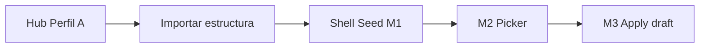

# Seed hub — PROFILE_SEED Módulo 1

Proceso y especificación del **Módulo 1** del Sembrador: **punto de entrada** “Importar estructura” — CTAs en apps destino (P0: FILE MATCH Perfil A), shell del flujo, permisos y copy UX. **No** selecciona origen ni escribe borrador (eso es M2 / M3).

> Estado: **implementado** (M1 — CTA + shell + `user_can_import`).  
> Producto: [`../PROFILE_SEED.md`](../PROFILE_SEED.md).  
> Rama: `feature/profile-seed`.  
> Siguiente: [`source_picker.md`](source_picker.md) (M2 — **spec + prototipos**).  
> Destino P0: FILE MATCH Perfil A · `/app/file-match/proyectos/<slug>/perfil-a/`.  
> Arquitectura MVP: **servicios + CTAs** (sin kind `profile_seed` obligatorio).  
> App: `apps/profile_seed/` · templates: `templates/profile_seed/` · CTA en hub Match A.  
> Prototipos: [`../../prototype/profile_seed/`](../../prototype/profile_seed/).  
> Frontera Scout: Scout = muestra → draft; Seed = definición **publicada** → draft.  
> Frontera Bridge: Bridge = hash de job; Seed = clone de estructura.

---

## Propósito

Dar al diseñador (PA/ED) un **acceso claro y seguro** para iniciar la siembra:

1. Ver CTA **Importar estructura** en el hub del Perfil A (Match);
2. Abrir el **shell** del flujo Seed (eyebrow, ayuda, pasos);
3. Continuar a M2 (elegir origen) solo si tiene permiso;
4. Entender qué hará el seed (borrador, no publicar, no bridge, no Scout).

```
Match Perfil A (hub)
        →
CTA Importar estructura
        →
Shell Seed (este módulo)
        →
M2 Selector origen → M3 Preview / apply
```

---

## Qué es / qué hace / qué no hace

| Pregunta | Respuesta |
|----------|-----------|
| **¿Qué es?** | La **puerta de entrada** del Sembrador en el destino (Match A) |
| **¿Qué hace?** | Muestra CTA, valida permiso, abre shell del flujo, enlaza a M2 |
| **¿Qué no hace?** | No lista orígenes (M2). No hace preview ni `save_source` (M3). No audita seed (M4). No publica. No abre Scout ni bridge |
| **Copy UX** | “Importar estructura” — **no** “sincronizar”, “vincular”, “bridge”, “aplicar Scout” ni “clonar proyecto” |

---

## Relación con Match / GATE / Scout

| Tema | Decisión |
|------|----------|
| Anclaje P0 | CTA en **hub Perfil A** de FILE MATCH (y panel resumen en hub proyecto Match, opcional) |
| Slot destino implícito | `profile_a` del proyecto Match actual |
| Origen | Aún no elegido (M2); M1 solo prepara el contexto destino |
| Scout | CTA distinto (“Explorar muestra”); no mezclar en el mismo botón |
| Bridge GATE | Configuración de pre-check en Match; no es este flujo |
| Kind Seed | MVP **sin** proyecto `profile_seed`; URLs bajo Match (o namespace seed delgado) |



**Frontera M1 vs M2:** M1 = entrada + permisos + shell; M2 = elegir origen publicado.  
**Frontera M1 vs M3:** M1 no escribe; M3 confirma y siembra borrador.

---

## Alcance de este documento

| Incluido | Excluido |
|----------|----------|
| CTA en Match Perfil A (+ opcional hub proyecto) | Selector de origen / versión / slot (M2) |
| Shell “Importar estructura” (contexto destino) | Preview, overwrite, `save_source` (M3) |
| Matriz permisos ver/usar CTA | Historial de semillas (M4) |
| Estados: sin permiso, empty hint | CTAs en GATE / Reverse / Perfil B (Fase 2 o M1.x) |
| Ayuda del paso | Kind propio `profile_seed` |

---

## Proceso (flujo de usuario)

1. Usuario PA/ED abre **FILE MATCH → proyecto → Perfil A**.  
2. Ve panel / botón **Importar estructura**.  
3. Entra al shell Seed: confirma destino (`slug` Match · slot Perfil A).  
4. Pulsa **Continuar** → M2 (selector origen).  
5. (GE/CO) no ven CTA activo; hint o sin panel.

### Contexto que M1 fija (para M2/M3)

| Campo | Valor P0 |
|-------|----------|
| `target_kind` | `file_match` |
| `target_project` | proyecto Match actual |
| `target_slot` | `profile_a` |
| `target_label` | “Perfil A (archivo A)” |

---

## Pantallas

| Pantalla | Descripción |
|----------|-------------|
| Hub Perfil A (Match) + CTA | Botón / panel “Importar estructura” |
| Shell Seed | Resumen destino + qué es / qué no + Continuar a elegir origen |
| Ayuda | Copy, roles, frontera Scout/bridge |

### Rutas propuestas (MVP bajo Match)

| Acción | URL | Nombre Django (propuesta) |
|--------|-----|---------------------------|
| Shell importar | `/app/file-match/proyectos/<slug>/perfil-a/importar/` | `profile_a_seed_hub` |
| Ayuda | `…/perfil-a/importar/ayuda/` | `profile_a_seed_hub_help` |

Alternativa (si más adelante hay app Seed): `/app/profile-seed/…` con query `target=…` — **no** MVP.

Namespace host: `file_match:*` (CTA) · servicios en módulo compartido `profile_seed` / `apps.profile_seed.services` sin kind.

---

## Reglas de negocio

| ID | Regla |
|----|-------|
| H1 | CTA solo si el usuario es **PA o ED** del proyecto Match destino. |
| H2 | Destino = proyecto Match actual; slot fijo `profile_a` en P0. |
| H3 | M1 **no** muta perfiles ni publica. |
| H4 | Copy fijo: **Importar estructura**; prohibido “bridge / sync / Scout”. |
| H5 | GE/CO: sin CTA (o deshabilitado con título explicativo). |
| H6 | Proyecto archivado / sin acceso → no CTA / redirect listado Match. |
| H7 | Tenant: misma compañía (el destino ya lo garantiza el hub Match). |
| H8 | Sin Django Forms; HTML plano + GET al shell; POST solo en M3. |
| H9 | Tras OK UX: implementar CTA + shell; M2/M3 en módulos siguientes. |
| H10 | No acoplar al bridge FILE GATE ni a STRUCTURE SCOUT en esta pantalla. |

---

## Validaciones / mensajes

| Situación | Canal | Texto |
|-----------|-------|-------|
| Sin permiso (GE/CO u otro) | UI / flash | No tiene permiso para importar estructuras en este proyecto. |
| Sin acceso al proyecto | flash | No tiene acceso a este proyecto Conciliador. |
| Shell OK | — | (sin flash; copy estático en pantalla) |

Catálogo: ampliar [`UI_MESSAGES.md`](../definition_app/UI_MESSAGES.md) al implementar (bloque PROFILE_SEED / Importar).

---

## Diseño UX

| Elemento | Criterio |
|----------|----------|
| Eyebrow shell | `PROFILE SEED · Importar estructura` |
| Contexto | Badge Match · slug · **Perfil A** · rol |
| Título | Importar estructura |
| Subtítulo | Copiar un perfil/contrato **publicado** de otro proyecto a este borrador Perfil A. No publica. |
| Panel CTA en hub A | Título corto + 1 frase + botón primario |
| Stepper shell | 1 Entrada (active) · 2 Origen · 3 Confirmar |
| Secondary | Ayuda · Volver a Perfil A |
| Empty permiso | Sin botón; hint de roles |

### Wireframe hub Perfil A (fragmento)

1. Header Perfil A existente.  
2. **Nuevo panel:** “¿Ya tiene el layout en FILE GATE u otro Match?” → **Importar estructura**.  
3. Resto del asistente 6 pasos sin cambio.

### Wireframe shell

1. Scope Match + Perfil A.  
2. Stepper 1/2/3.  
3. Qué hará / qué no (lista corta).  
4. CTA Continuar → M2 · Cancelar → hub A.

---

## Integración con Match (wiring)

Tras «Desarrolla el módulo» (M1):

| Pieza | Cambio |
|-------|--------|
| `templates/file_match/profile_a/hub.html` | Panel + CTA si `can_seed_import` |
| Vista shell | Nueva vista GET bajo `profile_a` |
| Servicio | `profile_seed_service.user_can_import(user, target_project)` |
| Hub proyecto Match | Opcional: enlace secundario “Importar a Perfil A” |

No requiere migración en M1 (solo UI + permiso).

---

## Matriz de permisos (M1)

| Acción | PA | ED | GE | CO |
|--------|----|----|----|-----|
| Ver panel / CTA en hub A | Sí | Sí | No | No |
| Abrir shell Importar | Sí | Sí | No | No |
| Continuar a M2 | Sí | Sí | No | No |
| Ver ayuda | Sí | Sí | Sí* | Sí* |

\*Ayuda puede ser pública al proyecto; el CTA sigue restringido.

---

## Criterios de aceptación

- [x] Propósito, frontera M2/M3/Scout/bridge
- [x] CTA P0 en Match Perfil A + shell
- [x] Reglas H1–H10, URLs, permisos
- [x] Prototipos: hub A con CTA + shell + ayuda
- [x] «Desarrolla el módulo» → código (CTA + shell + `user_can_import`)
- [x] Mensajes en `UI_MESSAGES.md` §3.13

---

## Implementación (entregado)

| Pieza | Ubicación |
|-------|-----------|
| App / servicio | `apps/profile_seed/` · `profile_seed_service` |
| CTA template | `templates/file_match/profile_a/hub.html` (`can_seed_import`) |
| Vistas / URLs shell | `apps/file_match/profile_a/` · `profile_a_seed_hub` / `profile_a_seed_hub_help` |
| Templates shell | `templates/profile_seed/seed_entry.html` · `seed_entry_help.html` |
| Mensajes | `UI_MESSAGES.md` §3.13 · `MSG_NO_IMPORT` |

> Continuar a M2: botón deshabilitado hasta `source_picker.md`.

---

## Próximos pasos

1. Abrir M2 `source_picker.md` (selector origen publicado).  
2. Spike GATE→Match A con M2/M3.  
3. Ampliar §3.13 al aplicar borrador (M3).

---

## Referencias

| Documento | Uso |
|-----------|-----|
| [`../PROFILE_SEED.md`](../PROFILE_SEED.md) | Producto, P0, roles |
| [`README.md`](README.md) | Índice |
| [`../FILE_MATCH.md`](../FILE_MATCH.md) · [`../definition_app_FILE_MATCH/profile_a.md`](../definition_app_FILE_MATCH/profile_a.md) | Destino CTA |
| [`../STRUCTURE_SCOUT.md`](../STRUCTURE_SCOUT.md) | Frontera muestra |
| [`../definition_app_STRUCTURE_SCOUT/apply_target.md`](../definition_app_STRUCTURE_SCOUT/apply_target.md) | Patrón apply (M3) |

---

*Documento: `docs/definition_app_PROFILE_SEED/seed_hub.md` — Módulo 1 PROFILE_SEED (implementado).*
