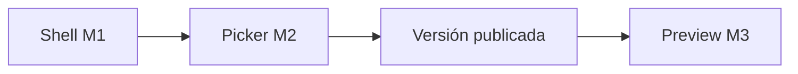

# Source picker — PROFILE_SEED Módulo 2

Proceso y especificación del **Módulo 2** del Sembrador: **selector de origen publicado** — elegir kind, proyecto, versión publicada y slot de origen. **No** escribe el borrador destino (eso es M3).

> Estado: **implementado** (M2 — lista GATE publicados + selección + wiring M1).  
> Producto: [`../PROFILE_SEED.md`](../PROFILE_SEED.md).  
> Rama: `feature/profile-seed`.  
> Predecesor: [`seed_hub.md`](seed_hub.md) (M1 — implementado).  
> Siguiente: [`apply_draft.md`](apply_draft.md) (M3 — **implementado**).  
> Destino P0 (fijo desde M1): FILE MATCH · slot `profile_a`.  
> Origen P0: FILE GATE · slot `schema` · versión **publicada** (`get_published_version`).  
> App: `apps/profile_seed/` · host URLs bajo Match Perfil A.  
> Código: `list_eligible_sources` · `profile_a_seed_picker` · `templates/profile_seed/source_picker*.html`.  
> Prototipos: [`../../prototype/profile_seed/`](../../prototype/profile_seed/).  
> Frontera Scout: Scout elige **destino** borrador; Seed elige **origen** publicado.  
> Frontera Bridge: Bridge elige GATE para hash de job; Seed elige GATE para clone de estructura.

---

## Propósito

Permitir al diseñador (PA/ED del **destino**) elegir **de dónde** clonar la estructura:

1. Ver lista de orígenes elegibles (misma compañía, visibles, con versión publicada);
2. Filtrar por kind (P0: solo FILE GATE);
3. Seleccionar un proyecto origen (versión publicada + slot implícitos en P0);
4. Continuar a M3 con el origen fijado (preview + confirmar + `save_source`).

```
Shell Seed (M1)
        →
Selector origen (este módulo)
        →
M3 Preview / apply borrador
```

---

## Qué es / qué hace / qué no hace

| Pregunta | Respuesta |
|----------|-----------|
| **¿Qué es?** | El **catálogo de orígenes publicables** para sembrar el destino actual |
| **¿Qué hace?** | Lista / filtra orígenes, muestra metadata (vN, tipo, N campos), fija selección para M3 |
| **¿Qué no hace?** | No hace preview detallado ni overwrite warning (M3). No escribe borrador. No publica. No audita seed (M4). No abre Scout ni bridge |
| **Copy UX** | “Elegir origen” / “Origen publicado” — **no** “vincular GATE”, “bridge”, “aplicar Scout” ni “sincronizar” |

---

## Relación con M1 / M3 / Scout / Bridge

| Tema | Decisión |
|------|----------|
| Contexto destino | Heredado de M1: `target_kind=file_match`, `target_slot=profile_a`, proyecto Match actual |
| Origen P0 | `source_kind=file_gate`, `source_slot=schema`, `source_version` = `current_version` publicada |
| Lectura | Solo snapshot **publicado** — nunca el borrador origen (`get_source_dict`) |
| Scout apply | Inverso: Scout lista destinos editables; Seed lista orígenes publicados |
| Bridge GATE | Lista GATE de compañía para pre-check; Seed exige **publicado** + visibilidad usuario |
| Self-seed | Excluir el propio proyecto destino si algún día el kind coincidiera (P0 no aplica: kinds distintos) |



**Frontera M1 vs M2:** M1 fija destino; M2 elige origen.  
**Frontera M2 vs M3:** M2 selecciona; M3 preview + escritura + auditoría.  
**Frontera M2 vs listados de app:** no es el listado GATE genérico; solo proyectos con `get_published_version` ≠ `None`.

---

## Alcance de este documento

| Incluido | Excluido |
|----------|----------|
| Listar orígenes GATE publicados (P0) | Escritura `save_source` / overwrite (M3) |
| Filtro kind (UI; P0 locked a GATE) | Historial de semillas (M4) |
| Metadata fila: slug, nombre, vN, tipo, N campos | Diff campo a campo (Fase 2) |
| Empty: sin orígenes publicados | Orígenes Match / Reverse en UI MVP (documentados; UI Fase P1+) |
| Ayuda del paso | Kind propio `profile_seed` |
| Hand-off a M3 (`source_project_id` / slug) | Publicar origen o destino |

---

## Orígenes (prioridad producto)

| Prioridad | Kind | Slot | Condición “publicado” | MVP UI |
|-----------|------|------|------------------------|--------|
| **P0** | `file_gate` | `schema` | `get_published_version(project)` | **Sí** |
| P1 | `file_gate` | `schema` | idem → destino Match B | No (otro destino) |
| P2 | `file_gate` / `file_match` | `schema` / `profile_a` | publicado → Reverse input | No |
| P3 | `file_match` | `profile_a` / `profile_b` | `get_published_version` + lado A/B | Extensión |
| Fase 2 | `reverse` | `input` | publicado `source_profile` | Extensión |
| Fase 2 | `dms` | `source` | publicado | Extensión |

### Elegibilidad de un origen (P0 GATE)

| Condición | Requerida |
|-----------|-----------|
| Misma `company_id` que el destino Match | Sí |
| `project_kind == file_gate` | Sí |
| No archivado | Sí |
| Usuario puede **ver** el proyecto GATE (`gate_project_service.user_can_view` / `visible_projects_qs`) | Sí |
| `get_published_version(project) is not None` | Sí |
| Usuario es PA/ED en el **destino** Match (`user_can_import`) | Sí (entrada M1/M2) |

> **No** se exige PA/ED en el origen: basta visibilidad (membresía o `visibility=company`).

### Lectura del snapshot (referencia M3; M2 solo metadata)

```
published = get_published_version(gate_project)
source = profile_to_dict(published.source_profile)
# M2 muestra: version_number, file_type_code, len(fields), published_at
# M3 clona source (sin gate_policy / políticas — PS7)
```

**Prohibido en M2/M3 para clone:** `config.gate_policy`, reglas Match, target Reverse, jobs.

---

## Pantallas

| Pantalla | Descripción |
|----------|-------------|
| Selector origen | Stepper paso 2 · filtro kind · tabla/lista · Continuar a confirmar |
| Empty sin orígenes | Mensaje + enlace a FILE GATE / publicar esquema |
| Ayuda | Qué es origen publicado, roles, frontera Scout/bridge |

### Rutas propuestas (MVP bajo Match)

| Acción | URL | Nombre Django (propuesta) |
|--------|-----|---------------------------|
| Selector | `/app/file-match/proyectos/<slug>/perfil-a/importar/origen/` | `profile_a_seed_picker` |
| Ayuda | `…/importar/origen/ayuda/` | `profile_a_seed_picker_help` |

Query GET (filtro / selección):

| Param | Uso |
|-------|-----|
| `kind` | Filtro origen; P0 default / único `file_gate` |
| `source_id` | PK del proyecto origen seleccionado |

Hand-off a M3 (propuesta): GET `…/importar/confirmar/?source_id=<id>` (spec en `apply_draft.md`).

Namespace host: `file_match:*` · servicio: `profile_seed_service.list_eligible_sources` / `get_source_picker_context`.

---

## Proceso (flujo de usuario)

1. Desde M1 shell, pulsa **Continuar a elegir origen**.  
2. Ve lista de proyectos FILE GATE visibles con versión publicada.  
3. (Opcional) Cambia filtro kind cuando existan más kinds en UI.  
4. Selecciona un origen (radio / select).  
5. Ve resumen corto: `slug` · vN · tipo · N campos · fecha publicación.  
6. Pulsa **Continuar a confirmar** → M3.  
7. **Cancelar** → shell M1 o hub Perfil A.

### Estados de pantalla

| Estado | UI |
|--------|-----|
| Con orígenes | Lista + Continuar habilitado tras selección |
| Sin orígenes | Empty + hint “Publique un esquema en FILE GATE” |
| Sin permiso destino | Redirect hub A + `MSG_NO_IMPORT` (igual M1) |
| `source_id` inválido / no elegible | Flash error + lista sin selección |

---

## Reglas de negocio

| ID | Regla |
|----|-------|
| P1 | Solo orígenes con versión **publicada** (`STATUS_PUBLISHED` vía `get_published_version`). |
| P2 | Misma compañía que el destino; sin cross-tenant. |
| P3 | Visibilidad origen: membresía activa **o** `dms_config.visibility=company`. |
| P4 | P0: kind origen = `file_gate`, slot = `schema` (implícito; no selector de slot en UI). |
| P5 | M2 **no** muta perfiles ni publica. |
| P6 | Copy: origen **publicado** / Importar estructura; prohibido bridge / Scout / sync. |
| P7 | No listar borradores ni versiones archivadas como origen. |
| P8 | Sin Django Forms; HTML plano + GET para filtro/selección. |
| P9 | Reutilizar listados existentes (`visible_projects_qs`) + filtro publish; no inventar query de compañía suelta. |
| P10 | Tras OK UX: implementar picker; M3 en módulo siguiente. |

---

## Validaciones / mensajes

| Situación | Canal | Texto |
|-----------|-------|-------|
| Sin permiso importar | flash | No tiene permiso para importar estructuras en este proyecto. |
| Sin acceso Match | flash | No tiene acceso a este proyecto FILE MATCH. |
| Sin orígenes elegibles | empty UI | No hay orígenes publicados visibles. Publique un esquema en FILE GATE o pida acceso a un proyecto GATE. |
| Origen no elegible / no encontrado | flash | El origen seleccionado no está disponible o no tiene versión publicada. |
| Kind no soportado (futuro) | flash / empty | Este tipo de origen aún no está disponible para importar. |

Catálogo: ampliar [`UI_MESSAGES.md`](../definition_app/UI_MESSAGES.md) §3.13 al implementar.

---

## Diseño UX

| Elemento | Criterio |
|----------|----------|
| Eyebrow | `PROFILE SEED · Elegir origen` |
| Stepper | 1 Entrada (done) · 2 Origen (active) · 3 Confirmar |
| Contexto destino | Badge Match · slug · Perfil A (solo lectura) |
| Filtro kind | Select; P0 una sola opción FILE GATE (o locked label) |
| Lista | Tabla o cards compactas: slug, nombre, vN, tipo archivo, N campos, publicado |
| Selección | Radio por fila **o** `<select>` + resumen (preferir tabla + radio en desktop) |
| Primario | Continuar a confirmar (disabled sin selección) |
| Secondary | Ayuda · Volver (shell M1) · Cancelar (hub A) |
| Empty | Ilustración/texto + enlace a listado FILE GATE si el usuario puede verlo |

### Wireframe selector

1. Scope destino (Match · Perfil A).  
2. Stepper 1✓ · 2 active · 3.  
3. Filtro “Tipo de origen”: FILE GATE.  
4. Tabla de orígenes publicados.  
5. Resumen de la fila seleccionada.  
6. CTA Continuar → M3.

### Shape de fila (servicio → template)

```python
{
    "id": int,
    "slug": str,
    "name": str,
    "kind": "file_gate",
    "kind_label": "FILE GATE",
    "slot": "schema",
    "slot_label": "Esquema",
    "version_number": int,
    "version_label": "v3",
    "file_type_code": str,
    "fields_count": int,
    "published_at": datetime | None,
}
```

---

## Integración técnica (objetivo post-OK)

| Pieza | Ubicación |
|-------|-----------|
| Servicio listado | `apps/profile_seed/services/profile_seed_service.py` → `list_eligible_sources(user, target_project, source_kind=…)` |
| Lectura publish | `file_intake_persistence_service.get_published_version` + `profile_to_dict` (solo metadata en M2) |
| Visibilidad GATE | `gate_project_service.visible_projects_qs(user)` |
| Vistas / URLs | `apps/file_match/profile_a/` · `profile_a_seed_picker` / `_help` |
| Templates | `templates/profile_seed/source_picker.html` · `source_picker_help.html` |
| Wiring M1 | Botón Continuar del shell → URL picker (dejar de estar disabled) |
| Mensajes | `UI_MESSAGES.md` §3.13 |

Sin migración en M2 (solo lectura + UI).

---

## Matriz de permisos (M2)

| Acción | PA | ED | GE | CO |
|--------|----|----|----|-----|
| Abrir selector (destino Match) | Sí | Sí | No | No |
| Ver orígenes GATE (si visibles) | Sí* | Sí* | — | — |
| Continuar a M3 | Sí | Sí | No | No |
| Ver ayuda | Sí | Sí | Sí† | Sí† |

\*Depende de visibilidad del proyecto origen (membresía o company).  
†Ayuda del flujo; sin CTA de importar.

---

## Criterios de aceptación

- [x] Propósito, frontera M1/M3/Scout/bridge
- [x] Elegibilidad P0 GATE publicado + shape de fila
- [x] Reglas P1–P10, URLs, permisos
- [x] Prototipos: lista con selección + empty + ayuda
- [x] «Desarrolla el módulo» → código (`list_eligible_sources` + vistas + wiring M1)
- [x] Mensajes en `UI_MESSAGES.md` §3.13

---

## Implementación (entregado)

| Pieza | Ubicación |
|-------|-----------|
| `list_eligible_sources` / `get_source_picker_context` | `apps/profile_seed/services/profile_seed_service.py` |
| Vistas / URLs | `profile_a_seed_picker` / `profile_a_seed_picker_help` |
| Templates | `templates/profile_seed/source_picker.html` · `source_picker_help.html` |
| Wiring M1 | Continuar → picker |
| Mensajes | `UI_MESSAGES.md` §3.13 · `MSG_SOURCE_UNAVAILABLE` / `MSG_NO_SOURCES` |

> Continuar a confirmar: enlazado a `profile_a_seed_apply?source_id=`.

---

## Próximos pasos

1. Abrir M3 `apply_draft.md` (preview + `save_source` + overwrite).  
2. Enlazar Continuar del picker → confirmar con `source_id`.  
3. Ampliar §3.13 al aplicar borrador.

---

## Referencias

| Documento | Uso |
|-----------|-----|
| [`../PROFILE_SEED.md`](../PROFILE_SEED.md) | Producto, P0, PS1–PS10 |
| [`seed_hub.md`](seed_hub.md) | M1 destino / permisos |
| [`README.md`](README.md) | Índice |
| [`../FILE_GATE.md`](../FILE_GATE.md) | Origen P0 |
| [`../definition_app_STRUCTURE_SCOUT/apply_target.md`](../definition_app_STRUCTURE_SCOUT/apply_target.md) | Picker inverso (destinos) |
| [`../definition_app/UI_MESSAGES.md`](../definition_app/UI_MESSAGES.md) §3.13 | Mensajes |

---

*Documento: `docs/definition_app_PROFILE_SEED/source_picker.md` — Módulo 2 PROFILE_SEED (implementado).*
