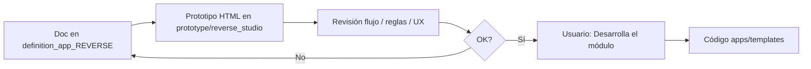

# definition_app_REVERSE — Definición Reverse Studio

Carpeta de documentación de análisis y definición para **Reverse Studio** (Emisor de layouts), vertical de DynamicWorkspace.

> **Producto:** [`../REVERSE_STUDIO.md`](../REVERSE_STUDIO.md)  
> **Familia §2:** [`../APP_FACTORY_HIGH_REUSE.md`](../APP_FACTORY_HIGH_REUSE.md)  
> **Rama Git (propuesta):** `feature/reverse-studio` (no desplegar a producción hasta merge a `main`)  
> **Chasis:** reutiliza `Company`, `UserProfile`, `Project`, `ProjectMembership`, seguridad y billing.  
> **Reuso técnico DMS:** SourceProfile, TargetProfile, field mapping, transform rules, intake, transform execution — ver [`../definition_app_DMS/`](../definition_app_DMS/).

---

## Método de trabajo (por módulo)

Igual que FILE GATE / DMS: **definir → prototipar → revisar → implementar solo con OK explícito**.

| Paso | Dónde | Quién |
|------|-------|--------|
| 1. Diseño, alcance, reglas, validaciones | `docs/definition_app_REVERSE/<modulo>.md` | Agente + revisión |
| 2. HTML demo | `prototype/reverse_studio/` | Agente |
| 3. Revisión de flujo | Chat / demo en navegador | Usuario |
| 4. Implementación Django | `apps/reverse_studio/`, `templates/reverse_studio/` | **Solo si el usuario dice «Desarrolla el módulo»** |

---

## Documentos (por módulo)

| Archivo | Módulo | Contenido | Estado |
|---------|--------|-----------|--------|
| [`../REVERSE_STUDIO.md`](../REVERSE_STUDIO.md) | Producto | Visión, alcance, módulos 1–7 | **Lineamientos** |
| [`input_definition.md`](input_definition.md) | **1** | Contrato de entrada (CSV / Excel / delimitado) | **Implementado** |
| [`output_definition.md`](output_definition.md) | **2** | Contrato de salida (posicional / JSON / XML) | **Implementado** |
| [`mapping_rules.md`](mapping_rules.md) | **3** | Mapeo entrada→salida + reglas | **Implementado** |
| [`publish.md`](publish.md) | **4** | Publicar definición (borrador → published) | **Implementado** |
| [`generate_run.md`](generate_run.md) | **5** | Generar archivo (upload + job + descarga) | **Implementado** |
| [`history.md`](history.md) | **6** | Historial y evidencia de generaciones | **Implementado** |
| [`gate_bridge.md`](gate_bridge.md) | **7** | Pre-check FILE GATE (Fase 2) | **Implementado** |
| `rs_integration.md` | Transversal | Kind, URLs, roles, reuso DMS | Pendiente |
| `project_lifecycle.md` | Transversal | Crear proyecto, hub, publicar | Pendiente |

> Los `.md` de módulo se crean al iniciar cada módulo (no anticipar specs vacías).

---

## Carpetas de trabajo

| Rol | Ruta |
|-----|------|
| Specs por módulo | `docs/definition_app_REVERSE/` |
| Prototipos HTML (antes del definitivo) | `prototype/reverse_studio/` |
| Templates Django (tras «Desarrolla el módulo») | `templates/reverse_studio/<modulo>/` |
| App Django (tras primer módulo) | `apps/reverse_studio/` |

### Subcarpetas previstas en templates

| Subcarpeta | Módulo |
|------------|--------|
| `templates/reverse_studio/projects/` | Alta / listado / hub de proyecto |
| `templates/reverse_studio/input/` | Contrato de entrada |
| `templates/reverse_studio/output/` | Contrato de salida |
| `templates/reverse_studio/mapping/` | Mapeo y reglas |
| `templates/reverse_studio/run/` | Generar archivo |
| `templates/reverse_studio/history/` | Historial |
| `templates/reverse_studio/bridge/` | Integración FILE GATE (Fase 2) |

---

## Prototipos

Misma estructura de carpetas que `templates/reverse_studio/<modulo>/` (espejo 1:1).

| Carpeta prototipo | Destino futuro (tras OK) | Estado |
|-------------------|--------------------------|--------|
| [`../../prototype/reverse_studio/run/`](../../prototype/reverse_studio/run/) | `templates/reverse_studio/run/` | **Implementado** (M5) |
| [`../../prototype/reverse_studio/history/`](../../prototype/reverse_studio/history/) | `templates/reverse_studio/history/` | **Implementado** (M6) |
| [`../../prototype/reverse_studio/bridge/`](../../prototype/reverse_studio/bridge/) | `templates/reverse_studio/bridge/` | **Implementado** (M7) |
| `prototype/reverse_studio/projects/` | `templates/reverse_studio/projects/` | Pendiente |

Abrir Módulo 7: [`prototype/reverse_studio/bridge/hub.html`](../../prototype/reverse_studio/bridge/hub.html).

---

## Convención

- Un documento por módulo (`<tema>.md`).
- Copy de producto: **emisión / layout de envío**, no “ETL genérico FilePipe”.
- Entrada MVP: CSV / Excel / delimitado; salida: posicional / JSON / XML ya soportados en DMS.
- Implementación propuesta: app delgada `apps.reverse_studio` + servicios DMS compartidos (**no duplicar** parsers/serializers).
- Mensajes UI: extender [`../definition_app/UI_MESSAGES.md`](../definition_app/UI_MESSAGES.md) cuando se implemente.
- Ritual: no pasar al siguiente módulo sin cerrar el actual.

---

## Índice y estado

| Documento | Estado |
|-----------|--------|
| Producto Reverse Studio | [`../REVERSE_STUDIO.md`](../REVERSE_STUDIO.md) — lineamientos |
| Módulos 1–7 (specs) | M1–M7 **implementados** |
| Prototipos | `prototype/reverse_studio/` (M1–M7) |
| Templates | `templates/reverse_studio/` — projects + input + output + mapping + publish + run + history + bridge |
| App Django | `apps.reverse_studio` (M1–M7) |
