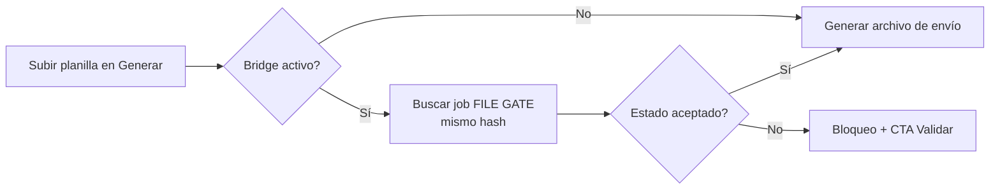
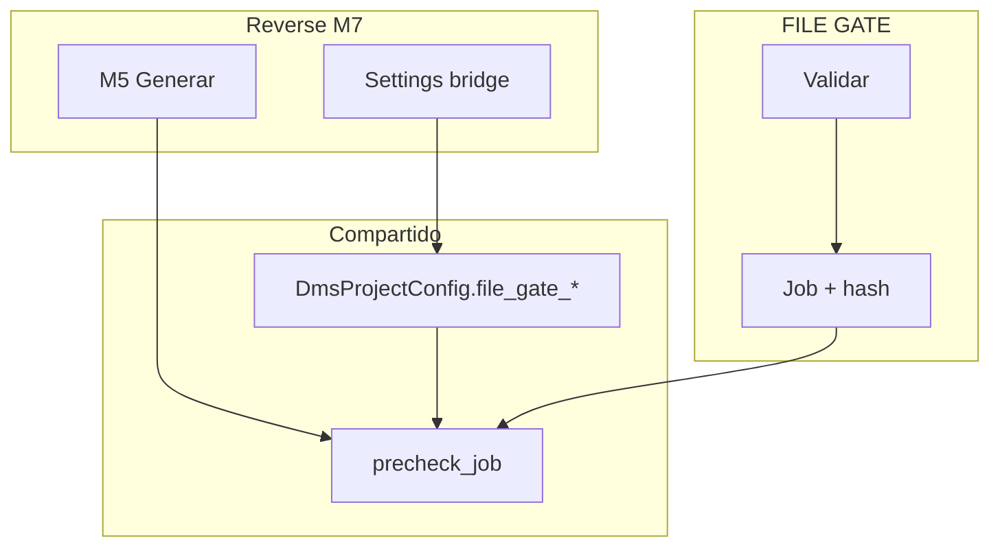
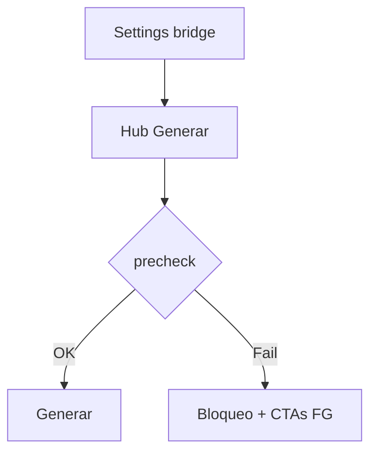

# Gate bridge — Reverse Studio Módulo 7

Proceso y especificación del **Módulo 7** de Reverse Studio: **integración opcional con FILE GATE** para exigir una validación en verde (mismo `content_hash`) **antes de generar** el archivo de envío.

> Estado: **implementado** (`apps/reverse_studio/bridge/` · `templates/reverse_studio/bridge/` · `dms_bridge_service` ampliado a `KIND_REVERSE`).  
> Producto: [`../REVERSE_STUDIO.md`](../REVERSE_STUDIO.md) § Módulo 7 · Frontera §4.4 · Fase 2.  
> Rama: `feature/reverse-studio`.  
> Destino: `apps/reverse_studio/bridge/` · `templates/reverse_studio/bridge/` · prototipos `prototype/reverse_studio/bridge/`.  
> Base técnica: [`../definition_app_FILE_GATE/dms_bridge.md`](../definition_app_FILE_GATE/dms_bridge.md) + `apps/file_gate/bridge/services/dms_bridge_service.py`.  
> **Prerrequisito:** M5 (generar) + M6 (historial). Contrato FG publicado en el proyecto vinculado.  
> **No incluye** fusionar contratos entrada Reverse ↔ esquema FG, override auditado, ni API (Fase 3).  
> Familia §2: [`../APP_FACTORY_HIGH_REUSE.md`](../APP_FACTORY_HIGH_REUSE.md).

---

## Propósito

Permitir que un proyecto **Reverse Studio** (emisor) exija, antes de **generar** el layout:

1. un proyecto **FILE GATE** vinculado (misma compañía);
2. una corrida de gate **aceptada** sobre la misma planilla (`content_hash`);
3. UX clara de **bloqueado** vs **listo**, con enlaces a validar / evidencia / certificado en FILE GATE.

FILE GATE **no genera** el archivo de envío. Reverse **no recalcula** el gate. El bridge es solo **pre-check** (mismo espíritu B2 / B10 del bridge FilePipe).



---

## Qué es / qué hace / qué no hace

| Pregunta | Respuesta |
|----------|-----------|
| **¿Qué es?** | Pre-check de calidad de la **planilla** antes de emitir |
| **¿Qué hace?** | Reusa config `DmsProjectConfig.file_gate_*` + `precheck_job` sobre `KIND_REVERSE` |
| **¿Qué no hace?** | No valida en Reverse; no publica FG; no fusiona esquemas |
| **Copy UX** | “Exigir FILE GATE antes de generar” / “planilla validada” — **no** “antes de transformar FilePipe” |

---

## Relación con FilePipe bridge y M5

Hoy el bridge FilePipe ↔ FILE GATE ya:

- persiste en `DmsProjectConfig` (`file_gate_enabled`, `file_gate_project`, accept, max_age);
- ejecuta `dms_bridge_service.precheck_job` desde `run_full_job`;
- muestra UI en DMS `/integracion/file-gate/`.

En Reverse M5 el hub **fuerza** `bridge_enabled=False` (GEN10). El motor `run_full_job` ya llama al pre-check, pero el servicio **rechaza** proyectos que no sean `KIND_DMS`.

| Tema | Decisión Reverse M7 |
|------|---------------------|
| Config | **Reusar** campos `file_gate_*` de `DmsProjectConfig` (sin migración nueva) |
| Pre-check | Reusar `precheck_job` ampliando kind a `KIND_DMS` **o** `KIND_REVERSE` |
| Guardar settings | Reusar / envolver `save_bridge_settings` con kind Reverse |
| UI config | Hub propio Reverse (`/bridge/` o `/integracion/file-gate/`) |
| UI generar | Quitar `force_bridge_disabled`; mostrar columna/banner como FilePipe |
| Mensajes | Remap a copy emisor (“generar”, no “transformar”) |
| Hub FILE GATE | Listar también proyectos `KIND_REVERSE` vinculados (hoy solo DMS) |
| Cardinalidad | Un Reverse → **un** FILE GATE (igual D8) |



---

## Alcance

| Incluido (Fase 2 MVP) | Excluido |
|-----------------------|----------|
| Settings bridge en proyecto Reverse (PA/ED) | Compartir / sync `SourceProfile` |
| Flag «exigir FILE GATE antes de generar» | Bypass / override (ni PA) |
| Matching por `content_hash` | Matching solo por nombre |
| Aceptación `passed` / `passed_with_warnings` | Aceptar `partial` / `failed` |
| Frescura (default 7 días) | Auto-validar al subir planilla |
| Banner / fila bloqueada o lista en Generar | API / webhook |
| Enlaces Validar · Evidencia · Certificado | Historial unificado cross-producto |
| Aviso suave tipo entrada Reverse ≠ esquema FG | Diff de contratos |
| Sello `file_gate_check` en job Reverse (auditoría) | Bridge obligatorio para todos los Reverse |
| Visibilidad del vínculo en hub FILE GATE | Configurar el flag desde FILE GATE |

---

## Responsabilidades

| Sí | No |
|----|-----|
| Vincular Reverse ↔ FILE GATE misma compañía | Ejecutar el motor de gate |
| Bloquear generación si no hay job aceptable | Editar esquema FG o definición Reverse |
| Mostrar estado y CTAs | Generar el layout “desde” FILE GATE |
| Remap de mensajes a copy Reverse | Fusionar whitelists de tipos |

---

## Prerrequisitos

| Condición | Si no se cumple |
|-----------|-----------------|
| Proyecto Reverse y FILE GATE misma compañía | No se puede vincular |
| Usuario PA/ED en Reverse para configurar | Forbidden |
| Contrato FILE GATE **publicado** | Bridge configurable; pre-check falla claro |
| Al menos una corrida FG final con el hash | Bloqueo: «Valide primero en FILE GATE» |
| Intake Reverse calcula hash (M5) | Matching imposible → bloquear si bridge ON |

---

## Decisiones de diseño (congeladas)

| # | Tema | Decisión |
|---|------|----------|
| RB1 | ¿Dónde vive la config? | En el **proyecto Reverse** (`DmsProjectConfig`), igual que FilePipe (D1). |
| RB2 | ¿Migración? | **No** — campos ya existen. Solo ampliar kind en el servicio. |
| RB3 | ¿Matching? | `content_hash` SHA-256 (D3 / B3). |
| RB4 | ¿Estados OK? | `passed` o `passed`+`passed_with_warnings` (D4). Nunca `failed`/`partial`. |
| RB5 | ¿Frescura? | Default **7** días (D5). |
| RB6 | ¿Override? | **No** en MVP (D6). |
| RB7 | ¿App delgada? | `apps/reverse_studio/bridge/` envolviendo `dms_bridge_service` (remap + URLs Reverse). |
| RB8 | ¿M5 force off? | Al implementar M7: dejar de forzar `force_bridge_disabled`; respetar config. |
| RB9 | ¿FG hub? | Extender listado entrante para incluir `KIND_REVERSE` (copy: “Emisor / Reverse Studio”). |

---

## Proceso (UX)

### Configurar (PA/ED en Reverse)

1. Proyecto Reverse → **Integración FILE GATE** (paso / panel bridge).
2. Activar «Exigir validación FILE GATE antes de generar».
3. Elegir proyecto FILE GATE de la misma compañía.
4. Elegir aceptación y frescura.
5. Guardar. Hub FILE GATE muestra el vínculo entrante (producto emisor).

### Generar con bridge (GE en Reverse)

1. Subir planilla en **Generar** (hash calculado).
2. Sistema busca job FILE GATE aceptable (mismo algoritmo que FilePipe).
3. **Listo** → badge / sello + CTA «Generar archivo».
4. **Bloqueado** → mensaje + Validar en FILE GATE · Evidencia · Certificado.



---

## Pantallas (prototipo → template)

| Prototipo | Template definitivo |
|-----------|---------------------|
| `bridge/hub.html` | `templates/reverse_studio/bridge/hub.html` (settings) |
| `bridge/hub_help.html` | `…/hub_help.html` |
| `bridge/blocked.html` | estado / demo bloqueo en Generar |
| `bridge/ready.html` | demo listo + sello |

Abrir: `prototype/reverse_studio/bridge/hub.html`.

### URLs previstas

```
/app/reverse-studio/proyectos/<slug>/bridge/          → bridge_hub (settings)
/app/reverse-studio/proyectos/<slug>/bridge/ayuda/    → bridge_hub_help
# POST guardar en el mismo hub (PRG)

# Pre-check: enganchado en M5 job_generate → run_full_job → precheck_job
# Descargas / validar: deep-links a FILE GATE existentes
```

---

## Roles y permisos

| Acción | PA | ED | GE | CO |
|--------|----|----|----|-----|
| Ver settings (estado) | Sí | Sí | Sí (lectura) | Sí (lectura) |
| Configurar bridge | Sí | Sí | No | No |
| Generar con bridge ON | Sí* | Sí* | Sí* | No |
| Saltar el check | No | No | No | No |

\* Solo si el pre-check pasa.

---

## Reglas de negocio

| ID | Regla |
|----|-------|
| BR1 | Solo se vinculan proyectos de la **misma compañía**. |
| BR2 | El pre-check **no recalcula** el gate; reutiliza el job FILE GATE persistido. |
| BR3 | Matching obligatorio por **hash**. |
| BR4 | Si `file_gate_enabled` y no hay job aceptable → **no** avanza la generación. |
| BR5 | `partial` / `failed` / `error` **nunca** abren el paso. |
| BR6 | Sin contrato FG publicado → bloqueo con mensaje claro. |
| BR7 | Flag OFF → Generar se comporta como M5 actual (sin gate). |
| BR8 | Sello `file_gate_check` en el job Reverse es de **auditoría** (no sustituye informe FG). |
| BR9 | Aviso suave si tipo planilla Reverse publicada ≠ tipo esquema FG. |
| BR10 | FILE GATE no escribe destino; Reverse no valida “solo gate”. |
| BR11 | Copy: generar / planilla / archivo de envío. |
| BR12 | Ampliar `dms_bridge_service` a `KIND_REVERSE` (settings + precheck + listado FG). |

---

## Validaciones

| Momento | Condición | Severidad |
|---------|-----------|-----------|
| Guardar | Gate inexistente / otra compañía / no `file_gate` | Error inline |
| Guardar | Flag ON sin proyecto | Error inline |
| Guardar | `max_age_days` &lt; 1 | Error inline |
| Generar | Bridge ON + sin hash | Bloqueo |
| Generar | Bridge ON + sin job matching | Bloqueo + CTA Validar |
| Generar | Estado no aceptado | Bloqueo + evidencia |
| Generar | Fuera de frescura | Bloqueo + re-validar |
| Abrir settings | Sin acceso al proyecto Reverse | Forbidden |

Mensajes: ampliar [`../definition_app/UI_MESSAGES.md`](../definition_app/UI_MESSAGES.md) §3.10 Módulo 7 al implementar (remap desde catálogo bridge FG).

---

## Algoritmo del pre-check

Idéntico a [`dms_bridge.md`](../definition_app_FILE_GATE/dms_bridge.md) § algoritmo, sustituyendo “transformar / DMS” por “generar / Reverse” en mensajes de producto. Entrada: `reverse_project`, `input_content_hash`, `now`.

---

## Modelo de datos (reuso)

| Artefacto | Uso |
|-----------|-----|
| `DmsProjectConfig.file_gate_*` | Config del bridge (ya migrado) |
| `dms_bridge_service.precheck_job` | Motor de matching |
| `DmsExecutionJob.input_suggestions["file_gate_check"]` | Sello auditoría |
| Jobs FILE GATE + `gate_result` | Fuente del veredicto |

**Sin migración nueva.** Cambio de código: aceptar `project_kind in {dms, reverse}` donde hoy solo `dms`.

---

## Casos de uso

### RS-BR01 — Activar bridge

| | |
|---|---|
| **Actor** | PA Reverse |
| **Flujo** | Bridge → ON → elegir `gate-nomina` → `passed_with_warnings` → 7d → Guardar |
| **Resultado** | Pre-check activo; FG ve vínculo “Reverse Studio” |

### RS-BR02 — Generar bloqueado (sin validar)

| | |
|---|---|
| **Flujo** | Sube planilla sin corrida FG |
| **Resultado** | Bloqueo + CTA Validar en FILE GATE |

### RS-BR03 — Generar tras gate failed

| | |
|---|---|
| **Flujo** | Mismo hash con último job `failed` |
| **Resultado** | Bloqueo + enlace evidencia |

### RS-BR04 — Generar listo

| | |
|---|---|
| **Flujo** | Hash con `passed` reciente |
| **Resultado** | Banner listo; genera; job guarda sello |

### RS-BR05 — Frescura vencida

| | |
|---|---|
| **Flujo** | `passed` antiguo &gt; max_age |
| **Resultado** | Bloqueo; pedir re-validación |

### RS-BR06 — Flag apagado

| | |
|---|---|
| **Flujo** | Bridge OFF; generar |
| **Resultado** | Igual M5 sin pre-check |

---

## Criterios de “módulo 7 completo” (definición)

- [x] Propósito y frontera M5 / FG claros
- [x] Reuso `DmsProjectConfig` + `precheck_job` documentado
- [x] Ampliar kind Reverse (RB12) explícito
- [x] Reglas BR1–BR12 + validaciones + casos
- [x] Mapa prototipo → template + URLs
- [x] Prototipos HTML listos
- [x] Prototipos revisados por el usuario
- [x] Usuario: «Desarrolla el módulo»

Checklist al implementar:

- [x] `apps/reverse_studio/bridge/` + templates settings/ayuda
- [x] Extender `dms_bridge_service` a `KIND_REVERSE` (+ listado FG)
- [x] Remap mensajes “generar”
- [x] M5: respetar bridge (quitar force off); UI bloqueado/listo
- [x] Hub proyecto: enlace Integración FILE GATE
- [x] UI_MESSAGES §3.10 Módulo 7
- [x] Docs M5/M6: frontera M7 actualizada

---

## Próximos pasos

1. Transversales pendientes: `rs_integration.md` / `project_lifecycle.md` si hace falta cerrar el producto.

---

## Referencias

| Documento | Uso |
|-----------|-----|
| [`../REVERSE_STUDIO.md`](../REVERSE_STUDIO.md) | M7, frontera FG, Fase 2 |
| [`generate_run.md`](generate_run.md) | Punto de enganche pre-check |
| [`../definition_app_FILE_GATE/dms_bridge.md`](../definition_app_FILE_GATE/dms_bridge.md) | Algoritmo y decisiones D1–D8 |
| [`../definition_app/UI_MESSAGES.md`](../definition_app/UI_MESSAGES.md) | Mensajes |
| [`README.md`](README.md) | Índice |

---

*Documento: `docs/definition_app_REVERSE/gate_bridge.md` — Módulo 7 Reverse Studio (pre-check FILE GATE).*
