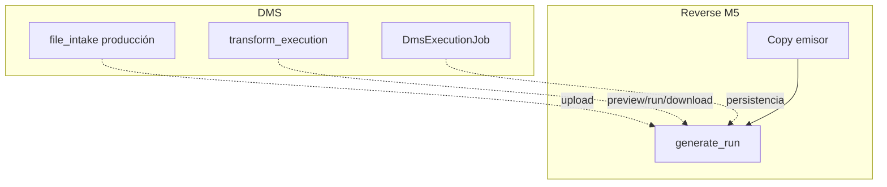
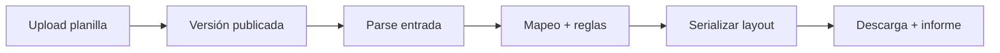
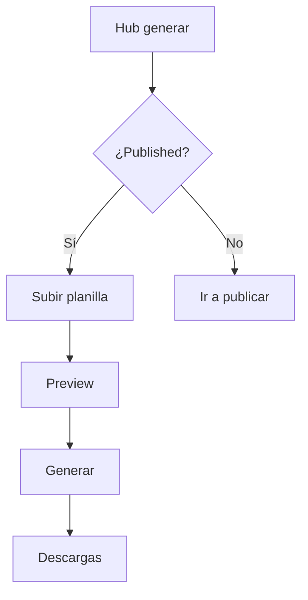

# Generate run — Reverse Studio Módulo 5

Proceso y especificación del **Módulo 5** de Reverse Studio: **subir la planilla**, **generar** el archivo de envío contra la versión **publicada** y **descargar** salida + informe.

> Estado: **implementado** (`apps/reverse_studio/run/` · `templates/reverse_studio/run/`).  
> Producto: [`../REVERSE_STUDIO.md`](../REVERSE_STUDIO.md).  
> Rama: `feature/reverse-studio`.  
> Destino: `apps/reverse_studio/run/` · `templates/reverse_studio/run/` · prototipos `prototype/reverse_studio/run/`.  
> Base técnica: [`../definition_app_DMS/file_intake.md`](../definition_app_DMS/file_intake.md) + [`../definition_app_DMS/transform_execution.md`](../definition_app_DMS/transform_execution.md).  
> **Prerrequisito:** Módulo 4 (definición publicada).  
> **No incluye** historial completo filtrable (Módulo 6) ni pre-check FILE GATE (Módulo 7).  
> Familia §2: [`../APP_FACTORY_HIGH_REUSE.md`](../APP_FACTORY_HIGH_REUSE.md).

---

## Propósito

Permitir que un usuario autorizado tome una **planilla de negocio** (CSV / Excel / delimitado), la procese con la definición publicada (parse → map → rules → serialize) y obtenga el **archivo del banco/ERP** listo para descargar, con métricas e informe de errores.

Sin versión publicada no hay generación (RS1 / PUB3).

---

## Qué es / qué hace / qué no hace

| Pregunta | Respuesta |
|----------|-----------|
| **¿Qué es?** | El flujo de **emisión**: upload planilla → job → descarga layout |
| **¿Qué hace?** | Reusa intake de producción + motor `transform_execution` sobre `KIND_REVERSE` |
| **¿Qué no hace?** | No edita definición; no publica; no es el historial largo (M6) |
| **Copy UX** | “Generar archivo de envío” / “planilla” / “layout” — **no** “ejecutar transformación FilePipe” |

---

## Relación con DMS File intake + Transform execution

En FilePipe: upload (`/archivo/`) y ejecutar (`/ejecutar/`) son áreas cercanas. En Reverse Studio el producto las agrupa como **un módulo (M5)** con una UX de emisor.

| Tema | Decisión Reverse |
|------|------------------|
| Upload producción | Reusar `file_intake` production upload |
| Motor | Reusar dry run + run + downloads de `transform_execution` |
| Versión | Solo `DmsMappingVersion` `published` / `current_version` |
| Extensiones | Según tipo de **entrada** publicada (whitelist CSV/xlsx/delimitado) |
| Nombre salida | `TargetProfile.layout.output_filename_pattern` |
| Roles | `PA` / `ED` / `GE` generan; `CO` no descarga datos de negocio (matriz §12) |
| FILE GATE | Opcional vía M7; Generar respeta `file_gate_enabled` |
| Historial | Enlace “ver recientes” + detalle del job; listado rico = M6 |
| UI | Un hub **Generar** (upload + jobs listos + preview/run + resultado) |

### Pipeline de un job

---

## Alcance

| Incluido | Excluido |
|----------|----------|
| Hub generar + ayuda | Editar M1–M4 |
| Upload planilla de producción | Archivo muestra del wizard (ya en M1 si aplica) |
| Dry run (preview N filas) | Scheduling / API (Fase 3) |
| Job completo síncrono MVP | Bridge FILE GATE (M7) |
| Descarga salida + informe + errores | Historial avanzado (M6) |
| Bloqueo sin published | Multi-destino |

---

## Responsabilidades

| Sí | No |
|----|-----|
| Validar extensión/tamaño vs contrato de entrada publicado | Cambiar campos o mapeo |
| Ejecutar motor DMS | Elegir carpeta en el servidor |
| Entregar enlaces de descarga TTL | Certificado formal (Fase 3) |

---

## Proceso (UX)

1. Usuario abre **Generar** (hub proyecto o CTA post-publicar).
2. Si no hay versión publicada → bloqueo + enlace a M4.
3. Selecciona / sube planilla (browse).
4. Opcional: **Vista previa** (dry run).
5. **Generar archivo** → job → resumen (filas OK / rechazadas).
6. Descargar layout + informe; enlace a historial (M6 placeholder o recientes).

| Pantalla | Equivalente DMS | Contenido Reverse |
|----------|-----------------|-------------------|
| `run/hub.html` | file_intake + transform_execution hub | Upload + lista jobs + acciones |
| `run/hub_help.html` | ayudas | Copy emisor |
| `run/result.html` *(opcional)* | resultado inline | Resumen post-job + CTAs descarga |
| Parciales | scope / config JS | URLs Reverse |

**Assets al implementar:** `file_intake` + `transform_execution` CSS/JS con skin Reverse.

---

## Reglas de negocio

| ID | Regla |
|----|-------|
| GEN1 | Solo versión **publicada** activa. |
| GEN2 | Permisos: `PA` / `ED` / `GE` generan; `CO` no descarga salida con datos (RS3 / §12). |
| GEN3 | El job **no** modifica la definición publicada. |
| GEN4 | Extensión del archivo debe coincidir con el tipo de entrada publicado (whitelist Reverse). |
| GEN5 | Límites de tamaño / MIME según file intake. |
| GEN6 | Nombre de salida desde `output_filename_pattern` del layout publicado. |
| GEN7 | Estados job: `completed` / `partial` / `failed` / `preview` (alineados DMS). |
| GEN8 | Códigos de error vía `ExecutionErrorCode` (no inventar). |
| GEN9 | Tenant: compañía + membresía. |
| GEN10 | Bridge FILE GATE opcional (M7): si está activo, pre-check antes de generar. |
| GEN11 | Copy: generar / planilla / archivo de envío. |

---

## Validaciones

| Momento | Regla | Severidad |
|---------|-------|-----------|
| Abrir hub | Sin published | Bloqueo UX |
| Upload | Extensión ≠ entrada publicada | **Error** |
| Upload | Tamaño / MIME | **Error** |
| Preview/Run | Job no pertenece al proyecto | **Error** |
| Run | Rol sin execute | **Forbidden** |
| Run | Published desapareció | **Error** |

Mensajes: ampliar [`UI_MESSAGES.md`](../definition_app/UI_MESSAGES.md) §3.10 bloque Módulo 5 al implementar.

---

## Modelo de datos (reuso)

| Artefacto | Uso |
|-----------|-----|
| `DmsExecutionJob` | Job de generación |
| Storage `MEDIA_ROOT/dms/...` | Input / output / report |
| `DmsProjectConfig.current_version` | Definición usada |
| Enlaces firmados TTL | Descarga (política DMS vigente, p. ej. 7 días) |

Semántica: docs DMS citados. No duplicar esquemas aquí.

---

## Pantallas (prototipo → template)

| Prototipo | Template definitivo |
|-----------|---------------------|
| `run/hub.html` | `templates/reverse_studio/run/hub.html` |
| `run/hub_help.html` | `…/hub_help.html` |
| `run/result.html` | `…/result.html` (o panel en hub) |

Abrir: `prototype/reverse_studio/run/hub.html`.

---

## Casos de uso

### RS-GEN01 — Excel → TXT banco

| | |
|---|---|
| **Flujo** | Published v1 · subir Excel · generar |
| **Resultado** | `completed` + TXT descargable |

### RS-GEN02 — Sin publicar

| | |
|---|---|
| **Flujo** | Abrir Generar sin published |
| **Resultado** | Bloqueo + CTA publicar |

### RS-GEN03 — Preview antes de generar

| | |
|---|---|
| **Flujo** | Upload → vista previa 100 filas → generar |
| **Resultado** | Preview sin output persistente; luego job completo |

### RS-GEN04 — Planilla con columnas faltantes

| | |
|---|---|
| **Flujo** | Excel sin campo requerido |
| **Resultado** | `failed` o filas rechazadas según write_validation |

### RS-GEN05 — Rol CO

| | |
|---|---|
| **Flujo** | CO intenta descargar salida |
| **Resultado** | Denegado (MVP) |

### RS-GEN06 — Extensión incorrecta

| | |
|---|---|
| **Flujo** | Entrada publicada = csv; sube `.xlsx` |
| **Resultado** | Rechazo en upload |

---

## Criterios de “módulo 5 completo” (definición)

- [x] Propósito y frontera M4 / M6 / M7 claros
- [x] Reuso intake + transform_execution documentado
- [x] Reglas GEN1–GEN11 + validaciones + casos
- [x] Mapa prototipo → template
- [x] Prototipos HTML listos
- [x] Prototipos revisados por el usuario
- [x] Usuario: «Desarrolla el módulo»

Checklist al implementar:

- [x] `apps/reverse_studio/run/` + templates
- [x] Upload producción + preview + run + downloads (reuso DMS)
- [x] Bloqueo sin published; roles PA/ED/GE
- [x] Hub proyecto: paso Generar activo post-publish
- [x] Copy / ayudas Reverse
- [x] UI_MESSAGES §3.10 Módulo 5
- [x] Enlace a historial (M6 placeholder o listado mínimo)

---

## Próximos pasos

1. Abrir Módulo 6 [`history.md`](history.md).
2. (Opcional) Prototipos `prototype/reverse_studio/run/` si se quiere espejo HTML offline.

---

## Referencias

| Documento | Uso |
|-----------|-----|
| [`../REVERSE_STUDIO.md`](../REVERSE_STUDIO.md) | RS1–RS9, matriz roles |
| [`publish.md`](publish.md) | Prerrequisito published |
| [`../definition_app_DMS/file_intake.md`](../definition_app_DMS/file_intake.md) | Upload |
| [`../definition_app_DMS/transform_execution.md`](../definition_app_DMS/transform_execution.md) | Motor / estados / descarga |
| [`../definition_app/UI_MESSAGES.md`](../definition_app/UI_MESSAGES.md) | Mensajes |
| [`README.md`](README.md) | Índice |

---

*Documento: `docs/definition_app_REVERSE/generate_run.md` — Módulo 5 Reverse Studio (generar archivo de envío).*
