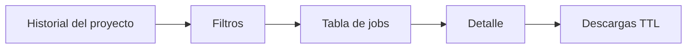
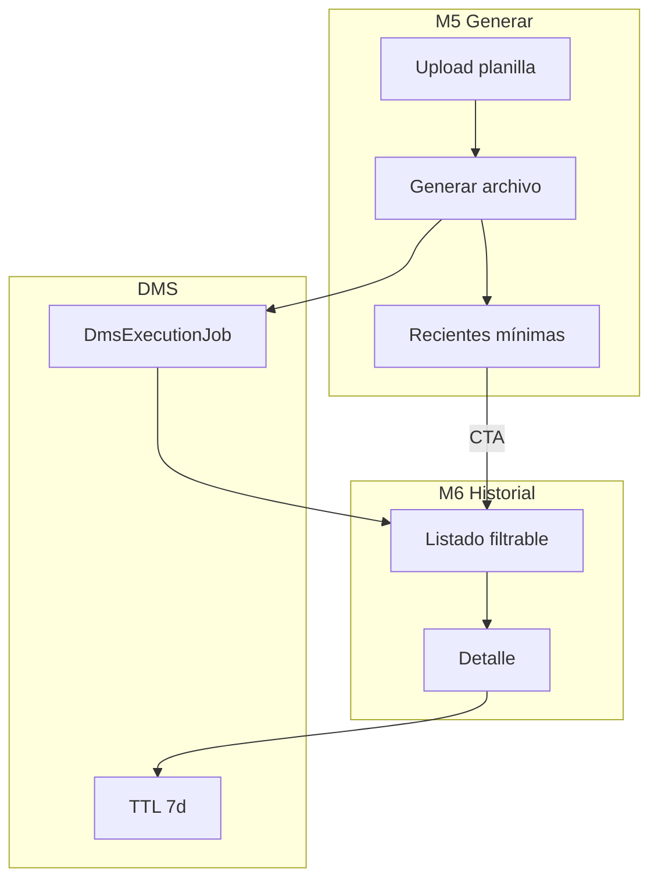
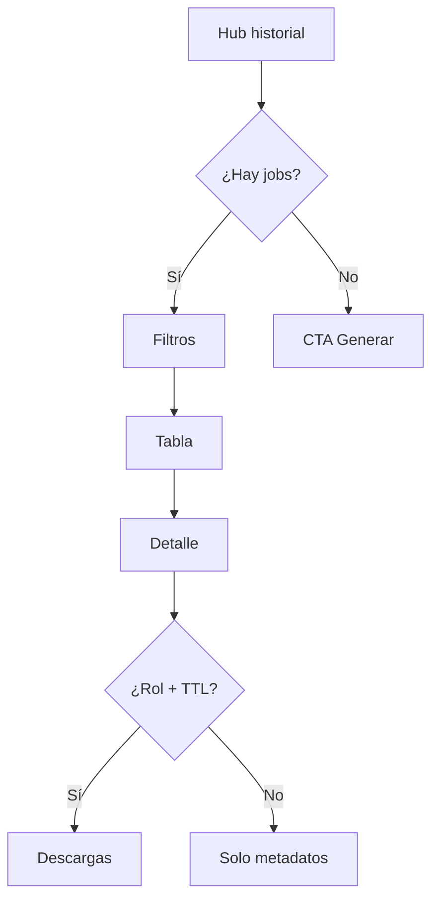

# History — Reverse Studio Módulo 6

Proceso y especificación del **Módulo 6** de Reverse Studio: **historial filtrable** de generaciones (archivo de envío), con metadatos de auditoría y descargas vigentes (TTL).

> Estado: **implementado** (`apps/reverse_studio/history/` · `templates/reverse_studio/history/`).  
> Producto: [`../REVERSE_STUDIO.md`](../REVERSE_STUDIO.md).  
> Rama: `feature/reverse-studio`.  
> Destino: `apps/reverse_studio/history/` · `templates/reverse_studio/history/` · prototipos `prototype/reverse_studio/history/`.  
> Base técnica: [`../definition_app_DMS/transform_execution.md`](../definition_app_DMS/transform_execution.md) (jobs + TTL) · patrón filtros [`../definition_app_FILE_GATE/validation_history.md`](../definition_app_FILE_GATE/validation_history.md).  
> **Prerrequisito:** Módulo 5 (generar) — los jobs nacen ahí.  
> **No incluye** bridge FILE GATE (Módulo 7) ni certificado formal (Fase 3).  
> Familia §2: [`../APP_FACTORY_HIGH_REUSE.md`](../APP_FACTORY_HIGH_REUSE.md).

---

## Propósito

Permitir que un usuario autorizado **consulte todas las generaciones** del proyecto emisor:

1. ver corridas recientes y antiguas (metadatos siempre);
2. **filtrar** por estado, fecha, usuario, planilla, versión publicada, TTL;
3. abrir **detalle** del job y, si el TTL está vigente y el rol lo permite, **descargar** layout / informe / errores;
4. reconocer jobs con **descargas expiradas** sin perder la auditoría.

El Módulo 5 ya muestra un preview de “recientes” en el hub Generar. El Módulo 6 es el **listado completo y filtrable** + capa de evidencia.



---

## Qué es / qué hace / qué no hace

| Pregunta | Respuesta |
|----------|-----------|
| **¿Qué es?** | El libro de **emisiones**: quién generó qué, cuándo, con qué versión |
| **¿Qué hace?** | Lista / filtra `DmsExecutionJob` de `KIND_REVERSE`; enlaza descargas M5 |
| **¿Qué no hace?** | No genera de nuevo; no edita definición; no valida FILE GATE |
| **Copy UX** | “Historial de generaciones” / “archivo de envío” / “planilla” — **no** “historial de transformaciones FilePipe” |

---

## Relación con M5 y DMS

| Tema | Decisión Reverse |
|------|------------------|
| Fuente de jobs | Mismos `DmsExecutionJob` que crea M5 |
| Criterio inclusión | Jobs de generación (`job_type` full / estados finales); excluir `uploaded` sin ejecutar |
| Descargas | Reusar enlaces firmados M5 (`run_download_*`) + TTL 7 días DMS |
| Filtros | Patrón FILE GATE history (GET, sin Django Forms) |
| Preview M5 | Hub Generar sigue mostrando N recientes; CTA → Historial |
| Bridge FG | Config en M7; historial no recalcula ni muestra columna gate (sello en job si aplica) |
| Certificado | No en MVP Reverse (sí en FILE GATE) |



---

## Alcance

| Incluido | Excluido |
|----------|----------|
| Hub historial + ayuda | Ejecutar / re-subir (M5) |
| Filtros: estado, fechas, usuario, planilla, versión, TTL | Editar M1–M4 |
| Columnas de auditoría (quién, cuándo, hash, métricas) | Diff entre jobs / versiones |
| Badge TTL vigente / expirado | Borrado físico de jobs (Fase 2) |
| Detalle de job + descargas (si rol + TTL) | Re-ejecutar sin re-subir (Fase 2) |
| Vacío / sin resultados de filtro | Export CSV masivo (Fase 2) |
| CO: metadatos sí; sin descarga de negocio | Historial cross-proyecto |
| Paginación | API de auditoría (Fase 3) |
| Sustituir/ampliar “recientes” M5 con enlace real | Certificado bancario / sello FG |

---

## Responsabilidades

| Sí | No |
|----|-----|
| Consultar y filtrar jobs del proyecto | Parsear planillas |
| Mostrar estado de TTL y enlaces vigentes | Serializar layout de nuevo |
| Detalle de métricas persistidas | Publicar definición |
| Aislar por compañía + `KIND_REVERSE` | Exigir FILE GATE |

---

## Proceso (UX)

1. Usuario abre **Historial** (hub proyecto paso 6, sidebar, o CTA desde Generar → Recientes).
2. Ve tabla ordenada por fecha (más reciente primero) + contadores (total / OK / fallidos / expirados).
3. Aplica filtros (estado, fechas, usuario, planilla, versión, TTL).
4. Abre **Detalle** o descarga Envía / Informe / Errores según permiso y TTL.
5. Si TTL vencido → badge «Expirado»; metadatos siguen; descargas bloqueadas.



---

## Datos mostrados por fila (auditoría)

| Campo | Origen |
|-------|--------|
| Job id | UUID (corto en lista; completo en detalle) |
| Planilla | `input_original_filename` |
| Tamaño | `input_size_bytes` |
| Hash | `input_content_hash` (truncado en lista) |
| Versión publicada usada | `version.version_number` |
| Estado | `completed` / `partial` / `failed` (+ labels ES) |
| Métricas | `rows_ok`, `rows_rejected`, `rows_read` |
| Archivo de envío | `output_filename` |
| Usuario | `executed_by` |
| Inicio / fin | `started_at`, `finished_at` |
| TTL | vigente / expirado (7 días desde `finished_at`) |
| Acciones | Detalle · Envío · Informe · Errores |

Orden por defecto: `-finished_at`, `-created_at`.

---

## Filtros (MVP)

| Filtro | Tipo | Notas |
|--------|------|-------|
| `status` | select | `all` / `completed` / `partial` / `failed` |
| `date_from` / `date_to` | date | Sobre `finished_at` (o `created_at` si falta) |
| `executed_by` | select | Usuarios que generaron en el proyecto |
| `filename` | texto contains | Case-insensitive sobre planilla |
| `version` | número | Versión publicada del job |
| `ttl` | select | `all` / `active` / `expired` |
| `page` | entero | Paginación |

Sin filtros → página 1 de N jobs (p. ej. 25/página; escaneo máx. alineado a FILE GATE / DMS).

Query string propuesta (GET, sin Django Forms):

```
?status=failed&date_from=2026-07-01&date_to=2026-07-27&filename=pagos&version=1&ttl=active
```

---

## Roles y permisos

| Acción | PA | ED | GE | CO |
|--------|----|----|----|-----|
| Ver historial (metadatos) | Sí | Sí | Sí | Sí |
| Filtrar / paginar | Sí | Sí | Sí | Sí |
| Abrir detalle (métricas) | Sí | Sí | Sí | Sí (sin datos de filas de negocio) |
| Descargar layout / informe / errores | Sí | Sí | Sí | **No** |
| Eliminar job | Fase 2 (PA) | No | No | No |
| Re-generar desde historial | Fase 2 | Fase 2 | Fase 2 | No |

Alineado a GEN2 / matriz [`../REVERSE_STUDIO.md`](../REVERSE_STUDIO.md) §12: CO ve auditoría; no descarga archivos con datos de negocio.

Visitante compañía (sin membresía, proyecto público): mismo trato que CO para descargas (metadatos si `user_can_view`; sin download).

---

## Reglas de negocio

| ID | Regla |
|----|-------|
| HIS1 | Solo jobs del proyecto Reverse actual; sin lectura cruzada (compañía + `KIND_REVERSE`). |
| HIS2 | El historial **no recalcula** resultados; muestra lo persistido en el job. |
| HIS3 | Metadatos permanecen tras TTL; solo fallan descargas de storage. |
| HIS4 | Badge «Expirado» cuando `now > finished_at + DOWNLOAD_TTL` (7 días). |
| HIS5 | CO / visitante compañía: listado y detalle de metadatos; **sin** enlaces de descarga de negocio. |
| HIS6 | Filtros aditivos (AND); vacío de resultados ≠ error (mensaje + limpiar). |
| HIS7 | Orden estable: más reciente primero. |
| HIS8 | No mezclar jobs FilePipe / FILE GATE aunque compartan tablas. |
| HIS9 | Descargas solo si estado `completed` o `partial` y TTL vigente y rol permitido. |
| HIS10 | Contadores del hub (total / completed / failed+partial / expired) reflejan el universo filtrable, no solo la página. |
| HIS11 | Copy: generación / planilla / archivo de envío. |
| HIS12 | M5 “Recientes” enlaza a este módulo; no duplicar un segundo historial rico. |

---

## Validaciones

| Momento | Condición | Severidad |
|---------|-----------|-----------|
| Abrir historial | Sin acceso al proyecto | Forbidden / redirect |
| Filtro fechas | `date_from` > `date_to` | Error inline |
| Filtro versión | No numérico | Error inline |
| Abrir detalle | Job de otro proyecto | 404 |
| Descargar | CO / sin permiso | 404 u ocultar |
| Descargar | TTL vencido | 410 + mensaje «Archivo expirado» |

Mensajes: ampliar [`../definition_app/UI_MESSAGES.md`](../definition_app/UI_MESSAGES.md) §3.10 bloque Módulo 6 al implementar.

---

## Modelo de datos (reuso)

| Artefacto | Uso |
|-----------|-----|
| `DmsExecutionJob` | Fuente de verdad |
| `execution_service.list_history` + query filtrada | Base listado |
| `build_download_links` namespace `reverse_studio` | Descargas |
| `DOWNLOAD_TTL` (7 días) | Badge / bloqueo |
| Storage `MEDIA_ROOT/dms/...` | Binarios |

Preferencia: **sin migración nueva**. Semántica de estados: docs DMS citados.

Criterio de inclusión MVP:

- `job_type` = full (generación), **o** status ∈ {`completed`, `partial`, `failed`};
- excluir `uploaded` / `running` / `queued` sin resultado final.

---

## Pantallas (prototipo → template)

| Prototipo | Template definitivo |
|-----------|---------------------|
| `history/hub.html` | `templates/reverse_studio/history/hub.html` |
| `history/hub_help.html` | `…/hub_help.html` |
| `history/detail.html` | `…/detail.html` |
| `history/empty.html` | estado vacío en hub (o parcial) |

Abrir: `prototype/reverse_studio/history/hub.html`.

### URLs previstas

```
/app/reverse-studio/proyectos/<slug>/historial/                 → history_hub
/app/reverse-studio/proyectos/<slug>/historial/ayuda/           → history_hub_help
/app/reverse-studio/proyectos/<slug>/historial/jobs/<uuid>/     → history_detail
```

Descargas: reutilizar rutas M5  
`/generar/jobs/<uuid>/download/{output|report|errors}/`.

M5 `generar/recientes/` puede **redirigir** a `historial/` o quedar como alias fino; al implementar, preferir un solo hub rico (HIS12).

---

## Casos de uso

### RS-HIS01 — Consultar emisiones del mes

| | |
|---|---|
| **Flujo** | Historial → filtro fechas julio → ver jobs completed |
| **Resultado** | Tabla filtrada + contadores |

### RS-HIS02 — Descargar layout vigente

| | |
|---|---|
| **Flujo** | Job completed hace 2 días → Descargar envío |
| **Resultado** | Archivo con TTL vigente |

### RS-HIS03 — TTL expirado

| | |
|---|---|
| **Flujo** | Job de hace 10 días |
| **Resultado** | Badge expirado; metadatos sí; sin descarga |

### RS-HIS04 — Rol CO

| | |
|---|---|
| **Flujo** | CO abre historial y detalle |
| **Resultado** | Ve planilla, estado, métricas; no botones de descarga de negocio |

### RS-HIS05 — Sin generaciones

| | |
|---|---|
| **Flujo** | Proyecto publicado sin jobs |
| **Resultado** | Vacío + CTA a Generar |

### RS-HIS06 — Filtro sin matches

| | |
|---|---|
| **Flujo** | status=failed sin fallos |
| **Resultado** | Mensaje “Sin resultados” + limpiar filtros |

---

## Criterios de “módulo 6 completo” (definición)

- [x] Propósito y frontera M5 / M7 claros
- [x] Reuso jobs + TTL + patrón filtros documentado
- [x] Reglas HIS1–HIS12 + validaciones + casos
- [x] Mapa prototipo → template + URLs
- [x] Prototipos HTML listos
- [x] Prototipos revisados por el usuario
- [x] Usuario: «Desarrolla el módulo»

Checklist al implementar:

- [x] `apps/reverse_studio/history/` + templates
- [x] Filtros GET + paginación + stats
- [x] Detalle job; descargas vía M5 (roles PA/ED/GE)
- [x] Hub proyecto: paso 6 Historial activo / enlace
- [x] M5 recientes → CTA real a M6 (sin duplicar listado rico)
- [x] Copy / ayudas Reverse
- [x] UI_MESSAGES §3.10 Módulo 6

---

## Próximos pasos

1. Abrir Módulo 7 [`gate_bridge.md`](gate_bridge.md) (Fase 2) o transversales (`rs_integration.md`).

---

## Referencias

| Documento | Uso |
|-----------|-----|
| [`../REVERSE_STUDIO.md`](../REVERSE_STUDIO.md) | RS1–RS9, matriz roles §12 |
| [`generate_run.md`](generate_run.md) | Origen de jobs / descargas |
| [`../definition_app_DMS/transform_execution.md`](../definition_app_DMS/transform_execution.md) | Estados / TTL |
| [`../definition_app_FILE_GATE/validation_history.md`](../definition_app_FILE_GATE/validation_history.md) | Patrón filtros |
| [`../definition_app/UI_MESSAGES.md`](../definition_app/UI_MESSAGES.md) | Mensajes |
| [`README.md`](README.md) | Índice |

---

*Documento: `docs/definition_app_REVERSE/history.md` — Módulo 6 Reverse Studio (historial de generaciones).*
