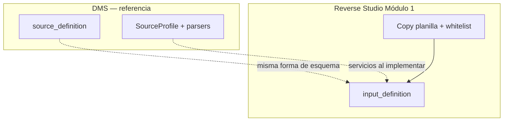
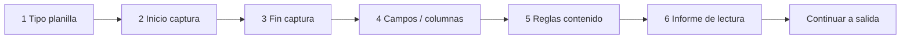
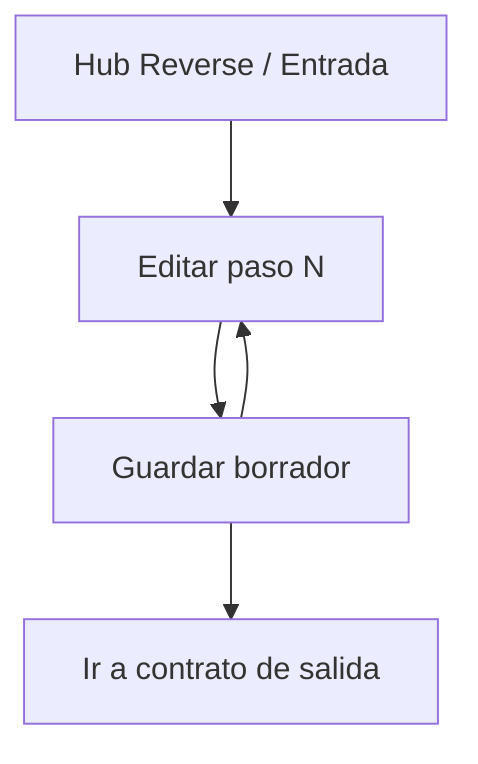

# Input definition — Reverse Studio Módulo 1

Proceso y especificación del **Módulo 1** de Reverse Studio: definir el **contrato de entrada** (cómo viene la planilla de negocio) y persistirlo como perfil reutilizable.

> Estado: **implementado** (Módulo 1 — contrato de entrada).  
> Producto: [`../REVERSE_STUDIO.md`](../REVERSE_STUDIO.md).  
> Rama: `feature/reverse-studio`.  
> Código: `apps/reverse_studio/` · templates `templates/reverse_studio/` · URLs `/app/reverse-studio/...`.  
> Base técnica: [`../definition_app_DMS/source_definition.md`](../definition_app_DMS/source_definition.md) (`DmsSourceProfile`, catálogos, `save_source`).  
> **No incluye** contrato de salida, mapeo ni generación (módulos 2–5).  
> Familia §2: [`../APP_FACTORY_HIGH_REUSE.md`](../APP_FACTORY_HIGH_REUSE.md).
> Prototipos de referencia: [`../../prototype/reverse_studio/input/`](../../prototype/reverse_studio/input/).
---

## Propósito

Permitir que el diseñador configure **paso a paso** cómo debe interpretarse la **planilla de entrada** (CSV, Excel o delimitado) que el negocio sabe llenar, sin programar.

El resultado es un **contrato de entrada** versionable. Más adelante:

- el Módulo 2 define el layout de salida;
- el Módulo 3 mapea entrada → salida;
- el Módulo 5 usa este contrato para **parsear** la planilla al generar el archivo de envío.

Sin un contrato de entrada completo (y, a nivel producto, una definición publicada que lo incluya), no hay generación.

---

## Qué es / qué hace / qué no hace

| Pregunta | Respuesta |
|----------|-----------|
| **¿Qué es?** | El asistente que describe la planilla de negocio (columnas, encoding, captura, reglas) |
| **¿Qué hace?** | Persiste un `SourceProfile` (o equivalente) acotado a tipos “fáciles” |
| **¿Qué no hace?** | No genera el TXT/XML/JSON de salida; no mapea; no sube la planilla de producción (eso es Módulo 5) |
| **Copy UX** | “Planilla de entrada” / “contrato de entrada” — **no** “origen para transformar” (FilePipe) |

---

## Relación con DMS Source definition

| Tema | Decisión |
|------|----------|
| Pasos del asistente | **Mismos 6 pasos** conceptuales que origen DMS / esquema FILE GATE |
| Catálogos | Reusar `SourceFileType`, `CharsetEncoding`, `LineEnding`, `CaptureBoundaryMode`, `FieldContentType` |
| Forma del JSON | Alineada a `source` de `SourceProfile` |
| Whitelist MVP | Solo tipos **amigables**: `csv`, `xlsx`, `txt_delimited` |
| UX / copy | Hub Reverse Studio · “planilla / entrada”, no hub FilePipe ni FILE GATE |
| Persistencia (propuesta) | `Project.KIND_REVERSE` + mismas tablas DMS (`DmsSourceProfile` en la versión) |
| Código a reutilizar | Catálogos, normalización, `save_source`, JS/CSS de SourceProfile con skin Reverse |



### Tipos de entrada permitidos (MVP)

| Código | Nombre | ¿Permitido en Reverse MVP? |
|--------|--------|----------------------------|
| `csv` | CSV | **Sí** |
| `xlsx` | Excel | **Sí** |
| `txt_delimited` | TXT delimitado | **Sí** |
| `txt_fixed` | TXT posicional | **No** (usar FilePipe o es salida, Módulo 2) |
| `json` | JSON | **No** (MVP) |
| `xml` | XML | **No** (MVP) |

**Regla IN3 / IN-W1:** la UI solo ofrece la whitelist. Si llega un `file_type_code` fuera de lista (API/payload), el servidor rechaza el guardado.

---

## Alcance de este documento

| Incluido | Excluido (otro módulo / app) |
|----------|------------------------------|
| Tipo de planilla (whitelist), encoding, line ending | Contrato de salida / TargetProfile (Módulo 2) |
| Captura inicio / fin | Mapeo entrada → salida (Módulo 3) |
| Campos y validaciones por campo | Publicar definición completa (Módulo 4) |
| Reglas globales de contenido | Subir planilla y generar archivo (Módulo 5) |
| Borrador del perfil de entrada | Historial de generaciones (Módulo 6) |
| Hub / pasos de entrada | Pre-check FILE GATE (Módulo 7) |
| | FilePipe genérico / FILE GATE validador |

---

## Responsabilidades

| Sí | No |
|----|-----|
| Asistente 6 pasos del **contrato de entrada** | Generar archivo de envío |
| Definir columnas/campos de la planilla | Definir layout posicional/XML/JSON de salida |
| Configurar captura y content_rules | Ejecutar job de emisión |
| Persistir borrador de entrada en la versión | Conciliar dos archivos |

---

## Proceso (asistente paso a paso)

El usuario recorre **6 pasos** en orden. Cada paso persiste borrador; puede volver atrás.



| Paso | Título UX Reverse Studio | Equivalente DMS | Contenido |
|------|--------------------------|-----------------|-----------|
| 1 | Tipo de planilla | Paso 1 origen | Whitelist `csv` / `xlsx` / `txt_delimited` + encoding + line ending |
| 2 | Inicio de captura | Paso 2 | `capture_start` |
| 3 | Fin de captura | Paso 3 | `capture_end` |
| 4 | Campos de la planilla | Paso 4 | fields (delimitado / xlsx; sin variantes fixed/json/xml de entrada) |
| 5 | Reglas de contenido | Paso 5 | `content_rules` (`trim_lines`, etc.) |
| 6 | Informe de lectura | Paso 6 | Qué reportar al leer la planilla (resumen / errores de fila); no es el layout de salida |

Detalle de modos, parámetros JSON y semántica: **delegar a** [`source_definition.md`](../definition_app_DMS/source_definition.md) §§ Pasos 1–6, salvo las diferencias de este doc.

### Diferencias de producto vs DMS / FILE GATE

| Paso | Diferencia Reverse Studio |
|------|---------------------------|
| Todos | Eyebrow / títulos: “planilla”, “entrada”, “emisión” — no “origen para transformar” ni “contrato de validación” |
| 1 | **Solo** tres tipos; ocultar o deshabilitar el resto del catálogo (el catálogo DMS sigue siendo fuente de verdad; la whitelist es filtro de producto) |
| 4 | UI solo para delimitado / CSV / Excel (columnas, header, delimiter, sheet…). Sin wizard posicional/JSON/XML de entrada. Plantillas parciales por tipo (como DMS/FG): `step4_fields_delimited` / `_xlsx` (CSV reusa delimitado) |
| 4 | Énfasis en `name` estable para **mapeo (M3)**; `required` / `content_type` / `pattern` también alimentan rechazo al leer la planilla en generación (M5) |
| 5 | Misma semántica DMS; default recomendado: `trim_lines: true` y `skip_empty_lines: true` en planillas amigables. Advertir lección FG: `trim_lines` en posicional de *salida* puede ser dañino — no aplica a entrada MVP |
| 6 | Contrato de **informe de lectura** al generar (`processing_report`). Sin enlace a política de umbral FILE GATE. Opciones DMS aplicables: `report_enabled`, `include_summary`, `include_row_errors`; `reject_alert_threshold` / `report_format` opcionales (mismo espíritu DMS) |
| Post-6 | CTA principal: **Continuar a contrato de salida** (Módulo 2), no “Publicar” (publicar definición completa = Módulo 4) |

### Notas de producto (lecciones DMS / FILE GATE)

| Tema | Decisión Reverse |
|------|------------------|
| `content_type` | Guía UX: nombres con espacios → `alphanumeric_spaces` o `free_text`; teléfonos/guiones → `free_text` o `custom` (evitar `CONTENT_TYPE_MISMATCH` en M5) |
| Preview / archivo muestra | **Fuera de M1 obligatorio.** Opcional futuro vía intake (patrón DMS `file_intake`); en MVP la planilla de producción se sube en Módulo 5 |
| Publicar solo entrada | **No.** No hay “publicar esquema de entrada” aislado como en FILE GATE. El snapshot de entrada se congela al publicar la **definición completa** (M4) |
| Generación usa | Solo versión `published` de la definición (M4); el borrador de M1 no habilita M5 (IN7) |

---

## Flujo de usuario (módulo 1)



1. Abrir proyecto Reverse Studio → sección **Entrada / Planilla**.
2. Ver progreso 0–6 del contrato de entrada y versión (borrador).
3. Entrar a un paso → ajustar → guardar borrador (o Guardar y continuar).
4. Al completar los 6 pasos → CTA hacia **Contrato de salida** (Módulo 2).
5. La **publicación** de la definición completa ocurre en Módulo 4 (no en este módulo solo).

---

## Reglas de negocio (módulo 1)

| ID | Regla |
|----|-------|
| IN1 | Solo `PA` / `ED` editan el contrato de entrada. |
| IN2 | La edición ocurre en el **borrador** de la versión del proyecto. |
| IN3 | `file_type_code` debe estar en la whitelist MVP (`csv`, `xlsx`, `txt_delimited`). UI solo ofrece esos; servidor rechaza fuera de lista (= IN-W1). |
| IN4 | Cambiar el tipo de planilla con campos ya definidos: advertencia fuerte; confirmar o limpiar campos (espíritu DMS / FG S7). |
| IN5 | Validación de borrador: mismas reglas base que origen DMS en modo no-strict al guardar paso; **strict** al publicar definición completa (Módulo 4). |
| IN6 | Tenant: solo miembros del proyecto / visibilidad según lifecycle Reverse. |
| IN7 | Completar Módulo 1 no basta para generar: faltan salida (M2), mapeo (M3) y publicar (M4). |
| IN8 | El hub de entrada marca pasos `done` / `draft` / `pending` como en SourceProfile / FILE GATE schema. |
| IN9 | No se implementa lógica de generación en este módulo. |
| IN10 | Al publicar definición (M4): al menos un campo en entrada; tipo de planilla obligatorio (análogo FG al publicar esquema). |

> **IN-W1** (whitelist en UI) queda absorbida por **IN3**; no usar IDs duplicados.

---

## Validaciones al guardar / al publicar definición

Reusar la matriz de [`source_definition.md`](../definition_app_DMS/source_definition.md) § Validaciones al guardar, **restringida a tipos whitelist**, más:

| Regla extra Reverse | Cuándo | Severidad |
|---------------------|--------|-----------|
| `file_type_code` ∉ `{csv, xlsx, txt_delimited}` | Guardar cualquier paso / API | **Error** (IN3) |
| Sin tipo de planilla | Strict (M4) | **Error** |
| Al menos un campo | Strict (M4) | **Error** |
| `report_enabled` recomendado true | Strict (M4) | **Advertencia** si false |
| Campos sin `name` único / `content_type` | Guardar paso 4 / strict | **Error** (matriz DMS) |
| `capture_end` vs `capture_start` comparable | Guardar / strict | **Error** (matriz DMS) |
| `delimiter` vacío en `csv` / `txt_delimited` | Strict (M4) | **Error** |
| `sheet_name` vacío en `xlsx` | Guardar paso 4 | **Advertencia** (usa primera hoja); strict: **Advertencia** o política DMS vigente |

Canal UI: alineado a [`UI_MESSAGES.md`](../definition_app/UI_MESSAGES.md); al implementar, añadir § Reverse Studio (mismo patrón §3.8 DMS / §3.9 FILE GATE).

**Implementación prevista:** reusar `validate_source_dict(..., strict=)` + filtro whitelist previo.

---

## Modelo de datos (reuso)

Preferencia: **reutilizar** `DmsSourceProfile` dentro de `DmsMappingVersion` del proyecto `kind=reverse` (mismo patrón FILE GATE con kind aislado).

| Concepto Reverse | Artefacto DMS / FG | Notas |
|------------------|--------------------|-------|
| Contrato de entrada | `DmsSourceProfile` (JSON `source`) | Forma alineada a DMS |
| Versión borrador / publicada | `DmsMappingVersion` | En Reverse la versión también lleva target + mappings (M2–M3); publicar = M4 |
| Config de proyecto | `DmsProjectConfig` o `ReverseConfig` mínimo | Decisión en `rs_integration.md` |
| Congelar entrada | Snapshot dentro de publish M4 | **No** hay `schema_publish` solo-entrada como FILE GATE |

No crear tablas paralelas de “InputProfile” en MVP salvo que el spike demuestre conflicto con FilePipe.

### Parámetros `config` por tipo (whitelist)

Delegar detalle a DMS § Parámetros por tipo; resumen Reverse:

| Tipo | Claves `config` relevantes |
|------|----------------------------|
| `csv` / `txt_delimited` | `delimiter`, `quote_char`, `escape_char`, `has_header`, `header_row` |
| `xlsx` | `sheet_name`, `has_header`, `header_row` |

Campos: propiedades comunes DMS (`name`, `label`, `content_type`, `required`, `pattern`) + localización de columna (`column_index` / `source_column` / `column` según tipo).

---

## JSON de ejemplo (entrada)

```json
{
  "file_type_code": "xlsx",
  "encoding_code": "utf-8",
  "encoding_custom": null,
  "line_ending_code": "lf",
  "line_ending_custom": null,
  "capture_start": { "mode": "first" },
  "capture_end": { "mode": "eof" },
  "config": {
    "has_header": true,
    "header_row": 1,
    "sheet_name": "Pagos"
  },
  "fields": [
    {
      "name": "documento",
      "label": "Documento",
      "source_column": "DOC",
      "column_index": 0,
      "content_type": "numeric",
      "required": true
    },
    {
      "name": "nombre",
      "label": "Nombre",
      "source_column": "NOMBRE",
      "column_index": 1,
      "content_type": "alphanumeric_spaces",
      "required": true
    },
    {
      "name": "monto",
      "label": "Monto",
      "source_column": "MONTO",
      "column_index": 2,
      "content_type": "decimal",
      "required": true
    }
  ],
  "content_rules": {
    "trim_lines": true,
    "skip_empty_lines": true,
    "comment_prefix": "",
    "allowed_chars": "",
    "excluded_chars": [],
    "forbidden_patterns": []
  },
  "processing_report": {
    "report_enabled": true,
    "include_summary": true,
    "include_row_errors": true,
    "reject_alert_threshold": null,
    "report_format": "json"
  }
}
```

> Semántica de captura, content_types y errores de ejecución: [`source_definition.md`](../definition_app_DMS/source_definition.md). Códigos como `CONTENT_TYPE_MISMATCH` aplican al **leer** la planilla en M5.

---

## Pantallas (prototipo → template)

Misma estructura de carpetas que la app (`input/`), para espejo 1:1 con `templates/reverse_studio/input/`.

| Prototipo | Template definitivo (tras «Desarrolla el módulo») |
|-----------|-----------------------------------------------------|
| `prototype/reverse_studio/input/hub.html` | `templates/reverse_studio/input/hub.html` |
| `prototype/reverse_studio/input/hub_help.html` | `templates/reverse_studio/input/hub_help.html` |
| `prototype/reverse_studio/input/step1_file_type.html` | `templates/reverse_studio/input/step1_file_type.html` |
| `prototype/reverse_studio/input/step1_help.html` | `templates/reverse_studio/input/step1_help.html` |
| `prototype/reverse_studio/input/step2_capture_start.html` | `templates/reverse_studio/input/step2_capture_start.html` |
| `prototype/reverse_studio/input/step2_help.html` | `templates/reverse_studio/input/step2_help.html` |
| `prototype/reverse_studio/input/step3_capture_end.html` | `templates/reverse_studio/input/step3_capture_end.html` |
| `prototype/reverse_studio/input/step3_help.html` | `templates/reverse_studio/input/step3_help.html` |
| `prototype/reverse_studio/input/step4_fields.html` | `templates/reverse_studio/input/step4_fields.html` (+ parciales `_delimited` / `_xlsx` al implementar) |
| `prototype/reverse_studio/input/step4_help.html` | `templates/reverse_studio/input/step4_help.html` |
| `prototype/reverse_studio/input/step5_content_rules.html` | `templates/reverse_studio/input/step5_content_rules.html` |
| `prototype/reverse_studio/input/step5_help.html` | `templates/reverse_studio/input/step5_help.html` |
| `prototype/reverse_studio/input/step6_report.html` | `templates/reverse_studio/input/step6_report.html` |
| `prototype/reverse_studio/input/step6_help.html` | `templates/reverse_studio/input/step6_help.html` |

Assets compartidos del prototipo: `prototype/reverse_studio/css/prototype.css`, `prototype/reverse_studio/js/prototype.js`.

Abrir en navegador (sin Django): `prototype/reverse_studio/input/hub.html`.

---

## Casos de uso (módulo 1)

### RS-IN01 — Planilla Excel de pagos

| | |
|---|---|
| **Actor** | Diseñador (`PA`) |
| **Flujo** | Hub → Paso 1 `xlsx` + utf-8 → capturas `first`/`eof` → campos documento/nombre/monto → reglas con trim → informe → hub |
| **Resultado** | Entrada completa en borrador; CTA a contrato de salida (M2); **no** genera archivo |

### RS-IN02 — Intentar tipo posicional como entrada

| | |
|---|---|
| **Flujo** | Paso 1: usuario intenta `txt_fixed` (UI deshabilitada) o API envía `txt_fixed` |
| **Resultado** | UI bloquea; servidor rechaza con IN3 |

### RS-IN03 — Cambiar de CSV a Excel con campos definidos

| | |
|---|---|
| **Flujo** | Había campos CSV; cambia a `xlsx` |
| **Resultado** | Advertencia IN4; campos se invalidan o se piden redefinir (espíritu FG-S02 / DMS) |

### RS-IN04 — Entrada completa pero sin salida/mapeo

| | |
|---|---|
| **Flujo** | Completa 6 pasos de entrada; intenta “Generar” desde hub de proyecto |
| **Resultado** | Bloqueo UX + servidor (IN7): faltan M2–M4 |

### RS-IN05 — content_type incorrecto (lección FG)

| | |
|---|---|
| **Flujo** | Campo `nombre` con `alphanumeric` (sin espacios); planilla tiene “JUAN PEREZ” |
| **Resultado** | En M5: `CONTENT_TYPE_MISMATCH`; corrección de diseño: `alphanumeric_spaces` o `free_text` |

---

## Criterios de “módulo 1 completo” (definición)

Antes de desarrollar:

- [x] Propósito y frontera con M2–M5 claros
- [x] Whitelist de tipos documentada
- [x] Pasos 1–6 y diferencias UX vs DMS / FILE GATE
- [x] Reglas de negocio IN1–IN10 + validaciones al guardar
- [x] Casos de uso RS-IN01–IN05
- [x] Mapa prototipo → template
- [x] Prototipos HTML listos para revisión
- [x] Alineación revisada vs `schema_definition.md` + `source_definition.md`
- [x] Prototipos HTML revisados / OK implícito («Desarrolla el módulo»)
- [x] Usuario: «Desarrolla el módulo»

Checklist al implementar (patrón FILE GATE):

- [x] `templates/reverse_studio/input/` + servicios (reuso `source_profile` + filtro whitelist)
- [x] Copy fino / ayudas hub + pasos
- [x] Mensajes UI § Reverse en `UI_MESSAGES.md` (§3.10)
- [x] Hub marca progreso; CTA a M2 sin publish aislado
- [x] App `apps.reverse_studio` (projects + input) · kind `reverse` · URLs `/app/reverse-studio/`

---

## Implementación (referencia)

| Pieza | Ubicación |
|-------|-----------|
| App | `apps/reverse_studio/` |
| Proyectos | `apps/reverse_studio/projects/` · `templates/reverse_studio/projects/` |
| Entrada | `apps/reverse_studio/input/` · `templates/reverse_studio/input/` |
| Kind | `Project.KIND_REVERSE = "reverse"` |
| Whitelist | `input_whitelist.INPUT_FILE_TYPE_WHITELIST` + filtro en `save_source` |
| URLs | `/app/reverse-studio/proyectos/`, `.../entrada/...`, `/app/reverse-studio/ayuda/` |

---

## Próximos pasos

1. Abrir Módulo 3 [`mapping_rules.md`](mapping_rules.md) (mapeo entrada → salida).
2. Revisar en UI: entrada → salida → hub.
3. No merge a `main` / Railway hasta MVP revisado (ver `REVERSE_STUDIO.md`).

---

## Referencias

| Documento | Uso |
|-----------|-----|
| [`../REVERSE_STUDIO.md`](../REVERSE_STUDIO.md) | Producto / lineamientos |
| [`../definition_app_DMS/source_definition.md`](../definition_app_DMS/source_definition.md) | Semántica de pasos, captura, fields, content_rules, validaciones |
| [`../definition_app_DMS/system_catalogs.md`](../definition_app_DMS/system_catalogs.md) | Catálogos (`SourceFileType`, encoding, captura, content types) |
| [`../definition_app_FILE_GATE/schema_definition.md`](../definition_app_FILE_GATE/schema_definition.md) | Patrón de doc módulo, publish solo-esquema (contraste), ritual |
| [`../definition_app/UI_MESSAGES.md`](../definition_app/UI_MESSAGES.md) | Mensajes §3.10 Reverse Studio |
| [`README.md`](README.md) | Índice definition_app_REVERSE |

---

*Documento: `docs/definition_app_REVERSE/input_definition.md` — Módulo 1 Reverse Studio (contrato de entrada / planilla). Implementado en `apps/reverse_studio`.*
