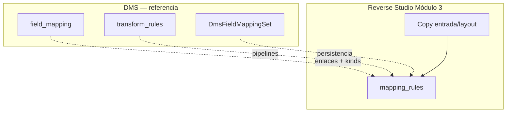
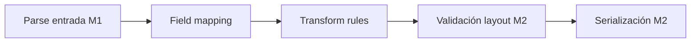
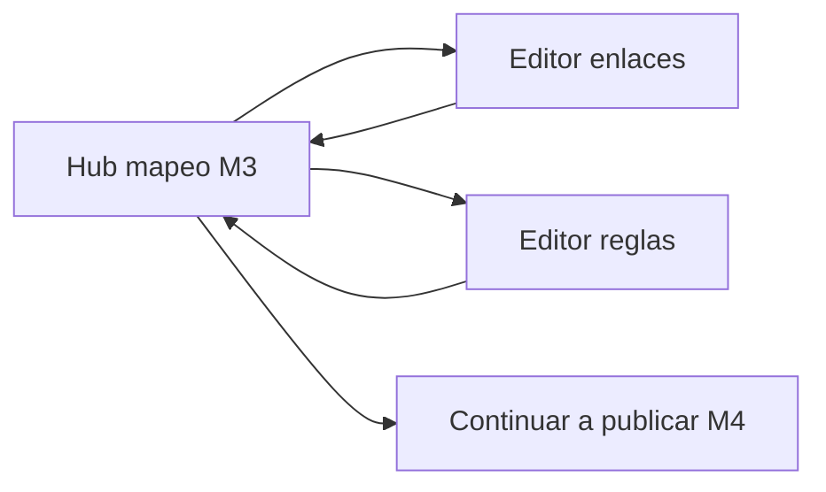

# Mapping rules — Reverse Studio Módulo 3

Proceso y especificación del **Módulo 3** de Reverse Studio: **enlazar** campos de la planilla (entrada) con campos del layout de envío (salida) y declarar **reglas de transformación** sobre el valor resuelto.

> Estado: **implementado** (Módulo 3 — mapeo + reglas).  
> Producto: [`../REVERSE_STUDIO.md`](../REVERSE_STUDIO.md).  
> Rama: `feature/reverse-studio`.  
> Código: `apps/reverse_studio/mapping/` · `templates/reverse_studio/mapping/` · prototipos `prototype/reverse_studio/mapping/`.  
> Base técnica: [`../definition_app_DMS/field_mapping.md`](../definition_app_DMS/field_mapping.md) + [`../definition_app_DMS/transform_rules.md`](../definition_app_DMS/transform_rules.md).  
> **Prerrequisito de producto:** Módulos 1 (entrada) y 2 (salida) implementados.  
> **No incluye** publicar ni generación (módulos 4–5).  
> Familia §2: [`../APP_FACTORY_HIGH_REUSE.md`](../APP_FACTORY_HIGH_REUSE.md).

---

## Propósito

Permitir que el diseñador diga, sin programar, **de dónde sale cada campo del archivo del banco/ERP** y **cómo se limpia/transforma** el valor antes de serializar.

El resultado es el conjunto `mappings[]` (con `transform_pipeline` por destino) en el borrador de la versión. Más adelante:

- el Módulo 4 publica entrada + salida + mapeo (+ reglas);
- el Módulo 5 aplica parse → map → rules → serialize al generar el archivo descargable.

Sin mapeo usable (y definición publicada), no hay emisión.

---

## Qué es / qué hace / qué no hace

| Pregunta | Respuesta |
|----------|-----------|
| **¿Qué es?** | El asistente de **enlaces** entrada→layout + **pipelines** de transformación |
| **¿Qué hace?** | Persiste `DmsFieldMappingSet` (o equivalente) en la versión `KIND_REVERSE` |
| **¿Qué no hace?** | No redefine campos de entrada/salida; no publica; no sube planillas ni escribe bytes |
| **Copy UX** | “Entrada → layout de envío” / “mapeo” / “reglas” — **no** “origen → destino” (FilePipe) |

---

## Relación con DMS Field mapping + Transform rules

En FilePipe son **dos módulos de producto** (`/mapeo/` y `/reglas/`). En Reverse Studio el producto los agrupa como **un solo módulo (M3)** con dos áreas de UI, reutilizando el mismo motor y persistencia.

| Tema | Decisión Reverse |
|------|------------------|
| Persistencia | Misma: `mappings[]` + `transform_pipeline` por `target_field` |
| Kinds de enlace | Reusar todos los MVP DMS: `direct`, `constant`, `concat`, `split`, `expression`, `generated` |
| Ops de reglas | Reusar catálogo `TransformOperation` (trim, upper, date_format, replace_map, …) |
| UI | Skin Reverse; dos hubs/editores bajo `/mapeo/` (enlaces + reglas) |
| Completitud | Obligatorios del layout cubiertos por mapeo, `generated`/`constant`, o `default_value` en salida |
| Sugerencias | CTA «Sugerir enlaces por nombre» (`suggest_direct_mappings`) — útil tras «Cargar desde entrada» en M2 |
| Post-módulo | CTA a **Publicar** (M4), no a generar |



### Posición en el pipeline de emisión



---

## Alcance de este documento

| Incluido | Excluido (otro módulo / app) |
|----------|------------------------------|
| Enlace entrada → campo layout | Contrato de entrada (M1) / salida (M2) |
| Kinds: direct, constant, concat, split, expression, generated | Publicar definición (M4) |
| `transform_pipeline` por campo layout | Subir planilla y generar (M5) |
| Completitud de obligatorios | Historial (M6) / FILE GATE (M7) |
| Preview de valor (fila muestra) en borrador | FilePipe genérico |
| Hub + editores (mapeo y reglas) | |

---

## Responsabilidades

| Sí | No |
|----|-----|
| Relacionar `name` de entrada con `name` de layout | Crear/borrar campos de M1/M2 |
| Constantes, concat, generadores, expresiones | Ejecutar job de emisión |
| Pipelines `trim` / `upper` / `date_format` / … | Congelar versión publicada |
| Marcar progreso y bloqueos suaves/duros de prerrequisito | Validar FILE GATE |

---

## Proceso (UX del módulo)

El usuario entra al **hub de mapeo** del proyecto. Desde ahí abre:

1. **Editor de enlaces** — panel entrada | panel layout | tabla de mapeos.
2. **Editor de reglas** — pipeline por campo del layout (requiere al menos un mapeo).



| Pantalla | Equivalente DMS | Contenido Reverse |
|----------|-----------------|-------------------|
| Hub mapeo | `field_mapping/hub` (+ resumen reglas) | Stats: mapeos, entrada→layout, obligatorios sin mapear, pipelines con pasos |
| Editor enlaces | `field_mapping/editor` | Drag/asignar; kinds; preview |
| Hub reglas *(opcional integrado)* | `transform_rules/hub` | Lista campos con/sin reglas |
| Editor reglas | `transform_rules/editor` | Ordenar ops del catálogo |
| Ayudas | `*_help` | Copy emisor |

### Diferencias de producto vs FilePipe

| Tema | Reverse Studio |
|------|----------------|
| Copy | «Planilla / entrada» y «layout de envío» — nunca «origen/destino» en UI |
| Prerrequisito | Aviso suave si M1 o M2 incompletos; **bloqueo de editor** si no hay campos de entrada o de layout |
| Completitud MVP | `unmapped_required == 0` para marcar M3 “listo” hacia publicar |
| Auto-sugerir | Botón «Sugerir por nombre» (mismo `name` entrada/layout) |
| Publicar | **No** en este módulo (M4) |
| Generar | **No** (M5); CTA deshabilitado si se muestra |
| Rutas | `/app/reverse-studio/proyectos/<slug>/mapeo/` (+ `/reglas/` o subrutas) |

---

## Flujo de usuario

1. Completar (recomendado) entrada 6/6 y salida 6/6.
2. Abrir **Mapeo** desde hub del proyecto o CTA de salida.
3. Si faltan campos: ir a entrada/salida; si hay campos: abrir editor de enlaces.
4. Crear mapeos (`direct` por arrastre o sugerencia; `constant`/`generated` para campos del banco sin columna en Excel).
5. Opcional: abrir reglas → `trim` / `upper` / `date_format` / `replace_map` donde haga falta.
6. Volver al hub → CTA **Continuar a publicar** (M4, placeholder hasta implementar).

---

## Reglas de negocio (módulo 3)

| ID | Regla |
|----|-------|
| MAP1 | Solo `PA` / `ED` editan mapeo y reglas. |
| MAP2 | Edición en **borrador** de la versión del proyecto. |
| MAP3 | Un solo mapeo activo por `target_field` (salvo patrón `split` 1:N como DMS). |
| MAP4 | `target_field` debe existir en el contrato de salida; `source_fields` en el de entrada cuando aplica. |
| MAP5 | Campos `required` del layout sin mapeo ni `default_value` → **error** en modo strict (M4); **advertencia** en borrador. |
| MAP6 | Tenant: membresía / visibilidad Reverse. |
| MAP7 | Completar M3 no habilita generar: falta publicar (M4). |
| MAP8 | No se ejecuta motor de job en este módulo (preview de muestra sí, como DMS). |
| MAP9 | `generated` / `constant` no requieren campo de entrada. |
| MAP10 | Reglas viven en `transform_pipeline` del mismo registro de mapeo (sin modelo Django aparte). |
| MAP11 | Aviso suave en hub si entrada o salida &lt; 6/6; editor bloqueado sin campos. |

---

## Validaciones al guardar

Reusar matrices de [`field_mapping.md`](../definition_app_DMS/field_mapping.md) § Validaciones y [`transform_rules.md`](../definition_app_DMS/transform_rules.md), con copy Reverse:

| Regla | Cuándo | Severidad |
|-------|--------|-----------|
| `target_field` inexistente en layout | Guardar | **Error** |
| `source_fields` inexistentes en entrada | Guardar | **Error** |
| `direct` sin origen | Guardar | **Error** |
| `constant` sin `value` | Guardar | **Error** |
| `concat` sin `parts` | Guardar | **Error** |
| `generated` sin `generator.type` | Guardar | **Error** |
| `expression` inválida / profundidad | Guardar | **Error** |
| Op de pipeline desconocida / params | Guardar | **Error** |
| Obligatorio layout sin mapeo | Borrador | **Advertencia** |
| Obligatorio layout sin mapeo | Strict (M4) | **Error** |
| Entrada sin usar | Guardar | **Advertencia** (informativa) |

Canal UI: ampliar [`UI_MESSAGES.md`](../definition_app/UI_MESSAGES.md) §3.10 bloque Módulo 3 al implementar.

### Errores en ejecución (referencia M5)

Delegar a códigos del motor DMS al aplicar mapeo/reglas (p. ej. expresión inválida, divide-by-zero, op fallida). No se implementan en M3.

---

## Modelo de datos (reuso)

| Artefacto | Uso |
|-----------|-----|
| `DmsFieldMappingSet` | Contenedor `mappings[]` en la versión |
| `FieldMapping` (JSON) | `target_field`, `mapping_kind`, `source_fields`, `parts`, `value`, `expression`, `generator`, `split`, `transform_pipeline` |
| `TransformOperation` | Catálogo de `op` |
| `ValueGeneratorType` | Catálogo de generadores |

Semántica completa: docs DMS citados. No duplicar esquemas en este archivo.

### Fragmento ejemplo (nómina → TXT banco)

```json
{
  "mappings": [
    {
      "target_field": "documento",
      "mapping_kind": "direct",
      "source_fields": ["documento"],
      "transform_pipeline": [{"op": "trim"}]
    },
    {
      "target_field": "nombre",
      "mapping_kind": "direct",
      "source_fields": ["nombre"],
      "transform_pipeline": [{"op": "trim"}, {"op": "upper"}]
    },
    {
      "target_field": "monto",
      "mapping_kind": "direct",
      "source_fields": ["monto"],
      "transform_pipeline": []
    },
    {
      "target_field": "linea",
      "mapping_kind": "generated",
      "generator": {"type": "sequence_alphanumeric", "prefix": "A", "start": 1},
      "transform_pipeline": []
    }
  ]
}
```

---

## Pantallas (prototipo → template)

| Prototipo | Template definitivo | Nota |
|-----------|---------------------|------|
| `mapping/hub.html` | `templates/reverse_studio/mapping/hub.html` | Stats + cards enlaces/reglas; CTA publicar placeholder |
| `mapping/hub_help.html` | `…/hub_help.html` | |
| `mapping/_project_scope.html` | parcial | |
| `mapping/editor.html` | `…/editor.html` | Enlaces entrada→layout |
| `mapping/editor_help.html` | `…/editor_help.html` | |
| `mapping/rules_hub.html` | `…/rules_hub.html` | Resumen pipelines |
| `mapping/rules_hub_help.html` | `…/rules_hub_help.html` | |
| `mapping/rules_editor.html` | `…/rules_editor.html` | Editor pipelines |
| `mapping/rules_editor_help.html` | `…/rules_editor_help.html` | |
| `mapping/_persistence.html` | parcial | URLs save Reverse |

Prefijo: `prototype/reverse_studio/`.

**Assets a reutilizar al implementar:** `field_mapping.css` / `transform_rules.css`, JS de editor mapeo/reglas/preview DMS, con skin copy Reverse.

Abrir demo: `prototype/reverse_studio/mapping/hub.html`.

---

## Casos de uso (módulo 3)

### RS-MAP01 — Enlace directo tras «Cargar desde entrada»

| | |
|---|---|
| **Flujo** | M2 sembrado documento/nombre/monto → sugerir por nombre → 3 `direct` |
| **Resultado** | Obligatorios cubiertos; listo a reglas/publicar |

### RS-MAP02 — Campo de banco sin columna en Excel

| | |
|---|---|
| **Flujo** | Layout exige `codigo_empresa` → mapeo `constant` = `"001"` |
| **Resultado** | Campo cubierto sin entrada |

### RS-MAP03 — Correlativo de línea

| | |
|---|---|
| **Flujo** | `generated` / `sequence_alphanumeric` → `linea` |
| **Resultado** | A1, A2… en M5 |

### RS-MAP04 — Normalizar nombre

| | |
|---|---|
| **Flujo** | Reglas `trim` + `upper` en `nombre` |
| **Resultado** | Pipeline en el mismo registro de mapeo |

### RS-MAP05 — Intentar mapear sin salida

| | |
|---|---|
| **Flujo** | Abrir editor sin campos de layout |
| **Resultado** | Bloqueo + enlace a salida (MAP11) |

### RS-MAP06 — Mapeo completo sin publicar

| | |
|---|---|
| **Flujo** | Completa enlaces; intenta generar |
| **Resultado** | Bloqueo UX/servidor (MAP7): falta M4 |

---

## Criterios de “módulo 3 completo” (definición)

- [x] Propósito y frontera con M1–M2 / M4–M5 claros
- [x] Relación DMS field_mapping + transform_rules documentada
- [x] Reglas MAP1–MAP11 + validaciones
- [x] Casos RS-MAP01–MAP06
- [x] Mapa prototipo → template
- [x] Prototipos HTML listos para revisión
- [x] Prototipos revisados / OK implícito («Desarrolla el módulo»)
- [x] Usuario: «Desarrolla el módulo»

Checklist al implementar:

- [x] `apps/reverse_studio/mapping/` + templates (reuso servicios DMS)
- [x] Hub proyecto: paso Mapeo activo + aviso si M1/M2 incompletos
- [x] Editor enlaces + sugerir por nombre
- [x] Hub/editor reglas
- [x] Copy / ayudas
- [x] UI_MESSAGES §3.10 bloque Módulo 3
- [x] CTA a publicar sin generate aislado

---

## Implementación (referencia)

| Pieza | Ubicación |
|-------|-----------|
| App | `apps/reverse_studio/mapping/` |
| Templates | `templates/reverse_studio/mapping/` (+ `rules/`) |
| Persistencia | `field_mapping_persistence_service` + `transform_rules_persistence_service` |
| URLs | `/app/reverse-studio/proyectos/<slug>/mapeo/` · `…/mapeo/reglas/` |

---

## Próximos pasos

1. Abrir Módulo 4 [`publish.md`](publish.md) (publicar definición).
2. Revisar en UI: entrada → salida → mapeo/reglas → hub.
3. No merge a `main` / Railway hasta MVP revisado.

---

## Referencias

| Documento | Uso |
|-----------|-----|
| [`../REVERSE_STUDIO.md`](../REVERSE_STUDIO.md) | Producto / matriz roles |
| [`input_definition.md`](input_definition.md) | M1 — campos de entrada |
| [`output_definition.md`](output_definition.md) | M2 — campos de layout |
| [`../definition_app_DMS/field_mapping.md`](../definition_app_DMS/field_mapping.md) | Kinds, validaciones, UI |
| [`../definition_app_DMS/transform_rules.md`](../definition_app_DMS/transform_rules.md) | Ops, pipelines |
| [`../definition_app/UI_MESSAGES.md`](../definition_app/UI_MESSAGES.md) | Mensajes §3.10 |
| [`README.md`](README.md) | Índice |

---

*Documento: `docs/definition_app_REVERSE/mapping_rules.md` — Módulo 3 Reverse Studio (mapeo + reglas). Implementado en `apps/reverse_studio/mapping/`.*
