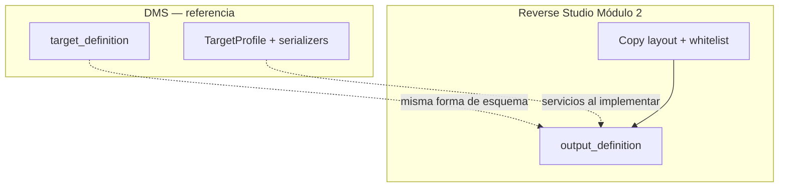
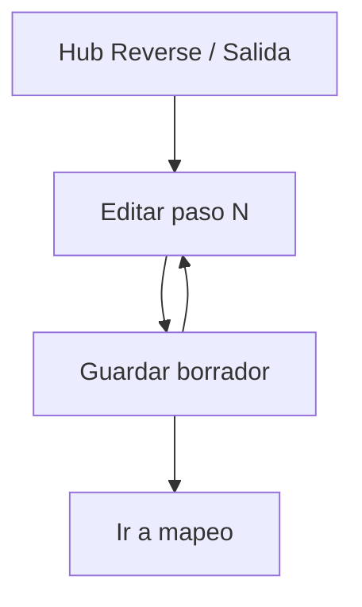

# Output definition — Reverse Studio Módulo 2

Proceso y especificación del **Módulo 2** de Reverse Studio: definir el **contrato de salida** (layout de envío que exige el banco/ERP) y persistirlo como perfil reutilizable.

> Estado: **implementado** (Módulo 2 — contrato de salida / layout de envío).  
> Producto: [`../REVERSE_STUDIO.md`](../REVERSE_STUDIO.md).  
> Rama: `feature/reverse-studio`.  
> Código: `apps/reverse_studio/output/` · `templates/reverse_studio/output/` · prototipos `prototype/reverse_studio/output/`.  
> Base técnica: [`../definition_app_DMS/target_definition.md`](../definition_app_DMS/target_definition.md) (`DmsTargetProfile`, catálogos, `save_target`).  
> **Prerrequisito de producto:** Módulo 1 (entrada) implementado.  
> **No incluye** mapeo, publicar ni generación (módulos 3–5).  
> Familia §2: [`../APP_FACTORY_HIGH_REUSE.md`](../APP_FACTORY_HIGH_REUSE.md).

---

## Propósito

Permitir que el diseñador configure **paso a paso** cómo debe **escribirse** el archivo que recibe el banco, el ERP o el proveedor, sin programar.

El resultado es un **contrato de salida** (layout de envío) versionable. Más adelante:

- el Módulo 3 mapea campos de entrada → campos de este layout;
- el Módulo 4 publica la definición completa (entrada + salida + mapeo);
- el Módulo 5 **serializa** contra este contrato al generar el archivo descargable.

Sin un contrato de salida completo (y una definición publicada que lo incluya), no hay archivo de envío.

---

## Qué es / qué hace / qué no hace

| Pregunta | Respuesta |
|----------|-----------|
| **¿Qué es?** | El asistente que describe el layout rígido de salida (posiciones, JSON/XML, encoding, serialización) |
| **¿Qué hace?** | Persiste un `TargetProfile` (o equivalente) acotado a tipos “rígidos” del MVP |
| **¿Qué no hace?** | No lee la planilla; no mapea; no genera bytes de producción (eso es Módulo 5); no publica solo |
| **Copy UX** | “Layout de envío” / “contrato de salida” / “archivo del receptor” — **no** “destino para transformar” (FilePipe) |

---

## Relación con DMS Target definition

| Tema | Decisión |
|------|----------|
| Pasos del asistente | **Mismos 6 pasos** conceptuales que destino DMS |
| Catálogos | Reusar `TargetFileType`, `CharsetEncoding`, `LineEnding`, `TargetFieldDataType` |
| Forma del JSON | Alineada a `target` de `TargetProfile` |
| Whitelist MVP | Solo tipos **rígidos de emisión**: `txt_fixed`, `json`, `xml` |
| UX / copy | Hub Reverse Studio · “layout / envío”, no hub FilePipe |
| Persistencia | `Project.KIND_REVERSE` + `DmsTargetProfile` en la misma `DmsMappingVersion` |
| Código a reutilizar | Catálogos, normalización, `save_target`, JS/CSS de TargetProfile con skin Reverse |
| Importar desde entrada | Reutilizar `import_fields_from_source` (útil: sembrar campos destino desde planilla) |



### Tipos de salida permitidos (MVP)

| Código | Nombre | ¿Permitido en Reverse MVP? |
|--------|--------|----------------------------|
| `txt_fixed` | TXT posicional | **Sí** (caso estrella: banco / legacy) |
| `json` | JSON | **Sí** |
| `xml` | XML | **Sí** |
| `txt_delimited` | TXT delimitado | **No** (MVP) — usar FilePipe si hace falta |
| `csv` | CSV | **No** (MVP) — la planilla ya es entrada |
| `xlsx` | Excel | **No** (MVP) — la planilla ya es entrada |

**Regla OUT3:** la UI solo ofrece la whitelist. Si llega un `file_type_code` fuera de lista (API/payload), el servidor rechaza el guardado.

> **Nota de producto:** emitir CSV/Excel como “salida” no es el valor de Reverse Studio (eso ya lo tiene el negocio). El diferenciador es **planilla fácil → layout rígido**.

---

## Alcance de este documento

| Incluido | Excluido (otro módulo / app) |
|----------|------------------------------|
| Tipo de layout (whitelist), encoding, line ending | Contrato de entrada / SourceProfile (Módulo 1) |
| Layout de archivo (record length, root JSON/XML, …) | Mapeo entrada → salida (Módulo 3) |
| Campos destino y data_types | Publicar definición completa (Módulo 4) |
| Reglas de serialización (padding, truncate, fechas) | Subir planilla y generar (Módulo 5) |
| Política de validación al escribir | Historial (Módulo 6) |
| Borrador del perfil de salida | Pre-check FILE GATE (Módulo 7) |
| Hub / pasos de salida | FilePipe genérico / FILE GATE |

---

## Responsabilidades

| Sí | No |
|----|-----|
| Asistente 6 pasos del **contrato de salida** | Parsear la planilla de entrada |
| Definir campos del layout que el receptor espera | Definir reglas de transformación de negocio (M3) |
| Configurar serialización y write_validation | Ejecutar job de emisión |
| Persistir borrador de salida en la versión | Conciliar dos archivos |

---

## Proceso (asistente paso a paso)

El usuario recorre **6 pasos** en orden. Cada paso persiste borrador; puede volver atrás.


| Paso | Título UX Reverse Studio | Equivalente DMS | Contenido |
|------|--------------------------|-----------------|-----------|
| 1 | Tipo de layout de envío | Paso 1 destino | Whitelist `txt_fixed` / `json` / `xml` |
| 2 | Codificación de salida | Paso 2 | `encoding_code`, `line_ending_code` (sin `auto` preferible) |
| 3 | Estructura del archivo | Paso 3 | `layout` (record_length, root JSON/XML, filename pattern, BOM…) |
| 4 | Campos del layout | Paso 4 | fields (posicional / json / xml); sin variantes csv/xlsx de salida |
| 5 | Serialización | Paso 5 | `serialization` (padding, truncate, formatos) |
| 6 | Validación al escribir | Paso 6 | `write_validation` (reject_row / abort / truncate…) |

Detalle de modos, parámetros JSON y semántica: **delegar a** [`target_definition.md`](../definition_app_DMS/target_definition.md) §§ Pasos 1–6, salvo las diferencias de este doc.

### Diferencias de producto vs DMS / entrada Reverse

| Paso | Diferencia Reverse Studio |
|------|---------------------------|
| Todos | Eyebrow / títulos: “layout de envío”, “archivo del receptor”, “emisión” — no “destino para transformar” |
| Partials / assets | Espejo DMS: `_project_scope`, `_wizard_stepper`, `_target_persistence`; CSS/JS `target_profile*` con skin Reverse |
| 1 | **Solo** tres tipos rígidos; ocultar csv / xlsx / delimitado como salida |
| 2 | **Igual que DMS destino:** filtrar/ocultar `auto` en encoding y line ending (escritura explícita para el receptor) |
| 3 | Una sola pantalla `step3_layout` con paneles por `layout_variant` (`fixed` / `json` / `xml`). Énfasis en `output_filename_pattern` (descarga M5) y `record_length` en posicional |
| 4 | Variantes de template: `step4_fields.html` (fixed), `step4_fields_json.html`, `step4_fields_xml.html`. **Sin** `_delimited` / `_xlsx` |
| 4 | CTA: **Cargar desde entrada** (copy Reverse; URL/servicio = `import_fields_from_source` DMS). Sembrar `name`/`label`/`data_type`; usuario completa posiciones o `path` |
| 4 | `name` estable = clave de mapeo (M3). Entrada usa `content_type`; salida usa `data_type` — el puente es el mapeo, no este módulo |
| 5 | Defaults recomendados posicional: `trim_before_write: true` + pad por campo; `default_truncate: error` en layouts bancarios (evitar archivos “casi correctos”) |
| 6 | Políticas por escenario (`policy`, `on_type_mismatch`, `on_length_exceeded`, `on_required_empty`) como DMS; copy: “al generar el archivo de envío”, no “gate FILE GATE” |
| Post-6 | CTA principal: **Continuar a mapeo** (Módulo 3), no “Publicar” (Módulo 4) |

### Notas de producto

| Tema | Decisión Reverse |
|------|------------------|
| Relación con M1 | Salida editable aunque entrada incompleta; hub proyecto: **aviso suave** si M1 no está 6/6 (“recomendado completar planilla primero”) |
| Cargar desde entrada | Requiere SourceProfile con campos; si no hay, mensaje claro (no inventar demo). Copy: “entrada / planilla”, no “origen” |
| Publicar solo salida | **No.** Congela en M4 junto con entrada + mapeo |
| Generación usa | Solo versión `published` (M4); borrador de M2 no habilita M5 |
| Preview de línea generada | **Fuera de M2** — dry run / M5 (igual criterio DMS § Consideraciones) |
| Campos calculados / constantes | Fuera de M2 — viven en mapeo/reglas (M3) |
| CSV/Excel como salida | Fuera de MVP; derivar a FilePipe |
| `trim_before_write` vs pad | Trim ocurre **antes** del pad posicional; suele ser deseable. No confundir con `trim_lines` de **lectura** (M1) |

---

## Flujo de usuario (módulo 2)



1. Abrir proyecto Reverse Studio → sección **Salida / Layout de envío**.
2. Ver progreso 0–6 del contrato de salida y versión (borrador).
3. Entrar a un paso → ajustar → guardar borrador (o Guardar y continuar).
4. Al completar los 6 pasos → CTA hacia **Mapeo** (Módulo 3).
5. La **publicación** de la definición completa ocurre en Módulo 4.

---

## Reglas de negocio (módulo 2)

| ID | Regla |
|----|-------|
| OUT1 | Solo `PA` / `ED` editan el contrato de salida. |
| OUT2 | La edición ocurre en el **borrador** de la versión del proyecto. |
| OUT3 | `file_type_code` debe estar en la whitelist MVP (`txt_fixed`, `json`, `xml`). UI solo ofrece esos; servidor rechaza fuera de lista. |
| OUT4 | Cambiar el tipo de layout con campos ya definidos: advertencia fuerte; confirmar o limpiar campos (espíritu DMS). |
| OUT5 | Validación de borrador: mismas reglas base que destino DMS en modo no-strict al guardar paso; **strict** al publicar definición (Módulo 4). |
| OUT6 | Tenant: solo miembros del proyecto / visibilidad según lifecycle Reverse. |
| OUT7 | Completar Módulo 2 no basta para generar: faltan mapeo (M3) y publicar (M4); entrada (M1) debe estar usable. |
| OUT8 | El hub de salida marca pasos `done` / `draft` / `pending` como TargetProfile / entrada Reverse. |
| OUT9 | No se implementa lógica de generación en este módulo. |
| OUT10 | Al publicar definición (M4): al menos un campo destino; tipo de layout obligatorio; posicional: rangos sin solape (matriz DMS). |
| OUT11 | Paso 2: no admitir encoding/line ending `auto` (escritura explícita; alineado a UI DMS destino). |

---

## Validaciones al guardar / al publicar definición

Reusar la matriz de [`target_definition.md`](../definition_app_DMS/target_definition.md) § Validaciones al guardar, **restringida a tipos whitelist**, más:

| Regla extra Reverse | Cuándo | Severidad |
|---------------------|--------|-----------|
| `file_type_code` ∉ `{txt_fixed, json, xml}` | Guardar cualquier paso / API | **Error** (OUT3) |
| Sin tipo de layout | Strict (M4) | **Error** |
| Al menos un campo destino | Strict (M4) / matriz DMS | **Error** |
| Nombres de campo no únicos | Guardar / strict | **Error** |
| `txt_fixed`: sin `start`/`end` ni `length` | Strict (M4) | **Error** |
| `txt_fixed`: solape de rangos | Guardar paso 4 / strict | **Error** |
| `txt_fixed`: `start` > `end` | Guardar / strict | **Error** |
| `txt_fixed`: coherencia con `record_length` | Guardar / strict | **Error** o **Advertencia** (política DMS vigente) |
| `json`: `root_type` vacío | Strict (M4) | **Error** |
| `xml`: `root_element` / `record_element` vacíos | Strict (M4) | **Error** |
| `write_validation.policy` vacío | Strict (M4) | Default `reject_row` o **Error** |
| `required` sin `default_value` y política `use_default` | Guardar | **Advertencia** (matriz DMS) |
| Encoding / line ending = `auto` | Guardar paso 2 | **Error** o rechazo (escritura debe ser explícita) |

Canal UI: [`UI_MESSAGES.md`](../definition_app/UI_MESSAGES.md); al implementar, ampliar §3.10 Reverse (bloque Módulo 2).

**Implementación prevista:** reusar `validate_target_dict(..., strict=)` + filtro whitelist previo (mismo patrón que entrada / `save_source`).

### Errores en ejecución (referencia M5)

Códigos estables del motor al serializar (no se implementan en M2; documentados para coherencia de producto):

| Código | Descripción |
|--------|-------------|
| `TARGET_REQUIRED_EMPTY` | Campo obligatorio sin valor |
| `TARGET_TYPE_MISMATCH` | Valor no convertible a `data_type` |
| `TARGET_LENGTH_EXCEEDED` | Supera `max_length` y política no permite truncar |
| `TARGET_RECORD_LENGTH_OVERFLOW` | Línea posicional excede `record_length` |
| `TARGET_PATTERN_MISMATCH` | No cumple regex del campo |
| `TARGET_SERIALIZATION_ERROR` | Fallo al formatear (fecha inválida, etc.) |

Fuente: [`target_definition.md`](../definition_app_DMS/target_definition.md) § Errores en ejecución.

---

## Modelo de datos (reuso)

Preferencia: **reutilizar** `DmsTargetProfile` dentro de `DmsMappingVersion` del proyecto `kind=reverse`.

| Concepto Reverse | Artefacto DMS | Notas |
|------------------|---------------|-------|
| Contrato de salida | `DmsTargetProfile` (JSON `target`) | Forma alineada a DMS |
| Versión borrador / publicada | `DmsMappingVersion` | Misma versión que entrada (M1) y mapeo (M3) |
| Congelar salida | Snapshot dentro de publish M4 | **No** hay publish solo-salida |

### Parámetros `layout` por tipo (whitelist)

| Tipo | Claves `layout` relevantes |
|------|----------------------------|
| `txt_fixed` | `record_length`, `trailing_newline`, `output_filename_pattern`, `include_bom` |
| `json` | `root_type`, `records_path`, `pretty_print`, `indent`, `output_filename_pattern` |
| `xml` | `root_element`, `record_element`, `namespace`, `declaration`, `output_filename_pattern` |

Campos: propiedades comunes DMS (`name`, `label`, `data_type`, `required`, `order`, `max_length`, `default_value`, `pattern`) + `target_meta` (posiciones / path).

---

## JSON de ejemplo (salida posicional)

```json
{
  "file_type_code": "txt_fixed",
  "encoding_code": "latin-1",
  "encoding_custom": null,
  "line_ending_code": "crlf",
  "line_ending_custom": null,
  "layout": {
    "record_length": 52,
    "trailing_newline": true,
    "output_filename_pattern": "pagos_{date:%Y%m%d}.txt",
    "include_bom": false
  },
  "fields": [
    {
      "name": "documento",
      "label": "Documento",
      "data_type": "string",
      "required": true,
      "order": 1,
      "max_length": 10,
      "start": 1,
      "end": 10,
      "align": "right",
      "pad_char": "0"
    },
    {
      "name": "nombre",
      "label": "Nombre",
      "data_type": "string",
      "required": true,
      "order": 2,
      "max_length": 30,
      "start": 11,
      "end": 40,
      "align": "left",
      "pad_char": " "
    },
    {
      "name": "monto",
      "label": "Monto",
      "data_type": "integer",
      "required": true,
      "order": 3,
      "max_length": 12,
      "start": 41,
      "end": 52,
      "align": "right",
      "pad_char": "0"
    }
  ],
  "serialization": {
    "trim_before_write": true,
    "default_truncate": "error",
    "null_representation": ""
  },
  "write_validation": {
    "policy": "reject_row",
    "on_type_mismatch": "reject_row",
    "on_length_exceeded": "reject_row",
    "on_required_empty": "reject_row"
  }
}
```

> Semántica completa: [`target_definition.md`](../definition_app_DMS/target_definition.md).

---

## Pantallas (prototipo → template)

Misma estructura de carpetas que la app (`output/`). Espejo de `templates/dms/target_profile/` (sin variantes delimited/xlsx).

| Prototipo | Template definitivo | Nota vs DMS |
|-----------|---------------------|-------------|
| `output/hub.html` | `templates/reverse_studio/output/hub.html` | Sin publish; CTA a mapeo si 6/6 |
| `output/hub_help.html` | `…/hub_help.html` | Copy layout de envío |
| `output/_project_scope.html` | parcial | Scope kind `reverse` |
| `output/_wizard_stepper.html` | parcial | URLs `reverse_studio:output_step*` |
| `output/_target_persistence.html` | parcial | `target_save_url` Reverse |
| `output/step1_file_type.html` | `…/step1_file_type.html` | Solo whitelist |
| `output/step1_help.html` | `…/step1_help.html` | |
| `output/step2_encoding.html` | `…/step2_encoding.html` | Sin `auto` |
| `output/step2_help.html` | `…/step2_help.html` | |
| `output/step3_layout.html` | `…/step3_layout.html` | Paneles fixed/json/xml |
| `output/step3_help.html` | `…/step3_help.html` | |
| `output/step4_fields.html` | `…/step4_fields.html` | Posicional + “Cargar desde entrada” |
| `output/step4_fields_json.html` | `…/step4_fields_json.html` | |
| `output/step4_fields_xml.html` | `…/step4_fields_xml.html` | |
| `output/step4_help.html` | `…/step4_help.html` | |
| `output/step5_serialization.html` | `…/step5_serialization.html` | |
| `output/step5_help.html` | `…/step5_help.html` | |
| `output/step6_write_validation.html` | `…/step6_write_validation.html` | Sin publish; Finalizar → hub |
| `output/step6_help.html` | `…/step6_help.html` | |

Prefijo de rutas prototipo: `prototype/reverse_studio/`.

**Assets a reutilizar al implementar:** `static/css/target_profile.css`, `static/js/target_profile-persistence.js`, `target_profile-fields*.js`, `target_profile-import-source-fields.js`, JS de pasos layout/serialization (skin copy Reverse).

Abrir en navegador (sin Django, tras prototipar): `prototype/reverse_studio/output/hub.html`.

---

## Casos de uso (módulo 2)

### RS-OUT01 — TXT posicional de pagos bancarios

| | |
|---|---|
| **Actor** | Diseñador (`PA`) |
| **Flujo** | Hub salida → Paso 1 `txt_fixed` + latin-1/crlf → layout `record_length` 52 → campos documento/nombre/monto con posiciones → serialización pad → write `reject_row` |
| **Resultado** | Salida completa en borrador; CTA a mapeo; **no** genera archivo |

### RS-OUT02 — Intentar CSV como salida

| | |
|---|---|
| **Flujo** | Paso 1: usuario intenta `csv` (UI deshabilitada) o API envía `csv` |
| **Resultado** | UI bloquea; servidor rechaza con OUT3 |

### RS-OUT03 — Cambiar de posicional a JSON con campos definidos

| | |
|---|---|
| **Flujo** | Había campos `txt_fixed`; cambia a `json` |
| **Resultado** | Advertencia OUT4; campos se invalidan o se piden redefinir (paths) |

### RS-OUT04 — Cargar desde entrada

| | |
|---|---|
| **Flujo** | Entrada ya tiene documento/nombre/monto → Paso 4 «Cargar desde entrada» |
| **Resultado** | Campos destino con mismos `name`; usuario completa start/end o path (espejo DMS “Cargar desde origen”) |

### RS-OUT05 — Salida completa sin mapeo/publicar

| | |
|---|---|
| **Flujo** | Completa 6 pasos de salida; intenta “Generar” |
| **Resultado** | Bloqueo UX + servidor (OUT7): faltan M3–M4 |

### RS-OUT06 — Longitud excedida con política reject

| | |
|---|---|
| **Actor** | Diseñador |
| **Flujo** | Campo `nombre` `max_length` 30; `on_length_exceeded: reject_row` |
| **Resultado** | En M5: filas con nombre largo → `TARGET_LENGTH_EXCEEDED`; no corrompen el archivo (espíritu TD-04) |

---

## Criterios de “módulo 2 completo” (definición)

- [x] Propósito y frontera con M1 / M3–M5 claros
- [x] Whitelist de tipos de salida documentada
- [x] Pasos 1–6 y diferencias UX vs DMS Target + plantillas `target_profile`
- [x] Reglas de negocio OUT1–OUT10 + validaciones + códigos TARGET_*
- [x] Casos de uso RS-OUT01–OUT06
- [x] Mapa prototipo → template (parciales + variantes paso 4)
- [x] Alineación revisada vs `target_definition.md` + `templates/dms/target_profile/`
- [x] Prototipos HTML listos para revisión
- [x] Prototipos revisados / OK implícito («Desarrolla el módulo»)
- [x] Usuario: «Desarrolla el módulo»

Checklist al implementar:

- [x] `templates/reverse_studio/output/` + servicios (reuso `target_profile` + filtro whitelist)
- [x] Enganche hub proyecto (paso Salida activo + aviso suave si M1 incompleto)
- [x] Paso 4: «Cargar desde entrada» (`import_fields_from_source`)
- [x] Copy / ayudas hub + pasos
- [x] Mensajes UI §3.10 bloque Módulo 2
- [x] CTA a mapeo sin publish aislado

---

## Implementación (referencia)

| Pieza | Ubicación |
|-------|-----------|
| App (salida) | `apps/reverse_studio/output/` |
| Templates | `templates/reverse_studio/output/` |
| Whitelist | `output_whitelist.OUTPUT_FILE_TYPE_WHITELIST` + filtro en `save_target` |
| Wizard | `output_wizard_service` (catálogo paso 1 filtrado) |
| Persistencia | `target_persistence_service.save_target` (mensajes reverse + OUT3/OUT11) |
| URLs | `/app/reverse-studio/proyectos/<slug>/salida/` |

---

## Próximos pasos

1. Abrir Módulo 3 [`mapping_rules.md`](mapping_rules.md) (mapeo entrada → salida).
2. Revisar en UI: entrada → 6 pasos salida → hub proyecto.
3. No merge a `main` / Railway hasta MVP revisado (ver `REVERSE_STUDIO.md`).

---

## Referencias

| Documento | Uso |
|-----------|-----|
| [`../REVERSE_STUDIO.md`](../REVERSE_STUDIO.md) | Producto / lineamientos |
| [`input_definition.md`](input_definition.md) | Módulo 1 (entrada) — espejo de ritual |
| [`../definition_app_DMS/target_definition.md`](../definition_app_DMS/target_definition.md) | Semántica de pasos, layout, fields, serialization, write_validation |
| [`../../templates/dms/target_profile/`](../../templates/dms/target_profile/) | UI de referencia (asistente 6 pasos) |
| [`../definition_app_DMS/system_catalogs.md`](../definition_app_DMS/system_catalogs.md) | Catálogos TargetFileType, encoding, data types |
| [`../definition_app/UI_MESSAGES.md`](../definition_app/UI_MESSAGES.md) | Mensajes §3.10 Reverse Studio |
| [`README.md`](README.md) | Índice definition_app_REVERSE |

---

*Documento: `docs/definition_app_REVERSE/output_definition.md` — Módulo 2 Reverse Studio (contrato de salida / layout de envío). Implementado en `apps/reverse_studio/output/`.*
