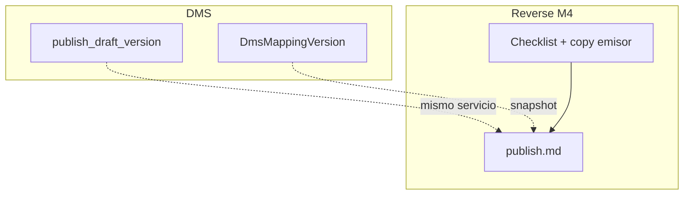
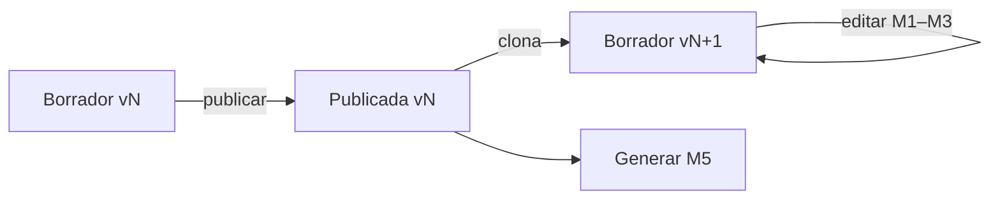
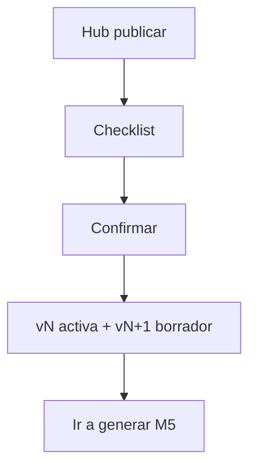

# Publish — Reverse Studio Módulo 4

Proceso y especificación del **Módulo 4** de Reverse Studio: **publicar** la definición completa (entrada + salida + mapeo + reglas) como versión inmutable contra la que se generarán archivos.

> Estado: **implementado** (Módulo 4 — publicar definición).  
> Producto: [`../REVERSE_STUDIO.md`](../REVERSE_STUDIO.md).  
> Rama: `feature/reverse-studio`.  
> Código: `apps/reverse_studio/publish/` · `templates/reverse_studio/publish/` · prototipos `prototype/reverse_studio/publish/`.  
> Base técnica: [`../definition_app_DMS/project_lifecycle.md`](../definition_app_DMS/project_lifecycle.md) + `version_publish_service.publish_draft_version`.  
> **Prerrequisito:** M1–M3 implementados (entrada, salida, mapeo).  
> **No incluye** subir planilla ni generar bytes (Módulo 5).  
> Familia §2: [`../APP_FACTORY_HIGH_REUSE.md`](../APP_FACTORY_HIGH_REUSE.md).

---

## Propósito

Congelar el **borrador** actual en una versión `published` y abrir un **nuevo borrador** editable. Las generaciones (M5) usan **solo** la versión publicada activa (`DmsProjectConfig.current_version`).

Sin publicar, no hay emisión de archivo de envío (RS2 / MAP7 / OUT7).

---

## Qué es / qué hace / qué no hace

| Pregunta | Respuesta |
|----------|-----------|
| **¿Qué es?** | El acto de publicar la definición completa del emisor |
| **¿Qué hace?** | Valida strict entrada+salida+mapeo(+reglas) → marca versión `published` → clona a nuevo draft |
| **¿Qué no hace?** | No ejecuta jobs; no sube Excel; no edita campos (eso es M1–M3 en borrador) |
| **Copy UX** | “Publicar definición” / “versión activa” — **no** “publicar origen” aislado |

---

## Relación con DMS publish

| Tema | Decisión Reverse |
|------|------------------|
| Motor | Reusar `version_publish_service.publish_draft_version` |
| Snapshot | Misma `DmsMappingVersion` (source + target + field_mapping_set) |
| Activa | `DmsProjectConfig.current_version` |
| Post-publish | Nuevo borrador con copia de perfiles/mapeos (igual DMS) |
| UI | Hub dedicado Reverse (checklist M1–M3 + CTA); no depender solo del hub FilePipe |
| Validación extra | Whitelist Reverse (entrada amigable / salida rígida) al publicar |
| Copy | entrada / layout / emisor |

### Ciclo de versiones

---

## Alcance

| Incluido | Excluido |
|----------|----------|
| Hub publicar + ayuda | Editar entrada/salida/mapeo (M1–M3) |
| Pre-check / checklist de completitud | Ejecutar generación (M5) |
| Acción publicar (POST) + mensajes | Historial de jobs (M6) |
| Mostrar versión activa y borrador | Archivar versiones (puede quedar en backlog) |
| Confirmación destructiva de producto | Publish “solo esquema” (FILE GATE) |

---

## Responsabilidades

| Sí | No |
|----|-----|
| Validar strict y congelar definición | Parsear planillas |
| Apuntar `current_version` | Serializar TXT/JSON/XML de producción |
| Crear nuevo borrador | Gestionar miembros |

---

## Proceso (UX)

1. Usuario completa M1–M3 en borrador.
2. Abre **Publicar** desde hub del proyecto o CTA de mapeo.
3. Ve checklist (entrada / salida / mapeo / reglas opcionales).
4. Si todo OK → confirma → publica → mensaje con vN publicada y vN+1 borrador.
5. CTA hacia **Generar** (M5, placeholder hasta implementar).

| Pantalla | Contenido |
|----------|-----------|
| `publish/hub.html` | Estado borrador vs activa; checklist; CTA publicar |
| `publish/hub_help.html` | Qué congela; quién puede; relación con M5 |
| Parcial `_project_scope` | Scope Reverse |

**No** es un wizard de 6 pasos: es una pantalla de decisión + confirmación.

---

## Checklist previo (UI + servidor)

| Ítem | Criterio “listo” | Bloquea publicar |
|------|------------------|------------------|
| Entrada | 6/6 pasos + campos; `file_type` ∈ whitelist entrada | **Sí** (strict source) |
| Salida | 6/6 + campos layout; tipo ∈ `txt_fixed`/`json`/`xml` | **Sí** (strict target) |
| Mapeo | Obligatorios del layout cubiertos (`is_mappings_complete`) | **Sí** (strict mappings) |
| Reglas | Pipelines válidos si existen (ops conocidas) | **Sí** si hay error; vacío OK |
| Roles | Actor `PA` o `ED` | **Sí** |

Aviso suave en hub si M1–M3 incompletos; botón publicar deshabilitado hasta checklist verde (o servidor rechaza).

---

## Reglas de negocio

| ID | Regla |
|----|-------|
| PUB1 | Solo `PA` / `ED` publican. |
| PUB2 | Publicar congela **entrada + salida + mapeo (+ reglas)** juntos — no hay publish parcial. |
| PUB3 | Generación (M5) usa solo `status=published` activa. |
| PUB4 | Tras publicar se crea borrador `version_number+1` con copia editable. |
| PUB5 | Validación **strict** al publicar (mismas matrices DMS + whitelist Reverse). |
| PUB6 | Tenant / membresía Reverse. |
| PUB7 | Confirmar con diálogo (`dwConfirmWarning`) antes del POST. |
| PUB8 | Republicar: el nuevo published sustituye `current_version`; el anterior queda `published` histórico (o se archiva según política DMS vigente). |
| PUB9 | Completar M4 no genera archivo; habilita M5. |
| PUB10 | Copy: “definición del emisor”, no “origen FilePipe”. |

---

## Validaciones al publicar

Reutilizar `publish_draft_version` (source/target/mappings strict). Añadir capa Reverse al implementar:

| Regla | Severidad |
|-------|-----------|
| Entrada `file_type` ∉ `{csv,xlsx,txt_delimited}` | **Error** |
| Salida `file_type` ∉ `{txt_fixed,json,xml}` | **Error** |
| Encoding/line ending salida `auto` | **Error** |
| Sin campos entrada o layout | **Error** |
| Mapeo incomplete / required sin fuente | **Error** |
| Pipeline con `op` inválida | **Error** |
| Sin borrador | **Error** |
| Sin permiso | **Error** forbidden |

Mensajes: ampliar [`UI_MESSAGES.md`](../definition_app/UI_MESSAGES.md) §3.10 bloque Módulo 4.

---

## Modelo de datos (reuso)

| Artefacto | Uso |
|-----------|-----|
| `DmsMappingVersion` | `draft` → `published`; `published_at` / `published_by` |
| `DmsSourceProfile` / `DmsTargetProfile` / `DmsFieldMappingSet` | Snapshot 1:1 versión |
| `DmsProjectConfig.current_version` | Versión activa para M5 |

Semántica: [`project_lifecycle.md`](../definition_app_DMS/project_lifecycle.md) + código `version_publish_service.py`.

---

## Pantallas (prototipo → template)

| Prototipo | Template definitivo |
|-----------|---------------------|
| `publish/hub.html` | `templates/reverse_studio/publish/hub.html` |
| `publish/hub_help.html` | `…/hub_help.html` |
| `publish/_project_scope.html` | parcial |

Assets al implementar: reusar `source_profile-publish.js` (o wrapper Reverse) + confirmación modal.

Abrir: `prototype/reverse_studio/publish/hub.html`.

---

## Casos de uso

### RS-PUB01 — Primera publicación

| | |
|---|---|
| **Flujo** | M1–M3 OK → publicar v1 |
| **Resultado** | Activa v1; borrador v2; CTA generar |

### RS-PUB02 — Publicar incompleto

| | |
|---|---|
| **Flujo** | Falta mapeo obligatorio |
| **Resultado** | CTA off / error servidor; enlaces a M3 |

### RS-PUB03 — Ajuste y republicar

| | |
|---|---|
| **Flujo** | Editar layout en v2 borrador → publicar v2 |
| **Resultado** | Activa v2; generaciones nuevas usan v2 |

### RS-PUB04 — Intentar generar sin publicar

| | |
|---|---|
| **Flujo** | Ir a M5 sin published |
| **Resultado** | Bloqueo (especificado en M5; aquí solo CTA deshabilitado) |

### RS-PUB05 — Rol GE intenta publicar

| | |
|---|---|
| **Flujo** | Usuario GE abre publicar |
| **Resultado** | Sin CTA / forbidden |

---

## Criterios de “módulo 4 completo” (definición)

- [x] Propósito y frontera M1–M3 / M5 claros
- [x] Reuso `publish_draft_version` documentado
- [x] Reglas PUB1–PUB10 + checklist + validaciones
- [x] Casos RS-PUB01–05
- [x] Mapa prototipo → template
- [x] Prototipos HTML listos
- [x] Prototipos revisados / OK implícito («Desarrolla el módulo»)
- [x] Usuario: «Desarrolla el módulo»

Checklist al implementar:

- [x] `apps/reverse_studio/publish/` + templates
- [x] Wrapper/validaciones whitelist Reverse sobre `publish_draft_version`
- [x] Hub proyecto: paso Publicar activo + CTA desde mapeo
- [x] Confirmación + JS publish
- [x] UI_MESSAGES §3.10 Módulo 4
- [x] CTA a generar (placeholder M5)

---

## Implementación (referencia)

| Pieza | Ubicación |
|-------|-----------|
| App | `apps/reverse_studio/publish/` |
| Servicio | `publish_service.publish_definition` + checklist |
| Templates | `templates/reverse_studio/publish/` |
| URLs | `/app/reverse-studio/proyectos/<slug>/publicar/` |
| JS | `source_profile-publish.js` (reuso) |

---

## Próximos pasos

1. Abrir Módulo 5 [`generate_run.md`](generate_run.md).
2. Revisar en UI: mapeo completo → publicar → versión activa.
3. No merge a `main` / Railway hasta MVP revisado.

---

## Referencias

| Documento | Uso |
|-----------|-----|
| [`../REVERSE_STUDIO.md`](../REVERSE_STUDIO.md) | Producto / RS2 |
| [`input_definition.md`](input_definition.md) · [`output_definition.md`](output_definition.md) · [`mapping_rules.md`](mapping_rules.md) | Qué se congela |
| [`../definition_app_DMS/project_lifecycle.md`](../definition_app_DMS/project_lifecycle.md) | Ciclo versiones |
| `apps/dms/source_profile/services/version_publish_service.py` | Motor |
| [`../definition_app/UI_MESSAGES.md`](../definition_app/UI_MESSAGES.md) | Mensajes §3.10 |
| [`README.md`](README.md) | Índice |

---

*Documento: `docs/definition_app_REVERSE/publish.md` — Módulo 4 Reverse Studio (publicar definición). Implementado en `apps/reverse_studio/publish/`.*
