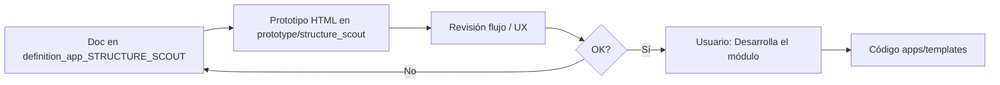

# definition_app_STRUCTURE_SCOUT — Definición STRUCTURE SCOUT

Carpeta de documentación de análisis y definición para **STRUCTURE SCOUT** (Explorador de estructura), vertical de la familia reutilización alta.

> **Producto:** [`../STRUCTURE_SCOUT.md`](../STRUCTURE_SCOUT.md)  
> **Familia §2:** [`../APP_FACTORY_HIGH_REUSE.md`](../APP_FACTORY_HIGH_REUSE.md) §6  
> **Rama Git:** `feature/structure-scout` (no desplegar a producción hasta merge a `main`)  
> **Chasis:** reutiliza `Company`, `UserProfile`, `Project`, `ProjectMembership`, seguridad y billing.  
> **Reuso técnico DMS:** sample intake, `detection_service`, parsers — ver [`../definition_app_DMS/`](../definition_app_DMS/).  
> **Complemento:** PROFILE_SEED (desde definición publicada); Bridge GATE (pre-check por hash).  
> **Obra nueva:** `StructureDraft` + job de exploración + apply a destino (capa compartible con Seed).

---

## Método de trabajo (por módulo)

Igual que FILE GATE / Match / Reverse / Seed: **definir → prototipar → revisar → implementar solo con OK explícito**.



| Paso | Dónde | Quién |
|------|-------|--------|
| 1. Diseño, alcance, reglas, validaciones | `docs/definition_app_STRUCTURE_SCOUT/<modulo>.md` | Agente + revisión |
| 2. HTML demo | `prototype/structure_scout/` | Agente |
| 3. Revisión de flujo | Chat / demo en navegador | Usuario |
| 4. Implementación Django | `apps/structure_scout/`, `templates/structure_scout/` | **Solo si el usuario dice «Desarrolla el módulo»** |

---

## Documentos (por módulo)

| Archivo | Módulo | Contenido | Estado |
|---------|--------|-----------|--------|
| [`../STRUCTURE_SCOUT.md`](../STRUCTURE_SCOUT.md) | Producto | Visión, alcance, módulos 1–7, roles | **Lineamientos** |
| `project_lifecycle.md` | **1** | Alta, listado, hub, miembros | **Implementado** |
| [`sample_upload.md`](sample_upload.md) | **2** | Cargar muestra + preview | **Implementado** |
| [`detect_pattern.md`](detect_pattern.md) | **3** | Encoding, tipo, delimitador, captura | **Implementado** |
| [`propose_fields.md`](propose_fields.md) | **4** | Tabla campos/tipos + confianza | **Implementado** |
| [`propose_field_lengths.md`](propose_field_lengths.md) | **Fase 2** | Longitudes/posiciones estimadas editables (`txt_fixed`) | **Implementado** |
| [`save_draft.md`](save_draft.md) | **5** | Persistir / versionar `StructureDraft` | **Implementado** |
| [`apply_target.md`](apply_target.md) | **6** | Aplicar borrador a GATE/Reverse/Match/DMS | **Implementado** |
| [`history.md`](history.md) | **7** | Historial unificado drafts + applies | **Implementado** |
| [`ss_integration.md`](ss_integration.md) | Transversal | Kind, URLs, roles, reuso DMS, frontera Seed | **Documentado** |

> Los `.md` de módulo se crean al iniciar cada módulo (no anticipar specs vacías).

---

## Prioridad de apply (MVP)

| Prioridad | Destino |
|-----------|---------|
| P0 | FILE GATE (contrato / esquema en borrador) |
| P1 | Reverse Studio (contrato de entrada) **o** FILE MATCH Perfil A |
| P2 | FILE MATCH Perfil B / FilePipe origen |

---

## Carpetas de trabajo

| Rol | Ruta |
|-----|------|
| Specs por módulo | `docs/definition_app_STRUCTURE_SCOUT/` |
| Prototipos HTML (antes del definitivo) | `prototype/structure_scout/` |
| Templates Django (tras «Desarrolla el módulo») | `templates/structure_scout/<modulo>/` |
| App Django | `apps/structure_scout/` |
| CSS / JS | `static/css/structure_scout_*.css`, `static/js/structure_scout-*.js` |

### Mapa de carpetas (objetivo)

```
docs/
├── STRUCTURE_SCOUT.md
└── definition_app_STRUCTURE_SCOUT/
    ├── README.md                 ← este archivo
    ├── project_lifecycle.md
    ├── sample_upload.md
    ├── detect_pattern.md
    ├── propose_fields.md
    ├── save_draft.md
    ├── apply_target.md
    ├── history.md
    └── ss_integration.md
```

---

## Decisiones de diseño (hereda del producto)

| # | Tema | Decisión |
|---|------|----------|
| SS1 | ¿Kind propio? | **Sí** — `structure_scout` + hub |
| SS2 | ¿LLM en MVP? | **No** — heurísticas + detección DMS |
| SS3 | ¿Auto-publicar destino? | **No** — solo borrador |
| SS4 | ¿Tenant? | Misma compañía |
| SS5 | ¿Duplicar parsers? | **No** — siempre `apps.dms.*` |
| SS6 | ¿Compartir apply con Seed? | **Sí** deseable (origen distinto: muestra vs definición) |

---

## Próximo módulo a abrir

1. Ciclo MVP M1–M7 **cerrado**.  
2. Integración transversal: [`ss_integration.md`](ss_integration.md) **documentada**.  
3. **En curso (rama `feature/scout-mejoras-campos`):** Fase 2 longitudes estimadas — [`propose_field_lengths.md`](propose_field_lengths.md) (doc; prototipo → código con OK).  
4. Otros ítems Fase 2 según [`../STRUCTURE_SCOUT.md`](../STRUCTURE_SCOUT.md) §7.3.
