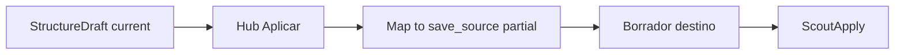
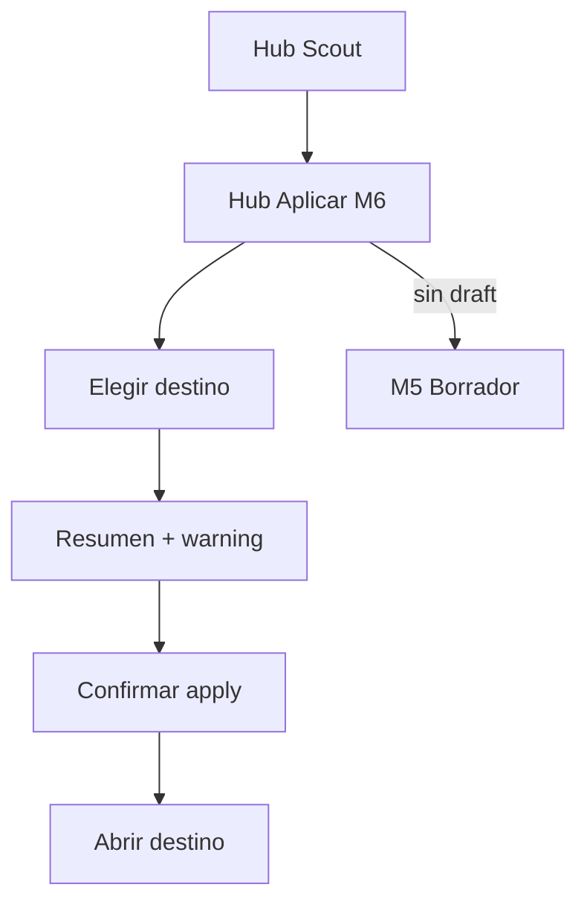
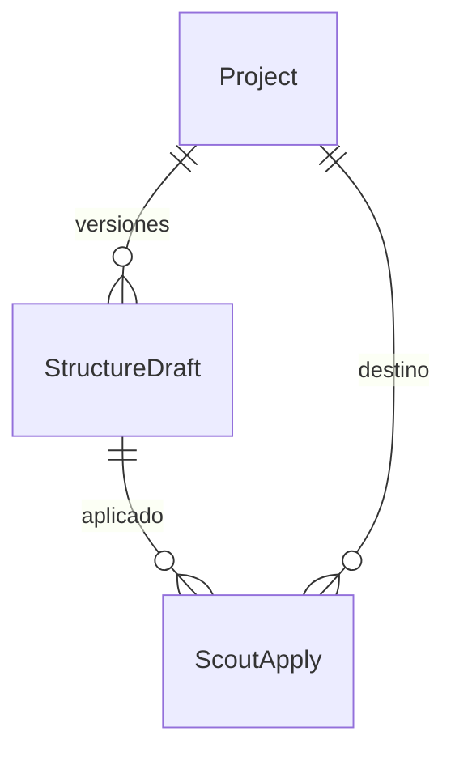

# Apply target — STRUCTURE SCOUT Módulo 6

Proceso y especificación del **Módulo 6** del Explorador: a partir del **`StructureDraft` current** (M5), **aplicar** (sembrar) el bloque `source` como **borrador** en un proyecto destino de la misma compañía — sin publicar.

> Estado: **implementado**.  
> Producto: [`../STRUCTURE_SCOUT.md`](../STRUCTURE_SCOUT.md).  
> Rama: `feature/structure-scout`.  
> Predecesor: [`save_draft.md`](save_draft.md) (M5 — borrador versionado).  
> Siguiente: `history.md` (M7 — historial de exploraciones / applies).  
> Base técnica: `StructureDraft.payload.source` → `source_persistence_service.save_source` (GATE / Reverse).  
> Frontera Seed: [`../PROFILE_SEED.md`](../PROFILE_SEED.md) (definición publicada → draft; Scout = muestra → draft).  
> App: `apps/structure_scout/apply/` · Templates: `templates/structure_scout/apply/`.  
> Prototipos: [`../../prototype/structure_scout/apply/`](../../prototype/structure_scout/apply/).

---

## Propósito

Permitir que el diseñador **siembre** la estructura explorada en un destino usable:

1. Elegir proyecto destino (misma compañía);
2. Ver resumen / warning si el destino ya tiene borrador;
3. Confirmar → escribir solo **borrador** SourceProfile (nunca publicar);
4. Registrar `ScoutApply` para auditoría (M7);
5. Abrir deep-link al hub del destino.

```
StructureDraft current (payload.source)
        →
Elegir destino (GATE / Reverse …)
        →
Preview resumen + warning overwrite
        →
save_source (borrador destino)
        →
ScoutApply + CTA abrir destino
```

---

## Qué es / qué hace / qué no hace

| Pregunta | Respuesta |
|----------|-----------|
| **¿Qué es?** | El puente **Scout → app destino** que copia estructura a borrador |
| **¿Qué hace?** | Lista destinos elegibles, mapea `source`, escribe draft, audita apply |
| **¿Qué no hace?** | No publica el destino (S2). No edita el draft Scout (M5). No clona desde definición publicada (PROFILE_SEED). No concilia / valida producción |
| **Copy UX** | “Aplicar a destino / sembrar borrador” — no “publicar”, “clonar contrato” ni “validar” |

---

## Relación con M5, DMS y PROFILE_SEED

| Tema | Decisión |
|------|----------|
| Prerrequisito | `StructureDraft` con `is_current` (`has_draft`). Sin ello → CTA a M5 |
| Origen | `payload.source` del draft current |
| Writer MVP | Apply **delgado en Scout** → `get_or_create_draft_version` + `save_source` |
| PROFILE_SEED | **No** dependencia de código Seed (aún inexistente). Futuro: writer compartido |
| Publicar | **Prohibido** en M6 |
| Tenant | Misma `company_id`; destino `is_archived=False` |



**Frontera M5 vs M6:** M5 = snapshot Scout; M6 = escribir en otro proyecto.  
**Frontera M6 vs Seed:** Scout parte de muestra; Seed parte de definición **publicada**.  
**Frontera M6 vs M7:** M6 registra apply; M7 lista/detalla historial.

---

## Destinos

| Prioridad | Kind | Writer | Deep-link (orientativo) |
|-----------|------|--------|-------------------------|
| **P0** | `file_gate` | `save_source` | `/app/file-gate/proyectos/<slug>/esquema/` (`schema_hub`) |
| **P1** | `reverse` | `save_source` | Hub source / schema Reverse equivalente |
| Extensión | `file_match` (Perfil A) | `save_source` | Documentar; UI puede listar si se habilita |
| Fase 2 | Match B | `save_source_b` | Otro modelo |
| Fase 2 | FilePipe / `dms` | `save_source` | Menor prioridad producto |

MVP de implementación (post-OK): **GATE + Reverse**. Match A opcional si el listado reusa el mismo writer.

### Elegibilidad de un destino

| Condición | Requerida |
|-----------|-----------|
| Misma compañía que el proyecto Scout | Sí |
| `project_kind` ∈ destinos MVP | Sí |
| No archivado | Sí |
| Usuario es **PA o ED** en el proyecto **destino** | Sí |
| Usuario puede aplicar desde Scout (PA/ED en Scout) | Sí |

---

## Alcance de este documento

| Incluido | Excluido |
|----------|----------|
| Requiere draft current | Editar / versionar draft Scout (M5) |
| Listar destinos GATE + Reverse | Match B / FilePipe write |
| Resumen overwrite (conteos) | Diff campo-a-campo (Fase 2) |
| Aplicar → `save_source` borrador | Publicar destino |
| `ScoutApply` auditoría | Historial UI completo (M7) |
| Deep-link post-apply | Cross-compañía |

---

## Responsabilidades

| Sí | No |
|----|-----|
| Sembrar / actualizar borrador SourceProfile destino | Publicar contrato / mapping |
| Auditar apply (`ScoutApply`) | Re-explorar muestra |
| Advertir si destino ya tiene campos en borrador | Merge inteligente campo a campo (Fase 2) |

---

## Proceso (flujo de usuario)



1. Desde hub o tras M5 → **Aplicar a destino**.
2. Si no hay draft current → empty state + enlace a M5.
3. Ver resumen del draft (versión, N campos, status).
4. Elegir **tipo** (GATE / Reverse) y **proyecto** elegible.
5. Ver preview: destino vacío vs ya tiene N campos → warning sobrescritura de borrador.
6. **Aplicar** (PA/ED) → `save_source` + `ScoutApply` → flash + enlace destino.
7. CTA Historial (M7; placeholder).

### Diff / preview MVP

| Señal | UI |
|-------|-----|
| Destino sin campos en borrador | “Se creará / llenará el borrador con N campos.” |
| Destino con campos | Warning: “El borrador destino tiene M campos; se sobrescribirán con N del Scout.” |
| Draft Scout `needs_review` | Warning heredado: revisar antes de aplicar |

Diff campo-a-campo = Fase 2.

---

## Mapeo `payload.source` → `save_source`

El bloque M5:

```json
{
  "file_type_code": "csv",
  "encoding_code": "utf-8",
  "line_ending_code": "lf",
  "delimiter": ";",
  "header_row": 1,
  "has_header": true,
  "fields": [
    { "name": "documento", "label": "documento", "content_type": "numeric", "required": true }
  ]
}
```

Al implementar, adaptar a la forma que espera `merge_source_dict` / `apply_dict_to_profile`:

| Scout `source` | Persistencia destino |
|----------------|----------------------|
| `file_type_code` | `file_type_code` |
| `encoding_code` / `line_ending_code` | Campos top-level y/o `config` según `source_persistence_service` |
| `delimiter` | `config.delimiter` (y top-level si aplica) |
| `header_row` / `has_header` | Según convención SourceProfile / layout |
| `fields[]` | `fields` (name, label, content_type, required; **Fase 2:** + start/end/length si `txt_fixed` — [`propose_field_lengths.md`](propose_field_lengths.md)) |

Reglas:

- Llamar `get_or_create_draft_version(target)` antes de guardar.
- **No** llamar publish.
- Sobrescritura MVP = reemplazo del partial source (campos + tipo/layout) en el borrador; no tocar versiones publicadas.

---

## Modelo `ScoutApply` (propuesto)

| Campo | Tipo | Notas |
|-------|------|-------|
| `id` | UUID PK | |
| `project` | FK Scout Project | Origen |
| `draft` | FK StructureDraft | Versión aplicada |
| `draft_version` | int | Denormalizado |
| `target_project` | FK Project | Destino |
| `target_kind` | char | `file_gate` / `reverse` / … |
| `status` | char | `ok` / `failed` |
| `message` | text | Corto / error user-facing |
| `created_by` | FK User | |
| `created_at` | datetime | |

M7 listará estos registros (+ saves de draft si se desea).

---

## Pantallas

| Pantalla | Descripción |
|----------|-------------|
| Hub aplicar | Selector destino + resumen + confirmar |
| Ayuda | Qué se siembra, destinos, roles |

Rutas propuestas:

| Acción | URL | Nombre Django |
|--------|-----|---------------|
| Hub aplicar | `/app/structure-scout/proyectos/<slug>/aplicar/` | `apply_hub` |
| Ayuda | `…/aplicar/ayuda/` | `apply_hub_help` |
| Confirmar (POST) | mismo hub `action=apply` | (PRG) |

Namespace: `structure_scout:*`.

---

## Reglas de negocio

| ID | Regla |
|----|-------|
| AT1 | Sin draft current no hay apply → CTA a M5. |
| AT2 | Apply escribe solo **borrador** destino; nunca publica (S2). |
| AT3 | Destino misma compañía; no archivado; kind permitido. |
| AT4 | Aplicar requiere PA/ED en **Scout** y PA/ED en **destino**. |
| AT5 | Origen = `payload.source` del draft `is_current` (versión congelada). |
| AT6 | Warning si destino ya tiene campos en borrador (overwrite). |
| AT7 | Tras OK: `ScoutApply` + flash + deep-link destino. |
| AT8 | GE/CO no aplican; pueden ver metadatos del hub (CO sin examples del draft). |
| AT9 | PRG en apply; sin Django Forms. |
| AT10 | Tenant / kind Scout únicamente como origen. |
| AT11 | Fallo `save_source` → no marcar apply ok; mensaje catálogo + log. |
| AT12 | Match B / FilePipe fuera de MVP (Fase 2). |

---

## Validaciones

| Situación | Severidad | Canal | Texto / comportamiento |
|-----------|-----------|-------|------------------------|
| Sin draft | Error / empty | UI | Guarde un borrador de estructura antes de aplicar a un destino. + CTA M5 |
| Destino no seleccionado | Error | inline / flash | Seleccione un proyecto destino. |
| Destino no elegible / sin permiso | Error | flash | No puede aplicar a este destino. Verifique compañía y rol (PA/ED). |
| Apply OK | Success | flash | Borrador sembrado en el destino. Abra el proyecto para revisar y publicar allí. |
| Apply fail | Error + log | flash | No se pudo aplicar el borrador al destino. Si persiste, contacte al administrador. |
| Sin permiso aplicar | Error | flash | No tiene permiso para aplicar el borrador a un destino. |
| Sin acceso Scout | Error | flash | No tiene acceso a este proyecto Explorador. |

Catálogo: ampliar [`UI_MESSAGES.md`](../definition_app/UI_MESSAGES.md) §3.12 al implementar (bloque Aplicar).

---

## Modelo conceptual



| Concepto | Descripción | Implementación propuesta |
|----------|-------------|--------------------------|
| Apply hub | UI selección + confirm | `apps/structure_scout/apply/` |
| Writer | Mapa + `save_source` | `apply_target_service` |
| `ScoutApply` | Auditoría | Tabla delgada |

---

## Diseño UX

| Elemento | Criterio |
|----------|----------|
| Eyebrow | `STRUCTURE SCOUT · Aplicar` |
| Título | Aplicar a destino |
| Subtítulo | Siembra el borrador Scout en un proyecto de la misma compañía. No publica. |
| Strip | Proyecto Scout + draft current (vN) |
| Stepper | Fase aplicación: Aplicar active · Historial pending |
| Form | Select kind + select proyecto; resumen draft; alert overwrite |
| CTAs | Aplicar · Volver borrador · Historial (disabled M7) |

### Wireframe lógico

1. Scope + header + ayuda.  
2. Stepper (aplicación).  
3. Alert sin draft / needs_review.  
4. Card draft current.  
5. Selector destino + preview.  
6. Acciones.

---

## Integración con el hub (M1)

Tras M6 (al implementar), `get_hub_context` debe:

| Campo | Comportamiento |
|-------|----------------|
| `has_apply` | `True` si existe al menos un `ScoutApply` ok (opcional) |
| `apply_step_class` | `is-done` si hubo apply; else `is-active` si `has_draft` |
| `history_step_class` | `is-active` si hubo apply (hasta M7) |
| CTA Aplicar | Enlace a `apply_hub` cuando `has_draft` |
| Nota módulos | Quitar “Aplicar” de pendientes |

Tras M5, CTA «Continuar a aplicar» apunta a `apply_hub`.

---

## Matriz de permisos (M6)

| Acción | PA | ED | GE | CO |
|--------|----|----|----|-----|
| Ver hub aplicar | Sí | Sí | Sí | Sí* |
| Ver resumen campos draft | Sí | Sí | Sí | No examples |
| Listar destinos elegibles | Sí | Sí | Sí** | Sí** |
| Confirmar apply | Sí*** | Sí*** | No | No |
| Abrir deep-link post-apply | Sí | Sí | Sí | Sí |

\*CO: metadatos.  
\*\*Lista filtrada por lo que podrían ver; apply sigue bloqueado.  
\*\*\*Además PA/ED en el **destino**.

---

## Criterios de aceptación (spec / prototipo)

- [x] Propósito, frontera M5/Seed/M7, writer `save_source` documentados
- [x] Destinos P0 GATE + P1 Reverse; Fase 2 Match B / FilePipe
- [x] Reglas AT1–AT12, `ScoutApply`, validaciones
- [x] URLs propuestas
- [x] Integración stepper hub
- [x] Prototipos HTML hub aplicar + ayuda
- [x] Revisión UX del usuario
- [x] «Desarrolla el módulo» → código Django

---

## Implementación

| Pieza | Ubicación |
|-------|-----------|
| Vistas / URLs | `apps/structure_scout/apply/` |
| Servicio | `apply_target_service` |
| Modelo | `ScoutApply` |
| Templates | `templates/structure_scout/apply/` |
| Prefijo | `/app/structure-scout/proyectos/<slug>/aplicar/` |
| Reuso | `source_persistence_service.save_source` |
| Hub wiring | `scout_project_service` + CTA en borrador |
| Mensajes | `UI_MESSAGES.md` §3.12 bloque Aplicar |

---

## Próximos pasos

1. M6 **implementado**.  
2. M7 **implementado**: [`history.md`](history.md).  
3. Integración: [`ss_integration.md`](ss_integration.md) **documentada**.

---

## Referencias

| Documento | Uso |
|-----------|-----|
| [`../STRUCTURE_SCOUT.md`](../STRUCTURE_SCOUT.md) | S2, SS-02, destinos |
| [`save_draft.md`](save_draft.md) | Draft current / `payload.source` |
| [`../PROFILE_SEED.md`](../PROFILE_SEED.md) | Frontera Seed |
| `source_persistence_service.py` | `save_source` |
| [`README.md`](README.md) | Índice |

---

*Documento: `docs/definition_app_STRUCTURE_SCOUT/apply_target.md` — Módulo 6 STRUCTURE SCOUT (spec + prototipos).*
