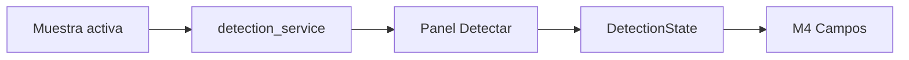
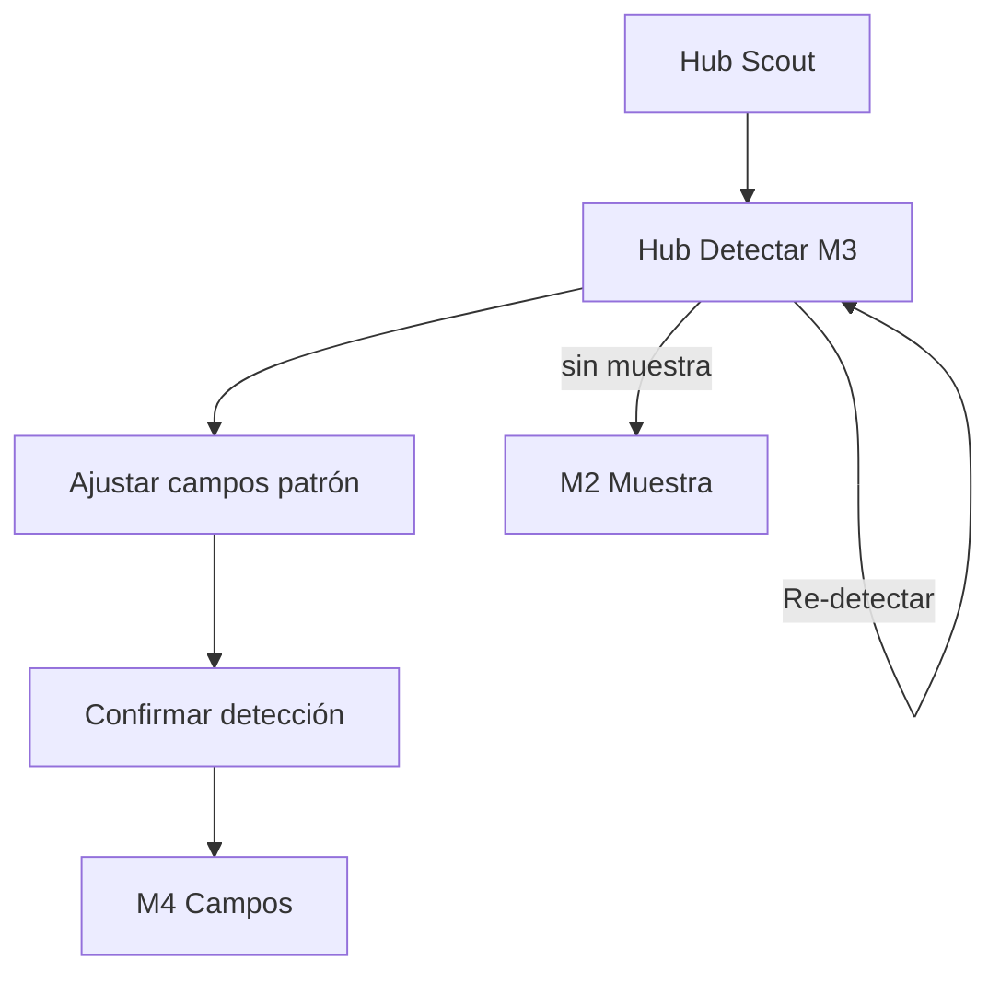
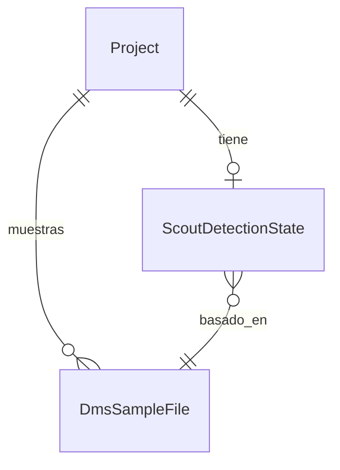

# Detect pattern — STRUCTURE SCOUT Módulo 3

Proceso y especificación del **Módulo 3** del Explorador: a partir de la **muestra activa** (M2), revisar / confirmar el **patrón de archivo** detectado (tipo, encoding, delimitador, line ending, fila de encabezado y señales de captura) y fijar un estado de confianza antes de proponer campos (M4).

> Estado: **implementado**.  
> Producto: [`../STRUCTURE_SCOUT.md`](../STRUCTURE_SCOUT.md).  
> Rama: `feature/structure-scout`.  
> Predecesor: [`sample_upload.md`](sample_upload.md) (M2 — muestra activa).  
> Siguiente: [`propose_fields.md`](propose_fields.md) (M4 — campos y tipos).  
> Base técnica: `apps.dms.file_intake.services.detection_service` (`build_suggestions`, `preview_rows`, heurísticas).  
> Estilo: hermano de [`sample_upload.md`](sample_upload.md) / [`../definition_app_FILE_GATE/schema_definition.md`](../definition_app_FILE_GATE/schema_definition.md).  
> App: `apps/structure_scout/detect/` · Templates: `templates/structure_scout/detect/`.  
> Prototipos: [`../../prototype/structure_scout/detect/`](../../prototype/structure_scout/detect/).

---

## Propósito

Convertir las **sugerencias heurísticas** de la muestra en un **patrón confirmado** (o marcado para revisión) que alimente:

1. El stepper del hub (`Detectar` → done / needs_review);
2. La inferencia de campos en M4 (misma encoding / delimitador / header);
3. El futuro `StructureDraft` (bloque `detection` del JSON de producto).

El usuario **puede corregir** tipo, encoding, delimitador y fila de encabezado. Scout **propone**; no aplica a destinos aquí.

```
Muestra activa (M2)
        →
(Re)ejecutar heurísticas detection_service
        →
Panel patrón + confianza + preview
        →
Confirmar / ajustar → estado detección
        →
CTA Continuar a campos (M4)
```

---

## Qué es / qué hace / qué no hace

| Pregunta | Respuesta |
|----------|-----------|
| **¿Qué es?** | La revisión asistida del **patrón global** del archivo (no aún la lista de campos) |
| **¿Qué hace?** | Muestra sugerencias, permite overrides, asigna confianza (`high` / `medium` / `low` / `failed`) |
| **¿Qué no hace?** | No propone nombres/tipos de campos (M4). No guarda `StructureDraft` versionado (M5). No aplica a GATE (M6). No re-sube el archivo (eso es M2) |
| **Copy UX** | “Detectar patrón / estructura del archivo” — no “contrato”, “validar” ni “mapear” |

---

## Relación con M2 y DMS detection

| Tema | Decisión |
|------|----------|
| Entrada | Última muestra del proyecto (`DmsSampleFile`) o la marcada activa |
| Sugerencias iniciales | Las de `sample.suggestions` (llenadas en upload M2) **o** re-cálculo con `build_suggestions` |
| Preview | `preview_rows` (crudo); Excel: mensaje stub como hoy |
| Overrides | Persistidos en Scout (ver modelo) — **no** escriben SourceProfile destino |
| Parsers tipados | Aún no; M4 usará `source_parser_service` cuando haya fields |



**Frontera M2 vs M3:** M2 = recibir archivo + preview + chips de sugerencia. M3 = **confirmar / editar** el patrón y fijar confianza de detección global.

---

## Alcance de este documento

| Incluido | Excluido |
|----------|----------|
| Requiere muestra activa (si no → CTA a M2) | Upload / delete de muestra (M2) |
| Mostrar y editar: tipo, encoding, LE, delimitador | Tabla completa de campos/tipos (M4) |
| Sugerir / editar `header_row` (default 1 si hay encabezado) | Captura inicio/fin avanzada posicional (MVP: solo hints; detalle Fase 2 / S7) |
| Estado global: `draft_ready` / `needs_review` / `failed` | Guardar StructureDraft (M5) |
| Re-detectar desde muestra | Apply a destino (M6) |
| Preview alineado al patrón (delimiter visual) | JSON/XML / posicional robusto (Fase 2) |
| Permisos PA/ED (editar); GE ver + confirmar ligero | Cross-compañía |

### Posicional en MVP

| Caso | Comportamiento MVP |
|------|-------------------|
| Heurística sugiere `txt_fixed` | Estado **`needs_review`**; UI advierte que longitudes se confirman a mano (S7) |
| Confianza baja en delimitador | `needs_review`; usuario elige delimitador o “sin delimitador / fijo” |
| No se puede leer muestra | `failed` |

---

## Responsabilidades

| Sí | No |
|----|-----|
| Confirmar patrón de lectura del archivo | Inferir catálogo de campos |
| Persistir overrides de detección del proyecto Scout | Publicar contratos en otras apps |
| Exponer confianza para el hub / M4 | Validar filas de producción |

---

## Proceso (flujo de usuario)



1. Desde hub o tras M2 → **Detectar patrón**.
2. Si no hay muestra → empty state + enlace a M2.
3. Ver sugerencias (chips + formulario editable).
4. Opcional: **Re-detectar** (vuelve a correr heurísticas sobre el archivo en disco).
5. Ajustar tipo / encoding / delimitador / header_row / LE.
6. **Confirmar detección** → estado `draft_ready` o `needs_review` según reglas.
7. CTA **Continuar a campos** (M4; placeholder hasta existir).

### Estados de detección (producto)

| Estado | Significado | Stepper |
|--------|-------------|---------|
| `idle` | Sin confirmación aún (solo sugerencias de M2) | Detectar `is-active` si hay muestra |
| `draft_ready` | Patrón usable; listo para M4 | Detectar `is-done` |
| `needs_review` | Parcial / dudoso; puede seguir a M4 con advertencia | Detectar `is-done` + badge revisión |
| `failed` | No legible / tipo no soportado | Detectar `is-active` / bloqueo suave a M4 |

---

## Campos del patrón (UI + persistencia)

| Campo | Origen sugerido | Editable MVP | Notas |
|-------|-----------------|--------------|-------|
| `file_type_code` | `suggest_file_type` | Sí | `csv` / `xlsx` / `txt_delimited` (/ `txt_fixed` → needs_review) |
| `encoding_code` | `detect_encoding` | Sí | utf-8, latin-1, … |
| `line_ending_code` | `detect_line_ending` | Sí | lf / crlf / cr |
| `delimiter` | `detect_delimiter` | Sí | `,` `;` tab `\|` o vacío si fijo/xlsx |
| `header_row` | Default **1** si primera fila parece encabezado; else `null`/0 | Sí | Heurística simple MVP (letras en celdas) |
| `has_header` | Derivado | Sí (checkbox) | Si false, `header_row` nulo |
| `capture_start` / `capture_end` | null MVP | Solo lectura / “—” | Fase 2 |
| `confidence` | Calculada | No directo | `high` / `medium` / `low` |
| `status` | Calculada / al confirmar | Al confirmar | Ver tabla estados |
| `notes` | Sistema | Opcional texto | Ej. “formatos mixtos”, “excel stub” |

### Reglas de confianza (borrador)

| Condición | confidence | status al confirmar |
|-----------|------------|---------------------|
| Tipo claro + delim estable (o xlsx) + encoding OK | `high` | `draft_ready` |
| Delim dudoso / header dudoso / pocos datos en preview | `medium` | `needs_review` |
| `txt_fixed` o conflictos fuertes | `low` | `needs_review` |
| Sin tipo / archivo ilegible | — | `failed` (no confirma) |

---

## Pantallas

| Pantalla | Descripción |
|----------|-------------|
| Hub detectar | Formulario patrón + preview + CTAs |
| Ayuda | Qué se detecta, límites, roles |

Rutas propuestas:

| Acción | URL | Nombre Django |
|--------|-----|---------------|
| Hub detectar | `/app/structure-scout/proyectos/<slug>/detectar/` | `detect_hub` |
| Ayuda | `…/detectar/ayuda/` | `detect_hub_help` |
| Re-detectar (POST) | `…/detectar/re-ejecutar/` | `detect_rerun` |
| Confirmar (POST) | `…/detectar/confirmar/` | `detect_confirm` |

Namespace: `structure_scout:*`.

---

## Reglas de negocio

| ID | Regla |
|----|-------|
| DP1 | Sin muestra activa no hay detección confirmable → redirect/CTA a M2. |
| DP2 | Toda detección parte de heurísticas DMS; **no** inventar parser (S6). |
| DP3 | Confirmar no publica destinos ni crea SourceProfile de GATE/Match. |
| DP4 | Overrides viven en estado Scout del proyecto (JSON / modelo delgado). |
| DP5 | `txt_fixed` en MVP → mínimo `needs_review` (S7). |
| DP6 | Editar / confirmar: **PA** o **ED**. **GE** puede ver y re-detectar; confirmar solo si se decide igualar a “explorar” (recomendación: GE confirma detección operativa; ED/PA para overrides “duros”). **Decisión MVP:** PA/ED confirman overrides; GE puede confirmar si no cambia tipo (solo acepta sugerencia). Simplificación: **PA/ED/GE confirman**; solo PA/ED editan campos del formulario. |
| DP7 | CO: metadatos sí; sin preview de filas (igual M2). |
| DP8 | Re-detectar pisa sugerencias base; preserva overrides solo si el usuario lo pide (MVP: re-detectar **resetea** formulario a heurística fresca + warning). |
| DP9 | Tras confirmar, hub marca Detectar `is-done` y activa Campos. |
| DP10 | PRG en confirmar; re-detectar puede ser PRG o JSON; sin Django Forms. |
| DP11 | Tenant / kind `structure_scout` únicamente. |

---

## Validaciones

| Situación | Severidad | Canal | Texto / comportamiento |
|-----------|-----------|-------|------------------------|
| Sin muestra | Error / empty | UI | Suba una muestra antes de detectar el patrón. + CTA M2 |
| Tipo vacío al confirmar | Error | inline | Seleccione un tipo de archivo. |
| Delimitado sin delimitador | Error | inline | Indique el delimitador o cambie el tipo. |
| Header row &lt; 1 | Error | inline | La fila de encabezado debe ser ≥ 1. |
| Confirmación OK `draft_ready` | Success | flash | Patrón detectado y confirmado. |
| Confirmación OK `needs_review` | Warning + success | flash | Patrón guardado con revisión pendiente. Revise antes de aplicar a un destino. |
| Re-detectar OK | Info / success | flash | Sugerencias actualizadas desde la muestra. |
| Fallo lectura archivo | Error | flash + log | No se pudo analizar la muestra. Vuelva a subir el archivo. |
| Sin permiso editar | Error | flash | No tiene permiso para editar el patrón de detección. |
| Sin acceso | Error | flash | No tiene acceso a este proyecto Explorador. |

Catálogo: ampliar [`UI_MESSAGES.md`](../definition_app/UI_MESSAGES.md) §3.12 al implementar (bloque Detectar).

---

## Modelo conceptual



| Concepto | Descripción | Implementación propuesta |
|----------|-------------|--------------------------|
| `ScoutDetectionState` | JSON patrón + status + confidence + `sample_id` + `confirmed_at` / `confirmed_by` | Tabla delgada `structure_scout` **o** JSON en config del proyecto hasta M5 unifique draft |
| Sugerencias base | Copia de `DmsSampleFile.suggestions` + campos extra | Al abrir hub / re-detectar |
| Overrides | Valores editados por el usuario | Mismos keys que el JSON `detection` de `STRUCTURE_SCOUT.md` §11 |

Fragmento alineado al producto:

```json
{
  "file_type_code": "csv",
  "encoding_code": "utf-8",
  "line_ending_code": "lf",
  "delimiter": ";",
  "header_row": 1,
  "has_header": true,
  "capture_start": null,
  "capture_end": null,
  "confidence": "high",
  "status": "draft_ready",
  "sample_id": "…",
  "notes": ""
}
```

---

## Diseño UX

| Elemento | Criterio |
|----------|----------|
| Eyebrow | `STRUCTURE SCOUT · Detectar` |
| Título | Detectar patrón |
| Subtítulo | Revise tipo, encoding y delimitador sugeridos para la muestra activa. |
| Strip | Proyecto + nombre muestra activa |
| Stepper | Muestra done · Detectar active/done · Campos · Borrador |
| Formulario | Selects/radios (tipo, encoding, LE, delim) + checkbox encabezado + nº fila |
| Preview | Tabla cruda (reuso visual M2); opcional resaltar split por delim |
| CTAs | Re-detectar · Confirmar · Continuar a campos · Volver hub / muestra |
| Badges | Confianza + status |

### Wireframe lógico

1. Scope + header + ayuda.  
2. Stepper exploración.  
3. Alert si `needs_review` / sin muestra.  
4. Card “Muestra” (nombre, hash corto, enlace M2).  
5. Formulario patrón.  
6. Preview.  
7. Acciones.

---

## Integración con el hub (M1)

Tras M3, `get_hub_context` debe:

| Campo | Comportamiento |
|-------|----------------|
| `has_detection` | `True` si status ∈ {`draft_ready`, `needs_review`} |
| `detect_step_class` | `is-done` si `has_detection`; else `is-active` si `has_sample` |
| `fields_step_class` | `is-active` si `has_detection` |
| CTA Detectar | Enlace real a `detect_hub` |
| Nota módulos | Quitar “Detectar” de la lista de pendientes |

Tras M2, el CTA «Continuar a detectar» en muestra apunta a `detect_hub`.

---

## Matriz de permisos (M3)

| Acción | PA | ED | GE | CO |
|--------|----|----|----|-----|
| Ver hub detectar (metadatos) | Sí | Sí | Sí | Sí* |
| Ver preview filas | Sí | Sí | Sí | No |
| Editar overrides | Sí | Sí | No | No |
| Re-detectar | Sí | Sí | Sí | No |
| Confirmar detección | Sí | Sí | Sí** | No |
| Continuar a M4 | Sí | Sí | Sí | No |

\*CO: solo estado/confianza sin filas.  
\*\*GE confirma aceptación de sugerencia; si el formulario fue editado por ED/PA, GE no “des-edita”.

---

## Criterios de aceptación (spec / prototipo)

- [x] Propósito, frontera M2/M4, reuso detection documentados
- [x] Campos del patrón + confianza + estados
- [x] Reglas DP1–DP11 y validaciones
- [x] URLs propuestas
- [x] Integración stepper hub
- [x] Prototipos HTML hub detectar + ayuda
- [ ] Revisión UX del usuario
- [ ] «Desarrolla el módulo» → código Django

---

## Implementación (objetivo post-OK)

| Pieza | Ubicación |
|-------|-----------|
| Vistas / URLs | `apps/structure_scout/detect/` |
| Servicio | `detect_pattern_service` (orquesta detection_service + persistencia estado) |
| Modelo / JSON | `ScoutDetectionState` o equivalente |
| Templates | `templates/structure_scout/detect/` |
| Prefijo | `/app/structure-scout/proyectos/<slug>/detectar/` |

---

## Próximos pasos

1. M3 **implementado** — código en `apps/structure_scout/detect/`.  
2. M4 abierto: [`propose_fields.md`](propose_fields.md) + prototipos `prototype/structure_scout/fields/`.  
3. Revisar UX M4 → «Desarrolla el módulo» o seguir a M5.

---

## Referencias

| Documento | Uso |
|-----------|-----|
| [`../STRUCTURE_SCOUT.md`](../STRUCTURE_SCOUT.md) | S4, S6, S7, JSON detection |
| [`sample_upload.md`](sample_upload.md) | Muestra activa |
| [`project_lifecycle.md`](project_lifecycle.md) | Hub / stepper |
| `detection_service.py` | Heurísticas |
| [`README.md`](README.md) | Índice |

---

*Documento: `docs/definition_app_STRUCTURE_SCOUT/detect_pattern.md` — Módulo 3 STRUCTURE SCOUT (spec + prototipos).*
