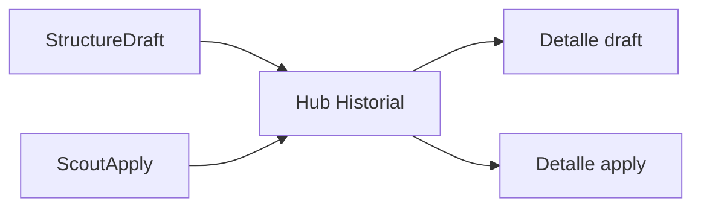

# History — STRUCTURE SCOUT Módulo 7

Proceso y especificación del **Módulo 7** del Explorador: **historial unificado** de versiones de `StructureDraft` (guardados) y registros `ScoutApply` (aplicaciones a destino), con detalle y enlaces de vuelta a borrador / destino.

> Estado: **implementado**.  
> Producto: [`../STRUCTURE_SCOUT.md`](../STRUCTURE_SCOUT.md).  
> Rama: `feature/structure-scout`.  
> Predecesores: [`save_draft.md`](save_draft.md) (M5), [`apply_target.md`](apply_target.md) (M6).  
> Siguiente: `ss_integration.md` (transversal; opcional).  
> Fuentes: tablas ya existentes — **sin** `ScoutExploration`.  
> Prototipos: [`../../prototype/structure_scout/history/`](../../prototype/structure_scout/history/).  
> Código: `apps/structure_scout/history/` · `templates/structure_scout/history/`.

---

## Propósito

Dar visibilidad auditable de **qué se congeló** y **dónde se sembró**:

1. Listado timeline (drafts + applies) por fecha;
2. Detalle de una versión de borrador;
3. Detalle de un apply (destino, status, deep-link);
4. Cerrar el stepper del hub (Historial).

```
StructureDraft + ScoutApply
        →
Timeline filtrable
        →
Detalle draft | Detalle apply
        →
CTAs: export / borrador / destino / aplicar
```

---

## Qué es / qué hace / qué no hace

| Pregunta | Respuesta |
|----------|-----------|
| **¿Qué es?** | El **libro de bitácora** del proyecto Scout (saves + applies) |
| **¿Qué hace?** | Lista, filtra por tipo, muestra detalle y enlaces |
| **¿Qué no hace?** | No guarda drafts (M5). No aplica a destinos (M6). No crea `ScoutExploration`. No re-aplica ni deshace |
| **Copy UX** | “Historial” — no “ejecuciones de producción”, “validaciones” ni “conciliación” |

---

## Relación con M5 / M6

| Tema | Decisión |
|------|----------|
| Drafts | Cada `StructureDraft` = evento tipo `draft` (fecha = `created_at`) |
| Applies | Cada `ScoutApply` = evento tipo `apply` |
| Exploración | MVP: el “ciclo de exploración” se infiere de drafts/applies; no hay entidad aparte |
| Export | Detalle draft reusa `draft_export` (versión current) o export por `version` id (al implementar: preferir export de esa versión) |



**Frontera M5/M6 vs M7:** M5/M6 escriben; M7 **solo lee** y presenta.

---

## Alcance de este documento

| Incluido | Excluido |
|----------|----------|
| Timeline unificado draft + apply | Tabla `ScoutExploration` |
| Filtro por tipo (todos / draft / apply) | Filtro por rango de fechas (Fase 2) |
| Detalle draft / apply | Re-aplicar / rollback |
| Empty state + CTAs | Diff campo-a-campo entre versiones |
| Permisos lectura | Edición de payload histórico |

---

## Proceso (flujo de usuario)

1. Desde hub o tras apply → **Historial**.
2. Ver tabla ordenada por fecha desc.
3. Filtrar por tipo (opcional).
4. Abrir detalle de un evento.
5. Desde detalle: export / ir a borrador / abrir destino / volver a aplicar.

### Evento timeline (fila)

| Columna | Draft | Apply |
|--------|-------|-------|
| Fecha | `created_at` | `created_at` |
| Tipo | Borrador | Apply |
| Resumen | `vN` · status · muestra · N campos · badge current | Destino slug · kind · ok/failed · draft vN |
| Usuario | `created_by` | `created_by` |
| Acción | Ver detalle | Ver detalle |

---

## Pantallas

| Pantalla | Descripción |
|----------|-------------|
| Hub historial | Filtro + tabla timeline |
| Detalle draft | Metadatos versión + CTAs |
| Detalle apply | Metadatos apply + deep-link |
| Ayuda | Qué se lista y roles |

Rutas propuestas:

| Acción | URL | Nombre Django |
|--------|-----|---------------|
| Hub | `/app/structure-scout/proyectos/<slug>/historial/` | `history_hub` |
| Ayuda | `…/historial/ayuda/` | `history_hub_help` |
| Detalle draft | `…/historial/borrador/<uuid:draft_id>/` | `history_draft` |
| Export draft | `…/historial/borrador/<uuid:draft_id>/exportar/` | `history_draft_export` |
| Detalle apply | `…/historial/apply/<uuid:apply_id>/` | `history_apply` |

Query filtro hub: `?tipo=all|draft|apply` (default `all`).

Namespace: `structure_scout:*`.

---

## Reglas de negocio

| ID | Regla |
|----|-------|
| H1 | Solo lectura; no muta drafts ni destinos. |
| H2 | Fuentes únicamente `StructureDraft` y `ScoutApply` del proyecto Scout. |
| H3 | Orden: fecha descendente; empate: apply antes que draft si misma marca (o estable por id). |
| H4 | Filtro MVP solo por tipo de evento. |
| H5 | PA/ED/GE/CO pueden ver el hub (metadatos). |
| H6 | CO: detalle draft **sin** examples en payload mostrado. |
| H7 | Export JSON: misma política M5 (CO sin examples); exportar la **versión del detalle**, no solo current. |
| H8 | Deep-link apply solo si `target_project` sigue existiendo / no archivado; si no, mostrar slug histórico. |
| H9 | Empty state si no hay drafts ni applies → CTA a muestra/borrador. |
| H10 | Tenant / membresía Scout; sin cross-compañía. |
| H11 | PRG no aplica (solo GET); sin Django Forms. |
| H12 | Tras implementar: hub marca Historial `is-done` si hay ≥1 evento; CTA real desde apply. |

---

## Validaciones / mensajes

| Situación | Canal | Texto |
|-----------|-------|-------|
| Sin acceso | flash | No tiene acceso a este proyecto Explorador. |
| Draft no encontrado | flash + redirect hub | Versión de borrador no encontrada. |
| Apply no encontrado | flash + redirect hub | Registro de aplicación no encontrado. |
| Sin permiso export | flash | No tiene permiso para exportar el borrador. |

Catálogo: ampliar [`UI_MESSAGES.md`](../definition_app/UI_MESSAGES.md) §3.12 al implementar (bloque Historial).

---

## Diseño UX

| Elemento | Criterio |
|----------|----------|
| Eyebrow | `STRUCTURE SCOUT · Historial` |
| Título | Historial |
| Subtítulo | Versiones de borrador y aplicaciones a destino de este proyecto. |
| Stepper | Aplicación: Aplicar done/active · Historial active/done |
| Filtro | Select tipo |
| Tabla | Fecha · Tipo · Resumen · Usuario · Ver |
| Detalle draft | vN, current badge, muestra, hash, status, confianza, N campos, notas |
| Detalle apply | destino, kind, draft vN, status, mensaje, usuario |

### Wireframe hub

1. Scope + header + ayuda.  
2. Stepper aplicación.  
3. Filtro tipo.  
4. Tabla o empty state.  
5. Enlace volver proyecto / aplicar.

---

## Integración con el hub (M1)

Tras M7 (al implementar):

| Campo | Comportamiento |
|-------|----------------|
| `has_history` | `True` si existe ≥1 `StructureDraft` o `ScoutApply` |
| `history_step_class` | `is-done` si `has_history`; else `is-active` si `has_apply` (o `has_draft`) |
| CTA Historial | Enlace real a `history_hub` |
| Nota módulos | Quitar “Historial” de pendientes (ciclo MVP cerrado) |

CTA «Historial» en apply deja de estar disabled.

---

## Matriz de permisos (M7)

| Acción | PA | ED | GE | CO |
|--------|----|----|----|-----|
| Ver hub / listado | Sí | Sí | Sí | Sí |
| Ver detalle draft (meta) | Sí | Sí | Sí | Sí |
| Ver examples en detalle | Sí | Sí | Sí | No |
| Export JSON versión | Sí | Sí | Sí | Sí* |
| Ver detalle apply | Sí | Sí | Sí | Sí |
| Abrir deep-link destino | Sí | Sí | Sí | Sí |

\*CO sin examples en el JSON.

---

## Criterios de aceptación (spec / prototipo)

- [x] Propósito, fuentes M5/M6, sin ScoutExploration
- [x] Timeline + filtro + detalles
- [x] Reglas H1–H12 y URLs
- [x] Integración stepper hub
- [x] Prototipos hub + 2 detalles + ayuda
- [x] Revisión UX del usuario
- [x] «Desarrolla el módulo» → código Django

---

## Implementación

| Pieza | Ubicación |
|-------|-----------|
| Vistas / URLs | `apps/structure_scout/history/` |
| Servicio | `history_service` (timeline + detalle) |
| Templates | `templates/structure_scout/history/` |
| Prefijo | `/app/structure-scout/proyectos/<slug>/historial/` |
| Reuso | `StructureDraft`, `ScoutApply`, `export_draft_json`, deep-link M6 |
| Hub wiring | `scout_project_service` + CTA apply / proyecto |
| Mensajes | `UI_MESSAGES.md` §3.12 bloque Historial |

---

## Próximos pasos

1. M7 **implementado**.  
2. Integración: [`ss_integration.md`](ss_integration.md) **documentada**.

---

## Referencias

| Documento | Uso |
|-----------|-----|
| [`../STRUCTURE_SCOUT.md`](../STRUCTURE_SCOUT.md) | Módulo 7, roles historial |
| [`save_draft.md`](save_draft.md) | StructureDraft |
| [`apply_target.md`](apply_target.md) | ScoutApply |
| [`README.md`](README.md) | Índice |

---

*Documento: `docs/definition_app_STRUCTURE_SCOUT/history.md` — Módulo 7 STRUCTURE SCOUT (implementado).*
