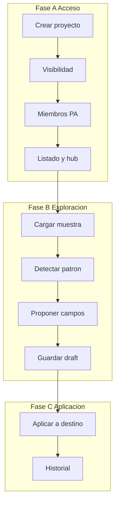
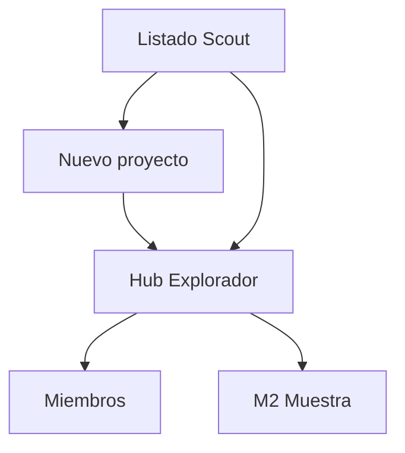
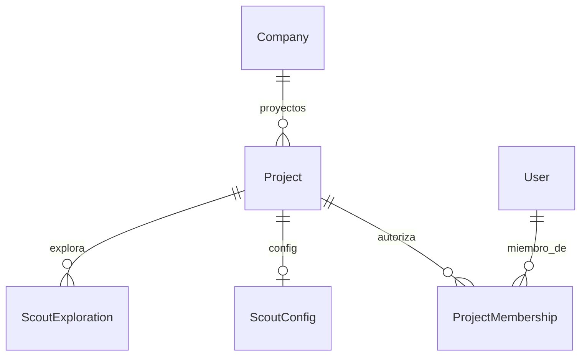

# Project lifecycle — STRUCTURE SCOUT

Ciclo de vida del **proyecto Explorador de estructura**: alta, visibilidad, miembros, hub y orden del flujo de exploración / borrador / aplicación.

> Estado: **implementado** (ciclo de acceso: listado, alta, hub, miembros).  
> Producto: [`../STRUCTURE_SCOUT.md`](../STRUCTURE_SCOUT.md).  
> Rama: `feature/structure-scout`.  
> Integración (cuando se abra): `ss_integration.md` (kind, URLs, roles, reuso DMS).  
> Contenedor de: muestras, exploraciones, `StructureDraft`, aplicaciones a destino e historial.  
> **Plataforma:** reutiliza [`Project` y `ProjectMembership`](../definition_app/DynamicWorkspace_Model.md#project).  
> Estilo de trabajo: hermano de [`../definition_app_FILE_MATCH/project_lifecycle.md`](../definition_app_FILE_MATCH/project_lifecycle.md); secciones de alcance/reglas/validaciones al estilo [`../definition_app_FILE_GATE/schema_definition.md`](../definition_app_FILE_GATE/schema_definition.md) y [`../definition_app_REVERSE/input_definition.md`](../definition_app_REVERSE/input_definition.md).  
> Prototipos: [`../../prototype/structure_scout/projects/`](../../prototype/structure_scout/projects/).  
> App: `apps/structure_scout/projects/` · templates `templates/structure_scout/projects/` · URLs `/app/structure-scout/`.

---

## Propósito

Un **proyecto STRUCTURE SCOUT** es la unidad de trabajo que agrupa:

1. **Exploraciones** a partir de muestras de archivo;
2. **Borradores de estructura** (`StructureDraft`: detección + campos/tipos);
3. **Aplicaciones** de ese borrador a proyectos destino (GATE / Reverse / Match / FilePipe) — solo borrador;
4. **Quién** puede ver, explorar, editar drafts o aplicar.

No es FILE GATE (no valida producción), ni Reverse (no emite), ni Match (no concilia), ni PROFILE_SEED (no clona definición publicada).

| Fase | Qué cubre | Specs |
|------|-----------|-------|
| **A — Acceso** | Crear, listar, visibilidad, miembros, hub | **Este documento** |
| **B — Exploración** | Muestra → detectar → campos → draft | `sample_upload.md`, `detect_pattern.md`, `propose_fields.md`, `save_draft.md` |
| **C — Aplicación** | Aplicar a destino + historial | `apply_target.md`, `history.md` |

---

## Qué es / qué hace / qué no hace (este módulo)

| Pregunta | Respuesta |
|----------|-----------|
| **¿Qué es?** | El ciclo de **acceso y contenedor** del Explorador: proyecto + hub + miembros |
| **¿Qué hace?** | Alta `structure_scout`, listado, hub con stepper, gestión PA de miembros |
| **¿Qué no hace?** | No sube muestras, no detecta, no propone campos, no aplica a GATE (módulos 2–7) |
| **Copy UX** | “Explorador / muestra / borrador de estructura” — **no** “validar”, “conciliar” ni “emitir” |

---

## Alcance de este documento

| Incluido | Excluido (otro módulo / app) |
|----------|------------------------------|
| Crear proyecto Scout (nombre, slug, descripción, visibilidad) | Upload de muestra (M2) |
| Listado filtrable + stats | Detección / inferencia (M3–M4) |
| Hub con stepper y paneles del ciclo | Guardar / versionar draft (M5) |
| Miembros PA/ED/GE/CO | Aplicar a destino (M6) |
| Visibilidad privado / público compañía | Detalle de historial de exploraciones (M7) |
| Mensajes de acceso / alta | Seed desde definición publicada (PROFILE_SEED) |
| Prefijo URLs `/app/structure-scout/` | Implementación Django (hasta «Desarrolla el módulo») |

---

## Responsabilidades

| Sí | No |
|----|-----|
| Contenedor `Project` kind Scout | Inferir campos desde muestra |
| Autorizaciones por membresía | Validar archivos de producción |
| Tablero del ciclo (hub) | Publicar contratos en apps destino |
| Copy y navegación del Explorador | Clone de perfiles publicados (Seed) |

---

## Integración con DynamicWorkspace

| Concepto | Implementación (propuesta) |
|----------|----------------------------|
| Contenedor | `Project` con `project_kind = structure_scout` |
| Código | `Project.slug` (único por compañía) |
| Nombre / descripción | `Project.name`, `Project.description` |
| Creador | `Project.owner` + membresía **PA** |
| Tenant | `Project.company` |
| Archivado | `Project.is_archived` |
| Visibilidad | Config Scout o reuso `DmsProjectConfig.visibility` (`company` \| `members_only`) — decidir en `ss_integration.md` |
| Miembros | `ProjectMembership` — misma compañía |
| Servicio | `scout_project_service` + `project_service` (miembros) |

**Al implementar:** añadir `KIND_STRUCTURE_SCOUT = "structure_scout"` a `Project.KIND_CHOICES`.

Detalle de kind/URLs/roles: `ss_integration.md` (pendiente).

---

## Fase A — Acceso

### A1 — Crear proyecto

| Campo | Obligatorio | Notas |
|-------|-------------|-------|
| `name` | Sí | Nombre visible |
| `slug` | Sí | Código único por compañía (mismo patrón Worksheets / Match) |
| `description` | No | Default UX: «Proyecto STRUCTURE SCOUT: exploración de muestra → borrador de estructura.» |
| `visibility` | Sí | Default `members_only` (Privado) |

- Solo usuarios **UF** con seguridad completa.
- Al crear: `Project(kind=structure_scout)` + config mínima + membership **PA** del creador.
- Mensaje: *«Proyecto Explorador de estructura creado correctamente.»* → redirect al hub.
- PRG + validación manual (sin Django Forms).

Rutas (propuesta):

| Acción | URL | Nombre Django |
|--------|-----|---------------|
| Formulario | `/app/structure-scout/proyectos/nuevo/` | `project_create` |
| Ayuda | `…/nuevo/ayuda/` | `project_create_help` |

### A2 — Visibilidad

| Valor UI | Código | Comportamiento |
|----------|--------|----------------|
| **Privado** | `members_only` | Solo membresía activa |
| **Público** | `company` | UF de la misma compañía pueden **ver** el proyecto sin ser miembros (rol virtual de consulta) |

El creador siempre es PA. Explorar / editar draft / aplicar siguen exigiendo rol adecuado (matriz abajo).

### A3 — Miembros y autorizaciones

- Solo el **PA** gestiona miembros (`user_can_manage_members`).
- Acciones: invitar, revocar, reactivar, cambiar rol.
- Roles: **PA** / **ED** / **GE** / **CO**.
- El **owner** no se revoca ni cambia de rol.
- Reuso: `project_service.invite_member`, `set_member_active`, `update_member_role`, etc.
- Solo usuarios UF de la **misma compañía**.

| Acción | URL | Nombre |
|--------|-----|--------|
| Miembros | `/app/structure-scout/proyectos/<slug>/miembros/` | `project_members` |
| Ayuda | `…/miembros/ayuda/` | `project_members_help` |

Si un no-PA abre miembros → redirect al hub con mensaje de denegación.

### A4 — Listado

| Acción | URL | Nombre |
|--------|-----|--------|
| Listado | `/app/structure-scout/proyectos/` | `project_list` |
| Ayuda | `…/proyectos/ayuda/` | `project_list_help` |

- QS: proyectos `structure_scout` de la compañía donde el usuario es miembro **o** el proyecto es público compañía.
- Stats: total, activos, como PA, públicos compañía.
- Columnas: código, nombre, visibilidad, mi permiso, última exploración / draft, Abrir.

---

## Hub del proyecto

| Acción | URL | Nombre |
|--------|-----|--------|
| Hub | `/app/structure-scout/proyectos/<slug>/` | `project_hub` |
| Ayuda | `…/<slug>/ayuda/` | `project_hub_help` |

El hub es el **tablero del ciclo**: stepper + paneles por módulo + CTAs.

### Stepper (UI)

| # | Etiqueta | Destino (módulo) | Activación (clases) |
|---|----------|------------------|---------------------|
| 1 | Muestra | M2 `sample_upload` | `is-active` hasta haber muestra en la exploración actual → `is-done` |
| 2 | Detectar | M3 `detect_pattern` | Activo tras muestra |
| 3 | Campos | M4 `propose_fields` | Activo tras detección usable |
| 4 | Borrador | M5 `save_draft` | Activo tras campos confirmables; `is-done` si hay draft guardado |
| 5 | Aplicar | M6 `apply_target` | Activo si hay draft listo |
| 6 | Historial | M7 `history` | Siempre enlazable; destaca si hay exploraciones previas |

Fases visuales: **Módulos 1–4** (exploración / draft) · **Módulos 5–6** (aplicación / auditoría).  
Numeración del stepper = pasos del **flujo de exploración**, no el número del módulo de producto (el Módulo 1 de producto es este lifecycle).

### Paneles del hub

| Panel | Contenido |
|-------|-----------|
| Nueva exploración | CTA principal: cargar muestra (M2) |
| Detección | Resumen encoding / tipo / delimitador / confianza |
| Campos y tipos | Conteos + confianza global; CTA continuar |
| Borrador | Estado `draft_ready` / `needs_review` / sin draft |
| Aplicar a destino | CTA (requiere draft); destinos GATE / Reverse / Match / DMS |
| Historial | Enlace a exploraciones y applies |

Strip: estado del draft / última exploración / conteo miembros. Botón **Miembros** solo si `can_manage_members`.

Contexto (al implementar): `scout_project_service.get_hub_context`.

---

## Flujo de usuario (módulo lifecycle)

1. Abrir **Explorador de estructura** → listado de proyectos Scout.
2. **+ Nuevo proyecto** → identidad + visibilidad → crear → hub.
3. (Opcional) **Miembros** si es Privado / hace falta equipo.
4. Desde el hub: **Nueva exploración** (entra a M2 — fuera de este documento).

---

## Reglas de negocio

| ID | Regla |
|----|-------|
| PL1 | Solo proyectos con `project_kind = structure_scout` entran en servicios / URLs Scout. |
| PL2 | El creador queda como **PA** y `owner`; no se puede revocar al owner. |
| PL3 | Default de visibilidad: **Privado** (`members_only`). |
| PL4 | Solo el **PA** gestiona miembros. |
| PL5 | Aislamiento por `Company`; sin lectura cruzada entre compañías. |
| PL6 | El hub no ejecuta detección ni apply: solo navega y muestra estado. |
| PL7 | “Aplicar a destino” (M6) exige draft usable; el lifecycle solo enlaza el CTA. |
| PL8 | PRG en POST de alta / miembros; sin Django Forms. |
| PL9 | Copy UX de exploración / borrador; no reutilizar textos de Match/GATE/Reverse. |
| PL10 | No desplegar a Railway desde `feature/structure-scout` hasta merge a `main`. |

---

## Validaciones

| Situación | Severidad | Canal | Comportamiento / texto |
|-----------|-----------|-------|------------------------|
| `name` vacío | Error | inline | Obligatorio |
| `slug` vacío / formato inválido | Error | inline | Misma política que Match / Worksheets |
| `slug` duplicado en compañía | Error | inline | Ya existe un proyecto con ese código |
| `visibility` ausente / inválida | Error | inline | Elija Privado o Público |
| Proyecto creado | OK | `success` | Proyecto Explorador de estructura creado correctamente. |
| Sin acceso al proyecto | Error | `error` | No tiene acceso a este proyecto Explorador. |
| No-PA abre miembros | Error | `error` + redirect hub | Solo el administrador del proyecto (PA) puede gestionar miembros. |
| Invitar usuario de otra compañía | Error | inline | Solo usuarios de su compañía |
| Invitar duplicado activo | Error | inline | Ya es miembro |
| Kind incorrecto en URL Scout | Error / 404 | servidor | Filtrar solo `structure_scout` |

Catálogo UI: añadir bloque STRUCTURE SCOUT en [`UI_MESSAGES.md`](../definition_app/UI_MESSAGES.md) al implementar (no anticipar textos fuera de esta tabla).

---

## Matriz de permisos (ciclo)

| Acción ciclo | PA | ED | GE | CO |
|--------------|----|----|----|-----|
| Ver listado / hub (si acceso) | Sí | Sí | Sí | Sí* |
| Crear proyecto | Sí (UF) | Sí (UF) | Sí (UF) | Sí (UF) |
| Gestionar miembros | Sí | No | No | No |
| Subir muestra / explorar (M2–M4) | Sí | Sí | Sí | No |
| Editar / guardar draft (M5) | Sí | Sí | No | No |
| Aplicar a destino (M6) | Sí | Sí | No | No |
| Ver historial / export metadatos | Sí | Sí | Sí | Sí |
| Ver preview con datos de muestra | Sí | Sí | Sí | No (MVP) |

\*CO o visitante de proyecto público compañía: ver según `user_can_view`; sin editar ni aplicar.

---

## Orden de trabajo recomendado

1. Crear proyecto (Privado por defecto) → asignar miembros si hace falta.
2. **Cargar muestra** → **Detectar** → **Revisar campos** → **Guardar borrador**.
3. **Aplicar** a FILE GATE (P0) u otro destino → publicar en la app destino (fuera de Scout).
4. Consultar **Historial** de exploraciones / applies.

Regla de producto (hereda S1–S2 de [`STRUCTURE_SCOUT.md`](../STRUCTURE_SCOUT.md)): Scout **propone**; nunca auto-publica el destino.

---

## Modelo conceptual (lifecycle)

| Entidad | Rol en este módulo |
|---------|--------------------|
| `Project` | Contenedor `structure_scout` |
| `ProjectMembership` | Autorizaciones |
| `ScoutConfig` | Visibilidad / flags (mínimo en MVP) |
| Exploraciones / draft / apply | Existen como **estado mostrado** en el hub; detalle en M2–M7 |

---

## Diseño UX (copy y navegación)

| Elemento | Texto / criterio |
|----------|------------------|
| Nombre producto UI | **Explorador de estructura** |
| Eyebrow listado | `STRUCTURE SCOUT · UF` |
| Título listado | Explorador de estructura |
| Subtítulo | Proyectos de exploración de muestra → borrador de estructura. |
| CTA alta | + Nuevo proyecto |
| Default descripción | Proyecto STRUCTURE SCOUT: exploración de muestra → borrador de estructura. |
| Sidebar (al implementar) | Entrada «Explorador» / Structure Scout junto a GATE / Match / Reverse |
| Prefijo URL | `/app/structure-scout/` |

### Wireframes lógicos

1. **Listado:** strip compañía → header + CTA → stats → tabla (código, nombre, visibilidad, permiso, draft/exploración, Abrir).
2. **Alta:** identidad (slug, name, description) → radio cards visibilidad → crear.
3. **Hub:** eyebrow slug/visibilidad/rol → strip estado → stepper 1–6 → paneles CTA.
4. **Miembros:** stepper Acceso (datos ✓, visibilidad ✓, miembros activo) → invitar → tabla miembros.

---

## Pantallas (prototipo)

| Pantalla | Archivo prototipo | Estado |
|----------|-------------------|--------|
| Índice demos | `prototype/structure_scout/index.html` | Demo |
| Listado | `projects/list.html` | Demo |
| Alta | `projects/create.html` | Demo |
| Hub | `projects/hub.html` | Demo |
| Miembros | `projects/members.html` | Demo |
| CSS compartido | `projects/projects.css` | Demo |

> Las demos son HTML estático navegable (sin Django). Al implementar: `templates/structure_scout/projects/`.

### Pantallas Django (objetivo post-OK)

| Template | Uso |
|----------|-----|
| `projects/list.html` | Listado + stats |
| `projects/list_help.html` | Ayuda listado |
| `projects/create.html` | Alta |
| `projects/create_help.html` | Ayuda alta |
| `projects/hub.html` | Hub + stepper + paneles |
| `projects/hub_help.html` | Ayuda hub |
| `projects/members.html` | Miembros |
| `projects/members_help.html` | Ayuda miembros |

---

## Criterios de aceptación (spec / prototipo)

- [x] Propósito y fases A/B/C documentados
- [x] Crear / visibilidad / miembros / listado / hub especificados
- [x] Stepper y paneles alineados a módulos Scout 2–7
- [x] URLs y nombres Django propuestos
- [x] Matriz de permisos del ciclo
- [x] Reglas PL1–PL10 y validaciones
- [x] Prototipos HTML listado, alta, hub, miembros
- [x] Revisión UX del usuario
- [x] «Desarrolla el módulo» → código Django (`apps/structure_scout/projects/`)

---

## Implementación (referencia)

| Pieza | Ubicación |
|-------|-----------|
| Vistas / URLs | `apps/structure_scout/projects/` |
| Servicio ciclo | `scout_project_service` |
| Miembros | `apps.projects.services.project_service` |
| Templates | `templates/structure_scout/projects/` |
| Guía | `templates/structure_scout/guide.html` · `/app/structure-scout/ayuda/` |
| Prefijo | `/app/structure-scout/proyectos/` |
| Kind | `Project.KIND_STRUCTURE_SCOUT` · migración `projects.0006_add_structure_scout_kind` |

---

## Próximos pasos

1. Abrir `sample_upload.md` (M2) + prototipos.
2. Inventario `detection_service` / sample DMS.
3. Completar `ss_integration.md`.

---

## Referencias

| Documento | Uso |
|-----------|-----|
| [`../STRUCTURE_SCOUT.md`](../STRUCTURE_SCOUT.md) | Producto / módulos / roles |
| [`../APP_FACTORY_HIGH_REUSE.md`](../APP_FACTORY_HIGH_REUSE.md) §6 | Familia Scout |
| [`../definition_app_FILE_MATCH/project_lifecycle.md`](../definition_app_FILE_MATCH/project_lifecycle.md) | Patrón ciclo hermano |
| [`../definition_app_DMS/project_lifecycle.md`](../definition_app_DMS/project_lifecycle.md) | Patrón FilePipe |
| [`../definition_app/projects.md`](../definition_app/projects.md) | Chasis membresías |
| [`README.md`](README.md) | Índice Scout |

---

*Documento: `docs/definition_app_STRUCTURE_SCOUT/project_lifecycle.md` — ciclo de proyecto STRUCTURE SCOUT (spec + prototipos).*
