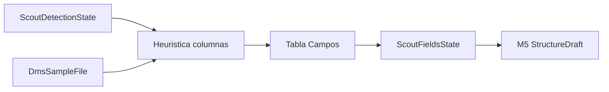
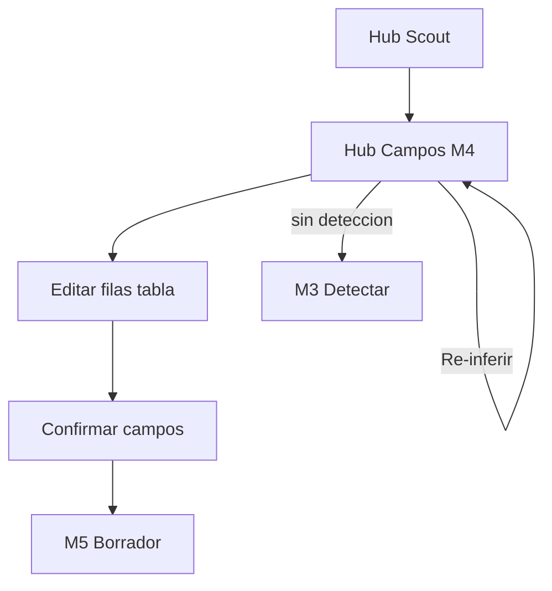
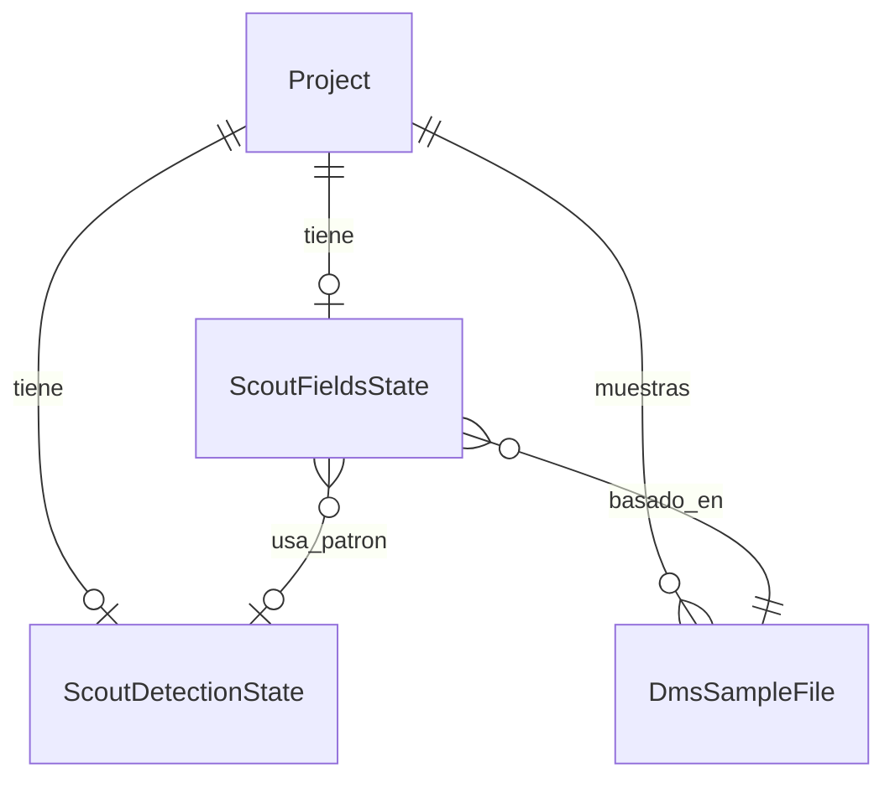

# Propose fields — STRUCTURE SCOUT Módulo 4

Proceso y especificación del **Módulo 4** del Explorador: a partir del **patrón confirmado** (M3) y la **muestra activa** (M2), inferir y permitir editar la **tabla de campos** (nombre, `content_type`, required, confianza, ejemplos) antes de guardar un `StructureDraft` versionado (M5).

> Estado: **implementado**.  
> Producto: [`../STRUCTURE_SCOUT.md`](../STRUCTURE_SCOUT.md).  
> Rama: `feature/structure-scout`.  
> Predecesor: [`detect_pattern.md`](detect_pattern.md) (M3 — patrón confirmado).  
> Siguiente: `save_draft.md` (M5 — borrador versionado).  
> Base técnica: patrón M3 + `detection_service.preview_rows` + catálogo `FieldContentType` / `get_content_type_choices()` + patrones de `source_field_validation_service`.  
> Estilo: hermano de [`detect_pattern.md`](detect_pattern.md) / forma de campo SourceProfile.  
> App: `apps/structure_scout/fields/` · Templates: `templates/structure_scout/fields/`.  
> Prototipos: [`../../prototype/structure_scout/fields/`](../../prototype/structure_scout/fields/).

---

## Propósito

Convertir filas de la muestra (partidas con el patrón M3) en una **lista de campos propuesta** que alimente:

1. El stepper del hub (`Campos` → done / needs_review);
2. El futuro `StructureDraft` (bloque `draft.fields` del JSON de producto §11);
3. El apply a destino (M6) sin “traducción creativa” de tipos.

El usuario **puede corregir** nombres, tipos, required y notas. Scout **propone**; no guarda draft versionado ni aplica a destinos aquí.

```
Patrón confirmado (M3) + muestra (M2)
        →
Partir columnas (delim / header)
        →
Inferir content_type + confianza + ejemplos
        →
Tabla editable
        →
Confirmar campos → estado ScoutFieldsState
        →
CTA Continuar a borrador (M5)
```

---

## Qué es / qué hace / qué no hace

| Pregunta | Respuesta |
|----------|-----------|
| **¿Qué es?** | La revisión asistida del **catálogo de campos** de la muestra |
| **¿Qué hace?** | Infiere columnas, propone `content_type`, muestra ejemplos y confianza; permite editar y confirmar |
| **¿Qué no hace?** | No confirma el patrón de archivo (M3). No versiona `StructureDraft` (M5). No aplica a GATE (M6). No re-sube la muestra (M2) |
| **Copy UX** | “Campos y tipos / proponer estructura” — no “contrato”, “validar producción” ni “mapear destino” |

---

## Relación con M3, DMS y GATE

| Tema | Decisión |
|------|----------|
| Prerrequisito | `ScoutDetectionState` confirmado (`draft_ready` o `needs_review`). Sin ello → CTA a M3 |
| Entrada filas | `preview_rows` + split por `delimiter` / `header_row` / `has_header` de M3 |
| Tipos | **Solo** códigos `FieldContentType` (`content_type`). El JSON producto §11 usa `type` → mapear 1:1 a `content_type` |
| Validación heurística | Reusar `CONTENT_TYPE_PATTERNS` / formatos fecha de `source_field_validation_service`; no inventar regex paralelo salvo gaps documentados |
| Forma de campo | Alinear a SourceProfile: `name`, `content_type`, `required`, + meta Scout (`confidence`, `examples`, `notes`) |
| Parsers tipados | MVP: split delimitado/CSV. Excel: stub / cobertura baja. `txt_fixed`: una o N columnas débiles → `needs_review` (S7) |
| Persistencia | `ScoutFieldsState` (OneToOne `Project` + JSON `fields`) — **no** `StructureDraft` aún |



**Frontera M3 vs M4:** M3 = patrón global del archivo. M4 = **lista de campos** sobre ese patrón.  
**Frontera M4 vs M5:** M4 = estado de trabajo editable; M5 = snapshot versionado exportable / aplicable.

---

## Alcance de este documento

| Incluido | Excluido |
|----------|----------|
| Requiere detección confirmada | Editar patrón archivo (M3) |
| Inferir / editar lista de campos | Versionar `StructureDraft` (M5) |
| Catálogo `content_type` DMS/GATE | Apply a destino (M6) |
| Confirmar → `draft_ready` / `needs_review` | LLM para nombrar campos |
| Re-inferir (resetea a heurística) | JSON/XML / posicional robusto (Fase 2) |
| Preview de ejemplos por columna | Cross-compañía |
| Permisos PA/ED editan; GE acepta | Upload muestra (M2) |

### Casos especiales MVP

| Caso | Comportamiento |
|------|----------------|
| Sin encabezado | Nombres `col_1` … `col_N`; usuario puede renombrar |
| Pocas filas (&lt; 3 datos) | Confianza baja / `needs_review` (S4) |
| Tipos mixtos en columna | `content_type` más general (`free_text` / `alphanumeric`) + `needs_review` |
| `txt_fixed` | Advertencia; campos tentativos; status mínimo `needs_review` |
| `xlsx` | Stub: columnas limitadas o mensaje; status `needs_review` si preview incompleto |
| Columna vacía | `free_text`, confidence `low`, required false |

---

## Responsabilidades

| Sí | No |
|----|-----|
| Proponer y confirmar catálogo de campos del proyecto Scout | Publicar SourceProfile en otras apps |
| Persistir overrides en `ScoutFieldsState` | Validar archivo de producción |
| Exponer confianza de campos para hub / M5 | Inventar vocabulario de tipos distinto a DMS |

---

## Proceso (flujo de usuario)



1. Desde hub o tras M3 → **Campos y tipos**.
2. Si no hay detección confirmada → empty state + enlace a M3.
3. Ver tabla inferida (nombre, tipo, required, confianza, ejemplos).
4. Opcional: **Re-inferir** (vuelve a partir la muestra con el patrón M3 actual; resetea overrides).
5. Ajustar filas (PA/ED); agregar / quitar campo (MVP: quitar y agregar al final).
6. **Confirmar campos** → estado `draft_ready` o `needs_review`.
7. CTA **Continuar a borrador** (M5; placeholder hasta existir).

### Estados de campos (producto)

| Estado | Significado | Stepper |
|--------|-------------|---------|
| `idle` | Sin confirmación (solo propuesta en memoria / no confirmada) | Campos `is-active` si hay detección |
| `draft_ready` | Campos usables para M5 | Campos `is-done` |
| `needs_review` | Cobertura baja / mixtos / fijo / excel stub | Campos `is-done` + badge revisión |
| `failed` | No se pudieron partir columnas | Campos `is-active`; bloqueo suave a M5 |

---

## Forma de un campo (UI + persistencia)

| Campo | Origen sugerido | Editable MVP | Notas |
|-------|-----------------|--------------|-------|
| `name` | Fila encabezado sanitizada o `col_N` | Sí | Único en la lista; slug-ish |
| `content_type` | Heurística por columna | Sí | Catálogo `FieldContentType` |
| `required` | Default `false` (MVP) | Sí | Checkbox |
| `confidence` | Calculada por columna | No directo | `high` / `medium` / `low` |
| `examples` | Hasta 3 valores no vacíos de la muestra | Solo lectura en UI | CO no ve ejemplos |
| `notes` | Sistema (p. ej. `mixed_types`) | Opcional texto | |
| `ordinal` | Orden en tabla | Sí (orden de filas) | Persistido implícito en array |

### Mapeo JSON producto §11 → persistencia

| Producto (`draft.fields[]`) | Scout / SourceProfile |
|-----------------------------|------------------------|
| `type` | `content_type` |
| `name` | `name` |
| `required` | `required` |
| `confidence` | `confidence` |
| `examples` | `examples` |
| `notes` | `notes` |

Fragmento alineado:

```json
{
  "fields": [
    {
      "name": "documento",
      "content_type": "numeric",
      "required": true,
      "confidence": "high",
      "examples": ["1001", "1002"],
      "notes": ""
    },
    {
      "name": "monto",
      "content_type": "decimal",
      "required": true,
      "confidence": "medium",
      "examples": ["500.00", "250.50"],
      "notes": "mixed_decimal_separators"
    }
  ],
  "status": "draft_ready",
  "confidence": "medium",
  "sample_id": "…",
  "detection_id": "…",
  "confirmed_at": null,
  "notes": ""
}
```

### Reglas de confianza (por campo y global)

| Condición | confidence campo | status al confirmar (global) |
|-----------|------------------|------------------------------|
| ≥80 % celdas encajan en un `content_type` claro + ≥3 filas dato | `high` | `draft_ready` si todos high/medium |
| Encaje parcial / tipos mixtos leves | `medium` | `needs_review` si algún medium+low dominante |
| Vacío, mixtos fuertes, `txt_fixed`, excel stub, &lt;3 filas | `low` | `needs_review` |
| 0 columnas / ilegible | — | `failed` (no confirma) |

Global: el peor caso relevante entre campos + flags de patrón M3 (`needs_review` en detección no bloquea M4 pero sesga a revisión).

---

## Pantallas

| Pantalla | Descripción |
|----------|-------------|
| Hub campos | Tabla editable + CTAs |
| Ayuda | Qué se infiere, límites, roles |

Rutas propuestas:

| Acción | URL | Nombre Django |
|--------|-----|---------------|
| Hub campos | `/app/structure-scout/proyectos/<slug>/campos/` | `fields_hub` |
| Ayuda | `…/campos/ayuda/` | `fields_hub_help` |
| Re-inferir (POST) | mismo hub `action=reinfer` | (PRG en hub) |
| Confirmar (POST) | mismo hub `action=confirm` | (PRG en hub) |

Namespace: `structure_scout:*`.

---

## Reglas de negocio

| ID | Regla |
|----|-------|
| PF1 | Sin detección confirmada no hay campos confirmables → CTA a M3. |
| PF2 | Inferencia usa patrón M3 + muestra; **no** inventar parser (S6). |
| PF3 | Tipos solo del catálogo `FieldContentType` / `get_content_type_choices()`. |
| PF4 | Confirmar no crea `StructureDraft` versionado ni SourceProfile destino. |
| PF5 | Overrides viven en `ScoutFieldsState` del proyecto Scout. |
| PF6 | **PA/ED** editan tabla; **PA/ED/GE** confirman; GE no edita filas (acepta propuesta actual, espejo M3). |
| PF7 | CO: metadatos / conteo de campos sí; **sin** ejemplos ni celdas de muestra. |
| PF8 | Re-inferir **resetea** la tabla a heurística fresca (pisa overrides) + mensaje. |
| PF9 | Tras confirmar, hub marca Campos `is-done` y activa Borrador (placeholder M5). |
| PF10 | PRG en confirmar / re-inferir; sin Django Forms. |
| PF11 | Tenant / kind `structure_scout` únicamente. |
| PF12 | Nombres de campo únicos (case-insensitive) al confirmar. |
| PF13 | Advertir cobertura baja (S4) y tipos mixtos en UI + status. |

---

## Validaciones

| Situación | Severidad | Canal | Texto / comportamiento |
|-----------|-----------|-------|------------------------|
| Sin detección | Error / empty | UI | Confirme el patrón de detección antes de proponer campos. + CTA M3 |
| Sin muestra | Error / empty | UI | Suba una muestra antes de proponer campos. + CTA M2 |
| Lista vacía al confirmar | Error | inline / flash | Agregue al menos un campo. |
| Nombre vacío | Error | inline | Indique el nombre del campo. |
| Nombre duplicado | Error | inline | El nombre del campo debe ser único. |
| Tipo vacío / inválido | Error | inline | Seleccione un tipo de contenido válido. |
| Confirmación OK `draft_ready` | Success | flash | Campos propuestos y confirmados. |
| Confirmación OK `needs_review` | Warning | flash | Campos guardados con revisión pendiente. Revise tipos antes de guardar el borrador. |
| Re-inferir OK | Success | flash | Campos vueltos a inferir desde la muestra. |
| Fallo lectura / 0 columnas | Error | flash + log | No se pudieron inferir campos desde la muestra. Revise el patrón o la muestra. |
| Sin permiso editar | Error | flash | No tiene permiso para editar los campos propuestos. |
| Sin permiso confirmar | Error | flash | No tiene permiso para confirmar los campos. |
| Sin acceso | Error | flash | No tiene acceso a este proyecto Explorador. |

Catálogo: ampliar [`UI_MESSAGES.md`](../definition_app/UI_MESSAGES.md) §3.12 al implementar (bloque Campos).

---

## Modelo conceptual



| Concepto | Descripción | Implementación propuesta |
|----------|-------------|--------------------------|
| `ScoutFieldsState` | JSON `fields` + status + confidence + FKs muestra/detección + `confirmed_at` / `confirmed_by` | Tabla delgada en `apps.structure_scout` |
| Inferencia | Servicio nuevo (p. ej. `propose_fields_service`) | Orquesta preview + split + score tipos |
| Catálogo tipos | `get_content_type_choices()` | Reuso DMS; sin seed propio |

---

## Diseño UX

| Elemento | Criterio |
|----------|----------|
| Eyebrow | `STRUCTURE SCOUT · Campos` |
| Título | Campos y tipos |
| Subtítulo | Revise nombres y tipos propuestos a partir de la muestra y el patrón confirmado. |
| Strip | Proyecto + muestra + chip patrón (tipo / delim) |
| Stepper | Muestra done · Detectar done · Campos active/done · Borrador |
| Tabla | Columnas: #, nombre, content_type, required, confianza, ejemplos, notas |
| CTAs | Re-inferir · Confirmar · Continuar a borrador (disabled M5) · Volver detectar / hub |
| Badges | Status + confianza global; alertas cobertura / mixtos / fijo |

### Wireframe lógico

1. Scope + header + ayuda.  
2. Stepper exploración.  
3. Alert si sin detección / `needs_review` / cobertura baja.  
4. Card resumen (muestra + patrón M3 + enlace Detectar).  
5. Tabla de campos.  
6. Acciones.

---

## Integración con el hub (M1)

Tras M4 (al implementar), `get_hub_context` debe:

| Campo | Comportamiento |
|-------|----------------|
| `has_fields` | `True` si status ∈ {`draft_ready`, `needs_review`} |
| `fields_step_class` | `is-done` si `has_fields`; else `is-active` si `has_detection` |
| `draft_step_class` | `is-active` si `has_fields` (hasta existir M5) |
| CTA Campos | Enlace real a `fields_hub` cuando `has_detection` |
| Nota módulos | Quitar “Campos” de la lista de pendientes |

Tras M3, el CTA «Continuar a campos» en detectar apunta a `fields_hub`.

---

## Matriz de permisos (M4)

| Acción | PA | ED | GE | CO |
|--------|----|----|----|-----|
| Ver hub campos (metadatos / conteo) | Sí | Sí | Sí | Sí* |
| Ver ejemplos de celdas | Sí | Sí | Sí | No |
| Editar filas / agregar / quitar | Sí | Sí | No | No |
| Re-inferir | Sí | Sí | Sí | No |
| Confirmar campos | Sí | Sí | Sí** | No |
| Continuar a M5 | Sí | Sí | Sí | No |

\*CO: sin ejemplos ni valores de muestra.  
\*\*GE confirma aceptación de la propuesta actual; no aplica overrides de filas (servidor ignora POST de edición).

---

## Criterios de aceptación (spec / prototipo)

- [x] Propósito, frontera M3/M5, reuso catálogo DMS documentados
- [x] Forma de campo + mapeo `type` → `content_type`
- [x] Reglas PF1–PF13 y validaciones
- [x] URLs propuestas
- [x] Integración stepper hub
- [x] Prototipos HTML hub campos + ayuda
- [x] Revisión UX del usuario
- [x] «Desarrolla el módulo» → código Django

---

## Implementación

| Pieza | Ubicación |
|-------|-----------|
| Vistas / URLs | `apps/structure_scout/fields/` |
| Servicio | `propose_fields_service` |
| Modelo | `ScoutFieldsState` |
| Templates | `templates/structure_scout/fields/` |
| Prefijo | `/app/structure-scout/proyectos/<slug>/campos/` |
| Hub wiring | `scout_project_service.get_hub_context` + CTA en detectar |
| Mensajes | `UI_MESSAGES.md` §3.12 bloque Campos |

---

## Próximos pasos

1. M4 **implementado** — código en `apps/structure_scout/fields/`.  
2. M5 **implementado** — [`save_draft.md`](save_draft.md) · `apps/structure_scout/draft/`.  
3. Abrir `apply_target.md` (M6).

---

## Referencias

| Documento | Uso |
|-----------|-----|
| [`../STRUCTURE_SCOUT.md`](../STRUCTURE_SCOUT.md) | S4, S6, JSON draft.fields |
| [`detect_pattern.md`](detect_pattern.md) | Patrón confirmado |
| [`sample_upload.md`](sample_upload.md) | Muestra activa |
| `source_profile_service.get_content_type_choices` | Catálogo tipos |
| `source_field_validation_service` | Patrones por tipo |
| [`README.md`](README.md) | Índice |

---

*Documento: `docs/definition_app_STRUCTURE_SCOUT/propose_fields.md` — Módulo 4 STRUCTURE SCOUT (spec + prototipos).*
