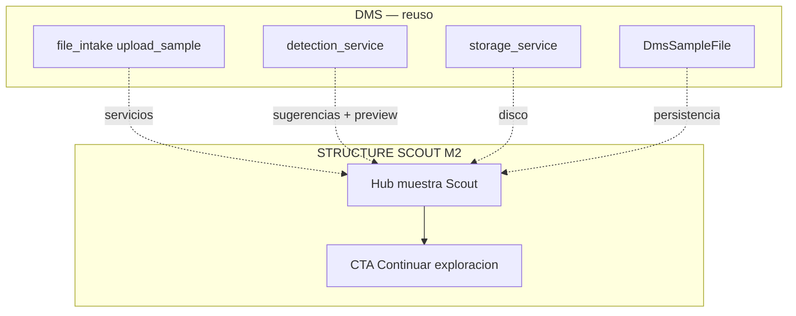
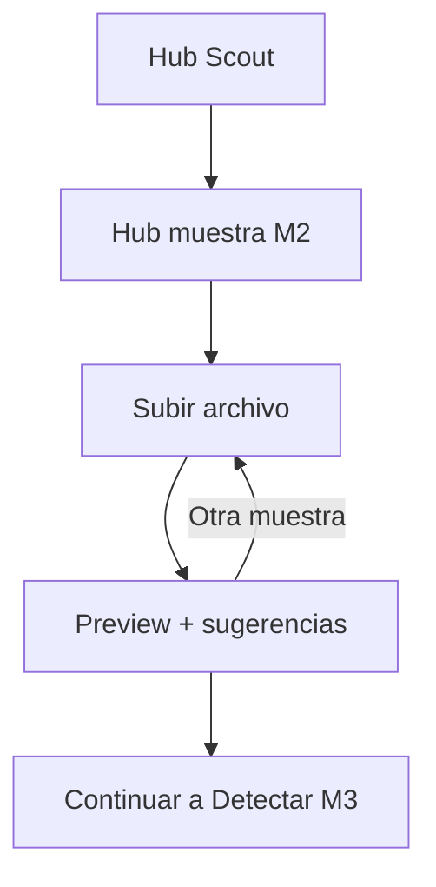
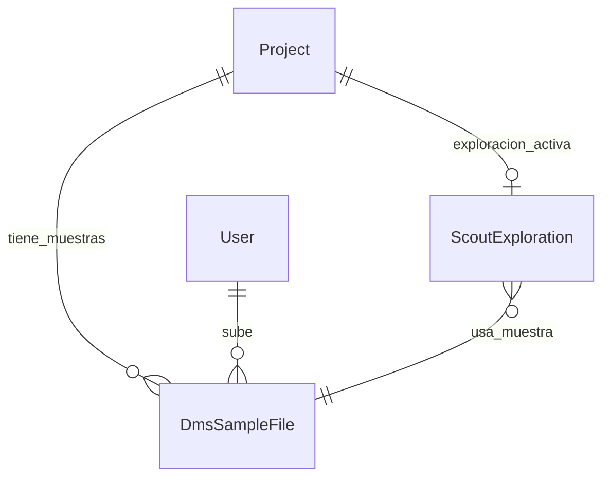

# Sample upload — STRUCTURE SCOUT Módulo 2

Proceso y especificación del **Módulo 2** del Explorador: cargar una **muestra de archivo**, validarla, almacenarla y mostrar **preview crudo** + señales de detección iniciales — sin inferir aún el catálogo completo de campos (M4) ni aplicar a destino (M6).

> Estado: **implementado** (upload, preview, delete, lista; reuso DMS detection/storage).  
> Producto: [`../STRUCTURE_SCOUT.md`](../STRUCTURE_SCOUT.md).  
> Rama: `feature/structure-scout`.  
> Ciclo: [`project_lifecycle.md`](project_lifecycle.md) (hub → este módulo).  
> Siguiente: [`detect_pattern.md`](detect_pattern.md) (M3 — puede compartir la misma pantalla o profundizar sugerencias).  
> Base técnica: [`../definition_app_DMS/file_intake.md`](../definition_app_DMS/file_intake.md) · `apps.dms.file_intake` (`detection_service`, `storage_service`, `DmsSampleFile`).  
> App: `apps/structure_scout/sample/` · templates `templates/structure_scout/sample/` · URLs `/app/structure-scout/proyectos/<slug>/muestra/`.  
> Prototipos: [`../../prototype/structure_scout/sample/`](../../prototype/structure_scout/sample/).

---

## Propósito

Permitir que el diseñador o ejecutor **seleccione un archivo local** (browse / drag & drop), lo suba de forma segura y obtenga:

1. Confirmación de recepción (nombre, tamaño, hash);
2. **Preview crudo** de las primeras filas;
3. **Sugerencias heurísticas** (tipo, encoding, delimitador, line ending) vía `detection_service`;
4. Una muestra persistida lista para M3–M5 (detectar → campos → draft).

La muestra **no es archivo de producción** ni dispara validación GATE, emisión Reverse ni conciliación Match.

```
Browse / drop muestra
        →
Validar extensión + tamaño
        →
Almacenar (sanitizado) + hash
        →
Preview + sugerencias
        →
CTA: Continuar a detectar / revisar campos
```

---

## Qué es / qué hace / qué no hace

| Pregunta | Respuesta |
|----------|-----------|
| **¿Qué es?** | El ingreso de la **muestra** que alimenta la exploración Scout |
| **¿Qué hace?** | Upload seguro, preview, sugerencias iniciales, listado/reemplazo de muestras del proyecto |
| **¿Qué no hace?** | No propone la tabla completa de campos/tipos (M4). No guarda `StructureDraft` (M5). No aplica a GATE (M6). No ejecuta jobs de producción |
| **Copy UX** | “Muestra / archivo de ejemplo” — **no** “archivo de producción”, “validar”, “conciliar” |

---

## Relación con DMS File intake

| Tema | Decisión |
|------|----------|
| Flujo | Solo contexto **muestra** (no producción) |
| Detección | Reusar `detection_service.build_suggestions` / `preview_rows` / `human_size` / `extension_of` |
| Storage | Reusar `storage_service.store_upload` / `sanitize_filename` (path bajo proyecto Scout) |
| Persistencia | **Preferida:** reutilizar modelo `DmsSampleFile` ligado al `Project` Scout (mismo patrón FilePipe). Alternativa: `ScoutSampleFile` espejo solo si el FK/versionado DMS resulta rígido |
| UI/JS | Adaptar patrón dropzone de `file_intake.js` / CSS; skin Structure Scout |
| Límites | `SAMPLE_MAX_BYTES` = **10 MB** (misma constante DMS) |
| Preview | `PREVIEW_LINE_LIMIT` = **20** filas |
| Parsers | **No** inventar parser; preview crudo vía detection; parse tipado en M3/M4 con `source_parser_service` cuando haya draft de campos |



---

## Alcance de este documento

| Incluido | Excluido (otro módulo / app) |
|----------|------------------------------|
| UI browse + drag & drop de **una** muestra | Inferencia completa de campos/tipos (M4) |
| Validación extensión / tamaño / vacío | Detección profunda posicional / captura (detalle M3) |
| Persistencia de muestra + hash + metadatos | Guardar `StructureDraft` (M5) |
| Preview crudo (N filas) | Aplicar a destino (M6) |
| Sugerencias básicas (tipo, encoding, delimitador, LE) | Historial formal de exploraciones (M7) — aquí solo lista de muestras del proyecto |
| Eliminar / reemplazar muestra | Upload de producción / job execution |
| Permisos PA/ED/GE según matriz | Cross-compañía |
| Mensajes UI de upload/preview | PROFILE_SEED / Bridge GATE |

---

## Responsabilidades

| Sí | No |
|----|-----|
| Recibir y guardar la muestra del Explorador | Validar contra contrato publicado |
| Mostrar preview y sugerencias iniciales | Generar archivo de envío |
| Dejar la muestra lista para M3 | Conciliar A vs B |
| Aislar por proyecto / compañía | Auto-publicar destinos |

---

## Extensiones MVP (whitelist)

Alineado a producto Scout (tipos amigables):

| Extensión | Tipo sugerido típico | MVP |
|-----------|----------------------|-----|
| `.csv` | `csv` | **Sí** |
| `.xlsx` / `.xls` | `xlsx` | **Sí** (preview Excel: mensaje stub o primeras filas vía openpyxl si detection ya lo soporta) |
| `.txt` | `txt_delimited` (o fijo si heurística lo sugiere) | **Sí** |
| `.tsv` | `txt_delimited` (tab) | **Sí** si está en catálogo / accept |
| `.json` / `.xml` | — | **No** MVP (Fase 2) |
| Binarios / `.zip` / `.pdf` | — | **No** |

`accept` del input: `.csv,.xlsx,.xls,.txt,.tsv` (ajustar a catálogo `SourceFileType` al implementar).

**Regla SU-W1:** si la extensión no está en whitelist, rechazo en cliente y servidor (no guardar).

---

## Proceso (flujo de usuario)



1. Desde el hub del proyecto → **Cargar / cambiar muestra**.
2. Seleccionar archivo (browse o drop) → validación cliente (extensión, ≤ 10 MB).
3. Subir (multipart) → servidor valida, almacena, calcula hash, corre `build_suggestions` + `preview_rows`.
4. UI muestra: metadatos, sugerencias, tabla preview, CTAs **Continuar a detectar** / **Quitar muestra**.
5. (Opcional) Listar muestras previas del proyecto; la **activa** para exploración es la más reciente o la marcada explícitamente (MVP: **última subida**).

### Estados UI del upload

| Estado | Significado |
|--------|-------------|
| `idle` | Sin archivo seleccionado |
| `selected` | Archivo en cliente, aún no subido |
| `uploading` | POST en curso |
| `ready` | Muestra persistida + preview OK |
| `rejected` | Validación fallida (mensaje) |
| `failed` | Error inesperado (mensaje genérico + log) |

---

## Pantallas

| Pantalla | Descripción |
|----------|-------------|
| Hub muestra | Dropzone + metadatos muestra activa + preview + sugerencias + lista de muestras |
| Ayuda | Límites, roles, qué es “muestra” vs producción |

Rutas propuestas:

| Acción | URL | Nombre Django |
|--------|-----|---------------|
| Hub muestra | `/app/structure-scout/proyectos/<slug>/muestra/` | `sample_hub` |
| Ayuda | `…/muestra/ayuda/` | `sample_hub_help` |
| Subir (POST) | `…/muestra/subir/` | `sample_upload` |
| Preview (GET JSON) | `…/muestra/<uuid:sample_id>/preview/` | `sample_preview` |
| Eliminar (POST) | `…/muestra/<uuid:sample_id>/eliminar/` | `sample_delete` |

Namespace: `structure_scout:*`.

---

## Reglas de negocio

| ID | Regla |
|----|-------|
| SU1 | La muestra **no** es archivo de producción; copy y límites deben dejarlo claro (S3). |
| SU2 | Un proyecto Scout puede tener **varias** muestras históricas; la exploración activa usa la **última** (MVP) salvo que M3/M5 fijen otra referencia. |
| SU3 | Subir / eliminar muestra: **PA**, **ED** o **GE** (GE puede explorar; no edita draft en M5). **CO:** no sube; puede ver metadatos si la matriz lo permite, **sin** preview de datos en MVP. |
| SU4 | Extensión fuera de whitelist → rechazo; no persistir. |
| SU5 | Tamaño &gt; 10 MB → rechazo con límite indicado. |
| SU6 | Archivo vacío → rechazo. |
| SU7 | Nombre sanitizado en disco; path interno opaco al usuario. |
| SU8 | Hash SHA-256 al almacenar (auditoría / dedupe blando). |
| SU9 | Tenant: solo miembros / visibilidad del proyecto Scout; sin lectura cruzada. |
| SU10 | No duplicar parsers: detection + storage DMS. |
| SU11 | Tras upload exitoso, el hub del proyecto marca paso **Muestra** como `is-done` y activa **Detectar**. |
| SU12 | Eliminar muestra activa deja el stepper en “sin muestra” si no queda otra. |
| SU13 | PRG o JSON+toast según patrón intake; sin Django Forms. |

---

## Validaciones

| Situación | Severidad | Canal | Texto / comportamiento |
|-----------|-----------|-------|------------------------|
| Extensión no permitida | Error | JSON / flash | Tipo de archivo no permitido. Use CSV, Excel o TXT. |
| Archivo vacío | Error | JSON / flash | El archivo está vacío. |
| Tamaño &gt; 10 MB | Error | JSON / flash | El archivo supera el límite de 10 MB para muestras. |
| Sin permiso | Error | flash + redirect | No tiene permiso para subir muestras en este proyecto. |
| Sin acceso al proyecto | Error | flash | No tiene acceso a este proyecto Explorador. |
| Subida OK | Success | JSON `user_message` / flash | Muestra subida correctamente. |
| Eliminación OK | Success | flash / JSON | Muestra eliminada. |
| Preview no disponible (Excel stub) | Info | UI | Preview limitado para Excel en esta versión; la detección de tipo sigue disponible. |
| Error inesperado | Error | flash + log | Ocurrió un error al subir la muestra. Si persiste, contacte al administrador. |

Catálogo: ampliar [`UI_MESSAGES.md`](../definition_app/UI_MESSAGES.md) §3.12 al implementar (bloque Muestra).

---

## Modelo conceptual



| Concepto | Descripción | Reuso |
|----------|-------------|-------|
| Muestra | Archivo de ejemplo del proyecto Scout | `DmsSampleFile` (preferido) |
| Sugerencias | JSON tipo/encoding/delimiter/LE | Campo `suggestions` + `detection_service` |
| Preview | Filas crudas para UI | `preview_rows` (no persistir filas en MVP) |
| Exploración activa | Referencia a muestra usada (M3+) | Modelo propio Scout en M3/M5; M2 solo deja la muestra lista |

### Campos mínimos expuestos en UI

| Campo | Origen |
|-------|--------|
| `original_filename` | Upload |
| `size_label` | `human_size` |
| `content_hash` (corto) | Storage |
| `created_at` / `uploaded_by` | Modelo |
| `suggestions.*` | detection |
| `preview_rows[]` | detection |

---

## Diseño UX

| Elemento | Criterio |
|----------|----------|
| Eyebrow | `STRUCTURE SCOUT · Muestra` |
| Título | Cargar muestra |
| Subtítulo | Archivo de ejemplo para proponer la estructura. No es validación ni producción. |
| Dropzone | Mismo patrón visual FilePipe; textos Scout |
| Strip proyecto | slug + nombre + rol |
| Stats | Nº muestras · límite 10 MB · muestra activa (nombre) |
| CTA primario tras `ready` | Continuar a detectar (M3) — en prototipo placeholder si M3 no existe aún |
| CTA secundario | Volver al hub · Eliminar muestra |
| Stepper mini | Muestra activa · Detectar · Campos · Borrador (solo Muestra done tras upload) |

### Wireframe lógico

1. Scope strip proyecto.  
2. Header + ayuda.  
3. Dropzone / selector.  
4. Panel “Muestra activa” (metadatos + sugerencias chips).  
5. Tabla preview (línea | raw | parsed opcional).  
6. Lista de muestras anteriores (nombre, tamaño, fecha, acciones).  
7. CTAs Continuar / Volver.

---

## Integración con el hub (M1)

Tras implementar M2, `scout_project_service.get_hub_context` debe:

| Campo hub | Comportamiento |
|-----------|----------------|
| `has_sample` | `True` si existe ≥ 1 `DmsSampleFile` del proyecto |
| `sample_step_class` | `is-done` si `has_sample`, else `is-active` |
| `detect_step_class` | `is-active` si `has_sample` y aún no hay detección confirmada (M3) |
| `exploration_label` | Nombre de la última muestra o “Sin exploración” |
| CTA hub | Enlace real a `sample_hub` (quitar “próximamente”) |

---

## Matriz de permisos (M2)

| Acción | PA | ED | GE | CO |
|--------|----|----|----|-----|
| Ver hub muestra (metadatos) | Sí | Sí | Sí | Sí* |
| Subir / reemplazar / eliminar | Sí | Sí | Sí | No |
| Ver preview con datos | Sí | Sí | Sí | No (MVP) |
| Continuar a M3 | Sí | Sí | Sí | No |

\*CO: solo metadatos si tiene acceso al proyecto; sin filas de preview.

---

## Criterios de aceptación (spec / prototipo)

- [x] Propósito, alcance, frontera DMS documentados
- [x] Whitelist, límites 10 MB, reglas SU1–SU13
- [x] URLs y pantallas propuestas
- [x] Validaciones y mensajes borrador
- [x] Integración con stepper del hub definida
- [x] Prototipos HTML hub muestra + ayuda
- [x] Revisión UX del usuario
- [x] «Desarrolla el módulo» → código Django

---

## Implementación (referencia)

| Pieza | Ubicación |
|-------|-----------|
| Vistas / URLs | `apps/structure_scout/sample/` |
| Servicio | `sample_upload_service` |
| Persistencia | `DmsSampleFile` (`version=None`) |
| Storage / detection | `apps.dms.file_intake.services` |
| Templates | `templates/structure_scout/sample/` |
| JS/CSS | `static/js/file_intake.js` · `static/css/file_intake.css` |
| Prefijo | `/app/structure-scout/proyectos/<slug>/muestra/` |

---

## Próximos pasos

1. Abrir `detect_pattern.md` (M3).  
2. CTA «Continuar a detectar» cuando M3 exista.  
3. Spike CSV → draft JSON (M4/M5).

---

## Referencias

| Documento | Uso |
|-----------|-----|
| [`../STRUCTURE_SCOUT.md`](../STRUCTURE_SCOUT.md) | Producto / S3 / S9 |
| [`project_lifecycle.md`](project_lifecycle.md) | Hub y stepper |
| [`../definition_app_DMS/file_intake.md`](../definition_app_DMS/file_intake.md) | Patrón muestra |
| [`../definition_app/UI_MESSAGES.md`](../definition_app/UI_MESSAGES.md) §3.12 | Mensajes (ampliar) |
| [`README.md`](README.md) | Índice Scout |

---

*Documento: `docs/definition_app_STRUCTURE_SCOUT/sample_upload.md` — Módulo 2 STRUCTURE SCOUT (spec + prototipos).*
