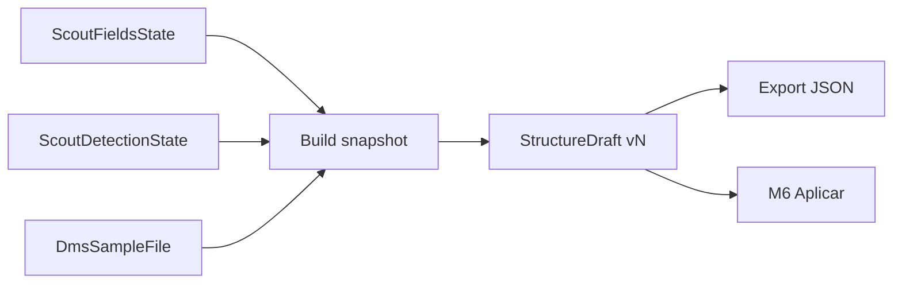
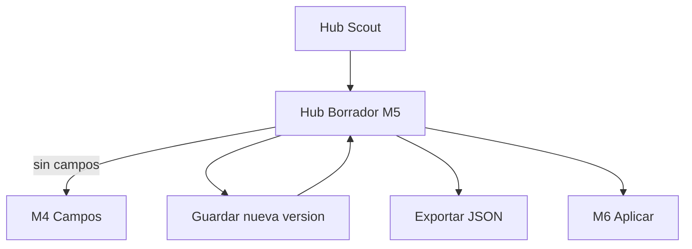
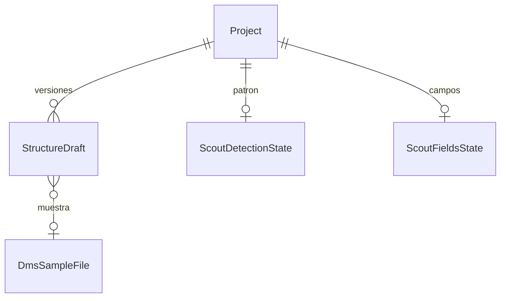

# Save draft — STRUCTURE SCOUT Módulo 5

Proceso y especificación del **Módulo 5** del Explorador: a partir de los **campos confirmados** (M4) y el **patrón** (M3), persistir un **`StructureDraft` versionado** (snapshot alineado a SourceProfile / contrato GATE), con export JSON, antes de aplicar a un destino (M6).

> Estado: **implementado**.  
> Producto: [`../STRUCTURE_SCOUT.md`](../STRUCTURE_SCOUT.md).  
> Rama: `feature/structure-scout`.  
> Predecesor: [`propose_fields.md`](propose_fields.md) (M4 — campos confirmados).  
> Siguiente: `apply_target.md` (M6 — aplicar a destino).  
> Base técnica: `ScoutDetectionState` + `ScoutFieldsState` + muestra (`DmsSampleFile`); forma `source` DMS/GATE.  
> Estilo: hermano de [`propose_fields.md`](propose_fields.md).  
> App: `apps/structure_scout/draft/` · Templates: `templates/structure_scout/draft/`.  
> Prototipos: [`../../prototype/structure_scout/draft/`](../../prototype/structure_scout/draft/).

---

## Propósito

Convertir el estado de trabajo (M3 + M4) en un **borrador congelado y versionable** que alimente:

1. El stepper del hub (`Borrador` → done);
2. El export JSON (evidencia / auditoría ligera);
3. El apply a destino (M6) sin traducción creativa de tipos.

El usuario **guarda una nueva versión** cada vez; Scout **no** aplica a proyectos destino aquí.

```
Campos confirmados (M4) + patrón (M3) + muestra (M2)
        →
Construir snapshot (producto §11 + bloque source)
        →
Guardar StructureDraft vN (is_current)
        →
Export JSON / CTA Continuar a aplicar (M6)
```

---

## Qué es / qué hace / qué no hace

| Pregunta | Respuesta |
|----------|-----------|
| **¿Qué es?** | El **snapshot versionado** de la estructura propuesta (detección + campos) |
| **¿Qué hace?** | Persiste versiones, marca la actual, permite exportar JSON y preparar apply |
| **¿Qué no hace?** | No edita la tabla de campos (M4). No aplica a GATE/Match/Reverse (M6). No publica destinos. No re-infiere |
| **Copy UX** | “Borrador de estructura / StructureDraft” — no “contrato publicado”, “validar” ni “mapear” |

---

## Relación con M4, SourceProfile y M6

| Tema | Decisión |
|------|----------|
| Prerrequisito | `ScoutFieldsState` confirmado (`draft_ready` o `needs_review`). Sin ello → CTA a M4 |
| Entrada | Detección M3 + campos M4 + metadatos muestra activa |
| Persistencia | Tabla **`StructureDraft`** (N versiones / proyecto). **No** OneToOne |
| Versionado | Cada guardado = **nueva versión**; `is_current=True` en la nueva; anterior desmarcada. Nunca pisar en silencio |
| Forma JSON | Payload **dual**: producto §11 + bloque `source` alineado a `DmsSourceProfile` |
| Exploración | MVP **sin** tabla `ScoutExploration`; el draft es el artefacto. M7 puede auditar saves/applies |
| Apply | M6 lee el draft `is_current` (o versión elegida en Fase 2) |



**Frontera M4 vs M5:** M4 = estado de trabajo editable; M5 = **snapshot congelado versionado**.  
**Frontera M5 vs M6:** M5 = guardar/exportar; M6 = sembrar borrador en proyecto destino (misma compañía).

---

## Alcance de este documento

| Incluido | Excluido |
|----------|----------|
| Requiere campos confirmados | Editar campos / re-inferir (M4) |
| Guardar nueva versión de `StructureDraft` | Apply a destino (M6) |
| Listado corto de versiones en hub | Historial completo de applies (M7) |
| Export JSON (versión actual) | Tabla `ScoutExploration` |
| Resumen de snapshot (patrón + N campos) | Diff campo a campo avanzado (Fase 2) |
| Permisos PA/ED guardar; GE/CO ver+export | Cross-compañía / auto-publicar |

---

## Responsabilidades

| Sí | No |
|----|-----|
| Congelar detección + campos en JSON versionado | Publicar SourceProfile en otras apps |
| Exportar evidencia JSON | Validar archivo de producción |
| Exponer draft current al hub / M6 | Inventar vocabulario de tipos distinto a DMS |

---

## Proceso (flujo de usuario)



1. Desde hub o tras M4 → **Borrador de estructura**.
2. Si no hay campos confirmados → empty state + enlace a M4.
3. Ver resumen del snapshot que se guardaría (patrón, N campos, status/confianza M4) y, si existe, la versión actual.
4. **Guardar borrador** (PA/ED) → crea `vN`, marca current.
5. Opcional: **Exportar JSON** de la versión actual.
6. CTA **Continuar a aplicar** (M6; placeholder hasta existir).

### Estados del draft (producto)

| Estado | Origen | Stepper |
|--------|--------|---------|
| (sin draft) | Nunca guardado | Borrador `is-active` si `has_fields` |
| `draft_ready` | Copiado de M4 al guardar | Borrador `is-done` |
| `needs_review` | Copiado de M4 al guardar | Borrador `is-done` + badge revisión |

El status del draft **no se recalcula** en M5: refleja el de `ScoutFieldsState` en el momento del save (más flags de detección si se documentan en notas).

---

## Modelo `StructureDraft` (propuesto)

| Campo | Tipo | Notas |
|-------|------|-------|
| `id` | UUID PK | |
| `project` | FK Project | kind `structure_scout` |
| `version` | PositiveInt | Incremental por proyecto (1, 2, …) |
| `is_current` | bool | Exactamente una current por proyecto cuando hay drafts |
| `status` | char | `draft_ready` / `needs_review` |
| `confidence` | char | `high` / `medium` / `low` |
| `payload` | JSON | Dual: producto + `source` (ver abajo) |
| `sample` | FK nullable | Muestra referida al guardar |
| `sample_filename` | char | Copia denormalizada |
| `sample_hash_short` | char | Copia corta para UI |
| `notes` | text | Opcional (usuario / sistema) |
| `created_by` | FK User | Quién guardó |
| `created_at` | datetime | |

Índice único sugerido: `(project, version)`. Constraint lógico: una sola `is_current=True` por proyecto.

---

## Forma JSON del `payload`

### A) Producto (§11) — legible / export

```json
{
  "schema_version": "1.0",
  "kind": "structure_scout",
  "version": 2,
  "status": "needs_review",
  "confidence": "medium",
  "sample": {
    "id": "…",
    "filename": "empleados_muestra.csv",
    "content_hash_short": "a1b2c3"
  },
  "detection": {
    "file_type_code": "csv",
    "encoding_code": "utf-8",
    "line_ending_code": "lf",
    "delimiter": ";",
    "header_row": 1,
    "has_header": true,
    "capture_start": null,
    "capture_end": null,
    "confidence": "high",
    "status": "draft_ready",
    "notes": ""
  },
  "draft": {
    "fields": [
      {
        "name": "documento",
        "type": "numeric",
        "content_type": "numeric",
        "required": true,
        "confidence": "high",
        "examples": ["1001", "1002"],
        "notes": ""
      }
    ]
  },
  "apply": {
    "allowed_targets": ["file_gate", "reverse_studio", "file_match", "filepipe"],
    "auto_publish": false
  }
}
```

> En `draft.fields[]`, `type` = alias de producto (= `content_type`) para compatibilidad §11.

### B) Bloque `source` — apply M6

Alineado a forma `DmsSourceProfile` (subset MVP):

```json
{
  "source": {
    "file_type_code": "csv",
    "encoding_code": "utf-8",
    "line_ending_code": "lf",
    "delimiter": ";",
    "header_row": 1,
    "has_header": true,
    "fields": [
      {
        "name": "documento",
        "label": "documento",
        "content_type": "numeric",
        "required": true
      }
    ]
  }
}
```

Meta Scout (`confidence`, `examples`, `notes` por campo) vive en `draft.fields`; el bloque `source.fields` se mantiene limpio para clone/merge en destino.

### Export CO

Al exportar como CO: omitir `examples` en `draft.fields` (solo metadatos).

---

## Pantallas

| Pantalla | Descripción |
|----------|-------------|
| Hub borrador | Resumen + versiones + CTAs |
| Ayuda | Qué se congela, versionado, roles |

Rutas propuestas:

| Acción | URL | Nombre Django |
|--------|-----|---------------|
| Hub borrador | `/app/structure-scout/proyectos/<slug>/borrador/` | `draft_hub` |
| Ayuda | `…/borrador/ayuda/` | `draft_hub_help` |
| Guardar (POST) | mismo hub `action=save` | (PRG) |
| Export JSON | `…/borrador/exportar/` | `draft_export` |

Namespace: `structure_scout:*`.

---

## Reglas de negocio

| ID | Regla |
|----|-------|
| SD1 | Sin campos confirmados no hay borrador guardable → CTA a M4. |
| SD2 | Guardar **siempre** crea versión nueva; no overwrite silencioso. |
| SD3 | Exactamente un `is_current` por proyecto con drafts. |
| SD4 | Snapshot toma M3+M4 **al momento del save** (no live-edit del payload en MVP). |
| SD5 | Guardar no publica destinos ni escribe SourceProfile ajeno. |
| SD6 | **PA/ED** guardan; **GE/CO** ven hub y exportan (CO sin examples). |
| SD7 | Status/confianza del draft = copia de M4 al guardar. |
| SD8 | Tras primer save (o current), hub marca Borrador `is-done` y activa Aplicar (placeholder M6). |
| SD9 | PRG en guardar; export GET (attachment); sin Django Forms. |
| SD10 | Tenant / kind `structure_scout` únicamente. |
| SD11 | Payload incluye bloque `source` listo para M6. |
| SD12 | Si M4 está `needs_review`, el draft nuevo también; UI advierte antes de apply. |

---

## Validaciones

| Situación | Severidad | Canal | Texto / comportamiento |
|-----------|-----------|-------|------------------------|
| Sin campos confirmados | Error / empty | UI | Confirme los campos propuestos antes de guardar el borrador. + CTA M4 |
| Sin detección / muestra inconsistente | Error | flash | No se pudo armar el snapshot. Revise detección y campos. |
| Guardado OK | Success | flash | Borrador de estructura guardado (versión N). |
| Sin permiso guardar | Error | flash | No tiene permiso para guardar el borrador de estructura. |
| Sin draft al exportar | Error | flash | No hay borrador para exportar. Guarde una versión primero. |
| Sin permiso export / acceso | Error | flash | No tiene acceso a este proyecto Explorador. / Sin permiso para exportar. |

Catálogo: ampliar [`UI_MESSAGES.md`](../definition_app/UI_MESSAGES.md) §3.12 al implementar (bloque Borrador).

---

## Modelo conceptual



| Concepto | Descripción | Implementación propuesta |
|----------|-------------|--------------------------|
| `StructureDraft` | Versión snapshot + `is_current` | Tabla en `apps.structure_scout` |
| Builder | Arma payload dual desde M3/M4/muestra | `save_draft_service` |
| Current | La versión marcada para M6 / export default | `is_current` |

---

## Diseño UX

| Elemento | Criterio |
|----------|----------|
| Eyebrow | `STRUCTURE SCOUT · Borrador` |
| Título | Borrador de estructura |
| Subtítulo | Congela patrón y campos en una versión exportable. No publica destinos. |
| Strip | Proyecto + muestra + versión current |
| Stepper | … Campos done · Borrador active/done · (Aplicar en fase aplicación) |
| Resumen | Chips: tipo archivo, delim, N campos, status, confianza |
| Tabla versiones | vN · fecha · usuario · status · current badge |
| CTAs | Guardar nueva versión · Exportar JSON · Continuar a aplicar (disabled) · Volver campos |

### Wireframe lógico

1. Scope + header + ayuda.  
2. Stepper.  
3. Alert si sin campos / `needs_review`.  
4. Card “Se guardará” (snapshot preview) o “Versión actual”.  
5. Lista de versiones.  
6. Acciones.

---

## Integración con el hub (M1)

Tras M5 (al implementar), `get_hub_context` debe:

| Campo | Comportamiento |
|-------|----------------|
| `has_draft` | `True` si existe `StructureDraft` con `is_current` |
| `draft_step_class` | `is-done` si `has_draft`; else `is-active` si `has_fields` |
| `apply_step_class` | `is-active` si `has_draft` (hasta M6) |
| `draft_status_label` | p. ej. `v2 · Listo` / `v2 · Revisión` / `Sin borrador` |
| CTA Borrador | Enlace a `draft_hub` cuando `has_fields` |
| Nota módulos | Quitar “Borrador” de pendientes |

Tras M4, CTA «Continuar a borrador» apunta a `draft_hub`.

---

## Matriz de permisos (M5)

| Acción | PA | ED | GE | CO |
|--------|----|----|----|-----|
| Ver hub borrador | Sí | Sí | Sí | Sí* |
| Ver ejemplos en resumen | Sí | Sí | Sí | No |
| Guardar nueva versión | Sí | Sí | No | No |
| Exportar JSON | Sí | Sí | Sí | Sí** |
| Continuar a M6 | Sí | Sí | No | No |

\*CO: metadatos de versiones sin ejemplos.  
\*\*CO: JSON sin `examples`.

---

## Criterios de aceptación (spec / prototipo)

- [x] Propósito, frontera M4/M6, payload dual documentados
- [x] Modelo versionado + reglas SD1–SD12
- [x] Validaciones y permisos
- [x] URLs propuestas
- [x] Integración stepper hub
- [x] Prototipos HTML hub borrador + ayuda
- [x] Revisión UX del usuario
- [x] «Desarrolla el módulo» → código Django

---

## Implementación

| Pieza | Ubicación |
|-------|-----------|
| Vistas / URLs | `apps/structure_scout/draft/` |
| Servicio | `save_draft_service` |
| Modelo | `StructureDraft` |
| Templates | `templates/structure_scout/draft/` |
| Prefijo | `/app/structure-scout/proyectos/<slug>/borrador/` |
| Hub wiring | `scout_project_service.get_hub_context` + CTA en campos |
| Mensajes | `UI_MESSAGES.md` §3.12 bloque Borrador |

---

## Próximos pasos

1. M5 **implementado** — código en `apps/structure_scout/draft/`.  
2. M6 **implementado** — [`apply_target.md`](apply_target.md) · `apps/structure_scout/apply/`.  
3. Abrir `history.md` (M7).

---

## Referencias

| Documento | Uso |
|-----------|-----|
| [`../STRUCTURE_SCOUT.md`](../STRUCTURE_SCOUT.md) | §11 JSON, S1–S2, roles |
| [`propose_fields.md`](propose_fields.md) | Campos confirmados |
| [`detect_pattern.md`](detect_pattern.md) | Patrón |
| SourceProfile / GATE | Forma `source` destino |
| [`README.md`](README.md) | Índice |

---

*Documento: `docs/definition_app_STRUCTURE_SCOUT/save_draft.md` — Módulo 5 STRUCTURE SCOUT (spec + prototipos).*
