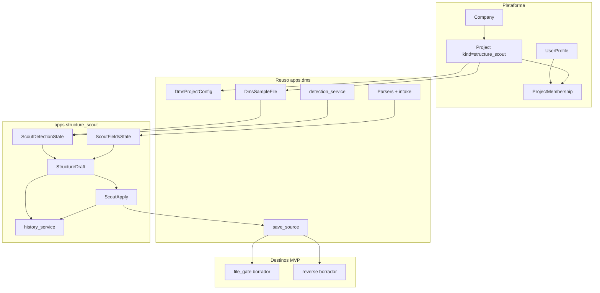

# Integración STRUCTURE SCOUT ↔ DynamicWorkspace

Alineación del **Explorador de estructura (STRUCTURE SCOUT)** con la plataforma: compañías, usuarios, seguridad, proyectos, reuso DMS, frontera PROFILE_SEED / Bridge GATE y convenciones Django ya implementadas (M1–M7).

> Estado: **documentado** (refleja implementación M1–M7 en `apps.structure_scout`).  
> Producto: [`../STRUCTURE_SCOUT.md`](../STRUCTURE_SCOUT.md).  
> Rama: `feature/structure-scout`.  
> Fuente de verdad plataforma: [`../DynamicWorkspace.md`](../DynamicWorkspace.md), [`../definition_app/DynamicWorkspace_Model.md`](../definition_app/DynamicWorkspace_Model.md).  
> Patrón hermano: [`../definition_app_FILE_MATCH/fm_integration.md`](../definition_app_FILE_MATCH/fm_integration.md), [`../definition_app_DMS/dms_integration.md`](../definition_app_DMS/dms_integration.md).  
> Specs por módulo: [`README.md`](README.md).  
> Mensajes UI: [`../definition_app/UI_MESSAGES.md`](../definition_app/UI_MESSAGES.md) §3.12.

---

## Principio

STRUCTURE SCOUT **no duplica** tenant, autenticación ni el contenedor de proyecto. Es una app delgada (`apps.structure_scout`) que:

1. reutiliza `Company`, `UserProfile`, `Project`, `ProjectMembership`, seguridad y billing;
2. reutiliza sample intake, detección y parsers de `apps.dms` (**cero parsers nuevos**);
3. aporta **obra propia**: estado de detección/campos, `StructureDraft` versionado, apply a destino y historial unificado;
4. escribe en destinos **solo borrador** vía `source_persistence_service.save_source` (nunca publica).



**Diferenciador vs PROFILE_SEED:** Scout = desde **muestra**; Seed = desde **definición publicada**. Ambos pueden sembrar borrador en un destino; el origen del snapshot es distinto.

**Diferenciador vs Bridge GATE:** Bridge = pre-check por **hash** de archivo en jobs; Scout = inferir estructura y sembrar contrato/borrador.

---

## Jerarquía tenant

```
Company
 ├── UserProfile (UA | US | UF)
 ├── Subscription
 └── Project (project_kind = structure_scout)
      ├── DmsProjectConfig (visibilidad)
      ├── DmsSampleFile (version=None — muestra Scout)
      ├── ScoutDetectionState (1:1 — M3)
      ├── ScoutFieldsState (1:1 — M4)
      ├── StructureDraft (N — M5, is_current)
      └── ScoutApply (N — M6 auditoría)
```

**No hay** en MVP: `ScoutExploration`, `ScoutConfig` aparte, ni tabla de historial dedicada (M7 lee drafts + applies).

**Reglas heredadas:**

1. Todo usuario opera dentro de `user.profile.company` (salvo UA soporte).
2. Todo proyecto pertenece a una `Company`.
3. Acceso a `/app/` requiere seguridad completa + suscripción vigente (US/UF).
4. Sin membresía / visibilidad de compañía → sin acceso al proyecto Scout.
5. Cross-compañía: **no** (regla S10).

---

## Tipos de usuario global

| Tipo | Rol en STRUCTURE SCOUT |
|------|------------------------|
| **UA** | Soporte; no opera el Explorador de negocio en MVP |
| **US** | Gestiona UF; ve proyectos Scout de su compañía según membresía/visibilidad |
| **UF** | Crea proyectos Scout; explora, guarda, aplica según rol de proyecto |

Scout **no introduce** tipos de usuario nuevos. Permisos granulares = `ProjectMembership.role`.

---

## Discriminador `project_kind`

| Campo | Valor | Descripción |
|-------|-------|-------------|
| `Project.project_kind` | `structure_scout` | Constante `Project.KIND_STRUCTURE_SCOUT` |
| Label UI | STRUCTURE SCOUT (Explorador) | Sidebar / listados |

Otros kinds en la misma plataforma: `workspace`, `dms` (FilePipe), `file_gate`, `reverse`, `file_match`. Un usuario puede tener varios kinds en la misma compañía.

Listados y servicios Scout **filtran siempre** por `project_kind=structure_scout`.

---

## Configuración: reuso `DmsProjectConfig`

No hay `ScoutConfig` separado en MVP. Scout usa el OneToOne `DmsProjectConfig` para:

| Campo | Uso en Scout |
|-------|----------------|
| `visibility` | `company` \| `members_only` (alta / listado / acceso CO) |

No usa en MVP: `current_version`, flags `file_gate_*` del bridge (eso es destino GATE / Match, no el proyecto Scout).

---

## Modelos propios (`apps.structure_scout`)

| Modelo | Relación | Módulo | Rol |
|--------|----------|--------|-----|
| `ScoutDetectionState` | 1:1 `Project` | M3 | Patrón confirmado (tipo, encoding, delim, header…) |
| `ScoutFieldsState` | 1:1 `Project` | M4 | Tabla campos / tipos / confianza |
| `StructureDraft` | N:1 `Project` | M5 | Snapshot versionado + `payload` dual + `is_current` |
| `ScoutApply` | N:1 `Project` | M6 | Auditoría apply → destino (ok/failed) |

### Persistencia muestra

| Artefacto | Decisión congelada |
|-----------|-------------------|
| `DmsSampleFile` | `version=None` (muestra Scout, no versión DMS publicada) |
| Hash / storage | Reuso intake DMS; TTL / retención como samples DMS |

### Payload draft (M5)

JSON con:

- bloque producto (§11 / `kind: structure_scout`, `draft.fields`, detección);
- bloque `source` alineado a forma SourceProfile / GATE para apply sin “traducción creativa”.

### Apply (M6)

| Tema | Decisión |
|------|----------|
| Destinos MVP | `file_gate`, `reverse` (misma compañía) |
| Persistencia | `save_source` en **2 pasos** (meta → fields) |
| Publicación | **Nunca** auto-publica |
| Permisos | PA/ED en Scout **y** PA/ED editable en destino |
| Deep-link | `file_gate:schema_hub` / `reverse_studio:input_hub` |
| Fase 2 | Match A/B, FilePipe origen |

### Historial (M7)

Solo lectura: timeline unificada `StructureDraft` + `ScoutApply`. Sin `ScoutExploration`.

---

## Reuso técnico DMS (obligatorio)

| Pieza | Dónde | Scout |
|-------|-------|-------|
| Sample intake / storage / hash | `apps.dms.file_intake` | Upload muestra M2 |
| Detección | `apps.dms` `detection_service` | Sugerencias M3 |
| Parsers / preview | parsers DMS | Preview + inferencia campos M4 |
| Catálogos `content_type` | catálogos DMS | Heurística tipos M4 |
| `save_source` | `source_persistence_service` | Apply M6 |
| `DmsProjectConfig` | visibilidad | M1 |

**Prohibido:** copiar parsers o detection engine a `apps.structure_scout`.

---

## Frontera PROFILE_SEED / Bridge

| Producto | Entrada | Salida típica |
|----------|---------|----------------|
| **STRUCTURE SCOUT** | Muestra de archivo | `StructureDraft` → borrador destino |
| **PROFILE_SEED** | Definición / perfil publicado | Clona forma → borrador destino |
| **Bridge GATE** | Hash de archivo en job | Pre-check passed / warnings |

Compartible a futuro: capa “aplicar estructura a destino” (`save_source` + auditoría). Seed no usa `StructureDraft` Scout; Scout no clona desde definición publicada.

---

## Membresía y matriz de permisos

Reuso total de `ProjectMembership` + `project_service`.

| Rol | Código | Uso Scout |
|-----|--------|-----------|
| Project Admin | `PA` | Todo: config, miembros, muestra, detectar, campos, draft, apply, historial, export |
| Editor | `ED` | Igual que PA salvo gestionar miembros |
| Generar / Ejecutar | `GE` | Subir muestra / explorar; ver hubs; export; **no** editar campos ni apply |
| Consulta | `CO` | Ver hubs / historial / export metadatos; **sin** preview muestra ni examples en JSON |

Al crear proyecto Scout, el `owner` recibe membresía **PA**.

### Matriz acción → rol (MVP implementado)

| Acción | PA | ED | GE | CO |
|--------|----|----|----|-----|
| Ver proyecto / hub / historial | Sí | Sí | Sí | Sí |
| Crear proyecto Scout | Sí* | Sí* | — | — |
| Gestionar miembros | Sí | No | No | No |
| Subir / eliminar muestra | Sí | Sí | Sí | No |
| Preview muestra | Sí | Sí | Sí | No |
| Confirmar detección | Sí | Sí | Sí** | No |
| Confirmar / editar campos | Sí | Sí | No | No |
| Guardar `StructureDraft` | Sí | Sí | No | No |
| Export JSON (current / versión) | Sí | Sí | Sí | Sí*** |
| Aplicar a destino | Sí | Sí | No | No |
| Ver examples en detalle draft | Sí | Sí | Sí | No |

\*Crear: UF con flujo de alta (owner → PA).  
\*\*GE: según matriz producto “subir / ejecutar exploración”; no confirma tipos finales (M4).  
\*\*\*CO: export sin examples (H7 / M5).

UI miembros: `/app/structure-scout/proyectos/<slug>/miembros/` (+ ayuda).

---

## URLs y navegación (congeladas)

Prefijo de app: `/app/structure-scout/` · `app_name = structure_scout` · montaje en `dynamicworkspace/urls.py`.

| Área | Ruta | Nombre URL |
|------|------|------------|
| Guía producto | `/app/structure-scout/ayuda/` | `structure_scout_guide` |
| Listado | `/app/structure-scout/proyectos/` | `project_list` |
| Alta | `…/proyectos/nuevo/` | `project_create` |
| Hub | `…/proyectos/<slug>/` | `project_hub` |
| Miembros | `…/proyectos/<slug>/miembros/` | `project_members` |
| Muestra | `…/muestra/` | `sample_*` |
| Detectar | `…/detectar/` | `detect_*` |
| Campos | `…/campos/` | `fields_*` |
| Borrador | `…/borrador/` (+ `exportar/`) | `draft_*` |
| Aplicar | `…/aplicar/` | `apply_*` |
| Historial | `…/historial/` (+ detalle draft/apply + export versión) | `history_*` |

Ayudas: sufijo `…/ayuda/` en hubs clave.

**Sidebar UF:** STRUCTURE SCOUT → Explorador + Ayuda (`structure_scout_guide`).

Templates: `templates/structure_scout/<modulo>/`. Prototipos: `prototype/structure_scout/`.  
CSS/JS: reuso `mapping.css` / `projects.css` + `file_intake.js` donde aplica; sin Django Forms.

---

## Stepper hub (ciclo MVP)

| Paso | Flag hub | Módulo |
|------|----------|--------|
| 1 Muestra | `has_sample` | M2 |
| 2 Detectar | `has_detection` | M3 |
| 3 Campos | `has_fields` | M4 |
| 4 Borrador | `has_draft` | M5 |
| 5 Aplicar | `has_apply` (apply ok) | M6 |
| 6 Historial | `has_history` (≥1 draft o apply) | M7 |

Wiring: `scout_project_service.get_hub_context`.

---

## Seguridad y convenciones

| Tema | Criterio |
|------|----------|
| Decoradores | `security_complete_required` + `user_type_required("UF")` en vistas Scout |
| Formularios | HTML plano + `request.POST` / validación en servicios — **sin** Django Forms |
| Resultados | `OperationResult` (`ok` / `error_code` / `user_message` / `errors`) |
| PRG | POST mutadores → redirect + `messages.*` |
| Logs | `logger.exception` técnico; usuario solo catálogo §3.12 |
| Idioma | Docs/UI en español; código en inglés |

---

## Mensajes UI

Catálogo único: [`UI_MESSAGES.md`](../definition_app/UI_MESSAGES.md) §3.12 — bloques M1–M7 (proyectos, muestra, detectar, campos, borrador, aplicar, historial).

No inventar textos nuevos en vistas; constantes MSG alineadas al catálogo.

---

## Checklist de integración (as-built)

- [x] Kind `structure_scout` + alta / listado / hub / miembros
- [x] Sidebar UF Explorador + guía
- [x] Reuso DMS sample + detection + parsers
- [x] Modelos propios detección / campos / draft / apply
- [x] Apply GATE + Reverse solo borrador (`save_source`)
- [x] Historial unificado sin `ScoutExploration`
- [x] Matriz roles + CO sin examples / sin preview
- [x] Mensajes §3.12 M1–M7
- [ ] CTA “Explorar muestra” embebido en wizards GATE/Match/Reverse (Fase 2)
- [ ] Destinos Match / FilePipe (Fase 2)
- [ ] Capa apply compartida explícita con PROFILE_SEED (deseable; hoy reusan `save_source`)

---

## Fuera de alcance de este documento

- Redefinir módulos M1–M7 (ver specs por módulo).
- Prototipos HTML nuevos (integración = mapa as-built).
- Deploy a producción desde `feature/structure-scout` (merge a `main` primero).

---

## Referencias

| Documento | Uso |
|-----------|-----|
| [`../STRUCTURE_SCOUT.md`](../STRUCTURE_SCOUT.md) | Producto, reglas S1–S10, matriz §12 |
| [`README.md`](README.md) | Índice de módulos |
| [`../PROFILE_SEED.md`](../PROFILE_SEED.md) | Frontera Seed |
| [`../definition_app_DMS/`](../definition_app_DMS/) | Intake / detection |
| [`../definition_app/UI_MESSAGES.md`](../definition_app/UI_MESSAGES.md) | §3.12 |
| [`../APP_FACTORY_HIGH_REUSE.md`](../APP_FACTORY_HIGH_REUSE.md) | Familia §6 |

---

*Documento: `docs/definition_app_STRUCTURE_SCOUT/ss_integration.md` — integración transversal STRUCTURE SCOUT (documentado M1–M7).*
