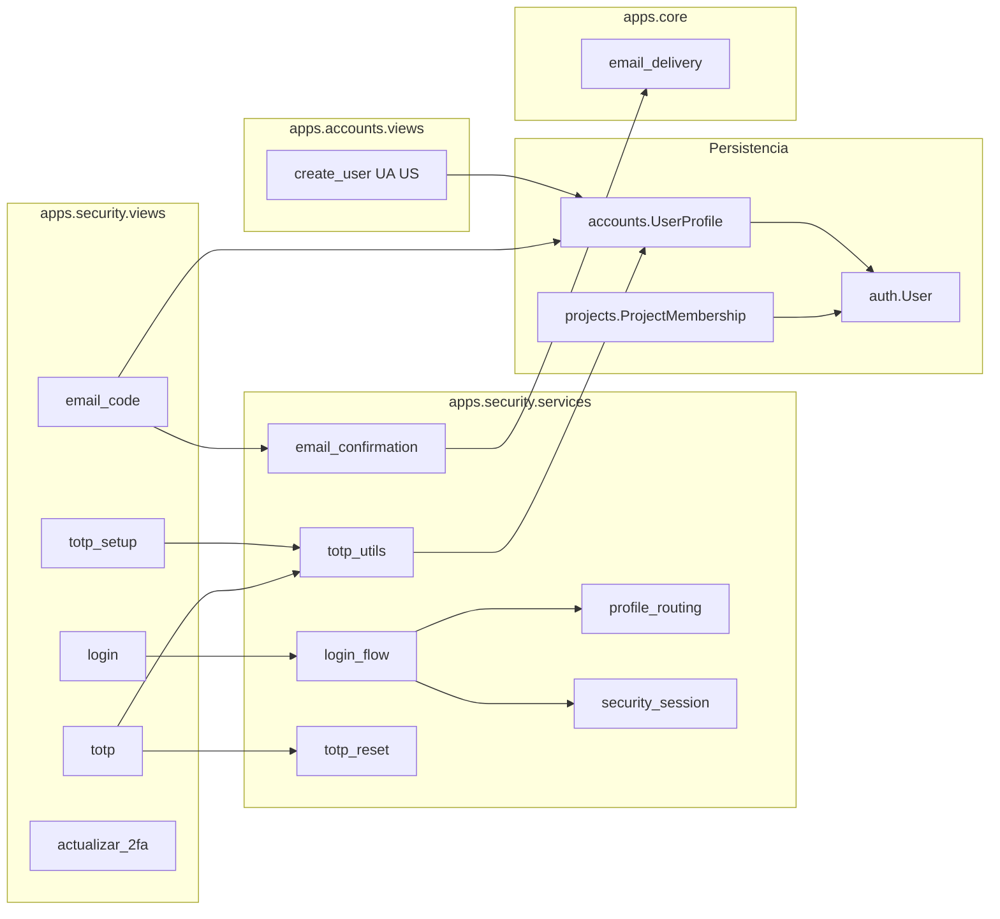

# DynamicWorkspace — Guía de implementación: login, correo y 2FA

Documento **técnico** para implementar el flujo de validación de usuario: alta administrada (UA/US) → credenciales → código por correo → TOTP (autenticador) → dashboard autenticado (`/app/`).

Basado en el patrón probado de CODAS/BAKEBUDGE, adaptado a DynamicWorkspace (proyectos configurables, tipos UA/US/UF).

**Contrato funcional (mensajes y pasos):** [`SEGURIDAD_Y_ACCESOS.md`](SEGURIDAD_Y_ACCESOS.md)  
**Campos de modelo:** [`definition_app/DynamicWorkspace_Model.md`](../definition_app/DynamicWorkspace_Model.md) · [`definition_app/accounts.md`](../definition_app/accounts.md)  
**Permisos por proyecto:** [`definition_app/projects.md`](../definition_app/projects.md)

---

## 1. Qué incluye el paquete

| Capa | App / módulo | Responsabilidad |
|------|--------------|-----------------|
| **Wizard HTTP** | `apps.security` | Login, correo, QR/TOTP, reset 2FA, cancelar |
| **Perfil** | `apps.accounts` | `UserProfile` con tipo de usuario + flags de seguridad |
| **Alta usuarios** | `apps.accounts` (vistas UA/US) | Creación de cuentas con `company` obligatorio |
| **Compañía** | `apps.company` | Tenant principal |
| **Billing** | `apps.billing` | Suscripción por compañía |
| **Correo** | `apps.core/services/email_delivery.py` | Envío transaccional (consola / Resend) |
| **Destino** | `apps.dashboard` | Home autenticado `/app/` |
| **Proyectos** | `apps.projects` | Membresías y roles por proyecto |
| **Settings** | `dynamicworkspace/settings.py` | `LOGIN_URL`, correo, apps |

### Flujos cubiertos

1. **Alta administrada** — UA/US crean cuenta; onboarding en primer login  
2. **Usuario nuevo** — correo (5 min) + alta TOTP con QR  
3. **Usuario activo** — solo TOTP tras contraseña  
4. **Rama intermedia** — correo confirmado, falta TOTP → salta al QR  
5. **Cambio / actualización 2FA** — reset y repetir ciclo completo  

---

## 2. Arquitectura



**Estado entre pasos:** sesión `security_pending_user_id` (`apps/security/services/security_session.py`).  
**Sin `login()` completo** hasta TOTP válido.  
**Redirección final:** `dashboard:home` → `/app/`.

---

## 3. Estructura de archivos a crear

### 3.1 App `apps/security`

```
apps/
└── security/
    ├── apps.py              # name = "apps.security"
    ├── urls.py
    ├── views.py
    ├── services/
    │   ├── __init__.py
    │   ├── login_flow.py
    │   ├── email_confirmation.py
    │   ├── profile_routing.py
    │   ├── security_session.py
    │   ├── totp_utils.py
    │   └── totp_reset.py
    ├── templates/security/
    │   ├── login.html
    │   ├── email_code.html
    │   ├── totp_setup.html
    │   ├── totp.html
    │   └── actualizar_2fa.html
    └── tests.py
```

### 3.2 Campos de seguridad en `apps.accounts.UserProfile`

Ver detalle completo en [`definition_app/DynamicWorkspace_Model.md`](../definition_app/DynamicWorkspace_Model.md#userprofile) y [`definition_app/accounts.md`](../definition_app/accounts.md). Resumen:

| Campo | Tipo | Default | Uso |
|-------|------|---------|-----|
| `company` | ForeignKey → Company | — | **Obligatorio** — compañía del usuario |
| `user_type` | CharField(2) | `'UF'` | `UA`, `US`, `UF` |
| `email_confirmed` | BooleanField | `False` | Paso correo OK |
| `email_confirm_code` | CharField(6), null | — | Código enviado |
| `email_confirm_exp` | DateTimeField, null | — | Caducidad +5 min |
| `totp_secret` | CharField(64), null | — | Secreto pyotp |
| `tfa_verified` | BooleanField | `False` | TOTP verificado |
| `last_totp_reset` | DateTimeField, null | — | Auditoría |
| `status` | CharField(1) | `'A'` | A=activo, I=inactivo |
| `locked_until` | DateTimeField, null | — | Bloqueo temporal |
| `primer_acceso_completado` | BooleanField | `False` | Primera visita Bienvenida |

**Propiedad útil:**

```python
@property
def is_security_complete(self):
    return self.email_confirmed and self.tfa_verified and bool(self.totp_secret)
```

### 3.3 Correo

```
apps/core/services/email_delivery.py
dynamicworkspace/settings.py  # bloque EMAIL_*
```

### 3.4 URLs

```python
# dynamicworkspace/urls.py
path("", include("apps.security.urls")),
path("app/", include("apps.dashboard.urls")),
path("app/", include("apps.projects.urls")),
path("app/admin/usuarios/", include("apps.accounts.urls_admin")),
```

| URL | Vista | Nombre |
|-----|-------|--------|
| `/ingresar/` | `login` | `security:login` |
| `/seguridad/correo/` | `email_code` | `security:email_code` |
| `/seguridad/totp-config/` | `totp_setup` | `security:totp_setup` |
| `/seguridad/totp/` | `totp` | `security:totp` |
| `/seguridad/actualizar-2fa/` | `actualizar_2fa` | `security:actualizar_2fa` |
| `/seguridad/cancelar/` | `cancel` | `security:cancel` |
| `/app/` | `home` | `dashboard:home` |
| `/app/bienvenida/` | `bienvenida` | `dashboard:bienvenida` |
| `/app/admin/usuarios/nuevo/` | `create_user` | `accounts:create_user` |

> **No existe** `/registro/` público en v1.

---

## 4. Dependencias Python

Añadir a `requirements.txt`:

```text
pyotp>=2.9,<3
qrcode>=7.4,<9
Pillow>=10.0,<12
resend>=2.0,<3
python-dotenv>=1.0,<2.0
```

---

## 5. Configuración Django

### 5.1 `INSTALLED_APPS`

```python
INSTALLED_APPS = [
    # ...
    "apps.core",
    "apps.company",
    "apps.billing",
    "apps.accounts",
    "apps.security",
    "apps.dashboard",
    "apps.projects",
    # fields, records, audit, imports — según fases
]
```

### 5.2 Auth redirects

```python
LOGIN_URL = "/ingresar/"
LOGIN_REDIRECT_URL = "/app/"
LOGOUT_REDIRECT_URL = "/ingresar/"
```

### 5.3 Correo: desarrollo vs producción

| Entorno | Configuración | Comportamiento |
|---------|---------------|----------------|
| **Desarrollo** (`DEBUG=True`) | Forzado en `settings.py` | `EMAIL_DELIVERY=console` — **no envía correos reales**. El código de verificación se imprime en la **terminal del `runserver`**. |
| **Producción** (`DEBUG=False`) | Variables de entorno | `EMAIL_DELIVERY=resend` (por defecto) + `RESEND_API_KEY` + dominio verificado en Resend. |

**Regla implementada** (`dynamicworkspace/settings.py`):

```python
if DEBUG:
    EMAIL_DELIVERY = "console"   # solo desarrollo; ignora .env
else:
    EMAIL_DELIVERY = os.environ.get("EMAIL_DELIVERY", "resend")
```

En desarrollo **no hace falta un buzón real**: el `User.email` puede ser de prueba (`test+1@mailinator.com`, alias Gmail `+`, etc.). El código aparece al cargar `/seguridad/correo/` o al pulsar «Reenviar código».

Salida esperada en terminal:

```text
--- DynamicWorkspace email (console) ---
To: usuario@ejemplo.com
Subject: Código de verificación DynamicWorkspace
...
Tu código de verificación DynamicWorkspace es: 042817
--- end email ---
```

Variables (`.env.example` — referencia; en desarrollo `EMAIL_DELIVERY` queda anulado por `DEBUG=True`):

```ini
EMAIL_DELIVERY=console
RESEND_API_KEY=
DEFAULT_FROM_EMAIL=DynamicWorkspace <onboarding@resend.dev>
LICENSE_SECRET_KEY=
```

Producción (Railway u otro host con `DEBUG=False`):

```ini
DEBUG=False
EMAIL_DELIVERY=resend
RESEND_API_KEY=re_...
DEFAULT_FROM_EMAIL=DynamicWorkspace <noreply@tudominio.com>
```

---

## 6. Routing tras contraseña correcta

Lógica en `apps/security/services/profile_routing.py`:

| Condición | Siguiente pantalla |
|-----------|-------------------|
| Sin `User.email` | Error: contacte administrador |
| `email_confirmed` + `tfa_verified` + `totp_secret` | `security:totp` (activo) |
| `email_confirmed` + not `tfa_verified` | `security:totp_setup` (QR) |
| not `email_confirmed` | `security:email_code` |
| Resto | `security:totp_setup` |

Tras TOTP correcto → `login(request, user)` + redirect según `post_login_routing`:

- `primer_acceso_completado = False` → `dashboard:bienvenida`
- `True` → `dashboard:home`

---

## 7. Decorador para zona privada

```python
# apps/core/decorators.py
def security_complete_required(view_func):
    @login_required
    def wrapper(request, *args, **kwargs):
        profile = request.user.profile
        if not profile.is_security_complete:
            return redirect(resolve_security_step(profile))
        return view_func(request, *args, **kwargs)
    return wrapper
```

Aplicar en `apps.dashboard`, `apps.projects`, y demás apps privadas.

Para vistas de proyecto, combinar con `project_permission_required` (ver [`definition_app/projects.md`](../definition_app/projects.md)).

---

## 8. Checklist de implementación

### Fase 1 — Código base

- [ ] Crear app `apps/security/` con estructura § 3.1  
- [ ] Crear app `apps.accounts` con `UserProfile` § 3.2  
- [ ] Signal `post_save` en `User` → crear `UserProfile`  
- [ ] `apps/core/services/email_delivery.py`  
- [ ] Dependencias § 4  
- [ ] URLs § 3.4  
- [ ] Issuer TOTP: `"DynamicWorkspace"` en `totp_utils.py`  
- [ ] Asunto correo: *«Tu código DynamicWorkspace»*  
- [ ] Vista `create_user` restringida a UA/US  

### Fase 2 — Base de datos

- [ ] `makemigrations` / `migrate`  
- [ ] Usuario UA de prueba con email válido  

Estados **onboarding forzado:**

```text
email_confirmed = False
tfa_verified = False
totp_secret = NULL
```

Estados **usuario activo:**

```text
email_confirmed = True
tfa_verified = True
totp_secret = <secreto base32>
User.email = <correo válido>
```

### Fase 3 — Correo

- [ ] Local: consola  
- [ ] Producción: Resend + dominio  
- [ ] Probar Gmail / Outlook  

### Fase 4 — Pruebas funcionales

| # | Escenario | Resultado esperado |
|---|-----------|-------------------|
| 1 | Alta UF por US + primer login | User + Profile → correo → QR → TOTP → `/app/bienvenida/` |
| 2 | Usuario activo | Password → TOTP → `/app/` |
| 3 | Código correo incorrecto | Error + reenvío / cancelar |
| 4 | TOTP incorrecto | Reintento |
| 5 | Reset 2FA | Vuelve a correo + QR |
| 6 | Sin email en User | Error antes de enviar |
| 7 | Sin UserProfile | Error perfil |
| 8 | Acceso `/app/` sin 2FA | Redirige al paso pendiente |
| 9 | UF sin membresía en proyecto | 403 o lista vacía de proyectos |

---

## 9. Personalización DynamicWorkspace

| Elemento | Ubicación | Valor |
|----------|-----------|-------|
| Issuer TOTP | `totp_utils.py` | `DynamicWorkspace` |
| Asunto correo | `email_confirmation.py` | *Código de verificación DynamicWorkspace* |
| Login URL | settings | `/ingresar/` |
| Dashboard | settings | `/app/` |
| Alta usuarios | `accounts` | Solo UA/US |

---

## 10. Diferencias respecto a BAKEBUDGE

| Aspecto | BAKEBUDGE | DynamicWorkspace |
|---------|-----------|------------------|
| Registro | Público `/registro/` (override v1: Master crea) | Solo UA/US crean cuentas |
| Tipos usuario | `M` Master, `U` User | `UA`, `US`, `UF` |
| Destino primer acceso | `/app/noticias/` | `/app/bienvenida/` |
| Datos | Por `owner=request.user` | Por **proyecto** + membresía |
| Módulos | catálogo, recetas, producción | proyectos, campos, registros |
| Perfil negocio | `nombre_negocio`, `moneda` | Sin campos de negocio en v1 |

---

## 11. Limitaciones conocidas

1. Código de correo en texto plano en BD; valorar hash en v2.  
2. Reset 2FA solo exige contraseña; correo como segundo factor al re-enrolar.  
3. **Desarrollo:** con `DEBUG=True` no aplica Resend; códigos solo en terminal. **Producción:** Resend sandbox sin dominio verificado solo entrega al email de la cuenta Resend.  
4. Permisos por proyecto se validan aparte del wizard de seguridad.  

---

## 12. Orden recomendado de implementación

1. Scaffold `apps/` + `apps.accounts.UserProfile` (tipo + seguridad).  
2. `apps/core/email_delivery` + settings correo.  
3. App `apps.security` (login wizard).  
4. App `apps.dashboard` mínima (`/app/`, `/app/bienvenida/`).  
5. Vista alta usuarios (UA/US) en `apps.accounts`.  
6. Decorador `security_complete_required` en apps privadas.  
7. `apps.projects` con `ProjectMembership` y permisos.  
8. Pruebas funcionales § 8.  

---

*Guía de implementación — seguridad DynamicWorkspace. Adaptada desde BAKEBUDGE, jul/2026.*
