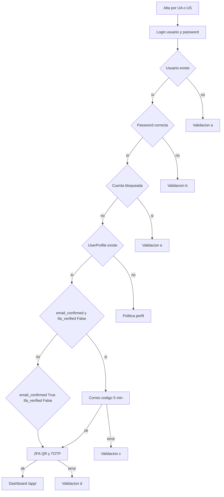

# DynamicWorkspace — Flujos de seguridad y accesos

Documento de **diseño funcional** alineado con la app **`apps.security`** (login, correo, TOTP) y el destino **`apps.dashboard`** (`/app/`).

> **v1:** no hay **registro público**. Los usuarios **UA** y **US** crean cuentas; el alta de seguridad (correo + 2FA) ocurre en el primer login del usuario creado.

**Modelos y campos:** ver [`definition_app/DynamicWorkspace_Model.md`](../definition_app/DynamicWorkspace_Model.md#userprofile) y [`definition_app/accounts.md`](../definition_app/accounts.md).

**Tipos de usuario global:** ver resumen en [`../DynamicWorkspace.md`](../DynamicWorkspace.md#6-seguridad-y-accesos-resumen).

**Entrada autenticada al producto:** tras completar credenciales y segundo factor según aplique:

| Situación | Destino |
|-----------|---------|
| **Primer acceso** (`primer_acceso_completado = False`) | **`/app/bienvenida/`** — bienvenida y primeros pasos |
| **Accesos siguientes** | **`/app/`** (`dashboard:home`) |

La navegación y módulos visibles dependen de `UserProfile.user_type` (`UA`, `US`, `UF`) y de `UserProfile.company`. Los permisos **por proyecto** se aplican además de los globales (ver [`definition_app/projects.md`](../definition_app/projects.md)).

---

## 1. Alcance

- **Alta de cuenta:** solo **UA** o **US** crean usuarios (sin `/registro/` público).
- **Usuario nuevo:** primer acceso tras alta administrada (correo + alta 2FA) hasta **Bienvenida** (`/app/bienvenida/`); accesos siguientes al **dashboard** (`/app/`).
- **Usuario activo:** onboarding completado; login con contraseña + código TOTP.
- **Cambio / actualización 2FA:** usuario activo que perdió el factor TOTP; repite el ciclo completo tras contraseña correcta (sección **9**).
- **Acceso a proyectos:** independiente del wizard de seguridad; requiere membresía explícita en cada proyecto.
- La **implementación** (vistas, plantillas, servicios, Resend, TOTP) queda en código; aquí solo el **contrato** del flujo y mensajes.

---

## 2. Criterio "Usuario nuevo"

Se considera que el usuario **aún no completó** el alta de seguridad cuando:

- `UserProfile.email_confirmed` **es `False`**, **y**
- `UserProfile.tfa_verified` **es `False`**.

Tras completar el flujo, ambos deben quedar en **`True`** para acceder a `/app/`. El **primer** ingreso completo redirige a **Bienvenida**; los posteriores al **dashboard**.

### 2.1 Rama intermedia (usuario a mitad de flujo)

Si **`email_confirmed = True`** y **`tfa_verified = False`** (confirmó correo pero no terminó 2FA):

- **No** repetir pasos 2.1–2.3 (correo ya validado).
- Entrar directamente en el **paso 3** (pantalla 2FA / QR).

---

## 3. Flujo principal (usuario nuevo)

### Paso 0 — Alta de cuenta (solo UA / US)

1. Un **UA** o **US** crea la cuenta desde el panel de administración.
2. Ingresa **email**, **usuario**, **contraseña**, **tipo de usuario** y **compañía** (`Company`). Tipos permitidos según quien crea: **UA** → solo `US`; **US** → solo `UF` en su compañía.
3. Se crea `User` + `UserProfile` con `company` asignado (`email_confirmed=False`, `tfa_verified=False`).
4. Se notifica al usuario (correo opcional con credenciales temporales o enlace de primer acceso).

> La compañía es **obligatoria**. UA asigna compañía libremente; US solo asigna usuarios a su propia compañía.

> La creación **no** inicia sesión del usuario final; el onboarding de seguridad comienza en su primer login.

### Paso 1 — Credenciales

1. El usuario ingresa **usuario** y **contraseña** en `/ingresar/`.
2. Se valida contra `auth_user` (`authenticate`) y debe existir `UserProfile` enlazado (`User.profile` / OneToOne).
3. Si `UserProfile.status = 'I'` (inactivo) o `locked_until` vigente → bloquear con mensaje acordado.

### Paso 2 — Validación por correo (caducidad 5 minutos)

**Condición de entrada:** `email_confirmed = False`.

| Subpaso | Comportamiento |
|---------|------------------|
| **2.1** | Pantalla informando que se envió un correo con un **código validador** que **vence en 5 minutos**. |
| **2.2** | El usuario ingresa el código recibido por correo. |
| **2.3** | Si el código es correcto y no ha vencido → paso **3 (2FA)**. |

**Campos `UserProfile`:** `email_confirm_code`, `email_confirm_exp` (+5 min), tras éxito `email_confirmed = True` (limpiar código/expiración).

**Origen del correo:** `User.email`. Si está vacío → bloquear con *«Tu cuenta no tiene correo configurado. Contacta al administrador.»*

### Paso 3 — 2FA (TOTP + autenticador)

1. Pantalla con explicación de **primer ingreso**, instalar app **Autenticador**, y **código QR** (issuer: **DynamicWorkspace**).
2. Botón: **«Ya registré el código en mi app»**.
3. **3.1** Pantalla que solicita el **código 2FA**; al validar → `tfa_verified = True`.

**Campos:** `totp_secret` (generado para QR), `tfa_verified`, opcional `last_totp_reset`.

### Paso 4 — Fin de flujo

Si todo es correcto → `login()` completo y redirección:

- **Primer acceso:** `/app/bienvenida/` + mensaje de bienvenida.
- **Accesos siguientes:** `/app/` (`dashboard:home`).

---

## 4. Validaciones y mensajes (usuario nuevo)

| Id | Condición | Mensaje / acción |
|----|-----------|------------------|
| **a** | El usuario **no existe** | *«Usuario no encontrado»* |
| **b** | **Contraseña** incorrecta | *«Contraseña incorrecta. Si olvidaste tu contraseña, contacta al administrador.»* |
| **c** | **Código de correo** incorrecto o caducado | *«Código inválido o expirado»* + **«Reenviar código»** y **«Cancelar»** |
| **d** | **Código 2FA** incorrecto | *«Código de autenticación incorrecto»* + **«Reintentar»** y **«Cancelar»** |
| **e** | Cuenta **inactiva** o **bloqueada** | *«Tu cuenta está temporalmente bloqueada. Intenta más tarde.»* |

### 4.1 Notas de comportamiento

- **Reenvío código (c):** nuevo código, nueva expiración, límite de frecuencia (anti-abuso).
- **Cancelar (c) y (d):** limpiar estado de sesión del wizard; volver al login.
- **Reintentos fallidos:** usar `locked_until` tras N intentos (p. ej. 5 en 15 min).
- Alta administrada: validar email único y username único antes de crear `User`.

---

## 5. Referencia rápida de campos (`UserProfile` — seguridad)

| Campo | Uso en este flujo |
|-------|-------------------|
| `company` | Compañía del usuario (obligatorio) |
| `company` | Compañía del usuario (obligatorio) |
| `user_type` | `UA` / `US` / `UF` |
| `email_confirmed` | `False` hasta validar correo; `True` tras paso 2.3 |
| `email_confirm_code` | Código de 6 dígitos enviado por correo |
| `email_confirm_exp` | Caducidad del código (+5 min) |
| `totp_secret` | Secreto para QR / validar TOTP |
| `tfa_verified` | `False` hasta TOTP correcto; `True` al completar |
| `last_totp_reset` | Auditoría al forzar cambio 2FA |
| `locked_until` | Bloqueo temporal tras N fallos |
| `status` | `A` activo / `I` inactivo |
| `primer_acceso_completado` | `False` hasta primera visita a Bienvenida |

---

## 6. Decisiones técnicas a fijar en implementación

1. **`UserProfile` obligatorio:** signal `post_save` al crear `User` (alta UA/US o admin).
2. **Sesión entre pasos:** clave `security_pending_user_id`; sin `login()` completo hasta TOTP válido.
3. **Código de correo:** valorar hash en lugar de texto plano (fase posterior).
4. **Correo:** `apps.core.services.email_delivery`. **Desarrollo** (`DEBUG=True`): `console` forzado — código en terminal del `runserver`. **Producción** (`DEBUG=False`): Resend.
5. **Aislamiento de datos:** tras login, vistas filtran por `profile.company` y membresía (`ProjectMembership`).
6. **Alta de usuarios:** solo **UA/US**; `UserProfile.company` obligatorio al crear.

---

## 7. Diagrama de flujo (usuario nuevo)



---

## 8. Usuario activo

Usuario que **completó** el onboarding. Login habitual: contraseña + **TOTP** (sin correo ni QR).

### 8.1 Criterio "activo"

1. `UserProfile.totp_secret` no vacío.
2. `User.email` no vacío.
3. **`email_confirmed = True`** y **`tfa_verified = True`**.

Si no cumple → flujo **sección 3** (nuevo o rama intermedia).

### 8.2 Flujo principal

| Paso | Descripción |
|------|-------------|
| **1** | Usuario y contraseña. |
| **2** | Si cumple criterio activo → pantalla TOTP. |
| **3** | Pantalla TOTP con opción **«Cambio / Actualización 2FA»** (sección **9**). |
| **4** | TOTP correcto → `login()` → **Bienvenida** (primer acceso) o **dashboard** `/app/` (habitual). |

### 8.3 Validaciones (usuario activo)

| Id | Condición | Mensaje / acción |
|----|-----------|------------------|
| **a** | Contraseña incorrecta | *«Contraseña incorrecta…»* |
| **d** | TOTP incorrecto | *«Código de autenticación incorrecto»* + Reintentar / Cancelar |

---

## 9. Cambio / actualización 2FA

Usuario **activo** que perdió acceso al autenticador. Desde la pantalla TOTP del activo puede solicitar reset.

### 9.1 Efectos del reset en `UserProfile`

| Campo | Efecto |
|-------|--------|
| `totp_secret` | Eliminar (NULL); nuevo secreto en siguiente ciclo |
| `tfa_verified` | `False` |
| `email_confirmed` | `False` (forzar correo + nuevo 2FA) |

Limpiar `email_confirm_code` y `email_confirm_exp`. Actualizar `last_totp_reset`.

### 9.2 Flujo post-reset

Repetir ciclo **sección 3** (pasos 2–4): correo → QR → TOTP → dashboard.

### 9.3 Riesgo

Quien tenga la **contraseña** puede resetear sin TOTP anterior. El **correo** actúa como segundo factor al re-enrolar. Valorar límites de frecuencia y confirmación por correo antes del reset en fases posteriores.

---

## 10. Integración con la zona privada

Todas las vistas en `/app/` requieren:

1. `@login_required`
2. `email_confirmed = True` y `tfa_verified = True` (decorador `security_complete_required`)
3. Para recursos de **proyecto:** membresía activa, misma compañía y rol con permiso suficiente

Patrón en vistas protegidas:

```python
try:
    profile = request.user.profile
except UserProfile.DoesNotExist:
    return redirect("security:login")
if not profile.is_security_complete:
    return redirect(resolve_security_step(profile))
```

Para vistas de proyecto, añadir verificación de `ProjectMembership` según [`definition_app/projects.md`](../definition_app/projects.md).

---

## 11. Documentos relacionados

| Documento | Contenido |
|-----------|-----------|
| [`GUIA_IMPLEMENTACION_SEGURIDAD.md`](GUIA_IMPLEMENTACION_SEGURIDAD.md) | Implementación técnica, archivos, checklist |
| [`definition_app/company.md`](../definition_app/company.md) | Tenant principal |
| [`definition_app/billing.md`](../definition_app/billing.md) | Suscripción y licencia |
| [`definition_app/DynamicWorkspace_Model.md`](../definition_app/DynamicWorkspace_Model.md) | Modelos de datos (maestro) |
| [`definition_app/accounts.md`](../definition_app/accounts.md) | App accounts |
| [`definition_app/projects.md`](../definition_app/projects.md) | Roles y permisos por proyecto |
| [`../DynamicWorkspace.md`](../DynamicWorkspace.md) | Visión de producto y arquitectura general |

---

## 12. Mantenimiento

Al cambiar mensajes, pasos o campos → actualizar **este archivo**, [`definition_app/DynamicWorkspace_Model.md`](../definition_app/DynamicWorkspace_Model.md#userprofile) y [`definition_app/accounts.md`](../definition_app/accounts.md).

Para implementación e inventario de archivos → [`GUIA_IMPLEMENTACION_SEGURIDAD.md`](GUIA_IMPLEMENTACION_SEGURIDAD.md).

---

*Documento de flujo de seguridad DynamicWorkspace — alta administrada, usuario nuevo, usuario activo y cambio de 2FA.*
